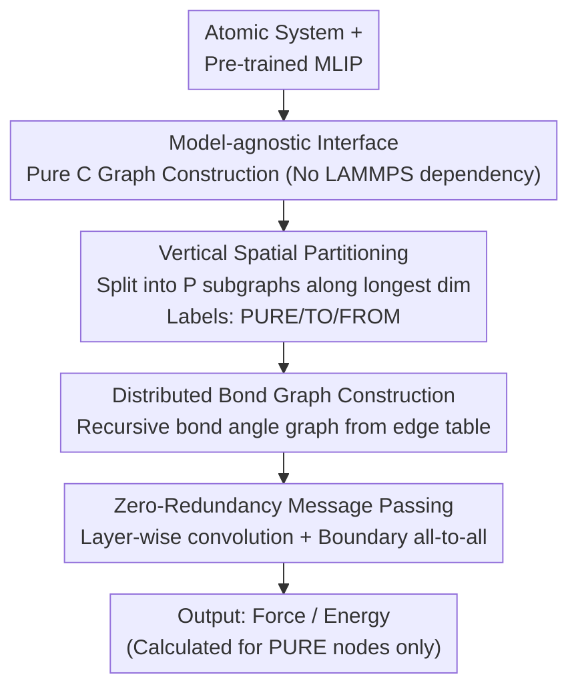

# DistMLIP: A Distributed Inference Platform for Machine Learning Interatomic Potentials

**Conference**: ICLR 2026  
**arXiv**: [2506.02023](https://arxiv.org/abs/2506.02023)  
**Code**: None (Platform project, supports multiple MLIPs)  
**Area**: Computational Biology  
**Keywords**: MLIP, distributed inference, graph neural networks, molecular dynamics, GPU parallelization

## TL;DR

Ours proposes DistMLIP, a distributed inference platform based on a zero-redundancy graph-level parallelization strategy. It addresses the lack of multi-GPU support in existing machine learning interatomic potentials (MLIPs), achieving simulations of nearly one million atoms on 8 GPUs. This approach is up to 8x faster and can simulate systems 3.4x larger than traditional spatial partitioning methods.

## Background & Motivation

**Scale requirements for atomic simulation**: Practical problems such as protein folding, interface reactions, and nanodomain formation require mesoscopic simulations at the million-atom scale, which far exceeds the current capacity of single-GPU MLIPs.

**Computational bottlenecks of DFT**: Density Functional Theory (DFT) calculations have a complexity of $O(N_e^3)$ and can only handle several hundred atoms, while classical force fields are cheap but lack accuracy.

**Rise and limitations of MLIPs**: MLIPs based on Graph Neural Networks (GNNs) achieve $O(N)$ linear complexity while maintaining quantum chemical accuracy. However, most MLIPs only support single-GPU inference and lack native multi-GPU support.

**Flaws of spatial partitioning**: Traditional LAMMPS uses spatial partitioning for parallelization, which requires the introduction of numerous "ghost atoms." For long-range MLIPs using multi-layer GNNs, redundant computations grow cubically with the interaction radius.

**Non-universal existing solutions**: SevenNet supports graph parallelism but is coupled with a specific architecture (Nequip) and relies on LAMMPS+TorchScript. DeepMD and Allegro rely on strict locality designs, limiting interaction ranges and chemical diversity.

## Method

### Overall Architecture

DistMLIP is a distributed inference platform for MLIPs. It takes over any pre-trained MLIP (without architectural changes or retraining). It uses a pure C implementation for graph construction to convert the atomic system into a graph. Then, it applies "wall-style" vertical cutting along the longest dimension of the unit cell to partition the graph into subgraphs across multiple GPUs. Each card is responsible only for its portion of atoms, performing layer-by-layer GNN convolutions. After each layer, updated features of boundary nodes/edges are exchanged via `all-to-all` communication—inverse to the LAMMPS approach of replicating and discarding ghost atoms—achieving zero-redundancy computation. For models like CHGNet that rely on bond angles, it additionally performs distributed construction of the bond graph and remains compatible with both conservative and direct force potentials. The overall data flow is as follows:

### Key Designs

**1. Model-agnostic plug-and-play interface: A general platform independent of LAMMPS**

The graph construction code is implemented in pure C, independent of external libraries like PyTorch, JAX, or LAMMPS. Graphs are built in CPU memory, while the GPU handles GNN forward propagation, allowing any MLIP to be integrated as a "plugin." This addresses a major pain point: most MLIPs lack mature LAMMPS interfaces, and many workflows (ASE, atomate2, etc.) do not use LAMMPS. DistMLIP is independent of the simulation engine and has been adapted for four mainstream architectures: MACE, CHGNet, TensorNet, and eSEN.

**2. Vertical spatial partitioning: Minimal partitioning overhead via simple cutting**

DistMLIP performs vertical "wall" cutting along the longest dimension of the unit cell to partition the system into $P$ subgraphs $G_1, \dots, G_P$. Each partition $G_i$ is expanded to $G_i'$ to include all 1-hop neighbors, ensuring that input edge information for one layer of convolution is local. Nodes are labeled as PURE (local nodes for force/energy calculation), TO (boundary nodes to be sent), or FROM (nodes to be received). Continuous intervals in feature tensors are used for communication to avoid node-by-node indexing. This simple partitioning is efficient because partitioning overhead occurs at every MD step; complex algorithms like METIS can be up to 8x slower in practice.

**3. Distributed construction of 3-body bond graphs: Enabling multi-GPU support for angle-dependent models**

High-precision MLIPs like CHGNet use bond graphs (line graphs) to encode 3-body interactions. Correctly constructing a bond graph for a partition requires 2-hop neighbors of PURE nodes. DistMLIP implements an edge table to map nodes to their outgoing edges and recursively traverses edges to build the parallel bond graph. This is the first distributed implementation of bond graphs for MLIPs.

**4. Zero-redundancy message passing parallelism: No wasted computation**

Unlike traditional spatial partitioning that replicates ghost atoms and performs redundant forward passes, DistMLIP uses graph parallelism. Each GPU calculates force and energy only for its PURE nodes. Intermediate features of boundary nodes/edges are shared via `all-to-all` communication after each layer. This eliminates redundant calculations and retains intermediate variables needed for backpropagation. Consequently, inference time scales linearly, rather than cubically, with the interaction range.

## Key Experimental Results

### Main Results

**Max simulation capacity (8× A100-80GB-PCIe)**:

| MLIP Model | 1 GPU Max Atoms | 8 GPU Max Capacity Multiplier |
|-----------|----------------|------------------|
| MACE-3.8M | ~22K | ~10× (216K) |
| TensorNet-0.8M | ~22K | ~6.4× (140K) |
| CHGNet-2.7M | ~6K | ~7.8× (47K) |
| eSEN-3.2M | ~1.4K | ~50× (69K) |

**Comparison with SevenNet (matched to 800K parameters)**:

| Metric | DistMLIP | SevenNet |
|------|----------|---------|
| Max Capacity | Up to 10× | Baseline |
| Inference Speed | 4× Faster | Baseline |

### Ablation Study

**Impact of interaction range on inference time (8 GPU, 72K atoms SiO₂)**:

| Interaction Range Growth | DistMLIP (Graph Parallel) | Spatial Partitioning Theory |
|-------------|------------------|-----------|
| Linear Relationship | ✓ Linear growth | Cubic growth |

**Comparison of partitioning algorithms**:

| Partitioning Method | Relative Inference Time |
|---------|-----------|
| Vertical Partitioning (DistMLIP) | 1× |
| Standard Graph Partitioning (METIS, etc.) | Up to 8× slower |

**MD Performance on real material systems (μs/(atom×step), 8 GPU)**:

| Model | Li₃PO₄ | H₂O | GaN | MOF |
|------|--------|-----|-----|-----|
| MACE-3.8M | 11.0‖216K | 11.6‖210K | 9.6‖250K | 10.9‖216K |
| L-MACE(LAMMPS) | 12.3‖66K | 8.5‖83K | 2.7‖78K | 6.2‖64K |
| TensorNet | 16.3‖140K | 18.0‖83K | 15.9‖123K | 15.5‖125K |

### Key Findings

1. **Linear capacity scaling**: The maximum number of simulated atoms grows linearly with the number of GPUs.
2. **Zero-redundancy advantage**: Inference time scales linearly with interaction range, providing significant benefits for long-range MLIPs compared to the cubic scaling of spatial partitioning.
3. **Simple partitioning is faster**: Vertical partitioning is up to 8x faster than complex algorithms like METIS because partitioning overhead is incurred at every MD step.
4. **Ours** achieves 3.4x the capacity of LAMMPS spatial partitioning for MACE, with comparable or faster 8-GPU inference speeds.

## Highlights & Insights

1. **Elegance of zero-redundancy design**: Unlike redundant calculations in spatial partitioning, every calculation in graph parallelism is utilized, representing a key engineering innovation.
2. **Model-agnostic universal design**: A single platform supports four different MLIP architectures without LAMMPS dependency, significantly lowering the barrier to entry.
3. **Empirical counter-intuitive finding**: Simple vertical partitioning outperforms complex graph partitioning, indicating that partitioning overhead is often overlooked in distributed inference.
4. **Distributed implementation of bond graphs**: Ours solves the multi-GPU distribution problem for bond graphs, enabling efficient parallelization for models like CHGNet.
5. **Practicality at million-atom scale**: Achieving 250K atom simulations on 8 GPUs marks a scale breakthrough for MLIPs in material science.

## Limitations & Future Work

1. **GPU memory bottlenecks**: Equivariant feature calculations in eSEN and MACE are performed on a single GPU, limiting linear capacity scaling.
2. **Bond graph scalability in CHGNet**: The $O(N^6)$ complexity of bond graph construction becomes a bottleneck for weak scaling in large systems.
3. **Inference only**: Currently supports only inference, not distributed training.
4. **Communication overhead**: In small systems, narrow partitions lead to boundary node overlap and high communication costs.
5. **Future directions**: Integrating model distillation to speed up inference; supporting more MLIP architectures; implementing dynamic load balancing.

## Related Work & Insights

- **LAMMPS Spatial Partitioning**: Traditional method, but incurs heavy redundant computation for long-range GNN-MLIPs.
- **SevenNet**: The first to support graph-parallel inference, but architecture-bound and LAMMPS-dependent. DistMLIP surpasses it in universality and performance.
- **DeePMD billion-atom simulation**: Achieved large-scale simulation via strict short-range designs, but at the cost of long-range interactions.
- **Insight**: The communication patterns of graph parallelization can be extended to other GNN inference scenarios (e.g., social networks, traffic prediction). The combination of foundation potentials and efficient inference platforms represents a new paradigm in computational materials science.

## Rating

- **Novelty**: ⭐⭐⭐⭐ Application of graph-level parallelization for MLIP inference is a novel systems innovation.
- **Experimental Thoroughness**: ⭐⭐⭐⭐ Supports 4 MLIPs and multiple material systems with complete scaling analysis.
- **Writing Quality**: ⭐⭐⭐⭐ Clear system architecture and complete pseudocode.
- **Value**: ⭐⭐⭐⭐⭐ Fills a critical gap in multi-GPU inference for MLIPs, enabling million-atom simulations.

<!-- RELATED:START -->

## Related Papers

- [\[ICLR 2026\] Representing Local Protein Environments with Machine Learning Force Fields](representing_local_protein_environments_with_machine_learning_force_fields.md)
- [\[ICLR 2026\] PepBenchmark: A Standardized Benchmark for Peptide Machine Learning](pepbenchmark_a_standardized_benchmark_for_peptide_machine_learning.md)
- [\[ICLR 2026\] Multifidelity Simulation-based Inference for Computationally Expensive Simulators](multifidelity_simulation-based_inference_for_computationally_expensive_simulator.md)
- [\[ICLR 2026\] DriftLite: Lightweight Drift Control for Inference-Time Scaling of Diffusion Models](driftlite_lightweight_drift_control_for_inference-time_scaling_of_diffusion_mode.md)
- [\[ICML 2025\] Reliable Algorithm Selection for Machine Learning-Guided Design](../../ICML2025/computational_biology/reliable_algorithm_selection_for_machine_learning-guided_design.md)

<!-- RELATED:END -->
