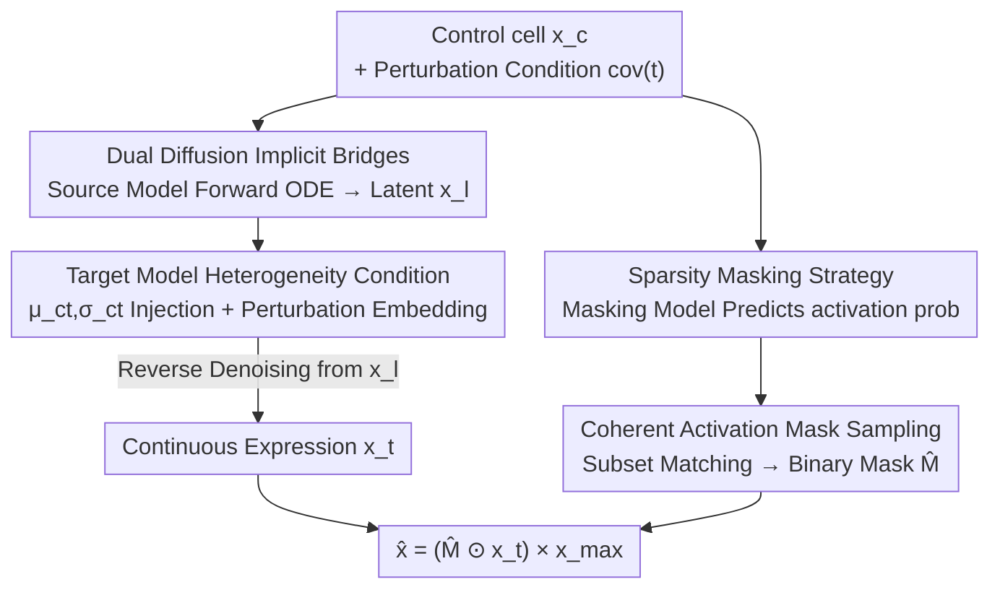

# Doloris: Dual Conditional Diffusion Implicit Bridges with Sparsity Masking Strategy for Unpaired Single-Cell Perturbation Estimation

**Conference**: ICLR2026  
**OpenReview**: [https://openreview.net/forum?id=rvpDHfoTd2](https://openreview.net/forum?id=rvpDHfoTd2)  
**Code**: https://github.com/ChangxiChi/Doloris  
**Area**: Computational Biology / Diffusion Models / Single-Cell Perturbation Prediction  
**Keywords**: Single-cell perturbation, Dual Diffusion Implicit Bridges, Unpaired data, Sparsity masking, Conditional diffusion

## TL;DR
Doloris utilizes two conditional diffusion models sharing a Gaussian latent space to model the distributions of "unperturbed cells" and "perturbed cells" respectively. By leveraging Dual Diffusion Implicit Bridges (DDIB), it bypasses the inherent challenge of unpaired single-cell sequencing data—where the same cell cannot be measured both before and after perturbation. Coupled with a sparsity masking model that specifically predicts gene silencing, it directs the diffusion model's capacity toward expressed genes, achieving SOTA performance on genetic and molecular perturbation datasets while preserving the diversity of single-cell responses.

## Background & Motivation
**Background**: Single-cell perturbation prediction aims to answer how the gene expression profile of a specific cell type changes after applying a CRISPR knockout or a small-molecule drug. This is crucial for identifying key genes and accelerating drug screening. Existing methods (GEARS, graphVCI, scGPT, BioLord, GRAPE, CPA, chemCPA, etc.) generally fall into two categories: regression models that directly predict perturbed expression, or generative models that reconstruct the perturbed distribution.

**Limitations of Prior Work**: Single-cell RNA sequencing is an **irreversible, destructive process** because cells must be lysed to release RNA. Consequently, it is impossible to measure the same cell in both its control and perturbed states, making the data inherently **unpaired**. Most existing methods either force artificial pairings (introducing unrealistic assumptions) or ignore the relationship between control and perturbed states altogether. A few works considering the unpaired nature (e.g., neural optimal transport-based Bunne et al.) lack explicit perturbation modeling, leading to poor generalization to unseen perturbations.

**Key Challenge**: Beyond the unpaired nature, gene expression data presents two structural difficulties: **high dimensionality and sparsity**. The gene dimension $N$ is vast, and the expression matrix is filled with zeros or near-zero values. Experimental results (Fig. 8) show that including more genes lowers the relative signal-to-noise ratio (SNR), making patterns harder to learn. Combined with sparsity, models easily "overfit to zero"—wasting capacity on predicting genes that should be zero while ignoring the expressed genes carrying the perturbation signal, resulting in collapsed generation and loss of diversity (Fig. 2).

**Goal**: To explicitly model perturbations and generalize to unseen genes/molecular perturbations without requiring paired cells, while avoiding the pitfalls of high-dimensional sparse zeros.

**Key Insight**: The authors adopt the concept of Dual Diffusion Implicit Bridges (DDIB)—transitions between two domains can be achieved by training separate diffusion models that share a standard Gaussian latent space, without requiring paired samples. This aligns perfectly with the unpaired nature of single-cell data by treating the "control $\rightarrow$ perturbed" transition as a bridge between two distributions.

**Core Idea**: Implicitly align control and perturbed states using a pair of conditional diffusion models with a shared latent space (solving the unpaired problem), and use an independent sparsity masking model to explicitly predict zero-valued genes, limiting the diffusion loss to expressed genes (solving the sparsity overfitting problem).

## Method

### Overall Architecture
The input to Doloris is a real control (unperturbed) cell $x_c$ and target perturbation conditions (cell type + genetic/molecular perturbation); the output is the predicted gene expression profile $\hat{x}$ under that perturbation. The pipeline coordinates three components: a **source model** learning the control distribution, a **target model** learning the perturbed distribution (sharing a standard Gaussian latent space to form the "implicit bridge"), and a **masking model** learning which genes are silenced after perturbation.

The inference process follows two steps: First, the source model performs a DDIM forward (noising ODE) mapping from $x_c$ to a latent variable $x_l$. Second, the target model performs reverse denoising from $x_l$ under the given perturbation conditions to generate continuous expression values $x_t$. Simultaneously, the masking model predicts the activation probability for each gene to produce a binary mask $\hat{M}$. Finally, the predicted expression is obtained by the element-wise product of continuous expression and the mask, rescaled by $x_{\max}$. During training, the diffusion models minimize reconstruction loss on expressed genes only, while the masking model minimizes cross-entropy.

### Key Designs

**1. Dual Conditional Diffusion Implicit Bridges: Bypassing Cell Pairing via Shared Latent Space**

This is the core solution to the "unpaired" problem. Two identical conditional diffusion models are trained: a source model $\hat{x}^{(s)}_\theta$ for the control distribution (condition $\mathrm{cov}^{(s)}=\{ct\}$, cell type) and a target model $\hat{x}^{(t)}_\theta$ for the perturbed distribution (condition includes cell type and perturbation $P$). Instead of direct alignment, each maps its distribution to the **same standard Gaussian latent space**. Inference maps a control cell $x_c$ to $x_l = \mathrm{ODESolve}(x_c; \hat{x}^{(s)}_\theta, \mathrm{cov}^{(s)}, 0, 1)$, then generates the perturbed state via $x_t = \mathrm{ODESolve}(x_l; \hat{x}^{(t)}_\theta, \mathrm{cov}^{(t)}, 1, 0)$. This preserves the structure of "perturbation as a transition from a control state" without requiring paired samples, outperforming optimal transport methods in generalization by utilizing explicit perturbation conditions.

Unlike standard diffusion models that predict noise $\epsilon$, Doloris **directly predicts the clean expression $x_0$**. Given the weak structure of gene expression data, modeling $x_0$ is more stable while remaining theoretically equivalent to predicting $\epsilon$.

**2. Heterogeneity Maintenance Condition: Avoiding Mean Collapse**

Since perturbations act on existing cells, the target model needs information from the control group. However, due to the lack of pairing, a paired control cannot be provided during training. Simply using the mean expression $\mu_{ct} \in \mathbb{R}^N$ would erase cell-to-cell heterogeneity, collapsing results into an "average cell." Doloris injects Gaussian noise based on the control group's standard deviation: $x_{\text{noisy}} = \mu_{ct} + \sigma_{ct}\cdot\epsilon, \epsilon\sim\mathcal{N}(0,I)$. This **randomization mechanism** preserves the dispersion of the control state. During training, the target condition is $\mathrm{cov}^{(t)}=\{ct, \mu_{ct}, \sigma_{ct}, P\}$; during inference, the real control $x_c$ is used directly: $\mathrm{cov}^{(t)}=\{ct, x_c, P\}$.

**3. Sparsity Masking Strategy: Refocusing Diffusion on Expressed Genes**

To combat "overfitting to zeros," Doloris employs an independent mask model $\hat{m}_\theta$ to predict gene silencing. First, the diffusion reconstruction loss is **only calculated on expressed genes** using a binary mask $M_i = \mathbb{1}[x_{0,i}\neq 0]$ to exclude zeros: $L = \mathbb{E}\big[\,\|M\odot(x_0-\hat{x}_\theta)\|^2 / \sum_i M_i\,\big]$. Second, the mask model is trained with cross-entropy to predict activation probabilities. This decouples the problem into "whether to express" (discrete) and "how much to express" (continuous), preventing the diffusion model from being biased by sparse structures.

**4. Coherent Activation Mask Sampling: Subset Matching over Independent Sampling**

The mask model provides marginal activation probabilities $p_{\hat{m}_\theta} \in [0,1]^N$. However, independent Bernoulli sampling across genes would ignore co-expression/silencing structures, leading to incoherent global patterns. Doloris identifies **subsets in the training set** whose empirical marginal distributions are close to $p_{\hat{m}_\theta}$ and updates samples from these subsets to generate a globally coherent binary mask $\hat{M}$. This ensures that the gene-wide activation pattern is self-consistent.

### Loss & Training
Diffusion models use a masked $\ell_2$ reconstruction loss, and the masking model uses cross-entropy. The source and target models share an implementation, simplified by processing $\mathrm{cov}^{(s)}$ and $\mathrm{cov}^{(t)}$ simultaneously. Cell type embeddings are learned as labels; genetic perturbations follow the GRAPE (Chi et al., 2025) embedding strategy for combinatorial effects, and molecular perturbations use pre-trained molecular model features. Training uses AdamW with a learning rate of 0.001, 500 diffusion steps, and 50 DDIM inference steps on an A100 80G.

## Key Experimental Results

### Main Results
Datasets: Adamson/Norman (CRISPR) and sci-Plex3 (chemical). Evaluation metrics: **Energy Distance (E-distance)** for overall distribution alignment and **Earth Mover's Distance (EMD)** for gene-level distribution shifts, addressing the unreliability of RMSE in capturing bimodal single-cell distributions.

| Task / Dataset | Metric (All) | Doloris | Prev. SOTA | Description |
|---|---|---|---|---|
| Unseen Single Perturb (Adamson) | RMSE↓ | **0.0336** | 0.0473 (linear) | E-distance 0.4682 vs 0.8658 |
| Unseen Single Perturb (Adamson) | EMD↓ | **0.0348** | 0.0373 (linear) | Outperforms all baselines |
| Unseen Molecular (sci-Plex3) | RMSE↓ | **0.0287** | 0.0409 (BioLord) | E-distance 0.4055 vs 0.7847 (chemCPA) |
| Dual Perturbation (Norman) | E-dist↓ | **0.6819** | 0.7862 (GRAPE) | Captures gene-gene interactions |
| OOD Drug (sci-Plex3) | E-dist↓ | **0.7071** | 0.8861 (chemCPA) | EMD 0.0295 vs 0.0959 |

Baselines (GEARS, scGPT, BioLord, etc.) often rely on forced pairing: regression models trend toward the mean and fail to catch heterogeneity. CPA/chemCPA reconstruct perturbed states without explicit "transition" modeling, resulting in lower performance.

### Ablation Study

| Configuration | Effect | Description |
|---|---|---|
| Full (Doloris) | Optimal | Full model performance |
| w/o $\mu_{ct}, \sigma_{ct}$ | Significant drop | Crucial for "perturbation as transition" |
| w/o latent | Drop | Using random noise instead of $x_l$ loses structure |
| w/o mask model | Drop + Diversity ↓ | Model overfits to zeros, lowering intra-class distance |

### Key Findings
- **Crucial Masking Model**: Without it, the model collapses toward zero, reducing generation diversity.
- **Structured Latent Initialization**: Mapping from control cells via ODE is superior to random Gaussian noise for quality/efficiency.
- **Essential Control Statistics**: $\mu_{ct}$ and $\sigma_{ct}$ provide a necessary starting point for perturbation transitions.
- **Generalization**: Superiority in dual-knockout and OOD drug settings highlights the外推 ability of explicit perturbation modeling combined with implicit bridges.

## Highlights & Insights
- **Revisiting "Unpaired" as "Distribution Transition"**: Replacing forced pairing with DDIB's shared latent space is a clean conceptual shift that respects the biological nature of the data.
- **Decoupling Discrete/Continuous**: Separating "whether to express" from "magnitude" allows simultaneous optimization for continuously-valued expression and discrete sparsity, a strategy applicable to any high-dimensional sparse count data.
- **Coherence in Sampling**: Beyond marginal probabilities, the use of subset matching ensures genome-wide consistency in activation patterns.
- **Metric Correction**: The emphasis on E-distance and EMD over RMSE acknowledges the bimodal heterogeneity of single-cell data.

## Limitations & Future Work
- **Dependence on Subset Matching**: Coherent mask sampling relies on finding similar empirical distributions in the training set, which may fail if the target perturbation is extremely far from the training distribution.
- **Gaussian Noise Assumption**: Modeling control heterogeneity with diagonal Gaussian noise may lose complex gene-gene covariance structures.
- **External Embedding Dependency**: Performance is partially capped by the quality of pre-trained molecular models or specific genetic embedding strategies.
- **Future Directions**: Exploring learnable structured discrete generation (e.g., autoregressive) to replace subset matching, or strengthening latent space alignment with stronger regularization.

## Related Work & Insights
- **vs. Forced-Pairing Methods**: Regression-based methods (GEARS, scGPT) tend toward the mean; Doloris captures heterogeneity via distribution bridging.
- **vs. Optimal Transport Methods**: OT-based methods (Bunne et al.) lack explicit perturbation conditioning; Doloris generalizes better to unseen perturbations via its conditional target model.
- **vs. DDIB**: While inheriting the framework, Doloris adapts it for single-cells via cell-type/perturbation conditions, $x_0$ parametrization, and a dedicated sparsity masking strategy.

## Rating
- Novelty: ⭐⭐⭐⭐⭐ 
- Experimental Thoroughness: ⭐⭐⭐⭐ 
- Writing Quality: ⭐⭐⭐⭐ 
- Value: ⭐⭐⭐⭐⭐

<!-- RELATED:START -->

## Related Papers

- [\[ICLR 2026\] scDFM: Distributional Flow Matching for Robust Single-Cell Perturbation Prediction](scdfm_distributional_flow_matching_model_for_robust_single-cell_perturbation_pre.md)
- [\[ICML 2026\] What Makes a Representation Good for Single-Cell Perturbation Prediction?](../../ICML2026/computational_biology/what_makes_a_representation_good_for_single-cell_perturbation_prediction.md)
- [\[NeurIPS 2025\] PRESCRIBE: Predicting Single-Cell Responses with Bayesian Estimation](../../NeurIPS2025/computational_biology/prescribe_predicting_single-cell_responses_with_bayesian_estimation.md)
- [\[ICLR 2026\] Clustering by Denoising: Latent Plug-and-Play Diffusion for Single-Cell Embeddings](clustering_by_denoising_latent_plug-and-play_diffusion_for_single-cell_embedding.md)
- [\[ICLR 2026\] Count Bridges enable Modeling and Deconvolving Transcriptomic Data](count_bridges_enable_modeling_and_deconvolving_transcriptomic_data.md)

<!-- RELATED:END -->
