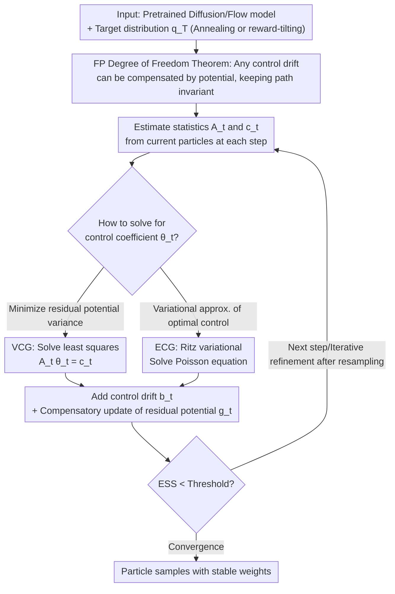

# DriftLite: Lightweight Drift Control for Inference-Time Scaling of Diffusion Models

**Conference**: ICLR 2026  
**arXiv**: [2509.21655](https://arxiv.org/abs/2509.21655)  
**Code**: [https://github.com/yinuoren/DriftLite](https://github.com/yinuoren/DriftLite)  
**Area**: Computational Biology  
**Keywords**: Diffusion model inference adaptation, particle methods, drift control, Fokker-Planck equation, variance reduction

## TL;DR
DriftLite proposes leveraging the degree of freedom between the drift and potential functions in the Fokker-Planck equation. By solving for an optimal control drift via a lightweight linear system to proactively stabilize particle weights, it addresses weight degradation in Sequential Monte Carlo with minimal cost, significantly outperforming Guidance-SMC baselines in Gaussian mixture, molecular system, and protein-ligand co-folding tasks.

## Background & Motivation

**Background**: Diffusion and Flow Matching models have achieved great success in generative tasks, but inference-time adaptation (adapting to new target distributions without retraining) remains a key challenge. Current approaches primarily include guidance (simple but biased) and SMC particle reweighting (unbiased but suffers from severe weight degradation).

**Limitations of Prior Work**:
   - Guidance methods (classifier/classifier-free guidance) are simple but inherently biased—they ignore the time-varying nature of the target distribution's normalization constant.
   - SMC particle methods are theoretically unbiased ($\text{KL divergence } \mathcal{O}(N^{-1})$), but in practice, weights degrade exponentially, causing the Effective Sample Size (ESS) to collapse rapidly.
   - Increasing the number of particles mitigates this but incurs linear growth in computational cost; decreasing it leads to instability.
   - Training-based control methods (parameterized by neural networks) require backpropagation, losing the lightweight advantage of inference-time methods.

**Key Challenge**: Unbiasedness vs. Computational Efficiency—SMC is theoretically correct but practically unstable, while guidance is efficient but biased.

**Goal**:
   - How to stabilize particle weights while maintaining unbiasedness?
   - Can a training-free method with minimal overhead be found?

**Key Insight**: A fundamental degree of freedom exists between the drift term and the potential function in the Fokker-Planck equation—any control term added to the drift can be precisely compensated by a corresponding correction to the potential function. This degree of freedom can be exploited to minimize the variance of the residual potential function.

**Core Idea**: Transform the passive reweighting of SMC into proactive steering—"unload" the portion of the potential function $g_t$ that causes weight variance into the drift term by solving a small linear system at each step.

## Method

### Overall Architecture
DriftLite addresses weight degradation in SMC during inference-time adaptation. Rather than post-hoc weight normalization, it proactively shifts "variance-inducing" information from weights to the drift term during the sampling process. This is justified by the **Fokker-Planck Degree of Freedom Theorem**, where adding any control drift can be compensated by a potential function adjustment without changing the final path. For each timestep, given a pretrained diffusion model and a target distribution (annealed $q_T \propto p_0^\gamma$ or reward-tilting $q_T \propto p_0 \exp(r)$), the process is: estimate a small matrix $A_t$ and vector $c_t$ from current particles, solve an $n \times n$ ($n \leq 3$) linear system for the control drift coefficient $\theta_t$ via **VCG** (min-variance) or **ECG** (variational), apply the control drift to the SDE, and update the residual potential. SMC resampling is triggered when ESS falls below a threshold. The mechanism requires no trainable parameters and adds only the cost of solving a small linear equation.

### Key Designs

**1. Fokker-Planck Degree of Freedom Theorem: Mathematical License for Transferring Variance**

Weight degradation originates from the high variance of the potential function $g_t$ across particles. Theorem (Prop 3.1) proves that for any control drift $\bm{b}_t$, simply adding a compensation term $h_t(\bm{x}; \bm{b}_t) = \nabla \cdot \bm{b}_t + \bm{b}_t \cdot \nabla \log q_t$ to the potential function keeps the path $(q_t)$ described by the Fokker-Planck equation invariant. The property $\mathbb{E}_{q_t}[h_t(\cdot; \bm{b}_t)] = 0$ ensures this does not introduce bias. This provides a "knob" to offload weight variance into the drift while preserving SMC's unbiasedness.

**2. VCG (Variance-Controlling Guidance): Direct Minimization of Residual Potential Variance**

VCG sets the objective to minimize the variance of the residual potential function. By restricting the control drift to a finite-dimensional subspace $\bm{b}_t = \sum_i \theta_t^i \bm{s}_i$ with basis functions $\{\nabla r_t, \nabla \log \hat{p}_t, \hat{\bm{u}}_t\}$ (gradients of reward, score, and model drift), minimizing $\text{Var}_{q_t}[\phi_t]$ reduces to a standard least squares problem $A_t \theta_t = c_t$. Since it solves a $3 \times 3$ system and reuses existing gradients, the overhead is negligible.

**3. ECG (Energy-Controlling Guidance): Variational Approximation of Optimal Control**

ECG focuses on approximating the theoretical optimal control $\bm{b}_t^* = \nabla A_t$, where $A_t$ satisfies a Poisson equation $\nabla \cdot (q_t \nabla A_t) = q_t g_t$. Instead of solving the equation directly, ECG uses the Ritz variational method over scalar basis functions $\{r_t, \log \hat{p}_t, \hat{U}_t\}$. This avoids calculating differentiable Laplacians, which can be noisy in high dimensions.

### Loss & Training
- **Completely training-free**: Requires no training or backpropagation.
- Per-step overhead: Solving an $n \times n$ ($n=3$) linear system plus evaluating basis functions (reusing already computed score and reward gradients).
- Support for Iterative Refinement: Uses control drifts and potential functions from the previous round as the base dynamics for the next, progressively reducing variance.
- Optional SMC resampling (when ESS < threshold) or pure continuous weighting.

## Key Experimental Results

### Main Results (30D Gaussian Mixture Model, Annealing $\gamma=2.0$)

| Method | $\Delta$NLL↓ | MMD↓ | SWD↓ | ESS Stability |
|------|------------|------|------|-----------|
| Pure Guidance | High Bias | Poor | Poor | N/A |
| Guidance-SMC | Medium | Mode Collapse | Medium | Rapid Decay |
| **VCG-SMC** | **Lowest** | **Best** | **Best** | **Stable** |
| **ECG-SMC** | Near VCG | Near VCG | Near VCG | **Stable** |

### Protein-Ligand Co-Folding (AlphaFold3 + DriftLite)

| Method | Ligand RMSD↓ | Pocket TM-score↑ | Clash Score↓ |
|------|----------|-------------|-------------|
| AF3 baseline | Medium | Medium | Higher |
| AF3 + VCG | **Significant Improvement** | **Improved** | **Reduced** |

### Ablation Study

| Configuration | Effect |
|------|------|
| Variance Reduction Magnitude | VCG reduces potential function variance by several orders of magnitude. |
| Particle Scaling | DriftLite with N/4 particles matches SMC with N particles. |
| Iterative Refinement | Variance decreases monotonically per round, improving sample quality. |
| Extra Runtime | Incremental increase of ~20-40% compared to Pure Guidance. |

### Key Findings
- **Order-of-Magnitude Variance Reduction**: VCG reduces potential function variance from $10^2$-$10^3$ to $10^{-1}$-$10^0$, maintaining stable ESS throughout inference.
- **Particle Efficiency**: DriftLite with 32 particles outperforms G-SMC with 128 particles—a 4x efficiency gain.
- **VCG Superiority**: Direct variance minimization (VCG) is slightly more effective than variational Poisson approximation (ECG).
- **Scalable to Scientific Apps**: Successful application on AlphaFold3 proves scalability to real-world, large-scale scientific scenarios.
- **Effective Iterative Refinement**: Multi-round refinement monotonically reduces variance without training.

## Highlights & Insights
- **Turning FP degree of freedom into a variance control tool** is the core theoretical contribution—elegant and effective. While mathematically known in SMC as twisted proposals, formalizing this as a lightweight, programmable control via a $3 \times 3$ system is a clever engineering innovation.
- **Paradigm shift from "Passive Reweighting" to "Active Steering"**: The fundamental problem of SMC is weight degradation, not theoretical correctness. DriftLite solves this at the root by transferring "information" from weights to drift.
- **Success on AlphaFold3** demonstrates practical value in scientific domains—it is not just a theoretical improvement but a tool capable of enhancing protein structure prediction.

## Limitations & Future Work
- Requires the reward function to be second-order differentiable (can be approximated with stochastic estimators, but at the cost of precision).
- Basis function selection is currently manual (set to 3); more or better basis functions might improve performance.
- Laplacian estimation in high dimensions can introduce noise, affecting control quality.
- Validated on generative scientific tasks; not yet tested on large-scale image generation (e.g., SD3).
- Iterative refinement increases total inference time (though still avoids training).

## Related Work & Insights
- **vs. Guidance-SMC (Skreta et al.)**: Uses the same framework, but DriftLite proactively reduces weight decay via drift control, whereas G-SMC uses passive reweighting leading to weight collapse.
- **vs. Neural Control (Albergo & Vanden-Eijnden)**: Neural parameterized control requires training/backpropagation; DriftLite replaces this with a training-free $3 \times 3$ linear system.
- **vs. Pure Guidance (Ho & Salimans)**: Guidance is simple but biased; DriftLite maintains unbiasedness with only 20-40% more computation.

## Rating
- Novelty: ⭐⭐⭐⭐⭐ Originality in applying FP degrees of freedom to variance control is high.
- Experimental Thoroughness: ⭐⭐⭐⭐⭐ Comprehensive validation from synthetic data to molecular systems and protein folding.
- Writing Quality: ⭐⭐⭐⭐⭐ Theoretically rigorous and logically clear.
- Value: ⭐⭐⭐⭐⭐ High potential for scientific applications as a general diffusion inference-task adaptation tool.

<!-- RELATED:START -->

## Related Papers

- [\[NeurIPS 2025\] Remasking Discrete Diffusion Models with Inference-Time Scaling](../../NeurIPS2025/computational_biology/remasking_discrete_diffusion_models_with_inference-time_scaling.md)
- [\[ICLR 2026\] OmniMouse: Scaling properties of multi-modal, multi-task Brain Models on 150B Neural Tokens](omnimouse_scaling_properties_of_multi-modal_multi-task_brain_models_on_150b_neur.md)
- [\[ICLR 2026\] Reverse Distillation: Consistently Scaling Protein Language Model Representations](reverse_distillation_consistently_scaling_protein_language_model_representations.md)
- [\[ICLR 2026\] Multifidelity Simulation-based Inference for Computationally Expensive Simulators](multifidelity_simulation-based_inference_for_computationally_expensive_simulator.md)
- [\[ICLR 2026\] Fine-Tuning Diffusion Models via Intermediate Distribution Shaping](fine-tuning_diffusion_models_via_intermediate_distribution_shaping.md)

<!-- RELATED:END -->
