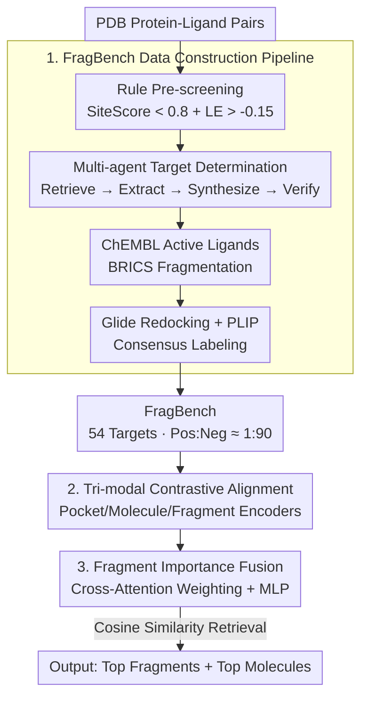

# Drugging the Undruggable: Benchmarking and Modeling Fragment-Based Screening

**Conference**: ICLR2026  
**OpenReview**: [https://openreview.net/forum?id=MMLAvR1juf](https://openreview.net/forum?id=MMLAvR1juf)  
**Code**: TBD  
**Area**: Computational Biology / Drug Discovery / Contrastive Learning  
**Keywords**: Undruggable Targets, Fragment Screening, Tri-modal Contrastive Learning, Virtual Screening, FBDD

## TL;DR
To address the failure of traditional molecular screening on "undruggable" proteins (shallow, transient, or cryptic pockets), this paper constructs FragBench, the first fragment-level virtual screening benchmark (comprising 54 challenging targets annotated via multi-agent LLM and human collaboration). It proposes FragCLIP, a tri-modal contrastive learning framework that jointly encodes pockets, full molecules, and fragments. FragCLIP significantly outperforms docking software and existing ML methods (improving EF@0.5% on FragBench from 1.86 for Glide to 6.85), and its retrieved fragments can be effectively extended or linked into high-affinity lead compounds.

## Background & Motivation
**Background**: Structure-based virtual screening (VS) has reached maturity, with methods like DiffDock/EquiBind predicting binding poses and DrugCLIP using contrastive learning to align pocket and ligand representations. Benchmarks such as DUD-E, LIT-PCBA, and CrossDocked2020 support standardized evaluations. However, these works largely assume proteins have "well-defined, shape-stable" binding pockets and focus on screening drug-like full molecules.

**Limitations of Prior Work**: Over 85% of the human proteome is considered "undruggable"—including transcription factors and protein-protein interaction (PPI) hubs. While critical to cancer and neurodegenerative diseases, these targets lack deep, stable pockets that full molecules can occupy or bind strongly to. Fragment-Based Drug Discovery (FBDD) offers a solution: smaller, more flexible fragments can fit into shallow, transient, or cryptic sites, serving as "anchors" to be expanded into high-affinity molecules (e.g., BCL-xL). However, fragment screening faces bottlenecks: experimental methods (NMR, crystallography) are accurate but slow and expensive, while computational docking, designed for full-sized ligands, systematically underestimates small fragments, leading to high false positive and negative rates. In practice, Glide achieves an EF1 of only 1.8 on such targets, performing near random.

**Key Challenge**: Despite the rapid progress of AI in drug discovery, fragment screening remains a blank space due to two fundamental gaps. First, there is no fragment screening benchmark specifically for undruggable pockets for standardized evaluation. Second, existing modeling frameworks fail to capture the ternary relationship between "fragment—drug-like molecule—protein pocket." Focusing solely on local fragment-pocket interactions or global molecule-pocket binding struggles to achieve cross-target generalization in fragment retrieval.

**Goal**: To formalize the task of "fragment retrieval on undruggable pockets" and address both data and modeling gaps by providing a high-quality benchmark and a model specifically designed for fragments.

**Key Insight**: Although fragments yield weak binding signals and sparse supervision, they do not exist in isolation—they originate from drug-like parent molecules that provide "scaffold-level context." By aligning representations across three granularities (pocket, full molecule, fragment), the parent molecule acts as a "bridge" to regularize and stabilize fragment representations, mitigating the sparse and noisy supervision inherent in fragment-only training.

**Core Idea**: Use tri-modal contrastive learning to jointly encode pockets, molecules, and fragments (FragCLIP), leveraging the parent molecule as a scaffold bridge. This is supported by the construction of FragBench, the first fragment screening benchmark for undruggable targets, using rule-based pre-screening and a multi-agent LLM-human collaborative annotation pipeline.

## Method

### Overall Architecture
The paper produces both a benchmark and a model. The task is defined as **fragment-level virtual screening**: given a pocket $p \in P$ (typically from an undruggable protein) and a fragment library $F = \{f_1, \dots, f_N\}$, the goal is to identify a subset $F^+ \subseteq F$ capable of forming favorable non-covalent interactions with $p$. Each fragment is a chemically valid substructure cleaved from drug-like molecules according to synthesis-aware rules (e.g., BRICS). Evaluation utilizes early recognition metrics like EF@k and BEDROC.

The pipeline is split into two parts. **The first part is the FragBench construction pipeline**: starting from protein-ligand complexes in the PDB → rule-based pre-screening (SiteScore and ligand efficiency filtering) to select structurally challenging pocket-ligand pairs → a multi-agent framework (retrieval/extraction/synthesis/expert verification) to determine if a target is "undruggable" from literature evidence → fetching active ligands from ChEMBL, cleaving them into fragments via BRICS, and performing Glide re-docking + PLIP interaction detection to assign fragment-level labels. **The second part is FragCLIP training and inference**: three encoders represent pockets, molecules, and fragments respectively, using multi-view contrastive loss to align the three granularities. A cross-attention fusion module weights and aggregates fragment features into a fused representation aligned with the pocket. During inference, top fragments and molecules are retrieved based on cosine similarity in the shared embedding space.

### Key Designs

**1. FragBench Construction: Rule Pre-screening + Multi-agent Collaboration to Identify Undruggable Targets and Reliable Fragment Labels**

The primary barrier is data: the PDB is biased toward druggable proteins with well-formed pockets, and **no database systematically catalogs undruggable targets**. The authors use a rule-based pipeline for coarse screening—filtering 87,425 PDB pairs to exclude covalent ligands, nearby nucleic acids, and small pockets. SiteMap is used to calculate SiteScore (retaining < 0.8 for shallow/poorly enclosed pockets) and Ligand Efficiency $LE(l) = S(l)/HA(l)$ (retaining $LE(l) > -0.15$ for weak binding relative to size). This yields 1,387 structurally challenging pairs.

Since rules alone cannot determine "undruggability," a **modular multi-agent framework** is employed: a Retrieval Agent $R$ pulls literature from DrugBank and PubMed; an Extraction Agent $E$ generates structured evidence tuples $(e_i, c_i)$ (e.g., "shallow pocket," "fragment hit") with schema constraints; a Synthesis Agent $S$ aggregates evidence to calculate a temporary classification; and finally, Expert Verification $V$ provides ground truth. Fragment labels follow a conservative consensus: fragments from ChEMBL actives (8–24 heavy atoms) are screened via Glide redocking and PLIP. A fragment is labeled positive only if at least 2 atoms form non-covalent interactions in at least one pose and this pattern is reproducible across 3 independent docking runs. Negative samples are randomly sampled at a 1:90 ratio. FragBench covers 54 targets with high-confidence labels.

**2. Multi-granularity Contrastive Alignment: Molecules as Bridges to Stabilize Sparse Fragment-Pocket Supervision**

Direct fragment-pocket training is problematic due to weak affinity and context dependence. FragCLIP uses a multi-encoder framework to model three granularities. The pocket encoder $f_p$ maps 3D structures to latent space, the fragment encoder $f_f$ captures fine-grained binding substructures, and the molecule encoder $f_m$ provides scaffold-level context to regularize fragment representations. Alignment uses InfoNCE-based contrastive objectives: pocket-molecule alignment $L_{p\text{-}m}$, pocket-fragment alignment $L_{p\text{-}f}$, and molecule-fragment alignment $L_{m\text{-}f}$.

$$L_{a\text{-}b}=-\frac{1}{N}\sum_{i=1}^N \log\frac{\exp(\mathrm{sim}(f_a(a_i),f_b(b_i))/\tau)}{\sum_{j=1}^N \exp(\mathrm{sim}(f_a(a_i),f_b(b_j))/\tau)}$$

The total alignment loss is $L_{align}=L_{p\text{-}m}+\lambda_1 L_{p\text{-}f}+\lambda_2 L_{m\text{-}f}$. All encoders are based on UniMol (3D molecular representation with SE(3)-equivariant attention). Fragments are not learned in a vacuum but are anchored by their parent molecules and associated pockets.

**3. Fragment Importance Fusion: Cross-attention to Highlight Key Binding Substructures**

Most fragments in a molecule contribute little to binding. To avoid diluting discriminative cues, a **fusion mechanism for joint selection** is added. Given molecule embedding $f_m(m)$ and fragment embeddings $\{f_f(f_i)\}_{i=1}^k$, a cross-attention module highlights relevant fragments. The weighted output is concatenated with the molecule embedding and passed through an MLP:

$$z_{fusion}=\mathrm{MLP}\big(f_m(m)\,\|\,\mathrm{Attn}(f_m(m),\{f_f(f_i)\}_{i=1}^k)\big)$$

This fused embedding is aligned with the pocket via $L_{fusion}$. This refines fragment signals and allows fragment information to benefit molecule-level retrieval.

### Key Experimental Results

**Main Results**
On FragBench (undruggable targets), classic docking methods fail—Vina provides no meaningful ranking, and Glide barely achieves enrichment. FragCLIP is optimal across all metrics, with EF@0.5% approximately 3.7x higher than Glide.

| Method | AUROC | BEDROC | EF@0.5% | EF@1% | EF@5% |
| :--- | :--- | :--- | :--- | :--- | :--- |
| Vina | 0.476 | 0.025 | 1.665 | 1.419 | 1.113 |
| Glide | 0.597 | 0.034 | 1.862 | 1.825 | 1.712 |
| EquiScore† | 0.581 | 0.105 | 4.039 | 3.331 | 2.049 |
| LigUnity† | 0.505 | 0.089 | 4.262 | 3.562 | 2.087 |
| DrugCLIP (90%) | 0.597 | 0.080 | 4.110 | 3.203 | 2.067 |
| **FragCLIP (90%)** | 0.593 | **0.115** | **6.853** | **5.797** | **3.000** |

**Ablation Study**
Fragment signals can recover misranked molecules. On the DUD-E molecule-level screening task, adding fragment contrastive learning even without fusion improves EF1% from 31.87 to 33.56. Full fusion and integration further increase this to 37.23.

| Configuration | AUC | BEDROC | EF@1% | Note |
| :--- | :--- | :--- | :--- | :--- |
| DrugCLIP | 80.93 | 50.52 | 31.89 | Molecule-only baseline |
| FragCLIP (w/o Fusion) | 84.76 | 53.61 | 33.56 | Fragment contrastive added |
| **FragCLIP** | **85.44** | **59.32** | **37.23** | Full (Fusion + Ensemble) |

## Key Findings
- **Docking systematically fails on fragments**: Glide's EF1 on FragBench (~1.8) is near random, confirming that fragment screening requires more than scaled-down molecule methods.
- **Tri-modal modeling is the primary performance driver**: Moving from molecule-pocket only (DrugCLIP) to FragCLIP nearly doubles EF@0.5% on FragBench. Fragment context regularizes molecule representations significantly.
- **Fusion and ensemble amplify gains**: The fusion module effectively filters irrelevant fragments, raising molecule-level EF1% on DUD-E.
- **Fragments are actionable**: On BCL-2, FragCLIP retrieved 30 candidates, which were then used by DiffLinker to design a molecule with a Glide score of -11.96, proving retrieval results can drive lead compound design.

## Highlights & Insights
- **Engineering undruggability identification**: The human-in-the-loop pipeline using LLMs to extract evidence from literature can be transferred to other biomedical labeling tasks where ground truth is hidden in text.
- **Molecules as bridges**: Using parent molecules as context for fragments anchors weak signals via multi-level alignment, a strategy applicable to other sub-entity retrieval tasks.
- **Conservative consensus labeling**: Requiring multi-atom interaction and reproducibility during docking ensures high-confidence labels despite inherent noise in docking.

## Limitations & Future Work
- **Dependence on in silico labels**: Labels rely on Glide and PLIP, inheriting potential system biases of docking software. "Gold standards" are computational approximations.
- **Low absolute enrichment**: An EF@0.5% of 6.85 on FragBench remains low compared to druggable targets (20+), indicating fragment retrieval on undruggable proteins is far from solved.
- **Scale and Validation**: 54 targets are a small subset of the undruggable proteome, and downstream cases (e.g., BCL-2) lack wet-lab confirmation.

## Related Work & Insights
- **vs. DrugCLIP**: FragCLIP extends the bi-modal (pocket-ligand) contrastive approach to tri-modal (including fragments) and adds interaction fusion, specifically for fragment-level and undruggable scenarios.
- **vs. Docking (Glide/Vina)**: FragCLIP bypasses physical scoring biases on small fragments/shallow pockets by using learned contrastive retrieval.
- **vs. VS Benchmarks**: While DUD-E/LIT-PCBA focus on druggable pockets, FragBench is the first benchmark for undruggable fragment screening.

## Rating
- **Novelty**: ⭐⭐⭐⭐⭐ First undruggable fragment benchmark + tri-modal framework.
- **Experimental Thoroughness**: ⭐⭐⭐⭐ Solid evaluation across 4 benchmarks and ablation, but lacks wet-lab validation.
- **Writing Quality**: ⭐⭐⭐⭐ Clear motivation and logical derivation.
- **Value**: ⭐⭐⭐⭐⭐ Directly addresses the high-value challenge of the 85% undruggable proteome.

<!-- RELATED:START -->

## Related Papers

- [\[ICLR 2026\] SubDyve: Subgraph-Driven Dynamic Propagation for Virtual Screening Enhancement](subdyve_subgraph-driven_dynamic_propagation_for_virtual_screening_enhancement_co.md)
- [\[ICLR 2026\] FACET: A Fragment-Aware Conformer Ensemble Transformer](facet_a_fragment-aware_conformer_ensemble_transformer.md)
- [\[ICLR 2026\] HeurekaBench: A Benchmarking Framework for AI Co-scientist](heurekabench_a_benchmarking_framework_for_ai_co-scientist.md)
- [\[ICLR 2026\] SigmaDock: Untwisting Molecular Docking with Fragment-Based SE(3) Diffusion](sigmadock_untwisting_molecular_docking_with_fragment-based_se3_diffusion.md)
- [\[ICML 2026\] Protein Fold Classification at Scale: Benchmarking and Pretraining](../../ICML2026/computational_biology/protein_fold_classification_at_scale_benchmarking_and_pretraining.md)

<!-- RELATED:END -->
