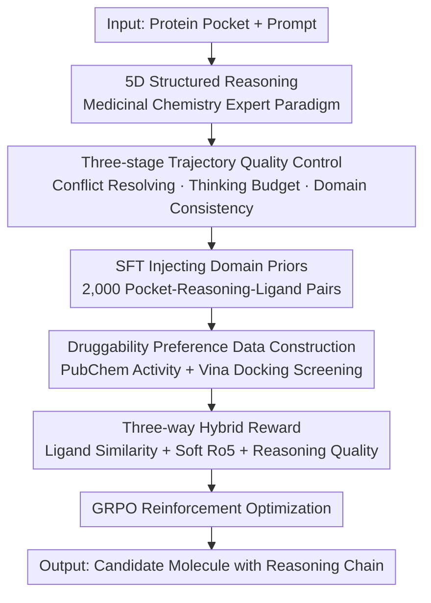

# DrugTrail: Interpretable Drug Discovery via Structured Reasoning and Druggability‑Tailored Preference Optimization

**Conference**: ICLR2026  
**OpenReview**: [https://openreview.net/forum?id=1pAW0y8WLH](https://openreview.net/forum?id=1pAW0y8WLH)  
**Code**: TBD  
**Area**: Computational Biology / LLM Reasoning / Reinforcement Learning  
**Keywords**: Drug discovery, interpretable reasoning, preference optimization, GRPO, druggability  

## TL;DR
DrugTrail transforms general large language models into drug designers that "think like medicinal chemistry experts." It employs Clinical Chemistry-Informed Reasoning (CCIR) for lightweight SFT, followed by Druggability-Tailored Preference Optimization (DTPO) via GRPO—an online-computable reinforcement learning approach that bypasses time-consuming docking scores. This allows 7B-level models to outperform large-scale models like DeepSeek-R1 in pocket-oriented molecule generation across metrics such as docking energy, QED, and SA, while providing readable reasoning chains for every molecule.

## Background & Motivation
**Background**: Machine learning is widely used to accelerate early drug discovery, including virtual screening, molecular docking, and molecular editing. Recently, LLMs have been recognized as powerful tools for drug discovery due to their cross-domain knowledge and ability to generate human-readable explanations.

**Limitations of Prior Work**: Existing AI tools suffer from two major issues. First is the "black box" problem—providing only final predictions without exposing intermediate reasoning, making it difficult for experts to understand, correct, or trust the findings. Second is "data hunger"—most LLM-based methods require large-scale bio-related corpora for pre-training, which is expensive and constrained by the scarcity of high-quality biological data.

**Key Challenge**: The authors identify two deeper contradictions. 1) Teaching models to "think like medicinal chemists" is difficult because existing datasets lack structured reasoning trajectories. 2) Reward design is a bottleneck in RL—prior methods often use binding affinity as a reward, but **high affinity $\neq$ high druggability**. Factors like residence time, synthetic accessibility, and off-target inhibition determine whether a molecule is safe and effective. Focusing solely on affinity biases the search space.

**Goal**: To activate the domain knowledge embedded in general LLMs without expensive pre-training, enabling them to: (1) Output transparent reasoning compliant with medicinal chemistry principles; (2) Optimize for comprehensive objectives closer to real pharmacological standards.

**Key Insight**: Instead of building domain models through expensive pre-training, RL can "unlock" existing domain knowledge in general LLMs (similar to math or coding), and a small amount of SFT is sufficient to guide reasoning. The authors pursue a lightweight route: "SFT-induced structured reasoning + RL-calibrated druggability."

**Core Idea**: Replace "large-scale pre-training + single affinity reward" with "five-dimensional structured reasoning trajectories (SFT) + druggability-tailored preference optimization (GRPO)" to create a molecule designer that is both interpretable and pharmacologically viable.

## Method

### Overall Architecture
DrugTrail decomposes "generating small molecules from protein pockets" into two serial stages. The first stage is **CCIR (Clinical Chemistry-Informed Reasoning)**: Extracting five reasoning dimensions used by medicinal chemistry experts from a base LLM to complete "pocket-ligand" pairs into "pocket $\rightarrow$ reasoning $\rightarrow$ ligand" triplets. After three stages of quality control filtering, SFT is performed to teach the model to use specific tags—`<Characterization>`, `<Stability>`, `<Guidance>`, `<Conservation>`, and `<Optimization>`—plus an `<Answer>` tag to output structured reasoning chains and SMILES. The second stage is **DTPO (Druggability-Tailored Preference Optimization)**: GRPO-based RL is applied to the SFT model. The reward is no longer a slow docking score but a hybrid reward comprising "ligand similarity + soft Lipinski rules + reasoning quality," allowing for efficient online calculation and strong correlation with real druggability.

### Key Designs

**1. Five-dimensional Structured Reasoning: Thinking Like a Medicinal Chemist**

Interatability is hindered when models provide conclusions without rationale. The authors designed structured prompts to query a base LLM (Qwen3-235B-A22B) to extract expert thinking dimensions in clinical drug discovery: (1) Deep physicochemical characterization; (2) Maintaining core structural/functional integrity; (3) Prior knowledge and chemical/structural space guidance; (4) Conservation analysis and key site identification; (5) Optimization and multi-attribute balancing. Each dimension corresponds to a pair of special tags (e.g., `<Characterization>`), forcing the model to segment reasoning into readable units. This value lies in using "expert consensus" sampled from the LLM’s own knowledge space, making it both pharmacologically logical and naturally generatable by LLMs.

**2. Three-stage Trajectory Quality Control: Filtering Credible Training Data**

Raw reasoning generated by LLMs can be inconsistent. The authors sampled pocket-ligand pairs from the CrossDocked2020 training set and guided an LLM to generate reasoning "connecting the pocket to the ligand." This is filtered via: **Conflict Resolving**—using a stronger LLM judge to ensure consistency among multiple generated candidates, discarding logical fallacies; **Thinking Budget Instruction**—filtering by length to penalize verbose or overly brief trajectories, encouraging a focused style; and **Domain Consistency**—using adversarial validation against expert-written "golden" trajectories to remove samples deviating from the expert paradigm. This yields ~2,000 high-quality samples for SFT.

**3. Druggability-Tailored Preference Optimization (DTPO): Online Hybrid Rewards**

To address the slow speed of docking and the fact that "affinity $\neq$ druggability," DTPO uses the GRPO framework (no value network, relative advantage estimated within groups: $A_{i,t} = (R_i - \mathrm{mean}(\{R_i\}))/\mathrm{std}(\{R_i\})$) with a hybrid reward $R_{total} = w_{ligand}R_{ligand} + w_{rule}R_{rule} + w_{reasoning}R_{reasoning}$:

-   **Ligand Similarity Reward (with Adaptive Ranking)**: For each pocket, experimentally verified active molecules are retrieved from PubChem. These are screened via AutoDock Vina (Vina score < -7) to form a "pocket-specific reference set." The reward is $R_{ligand}(m) = \sum_{i=1}^{N} \gamma^{rank_i}\,\mathrm{Tanimoto}(m, r_i)$, prioritizing similarity to high-ranking active molecules.
-   **Soft Lipinski Rule of Five Reward**: Maps four RO5 properties (MW, LogP, HBD, HBA) to $(0,1)$ soft scores via $s(x) = 1/(1+\exp(k(x-t)))$, encouraging drug-like physicochemical properties.
-   **Reasoning Quality Reward**: Points are awarded (+0.1) for each complete pair of the six predefined special tags reached, $R_{reasoning}(trace) = 0.1 \times N_{pairs}(trace)$, ensuring structural clarity and completeness.

These rewards are fast to compute online, bypassing the high cost of real-time docking while constraining optimization toward druggability.

### Loss & Training
Two stages: 1) SFT using ~2,000 quality-controlled samples with cross-entropy loss to align the model to the 5D + `<Answer>` format. 2) RL optimization via GRPO using the weighted hybrid reward $R_{total}$. Base models included Qwen3-1.7B, 4B, and 8B.

## Key Experimental Results

### Main Results
Evaluated on CBGBench using CrossDocked2020 (100 test complexes) across substructure, chemical properties, and interaction dimensions.

| Task/Metric | Base (Qwen3-8B) | +CCIR | +CCIR+DTPO | DeepSeek-R1 |
|-------------|-----------------|-------|------------|-------------|
| Docking Energy E ↓ | 11.80 | -3.10 | **-6.82** | -0.36 |
| Improved Binding IMP (%) ↑ | 0.01 | 10.93 | **41.01** | 0.2 |
| QED ↑ | 0.17 | 0.31 | **0.57** | — |
| SA ↑ | 0.28 | 0.43 | **0.72** | — |

Across all model sizes (1.7B to 8B), the full DrugTrail model significantly outperforms strong reasoning baselines like DeepSeek-R1 and Qwen3-235B, which mostly show positive docking energies and near-zero IMP. Substructure analysis also shows the generated distribution is closer to reference sets.

### Ablation Study

| Configuration | Observation | Explanation |
|---------------|-------------|-------------|
| Base | E positive, QED low | General models fail at pocket-oriented design. |
| +CCIR | E negatives, QED/SA climb | Reasoning SFT "activates" domain capabilities. |
| +CCIR+DTPO | E ~ -6.8, IMP ~ 41% | Preference optimization provides the largest gain. |
| w/o R / L / RQ | Metrics shift out of ideal zones | All three reward components are necessary. |
| Decay $\gamma$ | Best diversity near 0.95 | $\gamma$ controls preference strength for top ligands. |

### Key Findings
-   **CCIR is the "Switch," DTPO is the "Amplifier"**: Adding CCIR alone flips docking energy to negative and doubles QED, indicating that structured reasoning SFT awakens dormant domain knowledge. DTPO then boosts IMP from ~11% to ~41%.
-   **Synergy of Three-way Rewards**: Removing any component (Ligand, Rule, or Reasoning) degrades VS/QED/SA performance, showing that molecular similarity and RO5 are complementary.
-   **Zero-shot Generalization**: Models trained on CrossDocked2020 successfully transfer to small molecule editing (ZINC200) and protein optimization (improving GFP fitness from ~0.07 to ~0.60), demonstrating the transferability of the reasoning paradigm.

## Highlights & Insights
-   **Extracting Expert Paradigms from Models**: Using LLMs to define their own reasoning dimensions ensures the paradigm is both pharmacologically sound and easy for the model to generate, avoiding the subjectivity of manual templates.
-   **Engineering Druggability into Online Rewards**: Replacing slow docking with a hybrid of "Tanomoto similarity + Soft RO5 + Reasoning completeness" is a practical trick for scenarios where real evaluation is expensive but cheap proxy signals exist.
-   **Observability as an Optimization Objective**: By rewarding the presence of reasoning tags, interpretability becomes a primary goal of the optimization rather than an afterthought.
-   **Small Models Beating Large Ones**: A 7B model using this paradigm outperforms a 235B model, validating that "activating existing knowledge > scaling parameters" for specialized tasks.

## Limitations & Future Work
-   **Exploratory Generalization**: Results in molecular editing and protein optimization are preliminary, with observed drops in diversity (e.g., Novelty decreasing) on some tasks.
-   **Proxy Reward Ceiling**: Ligand similarity rewards may suppress the exploration of truly novel scaffolds (exploration-exploitation trade-off). Soft RO5 is also a coarse approximation of druggability.
-   **Dependence on Judge LLMs**: The quality control phase relies on stronger LLMs as judges and a small set of expert trajectories, which may introduce bias.
-   **Lack of 3D Geometry**: The model outputs SMILES and relies on external docking for conformation, which is not directly comparable to 3D-native generative models.

## Related Work & Insights
-   **vs. Large-scale Pre-trained Drug LLMs**: While they require massive bio-corpora, DrugTrail uses only ~2,000 SFT samples and lightweight GRPO to activate existing knowledge, reducing costs significantly.
-   **vs. Affinity-based Molecular RL**: While those optimize for docking scores (slow and potentially non-druggable), DrugTrail argues "affinity $\neq$ druggability" and uses a faster, more holistic hybrid reward.

## Rating
- Novelty: ⭐⭐⭐⭐⭐ 
- Experimental Thoroughness: ⭐⭐⭐⭐ 
- Writing Quality: ⭐⭐⭐⭐ 
- Value: ⭐⭐⭐⭐⭐ 

<!-- RELATED:START -->

## Related Papers

- [\[NeurIPS 2025\] g-DPO: Scalable Preference Optimization for Protein Language Models](../../NeurIPS2025/computational_biology/g-dpo_scalable_preference_optimization_for_protein_language_models.md)
- [\[ACL 2025\] Enhancing Safe and Controllable Protein Generation via Knowledge Preference Optimization](../../ACL2025/computational_biology/kpo_protein_safety.md)
- [\[ICLR 2026\] CellDuality: Unlocking Biological Reasoning in LLMs with Self-Supervised RLVR](cellduality_unlocking_biological_reasoning_in_llms_with_self-supervised_rlvr.md)
- [\[AAAI 2026\] EPO: Diverse and Realistic Protein Ensemble Generation via Energy Preference Optimization](../../AAAI2026/computational_biology/epo_diverse_and_realistic_protein_ensemble_generation_via_energy_preference_opti.md)
- [\[ICLR 2026\] Refine Drugs, Don't Complete Them: Uniform-Source Discrete Flows for Fragment-Based Drug Discovery](refine_drugs_dont_complete_them_uniform-source_discrete_flows_for_fragment-based.md)

<!-- RELATED:END -->
