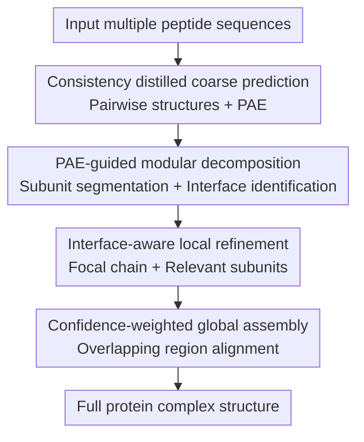

# Efficient Prediction of Large Protein Complexes via Subunit-Guided Hierarchical Refinement

**Conference**: ICLR 2026  
**OpenReview**: [https://openreview.net/forum?id=0G8Cq9z2Hp](https://openreview.net/forum?id=0G8Cq9z2Hp)  
**Code**: https://github.com/Luchixiang/HierAFold  
**Area**: Computational Biology / Protein Complex Structure Prediction  
**Keywords**: Protein Complex Prediction, AlphaFold3, PAE, Subunit Decomposition, Large-scale Structural Assembly  

## TL;DR
HIERAFOLD uses PAE to automatically segment rigid subunits and cross-chain interfaces from coarse-grained pairwise predictions, performs high-precision refinement only on "focal chain + relevant interface subunits," and finally assembles them via confidence-weighted alignment. This reduces the peak VRAM of large protein complexes to a runnable range while maintaining accuracy close to AlphaFold3.

## Background & Motivation
**Background**: The AlphaFold2/AlphaFold3 series has pushed the structural prediction of monomeric proteins, multi-chain complexes, and even protein-ligand structures to high precision. These models typically represent residues, nucleotides, or ligand atoms as tokens and infer 3D structures through pair representation, triangle updates, attention, and diffusion sampling. On small to medium-scale complexes, an end-to-end approach feeding all chains together is the most direct and reliable, as the model can perceive all cross-chain interactions simultaneously.

**Limitations of Prior Work**: Issues arise with "very large" complexes. Key modules in models like AlphaFold3/Protenix have an approximately quadratic memory cost with respect to the number of tokens, causing VRAM to spiral out of control after a few thousand tokens. The paper mentions that a complex with approx. 4,500 tokens may require 80GB of GPU VRAM; on large complex sets exceeding 5,000 tokens, end-to-end AlphaFold3 baselines suffer from OOM (Out of Memory). Existing alternatives often decompose complexes into pairs/triples and reassemble them using MCTS or combinatorial assembly. However, this "pairwise-then-puzzle" strategy easily misses multi-chain coordination: an interface might look plausible in a pair but could have the wrong orientation, fail to close, or have its conformation altered by a third chain in the complete complex.

**Key Challenge**: Predicting large complexes requires two simultaneous conditions: first, not feeding all tokens end-to-end into the model to avoid memory explosion; second, avoiding isolated pairwise predictions to maintain multi-body context. The context that truly needs preservation is not the entire complex, but the few interface regions around each chain that affect its conformation and assembly. Thus, the problem is not whether to decompose, but how to automatically decompose into small enough parts without losing critical interfaces.

**Goal**: The authors aim to build an automated workflow for large protein complex prediction. It needs to identify relatively rigid structural subunits within each chain from coarse predictions, find which external subunits likely form reliable interfaces with the current chain, perform high-precision refinement using a full AlphaFold3-style model only within this local context, and finally align multiple local high-confidence predictions into a complete complex. The goal is not to train a completely new model to replace AlphaFold3 but to wrap existing strong predictors into a more scalable hierarchical inference system.

**Key Insight**: A critical observation comes from PAE (Predicted Aligned Error). Low PAE diagonal blocks typically imply relatively rigid segments within a chain that can serve as structural subunits; cross-chain low PAE off-diagonal blocks often correspond to interface regions where the model is confident about relative positions. Therefore, PAE is not just a confidence output but also a structural clue for "where to split and where to keep context."

**Core Idea**: Use PAE-guided subunit decomposition to rewrite large complex prediction as multiple local refinements of "focal chain + sparse interface subunits," followed by confidence-weighted assembly to recover the global structure.

## Method

### Overall Architecture
The input to HIERAFOLD is a set of peptide sequences, and the output is the 3D structure of the complete protein complex. It first performs fast coarse prediction for all chain pairs to obtain pairwise structures and PAE; it then extracts intra-chain rigid subunits and filters cross-chain interface subunits from the PAE; next, it executes high-precision local refinement for each focal chain; finally, it assembles these partially overlapping structural predictions into a single coordinate system.

The four intermediate nodes in this diagram represent the core contributions of the paper. "Consistency distilled coarse prediction" solves the speed issue of all-pair screening; "PAE-guided modular decomposition" determines which structural fragments are worth keeping; "Interface-aware local refinement" recovers multi-body coordination in a memory-controllable local context; "Confidence-weighted global assembly" merges multiple local coordinate systems into a global model.

### Key Designs
**1. Consistency Distilled Coarse Prediction: Using few-step diffusion for cheap structural priors**

Providing coarse predictions for all chain pairs using a full AlphaFold3-style model would involve massive pairwise inference, plus expensive diffusion sampling. The first step of HIERAFOLD only aims to obtain two types of usable priors: coarse coordinates $X_{ij}$ and the corresponding PAE matrix $P_{ij}$ for chain pairs. Therefore, the authors trained a consistency-distilled structure predictor, replacing full sampling with a shallower Pairformer (12 token-level transformer blocks instead of 24) and few-step diffusion.

This distilled model learns to provide self-consistent structural outputs at different noise time steps. The paper defines the target as a consistency loss between adjacent time steps:

$$
L_{con}=\mathbb{E}\left[d\left(f_\theta(x_{t_{n+1}}, t_{n+1}, c), f_{\theta^-}(\hat{x}_{t_n}, t_n, c)\right)\right]
$$

where $c$ is the conditional feature extracted by Pairformer, $\theta^-$ is the EMA target model, and $\hat{x}_{t_n}$ is the estimate obtained by moving back one step along the ODE from $x_{t_{n+1}}$. During inference, the coarse stage runs only two refinement steps, generates 5 random samples per chain pair, and selects the top-ranked sample using a combined score of ipTM, pTM, and clash penalty. The significance of this is specific: the coarse stage does not pursue final accuracy but provides signals on "which regions are rigid and which segments might interact" with low latency, leaving accuracy recovery to the full model in the later refinement stage.

**2. PAE-guided Modular Decomposition: Segmentation of subunits and interfaces via low-error blocks**

Large complexes are not inseparable residue clouds. A chain often consists of stable domains, and interactions are concentrated in interface regions. HIERAFOLD uses two morphological features of PAE to automatically discover this modularity: intra-chain low PAE diagonal blocks correspond to rigid subunits, and cross-chain low PAE off-diagonal blocks correspond to interfaces.

For a chain of length $L$, the authors take the intra-chain matrix $P_{ii}$ from pairwise PAE and use recursive top-down partitioning. For any candidate fragment $[i,j)$, the algorithm enumerates a split point $k$ and calculates the mean inter-block PAE between the two resulting sub-fragments:

$$
P_{inter}(k)=\frac{1}{2}\left(
\frac{\sum_{u=i}^{k-1}\sum_{v=k}^{j-1} P_{uv}}{(k-i)(j-k)}+
\frac{\sum_{u=k}^{j-1}\sum_{v=i}^{k-1} P_{uv}}{(j-k)(k-i)}
\right)
$$

The intuition is: if the relative position between two sub-fragments is unstable, the cross-block PAE will be high, indicating they are separate structural units. When the maximum $P_{inter}(k)$ exceeds a threshold $\tau_{split}$ and the lengths on both sides are greater than $L_{min}$, the split is accepted and recursion continues. Defaults are $\tau_{split}=10.0$ and $L_{min}=20$.

After intra-chain segmentation, the method selects neighborhood subunits $N(C_a)$ from other chains for each focal chain $C_a$. An external subunit $U_{b,j}$ is included in the context if its mean interface PAE with $C_a$ is low enough or its minimum central atom distance to $C_a$ in coarse coordinates is small. Default thresholds are $\bar{P}(C_a,U_{b,j})<\tau_p=5.0$ or $d_{min}(C_a,U_{b,j})<\tau_d=20\ \text{Å}$. PAE and distance are complementary: PAE indicates confidence in relative position, while distance indicates physical proximity in the coarse structure.

**3. Interface-aware Local Refinement: Retaining multi-body context via focal-local combination**

Traditional divide-and-conquer methods often predict all pairwise interactions and assemble them. The problem is each pair only sees two chains, failing to represent multi-body effects where a third chain alters an interface. HIERAFOLD's refinement stage is not isolated pairwise prediction but constructs a combined input $C_a \cup N(C_a)$ for each focal chain $C_a$: the focal chain is kept whole, while only relevant filtered interface subunits from other chains are added.

This local input is much smaller than the full complex, allowing full AlphaFold3-style inference, yet it provides more context than pairwise docking because multiple potential interfaces around the same focal chain appear together. Each chain eventually receives a high-resolution, partially overlapping local prediction $\hat{X}_a$. While these are in different coordinate systems, each includes the focal chain and its external interfaces, providing sufficient overlap for assembly.

**4. Confidence-weighted Global Assembly: Global recovery via reliable overlapping regions**

After refinement, there are $M$ local predictions in different coordinate systems. Direct rigid-body alignment via Kabsch on all overlapping atoms might be biased by flexible loops, IDRs, or low-confidence fragments. HIERAFOLD thus uses confidence-weighted Kabsch: it selects the highest-confidence local prediction as the assembly starting point and sequentially aligns the remaining $\hat{X}_a$ to the current global structure.

For the $k$-th atom in the overlapping set, the weight is the product of pLDDT from both sides:

$$
w_k = pLDDT(x_{a,k})\cdot pLDDT(x_{global,k})
$$

Then solve for rotation $R$ and translation $t$ to minimize weighted RMSD:

$$
\arg\min_{R,t}\sum_{k\in overlap}w_k\left\|(Rx_{a,k}+t)-x_{global,k}\right\|^2
$$

This design is particularly suitable for large complexes, where flexible regions and local uncertainties are common. High pLDDT interfaces and stable domains dominate the alignment, while low-confidence disordered fragments are naturally down-weighted.

### Loss & Training
Training occurs only on the consistency distilled model in the coarse stage; the high-precision refinement stage uses Protenix v0.5.0 as the AlphaFold3-style backbone. The distilled model reduces token-level transformer blocks from 24 to 12. Training uses Adam with $1\times10^{-5}$ learning rate, 2,000 steps linear warmup, $\beta_1=0.9$, $\beta_2=0.95$, and $1\times10^{-8}$ weight decay. Data comes from Protenix pre-processed complex datasets, cropped to 512 tokens.

During inference, the coarse stage generates 5 samples per pair with 2 refinement steps. Short chains (under 40 tokens) are never segmented. Small molecule ligands are always retained and docked independently with each focal chain set, using mean atom pLDDT to select the final pose. If a chain pair's max ipTM is below 0.2, the interaction is deemed unreliable and the partner chain is excluded from the focal context.

## Key Experimental Results

### Main Results
Using Protenix v0.5.0 as the AlphaFold3 baseline, protein-protein interfaces are evaluated with DockQ success rate (DockQ $>0.23$), and protein-ligand with ligand RMSD $\le 2\ \text{Å}$ success rate. HIERAFOLD maintains nearly the same accuracy as the AlphaFold3 baseline on standard recent PDB and PoseBuster v2 data while overcoming OOM on complexes over 5,000 tokens.

| Dataset | Metric | HIERAFOLD | AlphaFold3 baseline | Key Comparison |
|--------|------|-----------|---------------------|----------|
| Recent PDB | DockQ Oracle success | 73.1% | 74.4% | Minimal accuracy sacrifice |
| Recent PDB | DockQ Top-1 success | 69.0% | 70.4% | Top-1 only 1.4% lower |
| PoseBuster v2 | Ligand RMSD $\le 2\ \text{Å}$ Oracle | 77.4% | 78.6% | Ligand interactions preserved |
| PoseBuster v2 | Ligand RMSD $\le 2\ \text{Å}$ Top-1 | 74.7% | 76.0% | Effective ligand strategy |
| Large Complexes $>5k$ tokens | DockQ Oracle success | 44.5% | OOM | Baseline cannot run |
| Large Complexes $>5k$ tokens | DockQ Top-1 success | 43.9% | OOM | Outperforms CombFold+AF3 (19.8%) |

The gap with CombFold highlights the importance of the design. On Recent PDB, CombFold+AF3 yielded only 43.2% Top-1 DockQ, far lower than HIERAFOLD's 69.0%, despite using the same engine. This suggests that the improvement stems from "local multi-interface refinement" providing better multi-chain coordination compared to "pairwise assembly."

### Ablation Study
Ablations show that components of HIERAFOLD are essential. Using a full diffusion model for the coarse stage adds minimal accuracy but triples time; using only PAE or only distance for interface selection drops performance; removing pLDDT-weighted assembly significantly reduces Top-1.

| Config | Oracle / Top-1 | Avg. Time | Note |
|------|----------------|----------|------|
| HIERAFOLD full | 73.1% / 69.0% | 46 min | Default full method |
| Full diffusion in coarse stage | 73.3% / 69.4% | 125 min | High cost for marginal gain |
| 20-step mini-rollout in coarse | 71.0% / 68.2% | 52 min | Poor coarse priors hurt final results |
| $\tau_{split}=0$ residue-level | 72.0% / 67.8% | 45 min | Excessive segmentation hurts coherence |
| PAE-only selection | 71.0% / 66.9% | 46 min | Worse than PAE + Distance |
| Distilled model in fine stage | 69.3% / 64.9% | 15 min | Fast but lacks precision |
| Unweighted assembly | 71.0% / 66.5% | 45 min | Disturbed by low-confidence segments |

### Key Findings
- **VRAM Savings**: The primary value of HIERAFOLD is enabling prediction for large complexes that OOM on AlphaFold3, saving approx. 40% peak VRAM on large targets.
- **PAE as a Signal**: PAE is a more suitable signal for this task than traditional domain segmentation tools like Merizo. While Merizo has higher domain parsing IoU, HIERAFOLD's requirement for "rigid subunits + interface context" is better served by PAE splitting.
- **IDR Robustness**: HIERAFOLD's performance drop on high-IDR (Intrinsically Disordered Region) interfaces follows the same pattern as the AF3 baseline, indicating that hierarchical decomposition does not introduce new vulnerabilities for disordered regions.
- **Scalability**: The advantage over CombFold grows with complex size, with the success rate gap increasing from +13.4% for small complexes to +23.9% for those in the 3,000-4,000 token range.

## Highlights & Insights
- **Heuristic Scheduling**: The most clever aspect is turning PAE from a "confidence visualization" into an "inference scheduling signal." It avoids complex external domain parsers by reusing the natural output of the coarse prediction.
- **Contextual Divide-and-Conquer**: HIERAFOLD improves upon simple decomposition by ensuring each sub-problem retains sufficient multi-body context. A focal chain sees multiple relevant interfaces, making it less likely to miss high-order coupling than pairwise methods.
- **Weighted Assembly**: Confidence-weighted Kabsch is a simple but effective engineering detail. In large complexes with many flexible regions, weighting by pLDDT ensures that stable domains and interfaces dominate the global transform.

## Limitations & Future Work
- **Time Trade-off**: HIERAFOLD trades time for VRAM. It requires multiple coarse and fine-stage inferences. At 4,000 tokens, it takes approx. 98 minutes compared to AlphaFold3's 74 minutes.
- **Backbone Dependency**: It is a wrapper for existing predictors. It inherits difficulties with multi-state conformations, antibody complexes, and out-of-distribution long chains inherent in AlphaFold-family models.
- **Large Complex Accuracy**: While 43.9% Top-1 is superior to CombFold, it is lower than the 69.0% on Recent PDB. This may require longer training crops or specialized fine-tuning for massive complexes.

## Related Work & Insights
- **vs AlphaFold3 / Protenix**: High end-to-end accuracy but OOM at scale. HIERAFOLD trades minimal accuracy for scalability.
- **vs CombFold**: Both use divide-and-conquer, but HIERAFOLD avoids purely pairwise assembly by including multi-interface contexts in the refinement stage.
- **vs MoLPC**: MoLPC relies on MCTS and expert-defined subunits or symmetry. HIERAFOLD is more automated via PAE-guided scheduling.

## Rating
- Novelty: ⭐⭐⭐⭐☆ Using PAE as a scheduling signal is precise and effective for the VRAM bottleneck.
- Experimental Thoroughness: ⭐⭐⭐⭐☆ Extensive coverage across PDB, PoseBuster, Large Complexes, and IDRs.
- Writing Quality: ⭐⭐⭐⭐☆ Clear logic and well-aligned experiments.
- Value: ⭐⭐⭐⭐⭐ Extremely practical for users needing to predict complexes exceeding 5,000 tokens.

<!-- RELATED:START -->

## Related Papers

- [\[ICLR 2026\] DCFold: Efficient Protein Structure Generation with Single Forward Pass](dcfold_efficient_protein_structure_generation_with_single_forward_pass.md)
- [\[ICLR 2026\] FragFM: Hierarchical Framework for Efficient Molecule Generation via Fragment-Level Discrete Flow Matching](fragfm_hierarchical_framework_for_efficient_molecule_generation_via_fragment-lev.md)
- [\[ICLR 2026\] Convex Efficient Coding](convex_efficient_coding.md)
- [\[CVPR 2026\] HyperST: Hierarchical Hyperbolic Learning for Spatial Transcriptomics Prediction](../../CVPR2026/computational_biology/hyperst_hierarchical_hyperbolic_learning_for_spatial_transcriptomics_prediction.md)
- [\[ICLR 2026\] Learning Brain Representation with Hierarchical Visual Embeddings](learning_brain_representation_with_hierarchical_visual_embeddings.md)

<!-- RELATED:END -->
