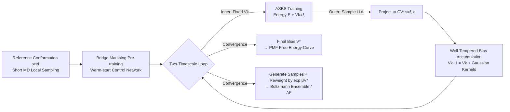

# Enhancing Diffusion-Based Sampling with Molecular Collective Variables

**Conference**: ICLR 2026  
**OpenReview**: [https://openreview.net/forum?id=1bJN1EQByS](https://openreview.net/forum?id=1bJN1EQByS)  
**Code**: TBD  
**Area**: Computational Biology / Molecular Simulation / Diffusion Sampler  
**Keywords**: Boltzmann Generator, Diffusion Sampler, Enhanced Sampling, Collective Variables, well-tempered metadynamics, Free Energy, Schrödinger Bridge

## TL;DR
This paper integrates the concept of "well-tempered metadynamics" from molecular dynamics—applying online repulsive biases along collective variables (CVs)—into the state-of-the-art diffusion sampler ASBS to create WT-ASBS. During training, it continuously accumulates biases along low-dimensional CVs to force the discovery of rare conformations; during inference, the bias is reweighted to restore the Boltzmann distribution. This marks the first time a diffusion sampler has characterized reaction surfaces involving bond breaking/formation with wall-clock times significantly lower than metadynamics.

## Background & Motivation
**Background**: Sampling from the Boltzmann distribution $\nu(x)\propto\exp(-\beta E(x))$ is central to statistical mechanics simulations. Traditional Molecular Dynamics (MD) or MCMC progresses through time, but transitions between conformations separated by high energy barriers are extremely slow, often requiring massive serial energy evaluations to capture a single conformational change or chemical reaction. Machine learning "Boltzmann Generators" (early normalizing flows and recent diffusion samplers like ASBS) attempt to bypass dynamics by using energy or log-density to directly draw i.i.d. samples.

**Limitations of Prior Work**: Although diffusion samplers can amortize sampling costs over many draws, they do not inherently reduce the number of energy evaluations required compared to MD. Furthermore, they suffer from a notorious "mode collapse" issue—where training and sampling concentrate on high-probability basins, systematically underestimating rare but thermodynamically critical states. Worse, reliable free energies and ensemble averages strictly depend on assigning correct (potentially exponentially small) weights to rare conformations. Base ASBS fails on alanine dipeptide by missing low-occupancy modes due to its mode-seeking nature.

**Key Challenge**: Diffusion samplers are naturally mode-seeking and tend to converge toward major basins, whereas molecular science specifically requires the discovery of rare states and statistically correct reweighting. These two objectives are in direct conflict.

**Goal**: To equip diffusion samplers with an "encourage exploration + accurate reweighting" mechanism, allowing the sampling of full conformational spaces and reaction surfaces in Cartesian coordinates faster than MD enhanced sampling.

**Core Idea (Biasing + Reweighting)**: Inspired by enhanced sampling, an **online repulsive potential** is maintained along a set of informative low-dimensional CVs (e.g., backbone dihedrals, bond lengths). Regions of CV space that are visited more frequently accumulate higher bias, increasing their effective energy and pushing subsequent samples toward new regions, which is equivalent to raising the temperature in the projected space. During inference, importance weighting is used to precisely remove this bias, enabling expanded exploration while ensuring unbiased ensemble estimation.

## Method

### Overall Architecture
WT-ASBS (Well-Tempered Adjoint Schrödinger Bridge Sampler) combines the ASBS diffusion sampler with online biasing from well-tempered metadynamics. It operates on two timescales: in the inner loop, the current bias $V_k$ is fixed while training the ASBS to convergence (ensuring the marginal distribution at $t=1$ equals the biased target $\nu_{V_k}$); in the outer loop, a batch of i.i.d. samples is drawn from the trained sampler, projected onto the CV space, and Gaussian kernels are added to the bias according to well-tempered rules. The process is further implemented with "local pre-training warm-start + constraint potentials for reachable domains + reweighting/refinement" for real molecular systems.

### Key Designs

**1. Well-tempered bias on CV space: Locking "heating" onto slow coordinates.** The physical core of the method is derived from well-tempered metadynamics by Barducci et al. CVs are low-dimensional functions of atomic coordinates $\xi:\mathcal{X}\to\mathcal{S}\subset\mathbb{R}^m$ ($m\ll n$), encoding only slow, chemically relevant motions (e.g., dihedrals $\phi,\psi$, bond lengths). Adding bias $V(s)$ on CVs yields a sampling density $\nu_V(x)\propto\exp[-\beta E(x)-\beta V(\xi(x))]$, corresponding to importance weights $w(x)\propto\exp[+\beta V(\xi(x))]$. Given a bias factor $\gamma>1$, the well-tempered bias is taken as $V_{WT}(s)=-(1-\frac1\gamma)F(s)$, where $F(s)=-\frac1\beta\log\bar\nu(s)$ is the Potential of Mean Force (PMF) along the CV. The CV marginal then satisfies $\bar\nu_{WT}(s)\propto[\bar\nu(s)]^{1/\gamma}$—meaning the CV directions behave as if they were at a higher effective temperature $T_{\text{eff}}=\gamma T$, while the **conditional distribution in orthogonal directions remains unchanged**. This satisfies the need for "local efficiency" while heating only slow coordinates without destroying other degrees of freedom.

**2. Two-timescale online bias accumulation with convergence guarantees.** The bias is not known a priori but is constructed on-the-fly by stacking Gaussian kernels during training. Each step in the outer loop draws an i.i.d. batch $\{X_{1,k}^{(i)}\}$ from the current sampler, projects to CV space to get $s_k^{(i)}$, and updates via:
$$V_{k+1}(s)=V_k(s)+h\sum_{i=1}^N \exp\!\Big(-\tfrac{\beta}{\gamma-1}V_k(s_k^{(i)})\Big)K_\sigma(s,s_k^{(i)})$$
where $K_\sigma(s,s')=\exp(-\|s-s'\|^2/2\sigma^2)$ is the Gaussian kernel and $h$ is a fixed height. Higher bias in visited regions reduces the height of newly added kernels, automatically "filling" free energy basins. Proposition 3.1 in the paper states that $V_k$ almost surely converges to $V^*(s)=-(1-\frac1\gamma)F(s)+\text{const}$. A direct benefit (Remark 3.1) is that the **final bias itself is the PMF**: $F(s)=-\frac{\gamma}{\gamma-1}V^*(s)+\text{const}$, providing the free energy curve for free. Compared to MD, diffusion samplers provide decorrelated i.i.d. samples at each step, allowing bias deposition without waiting for decorrelation, thus enabling smaller $\gamma$, smaller $h$, and faster mixing.

**3. Engineering recipes for molecular systems.** Beyond the algorithm, the paper provides three essential implementation elements. First is **local pre-training warm-start**: although ASBS theoretically requires no data, running short MD near reference conformations to get samples of barrier-less regions allows bridge matching to initialize the control network. This step doesn't require high precision (classical force fields or proxy models work) but significantly accelerates training. Second is **constraint potentials to limit the reachable domain $\mathcal{A}$**: sampling should remain on conformations dynamically connected to the reference. This is formalized through chemical isomerism—e.g., applying flat-bottom harmonic potentials on improper torsions for $C_\alpha$ chiral centers to keep the system in the natural L-configuration. Third is **sampling and refinement**: the PMF can be read from $V^*$, or samples can be generated by integrating the SDE and assigned weights $W_i=\exp[\beta V^*(\xi(X_i))]$. If the sampler is imperfect, short MD/MCMC runs on the biased surface $E+V^*\circ\xi$ starting from generated samples can restore asymptotic correctness while maintaining efficiency.

## Key Experimental Results
Four molecular sampling tasks: two peptides (Alanine dipeptide Ala2, tetrapeptide Ala4 with classical force fields and implicit solvent) and two chemical reactions (SN2, post-transition state bifurcation cycloaddition using uMLIP UMA-S-1.1 for near-DFT energies). The primary baselines are standard ASBS and WTMetaD. The core evaluation is whether the PMF derived from reweighted samples/bias matches the reference density.

### Main Results

| Task | Results |
|------|---------|
| **Ala2 ($\phi,\psi$ as CVs)** | Bias gradually pushes sampling from high-occupancy states to low-occupancy states; PMF from bias and weighted samples both highly consistent with long-range reference MD; baseline ASBS **completely fails** in low-occupancy regions; WT-ASBS converges $\Delta F$ more accurately than WTMetaD at the same bias factor. |
| **Ala4 ($\phi_1,\phi_2,\phi_3$ as CVs, 8 modes)** | Starting from only 1 mode pre-training, WT-ASBS discovers all 8 modes early in training, exploring much faster than WTMetaD; free energy MAE for 8 states converges within chemical accuracy (1 kcal/mol). |
| **SN2 Reaction** | 2-D PMF along two C–Cl bond lengths is symmetric and consistent with WTMetaD; TS location and barrier align with saddle point optimization. |
| **Cycloaddition (Post-TS Bifurcation)** | Using contact CVs $s_1=c_1+c_2+c_3$ (progress) and $s_2=c_2-c_3$ (product differentiation), 1-D/2-D PMF matches WTMetaD, successfully resolving the two bifurcated product channels. |

### Efficiency (Four A100 80GB, Wall-clock time vs. Convergence)

| Reaction | WT-ASBS | WTMetaD |
|------|---------|---------|
| SN2 | 0.77M Energy Evals / **4.3 hours** | 4.0M / 29 hours |
| Post-TS Bifurcation | 2.6M Energy Evals / **23 hours** | 6.4M / 48 hours |

### Key Findings
- WT-ASBS clearly outperforms in **crossing large barriers and discovering rare modes** (i.i.d. samples explore multiple conformational directions simultaneously, whereas MD must cross them sequentially in time).
- However, on Ala4, the free energy MAE is **not superior** to WTMetaD—once barriers on CVs are crossed, MD's local mixing within basins is highly efficient, whereas the diffusion sampler must learn the entire high-dimensional intra-basin distribution. The authors suggest a "global diffusion move + local MD mixing" combo for complex systems.
- Ablation: Changing $h, \sigma, \gamma$ over a wide range leaves final $\Delta F$ mostly unchanged; larger $h$/wider $\sigma$ mainly accelerates early exploration.
- Confirmed that automatically learned ML CVs can replace manual CVs while still restoring accurate PMFs.

## Highlights & Insights
- **Clean cross-community integration**: It "ports" mature well-tempered metadynamics to diffusion samplers almost as-is, proving convergence (Bias → $-(1-1/\gamma)F$) so that "Free Energy = Final Bias" holds as a free byproduct.
- **First reaction surface sampling with diffusion**: Capturing bond breaking/formation and resolving post-TS bifurcation with a fraction of WTMetaD's wall-clock time is a substantive step toward real chemical applications for neural samplers.
- **Honest assessment of limitations**: Explicitly admits that MD remains stronger for intra-basin refinement and proposes a hybrid "global diffusion + local MD" route, which is more persuasive than claiming SOTA everywhere.
- **Effect of i.i.d. sampling on bias deposition**: Because there is no need to wait for decorrelation, smaller $\gamma$, smaller $h$, and more frequent deposition can be used—a structural advantage of diffusion samplers over MD enhanced sampling.

## Limitations & Future Work
- Intra-basin free energy accuracy is limited by the diffusion sampler's ability to learn full high-dimensional distributions; complex systems may still require local MD refinement.
- Still relies on manually selecting or learning a good set of low-dimensional CVs; poor CV selection can limit the directions of exploration.
- Constraint potentials limit sampling to the reachable domain $\mathcal{A}$ connected to the reference; bond reorganization over extremely long timescales (hours to days) is not covered.
- Reweighting weights $\exp[\beta V^*(\xi(x))]$ can have high variance if the sampler is imperfect; future work suggests extensions to discrete grids or Dynamic Bayesian Networks.

## Related Work & Insights
- The underlying backbone is **ASBS (Liu et al., 2025)**—modeling Boltzmann sampling as a Schrödinger Bridge with Adjoint/Corrector Matching to avoid SDE backpropagation.
- For enhanced sampling, it builds on **well-tempered metadynamics (Barducci et al., 2008)** and variational biasing (Valsson & Parrinello 2014).
- Complementary to data-driven generative models (e.g., Torsional Diffusion, RFdiffusion), which focus on mode exploration without precise Boltzmann weighting.
- Insight: Neural samplers and classical rare-event techniques are not mutually exclusive; a hybrid paradigm of "global measure transport moves + local physical dynamics" may be the optimal practical solution for complex molecular systems.

## Rating
- **Novelty**: ⭐⭐⭐⭐ — Integration of well-tempered bias with diffusion samplers with convergence proofs and the first characterization of reaction surfaces via diffusion.
- **Experimental Thoroughness**: ⭐⭐⭐⭐ — Peptides and chemical reactions across four tasks, covering efficiency, ablation, and ML CV validation.
- **Writing Quality**: ⭐⭐⭐⭐ — Clear logical flow using the three sampling requirements as a through-line; excellent balance of formulaic and physical intuition.
- **Value**: ⭐⭐⭐⭐ — Advances diffusion samplers from "toys slower than MD" to practical tools capable of resolving reaction surfaces in shorter wall-clock times.

<!-- RELATED:START -->

## Related Papers

- [\[ICLR 2026\] Learning Collective Variables from BioEmu with Time-Lagged Generation](learning_collective_variables_from_bioemu_with_time-lagged_generation.md)
- [\[ICLR 2026\] Enhancing Molecular Property Predictions by Learning from Bond Modelling and Interactions](enhancing_molecular_property_predictions_by_learning_from_bond_modelling_and_int.md)
- [\[ICLR 2026\] Graph Diffusion Transformers are In-Context Molecular Designers](graph_diffusion_transformers_are_in-context_molecular_designers.md)
- [\[ICLR 2026\] Learning Flexible Forward Trajectories for Masked Molecular Diffusion](learning_flexible_forward_trajectories_for_masked_molecular_diffusion.md)
- [\[ICLR 2026\] SigmaDock: Untwisting Molecular Docking with Fragment-Based SE(3) Diffusion](sigmadock_untwisting_molecular_docking_with_fragment-based_se3_diffusion.md)

<!-- RELATED:END -->
