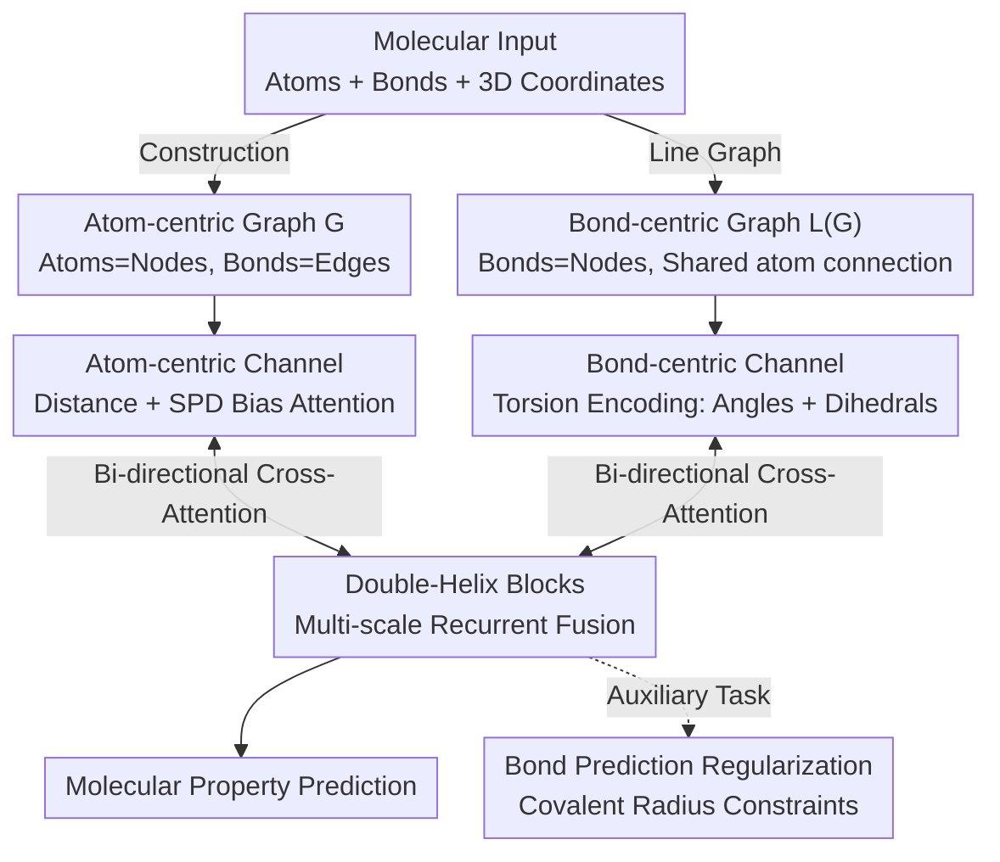

# Enhancing Molecular Property Predictions by Learning from Bond Modelling and Interactions

**Conference**: ICLR 2026  
**arXiv**: [2603.00568](https://arxiv.org/abs/2603.00568)  
**Code**: Available  
**Area**: Self-Supervised Learning / Molecular Representation Learning / Graph Neural Networks  
**Keywords**: molecular representation, dual-graph, bond modeling, GNN, property prediction

## TL;DR
The authors propose DeMol, a dual-graph enhanced multi-scale interaction framework. By utilizing parallel atom-centric and bond-centric graph channels along with Double-Helix Blocks, the model explicitly accounts for atom-atom, atom-bond, and bond-bond interactions, achieving SOTA results on benchmarks including PCQM4Mv2, OC20, and QM9.

## Background & Motivation

**Background**: Mainstream molecular representation learning methods are based on GNNs, which model molecules as graphs (atoms as nodes, bonds as edges). Recent approaches further incorporate 3D geometric information (distances, angles) to enhance predictions.

**Limitations of Prior Work**: Existing methods are "atom-centric," where chemical bonds are treated merely as pairwise interactions between atoms. However, bonds themselves carry rich information (bond order, length, hybridization state), and non-additive interactions exist between bonds (e.g., delocalized $\pi$ electron systems in benzene rings, or configural differences between cisplatin and transplatin that directly determine medicinal efficacy).

**Key Challenge**: Single-graph models cannot simultaneously and sufficiently encode both atomic topological relationships and bond geometric relationships (dihedral angles, bond angles), leading to constrained prediction accuracy.

**Goal**: To explicitly model chemical bond information and inter-bond interactions by constructing an atom-bond dual-channel fusion framework.

**Key Insight**: Information theory analysis demonstrates that the bond-centric graph (line graph) contains additional structural information not present in the original graph (Proposition 1), and a dual-graph representation strictly preserves more mutual information (Proposition 2).

**Core Idea**: Molecules are encoded in parallel using dual graphs (atom graph + bond graph). Information from the two channels is fused at multiple scales via Double-Helix Blocks, while covalent radius regularization ensures geometric consistency.

## Method

### Overall Architecture
The core problem DeMol addresses is that mainstream molecular models are "atom-centric," which simplifies chemical bonds into edges between atoms, thereby losing rich bond information and non-additive bond-bond interactions. The proposed solution involves maintaining two graphs simultaneously: an atom-centric graph $\mathcal{G}$ (atoms as nodes, bonds as edges) and its line graph, the bond-centric graph $\mathcal{L}(\mathcal{G})$ (bonds as nodes, with edges connecting bonds that share an atom). Each graph has a corresponding Transformer encoding channel: the **atom-centric channel** handles topological and spatial relationships, while the **bond-centric channel** manages bond-level geometry (bond angles, dihedral angles). These two channels undergo repeated cross-channel information exchange via **Double-Helix Blocks**. Additionally, a **bond prediction regularization** task uses covalent radii to constrain geometric representations within chemically plausible ranges. The final fused representation is used to predict molecular properties. The theoretical foundation is based on several propositions: the bond-centric graph carries extra structural information, dual-graph representations preserve more mutual information, and the final predictive power stems from the effective fusion of these two representations.

### Key Designs

**1. Atom-centric Channel: Integrating Spatial and Topological Information into Attention Biases**

This channel processes atom-level features and relationships through a Transformer with structural encoding. It injects two types of priors as self-attention biases: 3D inter-atomic distances expanded via Gaussian basis kernels, and 2D shortest path distances (SPD) encoding topological proximity. These are added to the attention scores to update atomic embeddings, capturing both geometry (proximity) and topology (connectivity).

**2. Bond-centric Channel: Modeling Bond-Bond Geometry in the Natural Bond Domain**

Atom channels are inherently poor at expressing "between-bond" relationships such as bond angles and dihedrals. The bond-centric graph provides a natural domain for these geometric relationships (Proposition 3). In the line graph, bonds become nodes, and bond-bond relationships become first-order adjacencies. The key innovation is **Torsion Encoding** $\Phi_b^{tors}$: it encodes bond angles $\theta_{ijk}$ and dihedral angles $\varphi_{ijkl}$ using Gaussian basis kernels as attention biases between bond nodes. This allows the model to explicitly distinguish configurations like cisplatin and transplatin.

**3. Double-Helix Blocks: Multi-scale Entangled Fusion of Channels**

Independent channels are insufficient; Proposition 2 indicates that predictive power arises from the **effective fusion** of the two representations. Double-Helix Blocks implement this via bi-directional cross-attention: atomic embeddings serve as queries for bond embeddings, and vice versa. This exchange occurs across multiple scales, allowing atomic representations to incorporate geometric details and bond representations to gain topological context.

**4. Bond Prediction Regularization: Constraining Geometry with Covalent Radii**

To prevent learned structural representations from deviating from chemical reality, an auxiliary bond prediction task is added. Based on inter-atomic distances and covalent radius constraints, the model predicts whether a bond should exist between atom pairs. This serves as a "guardrail" of chemical priors, ensuring internal structural features align with plausible bonding patterns.

### Loss & Training
The training objective consists of three parts: the task-specific main loss (e.g., MAE for property regression), the covalent radius bond prediction regularization term, and a structure-aware masking strategy to enhance training efficiency.

## Key Experimental Results

### Main Results: PCQM4Mv2

| Model | Parameters | MAE↓ |
|------|--------|------|
| GPS++ | 44.3M | 0.0778 |
| Transformer-M | 69M | 0.0772 |
| Unimol+ | 77M | 0.0693 |
| TGT-At | 203M | 0.0671 |
| **Ours (DeMol)** | **186M** | **0.0603** |

### OC20 IS2RE Validation Set

| Model | Average Energy MAE (eV)↓ | Average EwT (%)↑ |
|------|------|------|
| Unimol+ | 0.4088 | 8.61 |
| TGT-At | 0.4030 | 8.82 |
| **Ours (DeMol)** | **0.3879** | **9.23** |

### Ablation Study

| Configuration | Description |
|------|------|
| Atom Channel Only | Performance drops; lack of bond information |
| w/o Double-Helix | Performance drops; no fusion between channels |
| w/o Torsion Encoding | Performance drops; lack of angle/dihedral info |
| **Full DeMol** | **0.0603; Optimal configuration** |

### Key Findings
- DeMol achieves a 10.1% improvement over the previous SOTA (TGT-At) using a single model rather than an ensemble.
- It demonstrates stable performance and strong generalization in Out-of-Distribution (OOD) scenarios in OC20 IS2RE.
- Torsion encoding in the bond-centric channel makes a significant contribution to accuracy.

## Highlights & Insights
- Information theory analysis provides rigorous theoretical support for the dual-graph design via four propositions.
- The example of cisplatin/transplatin is intuitive—identical atomic composition with different bond configurations leads to drastically different medicinal effects.
- Double-Helix Blocks are potentially transferable to other multi-view fusion scenarios.

## Limitations & Future Work
- The model has a large parameter count (186M), leading to high training costs.
- Evaluation is primarily on small molecules and materials; applicability to macromolecules remains to be explored.
- Information theory providing a necessary condition does not guarantee the network fully utilizes the information in practice.

## Related Work & Insights
- **vs. Transformer-M**: While Transformer-M integrates 3D distance encoding on the atom graph, DeMol introduces an additional bond-centric channel.
- **vs. ALIGNN**: ALIGNN uses line graphs for message passing but lacks the atom-bond cross-attention found in DeMol.
- **vs. GemNet**: GemNet encodes dihedral angles but operates primarily within the atomic space.

## Rating
- Novelty: ⭐⭐⭐⭐ The combination of dual-graph, information theory motivation, and Double-Helix fusion is novel.
- Experimental Thoroughness: ⭐⭐⭐⭐⭐ Comprehensive SOTA results across four mainstream benchmarks.
- Writing Quality: ⭐⭐⭐⭐ Solid theoretical analysis with intuitive examples.
- Value: ⭐⭐⭐⭐ Significant advancement for the field of molecular representation learning.

<!-- RELATED:START -->

## Related Papers

- [\[ICLR 2026\] TetraGT: Tetrahedral Geometry-Driven Explicit Token Interactions with Graph Transformer for Molecular Representation Learning](tetragt_tetrahedral_geometry-driven_explicit_token_interactions_with_graph_trans.md)
- [\[ICLR 2026\] Enhancing Diffusion-Based Sampling with Molecular Collective Variables](enhancing_diffusion-based_sampling_with_molecular_collective_variables.md)
- [\[ICLR 2026\] SAIR: Enabling Deep Learning for Protein-Ligand Interactions with a Synthetic Structural Dataset](sair_enabling_deep_learning_for_protein-ligand_interactions_with_a_synthetic_str.md)
- [\[ICLR 2026\] RankFlow: Property-aware Transport for Protein Optimization](rankflow_property-aware_transport_for_protein_optimization.md)
- [\[ICLR 2026\] Learning Flexible Forward Trajectories for Masked Molecular Diffusion](learning_flexible_forward_trajectories_for_masked_molecular_diffusion.md)

<!-- RELATED:END -->
