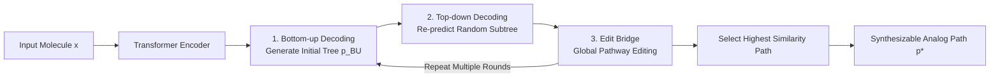

# Exploring Synthesizable Chemical Space with Iterative Pathway Refinements

**Conference**: ICLR 2026  
**OpenReview**: [https://openreview.net/forum?id=aQKVfKOkR5](https://openreview.net/forum?id=aQKVfKOkR5)  
**Code**: [NVIDIA-Digital-Bio/ReaSyn](https://github.com/NVIDIA-Digital-Bio/ReaSyn)  
**Area**: Computational Biology / Drug Discovery / Synthesizable Molecule Generation  
**Keywords**: Synthesizable projection, synthesis pathway generation, bidirectional autoregressive, discrete flow editing, ReaSyn  

## TL;DR
ReaSyn models "finding synthesizable analogs for a given molecule" as a search/inference problem. It utilizes a single autoregressive Transformer to support both bottom-up and top-down synthesis tree generation, overlaid with a global discrete flow editor (Edit Bridge). Through an iterative cycle of "bottom-up decoding $\rightarrow$ top-down decoding $\rightarrow$ global editing," it significantly improves the coverage and reconstruction rates within the synthesizable chemical space.

## Background & Motivation

**Background**: Molecule generation models are essential tools for accelerating drug discovery, but a long-standing pain point is that they do not guarantee the synthesizability of generated molecules. A mainstream approach to constrain the generation to the "synthesizable space" is to directly generate synthesis pathways rather than final product molecules. Among these, "synthesizable projection" (analog generation) is particularly useful because it is modular and can be plugged into any molecule generator to "project" a potentially unsynthesizable input molecule into a structurally similar but synthesizable analog.

**Limitations of Prior Work**: The combinatorial space of synthesizable molecules expands exponentially with the number of building blocks and reactions (over $10^{60}$ molecules in this study's setting). Existing methods show poor exploration capabilities and low coverage in this space. Specifically, two issues exist: (1) Unidirectional generation—most methods are either bottom-up (BU), building from blocks to products, or top-down (TD), deducing from products. The difficulty of BU lies in searching the massive building block set $\mathcal{B}$ (210k) rather than the reaction set $\mathcal{R}$ (115) ($|\mathcal{B}|\gg|\mathcal{R}|$) in initial steps. While TD aligns better with chemists' retrosynthetic intuition, it does not guarantee that leaf nodes land on valid building blocks. (2) Luiky pathway representations—existing methods use Morgan fingerprints for building blocks, which suffer from information loss and high sensitivity (single bit errors lead to entirely different molecules). They also rely on hierarchical representations (predicting node type then features), which lead to error accumulation and architectural complexity.

**Key Challenge**: Nodes in a synthesis tree are coupled; modifying any node requires both upward propagation (updating the remaining path to be compatible with a new intermediate) and downward propagation (regenerating the subtree producing that intermediate). Unidirectional generation cannot express this bidirectional correction, thus limiting exploration.

**Goal**: Solve synthesizable projection $p^* = \arg\max_p \mathrm{sim}(\mathrm{prod}(p), x)$ (finding a pathway $p$ whose final product is most similar to target $x$) as a search problem requiring bidirectional reasoning.

**Core Idea**: **[Unified Bidirectionality + Global Editing]** Use a single model with both BU/TD generation capabilities and introduce a discrete flow model capable of insertion/deletion/replacement at the entire pathway level. These components form an iterative refinement loop to "reason" out synthesizable pathways—ReaSyn (homophonous with "reason").

## Method

### Overall Architecture

ReaSyn adopts an encoder-decoder Transformer: the encoder encodes the input molecule $x$, and the decoder autoregressively generates the synthesis pathway for its synthesizable analog. Generation follows a repeatable three-step iterative loop: first, a bottom-up decoding generates an initial synthesis tree; then, a random subtree is selected for top-down re-prediction; finally, the Edit Bridge performs global editing at the pathway level. After multiple iterations, the pathway whose product has the highest similarity to the target molecule is selected as the final solution.

### Key Designs

**1. Bidirectional Serialized Path Representation: Representing building blocks with SMILES and unifying directions via post-order traversal.** ReaSyn abandons the hierarchical + fingerprint representation in favor of a simple sequence representation for synthesis trees. A pathway $p$ is split into $B$ blocks, where each block is either a molecule or a reaction. The bottom-up sequence $p_{\mathrm{BU}} := p_1 \oplus p_2 \oplus \cdots \oplus p_B$ corresponds to the post-order traversal (leaves to root). Reversing it yields the top-down sequence $p_{\mathrm{TD}} := p_B \oplus p_{B-1} \oplus \cdots \oplus p_1$ (root to leaves). Molecular blocks utilize SMILES with start/end delimiters `[MOL:START]`/`[MOL:END]`, while reaction blocks are single tokens representing reaction types, sharing the same vocabulary. Using SMILES avoids the information loss of non-bijective fingerprints and the error accumulation of hierarchical structures.

**2. Single Model Bidirectional Training/Inference + Token-Type Weighted Loss.** During training, for each $(x, p)$ pair, the model randomly switches between $p=p_{\mathrm{BU}}$ and $p=p_{\mathrm{TD}}$ with 0.5 probability using next-token prediction. Because molecular blocks consist of multiple SMILES tokens while reaction blocks are single tokens, a type-normalized loss is introduced to prevent SMILES from dominating the learning:

$$\mathcal{L} = -\mathbb{E}_{(x,p)\sim\mathcal{D},\, p\sim\{p_{\mathrm{BU}},p_{\mathrm{TD}}\}}\left[\frac{1}{|I_{\mathrm{mol}}|}\sum_{i\in I_{\mathrm{mol}}}\log\pi_\theta(p_i|x,p_{1:i-1}) + \frac{1}{|I_{\mathrm{other}}|}\sum_{j\in I_{\mathrm{other}}}\log\pi_\theta(p_j|x,p_{1:j-1})\right]$$

where $I_{\mathrm{mol}}$ and $I_{\mathrm{other}}$ are index sets for molecular tokens and other tokens (reactions, delimiters), respectively. During inference, direction is forced by setting the logits of non-target categories for the first token to $-\infty$.

**3. Bidirectional Iterative Loop: Subtree-level corrections propagating to roots/leaves.** Given a target product, an initial $B$-block path $p_{\mathrm{BU}}$ is generated. Then, a block index $b \in \{1,\dots,B-1\}$ is randomly sampled, and the model re-predicts the right half of the complementary sequence $p^{>b}_{\mathrm{TD}}$ (equivalent to $p^{\le(B-b)}_{\mathrm{BU}}$) to refine the tree. Bidirectional iteration ensures that updates to any node correctly propagate throughout the tree.

**4. Edit Bridge: Global editing starting from "Model Distribution" instead of "Noise".** ReaSyn pushes searching further with Edit Flow (a discrete flow defining a CTMC on sequences with insertion/deletion/replacement operators). Unlike standard Edit Flow where the source $p_0$ is empty or uniform noise, ReaSyn uses samples from the bidirectional autoregressive model as $p_0$. It trains the Edit Flow to bridge this "decent draft" to the data distribution $p_1$, hence the name **Edit Bridge**. This coupling increases the alignment rate from $0.0\%$ to $70.6\%$, reducing sampling steps from $142.9$ to $30.0$.

## Key Experimental Results

Setup: 115 common reactions + 211k Enamine building blocks, covering a space of $>10^{60}$ molecules.

### Main Results

Synthesizable Molecule Reconstruction (mean of 3 runs):

| Dataset | Method | Recon. Rate (%) | Similarity | Diversity (Path) | Diversity (BB) |
|--------|------|-----------|--------|--------------|----------------|
| Enamine | SynNet | 25.2 | 0.661 | 0.014 | 0.239 |
| Enamine | SynFormer | 66.3 | 0.913 | 0.101 | 0.587 |
| Enamine | **ReaSyn** | **95.0** | **0.987** | **0.118** | **0.753** |
| ChEMBL | SynFormer | 19.7 | 0.668 | 0.039 | 0.192 |
| ChEMBL | **ReaSyn** | **31.7** | **0.751** | **0.050** | **0.321** |
| ZINC1k | SynFormer | 18.0 | 0.624 | 0.020 | 0.181 |
| ZINC1k | **ReaSyn** | **87.9** | **0.958** | **0.071** | **0.658** |

ZINC1k includes 37k unseen building blocks (simulating library expansion). ReaSyn achieves an 87.9% reconstruction rate in this OOD setting, demonstrating strong generalization.

Synthesizable Goal-Directed Optimization (TDC 15 oracles, average AUC top-10):

| Method | Synthesis Constrained? | Avg Score |
|------|--------------|--------|
| Graph GA-**ReaSyn** | ✓ | **0.633** |
| Graph GA-SF (SynFormer) | ✓ | 0.612 |
| SynthesisNet | ✓ | 0.608 |
| SynNet | ✓ | 0.545 |
| Graph GA (Unconstrained) | ✗ | 0.633 |

ReaSyn, acting as a mutation operator for Graph GA, yields the highest score among constrained baselines, matching unconstrained Graph GA.

### Ablation Study

Contribution of components to reconstruction (BU: Bottom-up, TD: Top-down, EB: Edit Bridge):

| Config | Description |
|------|------|
| BU / TD | Single direction only; fails to reconstruct many molecules even with higher compute. |
| BU+TD | Bidirectional iteration; significantly outperforms unidirectional approaches. |
| **BU+TD+EB** | Full ReaSyn; further improvement provided by Edit Bridge. |

| Coupling Type | $p_0$-$p_1$ Alignment | Sampling Steps |
|----------|--------------------|--------------|
| Empty | 0.0% | 142.9 |
| Uniform | 2.6% | 94.6 |
| **Edit Bridge** | **70.6%** | **30.0** |

### Key Findings
- Bidirectional iteration is the primary factor for the performance leap.
- Edit Bridge improves the source distribution from noise to autoregressive drafts, boosting alignment by an order of magnitude and reducing sampling steps by 3-5x.
- In sEH binding affinity optimization, ReaSyn is superior across affinity, SA score, QED, and AiZynthFinder success rate.

## Highlights & Insights
- Explicitly reformulates synthesizable projection as a **bidirectional reasoning search problem**, elegantly implemented via a single model and complementary traversals.
- **Edit Bridge is a transferable trick**: Bridging a discrete flow from a pre-trained generator's draft rather than noise significantly lowers alignment and sampling costs.
- Direct SMILES representation for building blocks eliminates information loss and hierarchical error accumulation.

## Limitations & Future Work
- Edit Bridge requires expensive offline preparation of 10.5 million $(p_0, p_1)$ training pairs.
- The iterative loop represents a trade-off between test-time compute and reconstruction rate.
- Reconstruction on ChEMBL remains relatively low (31.7%) as many targets fall outside the predefined $\mathcal{B}$ and $\mathcal{R}$.
- Synthesizability relies on proxy models (AiZynthFinder) rather than wet-lab validation.

## Related Work & Insights
- **Synthesizable Design**: SynNet, SynFormer, ChemProjector, and GFlowNet-based methods. ReaSyn is the first to unify bidirectionality with global editing in the "projection" paradigm.
- **Retrosynthesis Planning**: Unlike AiZynthFinder which treats the target as a fixed starting point, ReaSyn treats it as a guide, allowing for optimization of the entire pathway and final product simultaneously.
- **Discrete Flow**: This work introduces bridging "learned distributions" to "data distributions," providing a reference for other discrete sequence refinement tasks.

## Rating
- Novelty: ⭐⭐⭐⭐⭐ Bidirectional unification + Edit Bridge (learned-to-data bridging) are genuine innovations.
- Experimental Thoroughness: ⭐⭐⭐⭐⭐ Covers reconstruction, goal-directed optimization (TDC + sEH), and hit expansion with OOD settings.
- Writing Quality: ⭐⭐⭐⭐ Clear structure; some details (Edit Flow alignment) require referring to the appendix.
- Value: ⭐⭐⭐⭐⭐ Large leads in reconstruction/coverage (e.g., ZINC1k 87.9% vs 18.0%) and modularity for drug discovery.

<!-- RELATED:START -->

## Related Papers

- [\[ACL 2026\] ToxReason: A Benchmark for Mechanistic Chemical Toxicity Reasoning via Adverse Outcome Pathway](../../ACL2026/computational_biology/toxreason_a_benchmark_for_mechanistic_chemical_toxicity_reasoning_via_adverse_ou.md)
- [\[ICLR 2026\] A Genetic Algorithm for Navigating Synthesizable Molecular Spaces](a_genetic_algorithm_for_navigating_synthesizable_molecular_spaces.md)
- [\[ICLR 2026\] SynCoGen: Synthesizable 3D Molecule Generation via Joint Reaction and Coordinate Modeling](syncogen_synthesizable_3d_molecule_generation_via_joint_reaction_and_coordinate_.md)
- [\[ICLR 2026\] Iterative Distillation for Reward-Guided Fine-Tuning of Diffusion Models in Biomolecular Design](iterative_distillation_for_reward-guided_fine-tuning_of_diffusion_models_in_biom.md)
- [\[ICLR 2026\] Low rank adaptation of chemical foundation models generate effective odorant representations](low_rank_adaptation_of_chemical_foundation_models_generate_effective_odorant_rep.md)

<!-- RELATED:END -->
