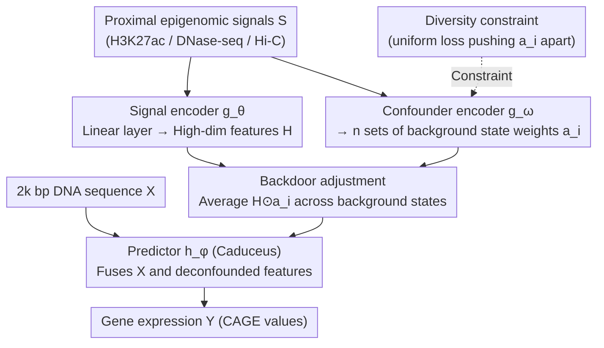

# Extending Sequence Length is Not All You Need: Effective Integration of Multimodal Signals for Gene Expression Prediction

**Conference**: ICLR 2026  
**arXiv**: [2602.21550](https://arxiv.org/abs/2602.21550)  
**Code**: [https://github.com/yangzhao1230/Prism](https://github.com/yangzhao1230/Prism)  
**Area**: Computational Biology  
**Keywords**: Gene expression prediction, epigenomic signals, causal inference, backdoor adjustment, confounding variables

## TL;DR
The study challenges the "longer is better" paradigm in long-sequence modeling for gene expression prediction, discovering that current SSM models essentially utilize only proximal information. It further identifies background chromatin signals (DNase-seq/Hi-C) as confounding variables that introduce spurious correlations and proposes the Prism framework to perform deconfounding via backdoor adjustment, outperforming 200k-sequence SOTA models using only 2k short sequences.

## Background & Motivation

**Background**: Gene expression prediction aims to predict mRNA expression levels (CAGE values) from DNA sequences. Mainstream methods focus on extending input sequence length to capture distal enhancers (potentially hundreds of thousands of base pairs away), often employing SSMs (e.g., Caduceus, Mamba) for linear-complexity long-sequence modeling. Concurrently, an increasing number of methods incorporate multimodal epigenomic signals (H3K27ac, DNase-seq, Hi-C) to provide cell-type-specific information.

**Limitations of Prior Work**: (a) The fixed-size hidden states of SSMs struggle to retain all information from ultra-long sequences and suffer from "recency bias"; experiments demonstrate that the performance of Caduceus continuously declines once sequences exceed 2k bp, and Seq2Exp (trained on 200k bp) shows nearly identical testing performance when truncated to 2.5k bp. (b) Existing methods typically perform simple concatenation of multimodal epigenomic signals, neglecting the distinct biological roles of different signals.

**Key Challenge**: Different epigenomic signals play varying roles—H3K27ac directly marks active regulatory elements ("foreground signals"), while DNase-seq/Hi-C reflect the background chromatin state ("background signals"). Models tend to develop over-reliance on background signals during training (performance drops sharply upon removal), yet the independent contribution of background signals to performance is minimal. This asymmetry indicates that models learn spurious correlations: while open chromatin regions often co-occur with high expression, gene expression can occur independently in regions with low accessibility.

**Goal**: (a) Demonstrate that long-sequence modeling is not effectively utilized by current technical tools; (b) identify and eliminate the confounding effects introduced by background chromatin signals; (c) achieve SOTA performance using short sequences combined with the correct integration of multimodal signals.

**Key Insight**: The multimodal signal fusion is viewed through a causal inference framework—modeling the background chromatin state as a confounding variable $C$ and cutting the $H \leftarrow C \rightarrow Y$ path via backdoor adjustment to isolate the direct causal effect $H \rightarrow Y$.

**Core Idea**: Instead of blindly extending sequence length, the focus should be on correctly integrating proximal epigenomic signals by handling the role differences of various signals through causal deconfounding.

## Method

### Overall Architecture
Prism utilizes only 2k bp DNA sequences $X$ centered at the TSS and proximal multimodal epigenomic signals $S$ (H3K27ac, DNase-seq, Hi-C). The core mechanism involves a causal deconfounding step during signal fusion. The logic follows a "diagnosis then treatment" approach: the first two components are diagnostics—proving the ineffectiveness of long sequences and formalizing "how signals should be fused" as "how signals should be deconfounded" via a Structural Causal Model (SCM). The latter two components constitute the Prism architecture itself. During inference, the signal encoder $g_\theta$ maps $S$ to high-dimensional features $H$, while the confounder encoder $g_\omega$ learns $n$ sets of weights $\{a_1, \dots, a_n\}$ characterizing different background chromatin states from $S$. The predictor $h_\phi$ (based on Caduceus) performs backdoor adjustment (marginalizing the intervention) on $H$ under these background states before predicting the expression level $Y$ alongside $X$. A diversity constraint pushes the $n$ sets of weights apart during training to ensure clear distinction between different background states.

### Key Designs

**1. Empirical Analysis of Long-Sequence Ineffectiveness: Proving "Longer is Better" is an Illusion**

The field has focused on increasing sequence length to capture distal enhancers, but this study refutes this premise with two controlled experiments. First, the performance of SSMs like Caduceus decreases as sequence length exceeds 2k—fixed hidden states cannot store all information from ultra-long sequences and possess an inherent "recency bias." Second, while Seq2Exp is trained on 200k bp, truncating its input to 2.5k bp during testing results in almost no performance loss, indicating that the effective information learned during training is concentrated in the proximal region. Together, these suggest that current technology does not yet realize the promise of distal regulation modeling, and attention should return to the integration of proximal signals.

**2. Structural Causal Model (SCM): Formulating Signal Fusion as Causal Inference**

The study explains the failure of simple concatenation via a causal diagram involving three variables: high-dimensional epigenomic features $H$, gene expression $Y$, and background chromatin state $C$. Two paths exist between $H$ and $Y$—$H \rightarrow Y$ is the true direct regulatory effect, while $H \leftarrow C \rightarrow Y$ is a confounding path through the background state. Standard training optimizes $P(Y|H)$, confounding these paths and causing the model to over-rely on background signals like DNase-seq/Hi-C. Identifying this confounding path transforms "how to fuse signals" into "how to deconfound them," providing a theoretical target for intervention.

**3. Confounder Encoder + Backdoor Adjustment: Data-Driven Deconfounding**

To cut the $H \leftarrow C \rightarrow Y$ path, rather than crudely removing signals based on biological priors, the study employs backdoor adjustment. The confounder encoder $g_\omega$ learns $n$ weight vectors $\{a_1, \dots, a_n\}$ from the raw signals $S$, each characterizing a potential background chromatin state, thereby explicitly parameterizing "unobserved confounding" into enumerable states. During prediction, instead of using $H$ directly, the model performs intervention across background states and averages the results:

$$P(Y|X, do(H)) = \frac{1}{n} \sum_{i=1}^{n} h_\phi(X, H \odot a_i)$$

This marginalizes the background states, forcing the predictor $h_\phi$ to learn the direct effect of $H$ on $Y$ while "controlling for $C$." This avoids reliance on oversimplified biological assumptions.

**4. Diversity Constraint: Preventing Weight Collapse**

For backdoor adjustment to be effective, the $n$ sets of weights must cover different background states. A uniform loss is added to penalize pairwise similarity between weight vectors:

$$\mathcal{L}_3 = \log\Big(\sum_{i,j} \exp(2t \cdot \tilde{a}_i^T \tilde{a}_j - 2t)\Big)$$

This pushes normalized weight vectors apart in the feature space, forcing each set to emphasize different signal combinations (e.g., one focusing on accessibility, another on 3D organization).

### Loss & Training

Total loss: $\mathcal{L} = \mathcal{L}_1 + \alpha \mathcal{L}_2 + \beta \mathcal{L}_3$:
- $\mathcal{L}_1$: Standard prediction loss (Huber loss) predicting $Y$ directly from $H$.
- $\mathcal{L}_2$: Intervention regularization, the Huber loss between the average prediction across background states and $Y$.
- $\mathcal{L}_3$: Diversity loss to ensure distinct weight vectors.

The signal encoder $g_\theta$ is a simple linear layer, and the confounder encoder $g_\omega$ is a lightweight 1D-CNN, adding only 11K parameters.

## Key Experimental Results

### Main Results

Prediction of CAGE values in K562 and GM12878 cell lines across 9 methods:

| Method | K562 MSE↓ | K562 Pearson↑ | GM12878 MSE↓ | GM12878 Pearson↑ |
|------|------|------|------|------|
| Enformer (200k) | 0.2920 | 0.7961 | 0.2889 | 0.8327 |
| Caduceus (200k) | 0.2197 | 0.8475 | 0.2124 | 0.8819 |
| Seq2Exp-soft (200k) | 0.1856 | 0.8723 | 0.1873 | 0.8951 |
| **Prism (2k)** | **0.1789** | **0.8751** | **0.1759** | **0.9016** |

Prism outperforms all 200k-sequence methods using only 2k sequences.

### Ablation Study

| Configuration | K562 MSE↓ | Description |
|------|---------|------|
| $n=0$ (No deconfounding) | 0.1863 | Degenerates to standard training |
| $n=1$ | 0.1891 | Single background state is insufficient |
| $n=2$ (Default) | 0.1789 | Balance between performance and efficiency |
| $n=4$ (Optimal) | **0.1762** | More states are better but with diminishing gains |
| $\alpha=0$ (No intervention loss) | Fail | Verifies necessity of intervention regularization |
| $\beta$ Sensitivity | Stable (0.1~1.0) | Diversity constraint is robust |

### Key Findings
- "Emperor's New Clothes" of long-sequence modeling: Seq2Exp is trained on 200k but uses only proximal info (2.5k); long sequences can be harmful rather than helpful.
- H3K27ac (foreground signal) provides the greatest contribution; however, background signals introduce spurious correlations when concatenated simply.
- Learned weight vectors show meaningful biological patterns: structural similarity between genes (e.g., "active" vs "repressed" states).
- Prism is extremely lightweight, adding only 11K parameters (vs. 500K+ for Seq2Exp).

## Highlights & Insights
- **Counter-intuitive Core Discovery**: In a field pursuing ever-longer sequences, the authors use rigorous experiments to prove that short sequences with superior signal integration are more effective. This "subtraction" approach is highly valuable.
- **Causal Inference Migration**: Migrating deconfounding methods from CV (e.g., Qiang et al. 2022) to genomics connects two seemingly unrelated fields. Backdoor adjustment is applicable to any multi-source signal fusion with foreground/background confounding.
- **Minimal Parameter Overhead**: Achieving SOTA with only 11K extra parameters reveals that the problem lies in the modeling approach rather than model capacity.
- **Visualizing Causal Hypotheses**: Visualization of weight vectors clearly demonstrates complementary "active/repressed" patterns, providing intuitive support for the causal framework.

## Limitations & Future Work
- Validated only on two cell lines (K562, GM12878), lacking cross-tissue or cross-species generalization assessments.
- The "background chromatin state" confounder is somewhat abstract and lacks direct biological validation—do learned weights correspond to known states (e.g., ChromHMM)?
- The hypothesis that proximal epigenomic signals reflect distal regulation via chromatin loops is plausible but lacks direct experimental evidence.
- The number of background states $n$ requires manual tuning.
- It remains to be seen if these conclusions hold as more powerful long-sequence models (e.g., future SSM improvements) emerge.

## Related Work & Insights
- **vs Seq2Exp**: Seq2Exp uses a learnable mask on 200k sequences. This paper proves it effectively only uses proximal info and that its integration method is confounded. Prism is simpler and more effective.
- **vs EPInformer**: EPInformer uses DNase-seq peaks to locate enhancers. This paper argues DNase-seq is a background signal and direct usage introduces confounding.
- **vs Enformer**: Enformer's 128x downsampling loses single-nucleotide resolution, performing worse than single-base resolution methods on gene expression tasks.
- **Generalization of Causal Logic**: Backdoor adjustment for deconfounding can be transferred to other multimodal fusion scenarios where signal roles differ in "foreground/background" nature.

## Rating
- Novelty: ⭐⭐⭐⭐ Causal deconfounding in genomics is novel, though the method originated in CV.
- Experimental Thoroughness: ⭐⭐⭐⭐ Ablation and sensitivity analyses are thorough, but limited to two cell lines.
- Writing Quality: ⭐⭐⭐⭐⭐ Motivation is well-developed, and the counter-intuitive findings are argued rigorously.
- Value: ⭐⭐⭐⭐ Provides significant insights for gene expression prediction; the method is concise and practical.

<!-- RELATED:START -->

## Related Papers

- [\[ICLR 2026\] One Protein Is All You Need](one_protein_is_all_you_need.md)
- [\[ICLR 2026\] Triangle Multiplication is All You Need for Biomolecular Structure Representations](triangle_multiplication_is_all_you_need_for_biomolecular_structure_representatio.md)
- [\[NeurIPS 2025\] Is Sequence Information All You Need for Bayesian Optimization of Antibodies?](../../NeurIPS2025/computational_biology/is_sequence_information_all_you_need_for_bayesian_optimization_of_antibodies.md)
- [\[CVPR 2026\] From Spots to Pixels: Dense Spatial Gene Expression Prediction from Histology Images](../../CVPR2026/computational_biology/from_spots_to_pixels_dense_spatial_gene_expression_prediction_from_histology_ima.md)
- [\[ICLR 2026\] Towards All-atom Foundation Models for Biomolecular Binding Affinity Prediction](towards_all-atom_foundation_models_for_biomolecular_binding_affinity_prediction.md)

<!-- RELATED:END -->
