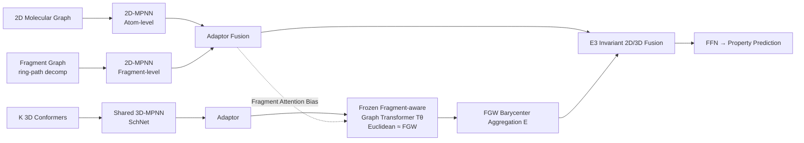

# FACET: A Fragment-Aware Conformer Ensemble Transformer

**Conference**: ICLR 2026  
**OpenReview**: [https://openreview.net/forum?id=cpwbXHvd2h](https://openreview.net/forum?id=cpwbXHvd2h)  
**Code**: Open sourced (link provided in paper)  
**Area**: Molecular Representation Learning / Computational Chemistry / Geometric Deep Learning  
**Keywords**: Conformer Ensemble, Fused Gromov-Wasserstein, Graph Transformer, Fragment Prior, Molecular Property Prediction  

## TL;DR
FACET uses a differentiable Graph Transformer to **learn an approximation of the expensive Fused Gromov-Wasserstein (FGW) distance**, transforming "geometry-aware multi-conformer aggregation" from an online optimization problem into a single forward pass. Combined with fragment-level structural priors, it achieves a 5–6x training speedup while maintaining SOTA accuracy, scaling effectively to 75,000 molecules.

## Background & Motivation
**Background**: Molecular property prediction requires the simultaneous utilization of 2D topological graphs (connectivity) and 3D conformers (geometric information like bond lengths and dihedral angles). Since molecules dynamically sample multiple low-energy conformers through bond rotation and vibration, many observable properties (e.g., solubility, binding affinity) depend on the **entire conformer ensemble** rather than a single conformer. Consequently, hybrid 2D+3D multi-conformer models have become the dominant paradigm.

**Limitations of Prior Work**: ① Naive aggregation (mean pooling / DeepSets / self-attention) assumes all conformers have equal weight and ignores alignment and structural similarity between conformers. ② Geometric-aware methods based on Optimal Transport (specifically FGW alignment, such as CONAN-FGW) can align feature and geometric spaces simultaneously for better performance; however, **solving FGW is extremely expensive**, making it unscalable for large datasets like Drugs-75k—CONAN-FGW requires 1107 GPU hours for 300 epochs on Drugs-75K.

**Key Challenge**: The trade-off between FGW geometric alignment quality and its computational cost—retaining FGW's joint structure-feature alignment capability while eliminating the overhead of online optimization.

**Goal**: Achieve fast, permutation-invariant, and geometry-aware conformer aggregation in large-scale generative molecular pipelines.

**Core Idea**: **Distill FGW into the latent space of a Graph Transformer via supervised learning.** During training, ground-truth FGW distances provide supervision, forcing the Euclidean distance between Transformer outputs to approximate the FGW distance. During inference, the latent representation of the "FGW Barycenter" is obtained directly via a forward pass, with fragment-level priors injected to enhance fine-grained chemical semantics.

## Method

### Overall Architecture
FACET integrates three branches: one 2D-MPNN encodes atom-level topology, another 2D-MPNN encodes high-order sub-structural priors on a fragment graph, and both are fused via an adaptor. Multiple 3D conformers are encoded by a shared 3D-MPNN (SchNet) and fed into a **pre-trained and frozen** fragment-aware Graph Transformer $T_\theta$. This Transformer, supervised by FGW distances, maps conformers into a space where "Euclidean distance ≈ FGW distance." Finally, a permutation-invariant and E(3)-invariant fusion module unifies 2D and 3D representations into a single embedding for downstream prediction.

### Key Designs
**1. Learnable Proxy for FGW Distance: Replacing Optimization with a Forward Pass.** The core of FACET lies in avoiding online FGW solvers. Instead, a Graph Transformer $T_\theta$ is trained to map each conformer $S$ to a latent space such that the Euclidean distance between the embeddings of any pair $(S_i, S_j)$ approximates their FGW distance. The supervision loss directly aligns the two:

$$\mathcal{L}_{enc}=\sum_{ij}\Big|\;\lVert T_\theta(H_i)-T_\theta(H_j)\rVert_2^2-\mathrm{FGW}_{p,\alpha}(G(S_i),G(S_j))\;\Big|$$

After training, $T_\theta$ is frozen. The mean of the embeddings for $K$ conformers, $\bar H=\mathbb{E}[\{T_\theta(H_i)\}]$, corresponds to the **FGW Barycenter** in the latent space (the geometric mean of the conformer set). Calculating the FGW barycenter typically requires solving the expensive optimization $\arg\min_G\sum_k\lambda_k\mathrm{FGW}(G,G_k)$, which is reduced here to a simple average—the source of the 6× speedup. Based on Multidimensional Scaling (MDS) theory, the authors provide upper and lower bounds for the cumulative stress error of embedding non-Euclidean Wasserstein/FGW distances into Euclidean space (Theorem 1), providing theoretical support for the proxy's feasibility.

**2. Fragment-Aware Attention Bias: Directing Attention to Chemically Meaningful Sub-structures.** Pure geometric attention lacks the capacity to capture chemical semantics like rings or functional groups. FACET uses ring-path decomposition to deconstruct molecules into a fragment graph $G^{frag}$, computes fragment embeddings via GAT, and adds them back to each constituent atom: $\tilde h_v^{(L)}=h_v^{(L)}+\mathrm{FFN}(h_{f(v)}^{frag})$, creating a dual-scale "local atom + global fragment" representation. Inside the Graph Transformer, the attention score adds a chemical similarity bias calculated from these fragment-enhanced embeddings, alongside Graphormer's centrality and Spatial (SPD) encodings:

$$\tilde A_{ij}=\frac{(h_iW_Q)(h_jW_K)^\top}{\sqrt d}+s_{\phi(v_i,v_j)}+c_{ij}+A(G)_{ij},\quad A(G)_{ij}=1-\frac{\langle\tilde h_i^{(L)},\tilde h_j^{(L)}\rangle}{\lVert\tilde h_i^{(L)}\rVert\,\lVert\tilde h_j^{(L)}\rVert}$$

Where $A(G)_{ij}$ is the cosine distance between atom embeddings in the 2D topology, guiding attention toward functionally relevant regions like rings and scaffolds.

**3. Three-Stage Training + Adaptor to Align Domain Drift.** Since $T_\theta$ is pre-trained on fixed 3D-MPNN features from Stage 1, while end-to-end joint training updates the 3D-MPNN, the feature distribution fed to $T_\theta$ shifts. FACET adopts a three-stage approach: Stage 1 trains independent 2D/3D MPNNs (and generates FGW supervision data); Stage 2 trains the Graphormer (12 layers/8 heads/372k params) to approximate FGW; Stage 3 involves end-to-end fine-tuning. A crucial **MLP adaptor** is inserted to project 2D/3D features back to the distribution seen by $T_\theta$ during its training (64 dimensions), mitigating domain drift.

**4. Permutation and E(3) Invariant 2D/3D Fusion.** The final 2D fragment-enhanced representation $h_{2D}$, the Graph Transformer aggregated representation $h_{GT}$, and 3D conformer features $H_{3D}$ are combined via a learnable projection: $H_{comb}=\tilde W_{2D}H_{2D}+\tilde W_{3D}H_{3D}+\tilde W_{GT}H_{GT}$, followed by an FFN for prediction. This aggregation is invariant to conformer permutations and E(3) rigid transformations, ensuring robustness under physical symmetries.

## Key Experimental Results

### Main Results
Molecular property regression on MoleculeNet (MSE ↓, SchNet backbone):

| Model | Lipo | ESOL | FreeSolv | BACE |
|---|---|---|---|---|
| UniMol | **0.374** | 0.741 | 2.867 | - |
| CONAN | 0.556 | 0.571 | 1.496 | 0.635 |
| CONAN-FGW | 0.422 | 0.529 | 1.068 | 0.549 |
| **FACET** | 0.424 | **0.516** | **0.967** | **0.495** |

FACET achieves the lowest MSE on ESOL, FreeSolv, and BACE, consistently improving over CONAN-FGW. On the MARCEL benchmark, it provides stable gains across both SchNet and GemNet backbones, whereas CONAN-FGW struggles to scale.

### Ablation Study
Component Ablation (MSE ↓):

| Dataset | FACET | w/o Frag. | w/o Frag. in Trans. | w/o Adap. |
|---|---|---|---|---|
| ESOL | **0.516** | 0.531 | 0.525 | 0.546 |
| FreeSolv | **0.967** | 1.072 | 0.973 | 1.085 |
| Kraken | **0.238** | 0.247 | 0.242 | 0.262 |

Training Strategy Ablation (MSE ↓):

| Settings | ESOL | FreeSolv | BACE | Lipo |
|---|---|---|---|---|
| FACET (default) | 0.52 | 0.97 | 0.50 | 0.42 |
| Merge all steps | 0.57 | 1.26 | 0.59 | 0.53 |
| FACET (w/o FGW) | 0.54 | 0.98 | 0.53 | 0.45 |

### Key Findings
- **Efficiency**: Achieves 5–6× training speedup over CONAN-FGW; training on Drugs-75K for 300 epochs dropped from 1107 to 214 GPU hours.
- **Effectiveness of FGW Supervision**: Removing FGW supervision (w/o FGW) leads to performance degradation across datasets, proving the Transformer learns geometric alignment rather than standard attention.
- **Proxy Fidelity**: The Euclidean distance of learned embeddings correlates strongly with ground-truth FGW distance (high $\rho$ in Figure 2), with reliability increasing with conformer count.
- **Fragment Priors and Adaptors are Essential**: Removing either leads to degradation, with the adaptor (combating domain drift) having the most significant impact.

## Highlights & Insights
- **The paradigm shift of distilling "expensive optimization" into a "single forward pass"**: Using neural supervised learning for structure-aware OT metrics like FGW is a novel learnable proxy approach that can be transferred to other online geometric alignment scenarios.
- **Latent Space Mean = FGW Barycenter**: Reducing the optimization problem of barycenter calculation to a simple average is both engineeringly elegant and theoretically grounded via MDS error bounds.
- **Fragment priors injected via attention bias** rather than mere feature concatenation allows chemical semantics to modulate token attention directly, serving as a clever interface for coupling 2D topology and 3D geometry.

## Limitations & Future Work
- Conformers are generated via RDKit distance geometry rather than DFT, placing an upper bound on geometric precision; this may be insufficient for properties requiring quantum-level accuracy.
- FGW supervision signals still require offline computation of ground-truth FGW distances in Stages 1/2. Preprocessing costs are shifted out of the training loop rather than entirely eliminated.
- The three-stage process involving freezing and adaptors is complex, with many hyperparameters (e.g., $\alpha$, adaptor dimensions). A single-stage end-to-end approach (merge all steps) performs significantly worse, indicating sensitivity to the training schedule.

## Related Work & Insights
- **Conformer Ensemble Learning**: Progresses from mean pooling/DeepSets/self-attention to FGW alignment (CONAN-FGW). FACET directly targets the scalability issues of the latter.
- **Scalable OT**: Includes Sinkhorn, low-rank decomposition, and neural OT proxies—FACET extends these from standard OT to structure-aware FGW.
- **Fragment-prior GNNs**: Utilizes ring-path decomposition and fragment contrastive learning. FACET injects fragment hierarchies into both 2D message passing and 3D spatial attention.
- **Insight**: For any task where expensive geometric alignment (point cloud registration, shape matching, graph matching) is called repeatedly during training/inference, the paradigm of "supervising a differentiable encoder with a ground-truth metric to distill it into embedding distances" should be considered.

## Rating
- **Novelty**: ⭐⭐⭐⭐ First learnable Graph Transformer proxy for FGW + Latent mean as barycenter + MDS error bounds; novel combination with theoretical support.
- **Experimental Thoroughness**: ⭐⭐⭐⭐ Covers 6 MoleculeNet/MARCEL benchmarks, multiple backbones, efficiency and fidelity analysis, and complete ablations up to 75k molecules.
- **Writing Quality**: ⭐⭐⭐⭐ Framework diagrams and three-stage narratives are clear; formulas and notation are standard.
- **Value**: ⭐⭐⭐⭐ Provides 5–6x speedup for geometry-aware aggregation while maintaining SOTA accuracy, offering direct engineering value for large-scale drug/material screening.

<!-- RELATED:START -->

## Related Papers

- [\[ICLR 2026\] Hierarchical Multi-Scale Molecular Conformer Generation](hierarchical_multi-scale_molecular_conformer_generation.md)
- [\[ICLR 2026\] SigmaDock: Untwisting Molecular Docking with Fragment-Based SE(3) Diffusion](sigmadock_untwisting_molecular_docking_with_fragment-based_se3_diffusion.md)
- [\[ICLR 2026\] Animal behavioral analysis and neural encoding with transformer-based self-supervised pretraining](animal_behavioral_analysis_and_neural_encoding_with_transformer-based_self-super.md)
- [\[ICLR 2026\] Drugging the Undruggable: Benchmarking and Modeling Fragment-Based Screening](drugging_the_undruggable_benchmarking_and_modeling_fragment-based_screening.md)
- [\[ICLR 2026\] Coupled Transformer Autoencoder for Disentangling Multi-Region Neural Latent Dynamics](coupled_transformer_autoencoder_for_disentangling_multi-region_neural_latent_dyn.md)

<!-- RELATED:END -->
