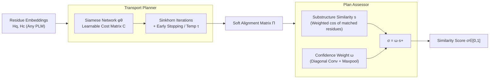

# Fast and Interpretable Protein Substructure Alignment via Optimal Transport

**Conference**: ICLR 2026  
**OpenReview**: [https://openreview.net/forum?id=FileqNzZzn](https://openreview.net/forum?id=FileqNzZzn)  
**Code**: [https://github.com/ZW471/PLASMA-Protein-Local-Alignment](https://github.com/ZW471/PLASMA-Protein-Local-Alignment)  
**Area**: Computational Biology / Protein Structure Alignment  
**Keywords**: Protein Local Structure Alignment, Optimal Transport, Sinkhorn Algorithm, Interpretability, Residue-level Alignment

## TL;DR
PLASMA reformulates protein local structure alignment as an entropy-regularized optimal transport problem. Using differentiable Sinkhorn iterations, it directly outputs a residue-level alignment matrix and an interpretable similarity score in $[0,1]$. It achieves high speed (~10ms/pair, 50× faster than TM-align) and high accuracy for aligning active/binding sites.

## Background & Motivation

**Background**: Local structural motifs (catalytic residues, binding pockets, metal-binding sites, etc.) are critical links between structure and function. Structural conservation is often 3–10 times stronger than sequence conservation—many functional relationships are only detectable through local structural alignment where sequence alignment fails. Massive structural resources like the AlphaFold Database (AFDB) offer opportunities to mine conserved motifs across the protein universe.

**Limitations of Prior Work**: Existing methods fall into three categories, each with significant drawbacks. (1) **Template-based searching** can only match known motifs and fails to discover novel similarities; (2) **Global structural similarity methods** (TM-align, Foldseek, TM-Vec) are either computationally expensive and hard to scale or compress residue-level information into coarse-grained embeddings, losing local interpretability; (3) **Substructure alignment methods** (similarity matrix construction + dynamic programming) are more accurate but are often biased by global structural patterns. Their alignment matrices are often sacrificed for algorithmic performance optimization, and most are non-trainable, making them unable to adapt to specific tasks or incorporate domain knowledge.

**Key Challenge**: Functionally similar local regions are often **partially overlapping**, variable in length, sequence-discontinuous, and embedded in entirely different global folds. Existing OT-based alignment methods typically assume **strict one-to-one mapping** or that one structure is fully contained within the other—conflicting with the realities of protein substructure alignment.

**Goal**: To develop a residue-level local alignment method that is **accurate, efficient, and interpretable**, while handling partial, variable-length, and non-sequential motif alignments.

**Core Idea**: **Reformulate substructure alignment as entropy-regularized Optimal Transport (OT)**. Use a learnable geometric cost matrix and differentiable Sinkhorn iterations to compute a soft alignment matrix. A Plan Assessor then compresses this matrix into a probabilistically meaningful similarity score. The system acts as a pluggable module for any pre-trained protein representation model.

## Method

### Overall Architecture

PLASMA (Pluggable Local Alignment via Sinkhorn MAtrix) takes residue-level latent representations $H_q \in \mathbb{R}^{N\times d}$ and $H_c \in \mathbb{R}^{M\times d}$ (from any pre-trained PLM) and outputs a soft alignment matrix $\Pi \in \mathbb{R}^{N\times M}$ and a similarity score $\sigma \in [0,1]$, denoted as $(\Pi, \sigma) = \text{PLASMA}(H_q, H_c)$. It consists of two complementary modules: the **Transport Planner** for core OT computation and alignment matrix $\Pi$ generation, and the **Plan Assessor** for summarizing $\Pi$ into an interpretable similarity score. The overall complexity is $O(N^2)$, and it is fully parallelizable, differentiable, and end-to-end trainable.

### Key Designs

**1. Learnable Geometric Cost Matrix: Converting residue-pair similarity into optimizable transport costs via Siamese networks.** Each element $C_{ij}$ of the cost matrix measures the transport cost from query residue $r_{q,i}$ to candidate residue $r_{c,j}$, defined as $C_{ij} = \big[\varphi_\theta(\text{LN}(h_{q,i})) \cdot \varphi_\theta(\text{LN}(h_{c,j}))\big]_+ + 1$. Here, $\varphi_\theta$ is a Siamese network with shared parameters $\theta$ (defaulting to a two-layer MLP $\varphi_\theta(h)=\text{ReLU}(h W_1) W_2$, though Transformers or GNNs can be used). Layer Normalization $\text{LN}(\cdot)$ ensures numerical stability and scale invariance, while the hinge non-linearity $[\cdot]_+$ has been proven superior to dot products in subgraph matching. This design allows PLASMA to learn task-specific alignment costs through training. A **training-free variant, PLASMA-PF**, is also provided, which computes costs directly on raw embeddings.

**2. Sinkhorn Soft Alignment with Early Stopping and Temperature: Solving partial alignment via entropy-regularized OT to avoid forced one-to-one matches.** Based on $C$, initialize $\Pi^{(0)}=\exp(-C/\tau)$ and perform Sinkhorn iterations. A key observation is that vanilla Sinkhorn converges to a fully doubly stochastic matrix, **forcing every residue to distribute its mass across the other structure**, which is biologically meaningless when most residues have no correspondent. PLASMA implements **implicit partial alignment** via two mechanisms: **Early stopping** (limiting iterations so poorly matched residues retain low weight) and the **Temperature parameter $\tau$** (controlling sparsity). Together, they highlight biologically relevant correspondences without requiring hard transport budget constraints.

**3. Interpretable Score Calibrated by Confidence Weights: Calculating substructure similarity and preventing inflation via diagonal continuity.** The Plan Assessor first selects matched residue sets $R_q, R_c$ from $\Pi$ based on a threshold $\eta$ ($\Pi_{ij}>\eta$), and computes their cosine similarity $s$ after summation. However, $s$ can be **artificially high** when only scattered residues align. To address this, a **confidence weight $\omega$** is introduced: a $k\times k$ identity kernel $K=I_k$ is used for a 2D convolution $\omega_{ij}=\sum_{u=0}^{k-1}\Pi_{i+u,j+u}$ to highlight core regions of sequential matches. Taking $\omega=\max_{i,j}\omega_{ij}$, the final score is $\sigma=\omega\cdot s_+$. This provides a score where $\sigma=0$ indicates no match and $\sigma=1$ indicates perfect substructure alignment, following the TM-align convention of excluding negative similarities.

**4. Dual-objective Training + Label Match Loss: Jointly optimizing "if it aligns" and "where it aligns" with robustness to sparse labels.** For a protein pair $(P_q, P_c)$ where shared functional substructures are marked by masks $M_q, M_c$, the score $\sigma$ is supervised by Binary Cross-Entropy ($L_{BCE}$). For the alignment matrix, the **Label Match Loss (LML)** focuses only on labeled substructures: $L_{LML}=\|[M_c - \Pi^\top M_q]_+\|_1 / \|M_c\|_1$. This measures how well the known substructures are aligned while ignoring unlabeled residues, which might be valid but unannotated matches. The total loss is $L=L_{BCE}+L_{LML}$.

## Key Experimental Results

### Main Results

Evaluation on the VenusX residue-level functional alignment benchmark across three categories (motif / binding site / active site) with <50% sequence identity. **test_extra** represents novel substructures from unseen families. The following contains representative metrics (ANKH backbone):

| Metric | Task | PLASMA | PLASMA-PF | EBA | Foldseek | TM-Align |
|------|------|--------|-----------|-----|----------|----------|
| ROC-AUC | Motif | **.98** | .98 | .90 | .89 | .81 |
| ROC-AUC | Binding Site | **.99** | .99 | .99 | — | — |
| ROC-AUC | Active Site | **.98** | .97 | .97 | — | — |
| F1-Max | Motif | **.97** | .96 | .86 | .91 | .76 |
| PR-AUC | Motif | **.98** | .98 | .91 | .84 | .86 |

Ours consistently ranks first across all tasks and metrics. PLASMA-PF is competitive even without training, though the learnable version performs better on test_extra, highlighting the value of supervision for novel functional motifs.

### Ablation Study

| Dimension | PLASMA | PLASMA-PF | EBA | TM-Align / Foldseek |
|------|--------|-----------|-----|---------------------|
| Inference time (pair) | ~10ms | ~7ms | ~30ms | ~500ms (~50× slower) |
| ROC-AUC (TM<0.5) | >0.9 | >0.9 | Sharp Drop | Sharp Drop |
| LMS Alignment Quality | Highest | High | Unreliable (Const. 1.0) | — |

- **Efficiency**: PLASMA is ~50× faster than TM-align/Foldseek (which require structural superposition) and ~3× faster than EBA (which relies on serial dynamic programming).
- **Calibrability**: PLASMA/PLASMA-PF clearly separates positive and negative pair distributions, whereas EBA scores are unbounded and harder to calibrate.
- **Training Gain**: PLASMA outperforms PLASMA-PF in Label Match Score (LMS), proving that training improves alignment precision.

### Key Findings
1. The OT formulation allows alignment to focus on local correspondences **independently of global similarity**, which is the root cause of its robustness in low-homology scenarios.
2. In three real biological cases (small helical motifs, cofactor-binding domains, multi-element substructures), PLASMA accurately aligned functionally relevant residues (e.g., Leu-X-X-Leu-Leu motif, RMSD 0.18Å), while EBA often aligned non-functional backbone regions.
3. Behavior is consistent across seven different backbones (ProtT5, ESM2, etc.), indicating the method is encoder-agnostic.

## Highlights & Insights
- **Elegant Reformulation**: Replacing "fragment enumeration + dynamic programming" with "entropy-regularized OT + Sinkhorn" naturally supports partial/variable-length/non-sequential matching while being parallelizable.
- **Simplicity in Partial Alignment**: Achieving partial alignment through "early stopping + temperature" instead of hard constraints is an engineering masterstroke that addresses the biological inaccuracy of doubly stochastic matrices.
- **Diagonal Convolution for Interpretability**: Using a simple identity kernel convolution to identify continuous diagonal segments effectively distinguishes true substructures from "scattered noise."
- **Two-tier Implementation**: Offering both a trainable version and a high-performance training-free version (PLASMA-PF) makes the method highly adaptable.

## Limitations & Future Work
- **Dependency on Pre-trained Representations**: The alignment quality is constrained by the encoding quality of the PLM; encoder biases necessarily propagate to the results.
- **Hyperparameter Sensitivity**: Threshold $\eta$, temperature $\tau$, and kernel size $k$ require tuning, and their robustness across entirely new tasks requires further study.
- **Annotation Dependency**: LML requires mask annotations, which are limited outside existing benchmarks like VenusX.
- **Evaluation Scope**: While successful in motif detection, end-to-end evidence from large-scale database retrieval (e.g., scanning the entire AFDB) is still needed.

## Related Work & Insights
- **Global Structure Alignment**: Methods like TM-align and Foldseek solve a different problem; global similarity often obscures conserved local motifs in overall dissimilar proteins.
- **Substructure/Sequence Alignment**: Related to graph-based residue embeddings and embedding-aware dynamic programming. While Pellizzoni (2024) used OT to learn substitution matrices, PLASMA directly produces explicit residue-level mappings.
- **Insights**: The perspective of "alignment = optimal transport" combined with "soft-sparsity via early stopping" has potential for transfer to other matching tasks like point cloud registration or cross-modal token alignment.

## Rating
- **Novelty**: ⭐⭐⭐⭐ Reformulating local alignment as OT with a specific mechanism for partial matching and interpretable scoring is a clever combination of known components that solves specific domain pain points.
- **Experimental Thoroughness**: ⭐⭐⭐⭐ Comprehensive across tasks, backbones, and real-world cases, though missing large-scale retrieval evidence.
- **Writing Quality**: ⭐⭐⭐⭐ Logical flow from motivation to specific designs; clear separation of module responsibilities.
- **Value**: ⭐⭐⭐⭐ 50× faster, interpretable, and pluggable; highly practical for functional annotation and drug design.

<!-- RELATED:START -->

## Related Papers

- [\[ICLR 2026\] KGOT: Unified Knowledge Graph and Optimal Transport Pseudo-Labeling for Molecule-Protein Interaction Prediction](kgot_unified_knowledge_graph_and_optimal_transport_pseudo-labeling_for_molecule-.md)
- [\[ICLR 2026\] Optimal Transport Unlocks End-to-End Learning for Single-Molecule Localization](optimal_transport_unlocks_end-to-end_learning_for_single-molecule_localization.md)
- [\[ICLR 2026\] WFR-FM: Simulation-Free Dynamic Unbalanced Optimal Transport](wfr-fm_simulation-free_dynamic_unbalanced_optimal_transport.md)
- [\[ICLR 2026\] RankFlow: Property-aware Transport for Protein Optimization](rankflow_property-aware_transport_for_protein_optimization.md)
- [\[ICLR 2026\] Greater than the Sum of Its Parts: Building Substructure into Protein Encoding Models](greater_than_the_sum_of_its_parts_building_substructure_into_protein_encoding_mo.md)

<!-- RELATED:END -->
