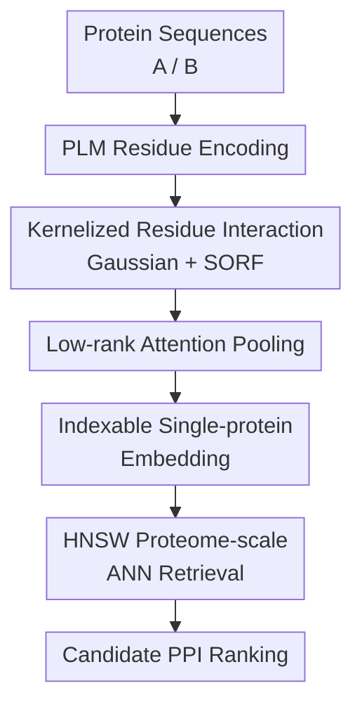

# Fast Proteome-Scale Protein Interaction Retrieval via Residue-Level Factorization

**Conference**: ICLR2026  
**OpenReview**: [https://openreview.net/forum?id=Dp1RM3gPg8](https://openreview.net/forum?id=Dp1RM3gPg8)  
**Paper**: [OpenReview](https://openreview.net/forum?id=Dp1RM3gPg8)  
**Code**: https://github.com/AndyJZhao/RaftPPI  
**Area**: Computational Biology / Protein-Protein Interaction Retrieval  
**Keywords**: Protein-Protein Interaction, Proteome-scale Retrieval, residue-level factorization, Random Fourier Features, hard negative weighting  

## TL;DR
RaftPPI approximates traditional residue-residue protein interaction scoring as decomposable single-protein embedding inner products. By utilizing Gaussian kernels, SORF random Fourier features, and low-rank attention, it preserves residue-level modeling capabilities while reducing the time required for candidate interaction retrieval across the entire human proteome from GPU-months to a few minutes on a single machine.

## Background & Motivation
**Background**: Protein-protein interaction (PPI) prediction fundamentally concerns whether two proteins will engage in functional or structural contact within a cellular environment. High-precision approaches typically follow two routes: directly predicting protein complex structures (e.g., AlphaFold-Multimer, AlphaFold3, or the RoseTTAFold series) or utilizing sequence-based PPI classifiers that encode each residue or sequence using Protein Language Models (PLMs) for binary classification. The former provides strong structural interpretability but requires expensive inference for every candidate complex; the latter is lighter but many robust models still necessitate joint encoding or explicit calculation of residue-residue interactions for every pair.

**Limitations of Prior Work**: Real-world applications involve screening potential interaction pairs within a species' proteome rather than evaluating a small batch of candidates. The human proteome contains approximately 20,000 proteins, resulting in roughly $2\times 10^8$ candidate pairs. If a model computes a residue interaction matrix of size $L_A \times L_B$ for every pair, the total complexity approaches $O(N^2L^2)$. Combined with pairwise PLM inference or structure prediction, screening the entire proteome becomes a task requiring GPU-months. Comparisons in the paper are intuitive: the strong classification model PLM-Interact is estimated to require 148.47 A100 GPU-days (~4.9 months) for the human proteome.

**Key Challenge**: PPI signals indeed manifest at the residue level; simply compressing an entire protein into a single [CLS] vector loses interfacial residue information. However, explicit residue-residue interaction is computationally prohibitive for quadratic candidate counts in proteome-wide screening. Thus, the model must observe local contacts like residue-level models while pre-encoding each protein into an indexable embedding for vector retrieval.

**Goal**: The authors aim to ensure the PPI model satisfies three criteria: first, it must approximate residue-level interaction scoring; second, each protein should be encoded only once to enable large-scale top-$K$ retrieval via ANN indexing; and third, it must remain stable during training on PPI data where negative sample quality is inconsistent, avoiding being misled by a large volume of easy negatives.

**Key Insight**: The paper observes that many residue-level PPI models can be abstracted into a "Pred&Agg" pipeline that predicts residue-pair scores and then aggregates them. By rewriting non-linear residue scoring and 2D attention aggregation into a decomposable form, the entire protein-pair logit can be expressed as the inner product of two single-protein vectors. The authors choose a Gaussian kernel for residue-residue similarity, approximate the kernel as explicit feature inner products via Random Fourier Features (RFF), and use low-rank separable attention to decompose 2D residue weights into two 1D weights.

**Core Idea**: RaftPPI factorizes the residue-level PPI score of each protein pair into a dot product of single-protein embeddings through "kernelized residue interaction + low-rank attention pooling," transforming proteome-scale PPI screening from explicit pairwise scoring into vector nearest neighbor retrieval.

## Method
The RaftPPI method can be viewed as a mathematical reformulation of the traditional residue-level PPI pipeline. While traditional methods require calculating interaction scores $c_{ij}$ for all residue pairs $(i,j)$ and then aggregating them, RaftPPI ensures this process is approximately equivalent to $\langle \hat{h}_A, \hat{h}_B\rangle$ during both training and inference. Consequently, each protein's $\hat{h}$ can be pre-cached in an HNSW index, eliminating the need to traverse all pairs during queries.

### Overall Architecture
The input consists of a pair of protein sequences. First, residue-level embeddings are generated using a PLM such as ESM2-8M. Instead of constructing a full pair matrix, RaftPPI applies Random Fourier Feature mapping of a Gaussian kernel to each residue embedding while simultaneously learning a set of per-residue attention weights. The residue features within a protein are then summed via attention weighting to obtain a fixed-length single-protein embedding. During training, the inner product of two embeddings serves as the PPI logit; during inference, all protein embeddings are stored in an HNSW index for nearest neighbor retrieval.

The PLM residue encoding serves as a general backbone. The core contributions are concentrated in three modules: kernelized residue interaction, low-rank attention pooling, and HNSW-based proteome-scale retrieval. At the training level, adaptive negative weighting is added to address the unreliable construction of negative samples in PPI datasets. The overall framework maps directly to the key designs: first, transforming residue interaction into a decomposable kernel, then converting 2D attention into 1D weight products, and finally integrating the resulting protein vectors into ANN retrieval.

### Key Designs
**1. Kernelized Residue Interaction: Retaining non-linear residue-level contact signals via Gaussian kernels**  

Traditional Pred&Agg methods use an MLP or inner product function $f(z_{A,i}, z_{B,j})$ to predict residue-pair contact scores. However, such pair-specific non-linear functions are difficult to index for single proteins because they require both residues as input. RaftPPI changes the residue-pair interaction to a Gaussian kernel: $k_{\hat{\sigma}}(z_{A,i}, z_{B,j})=\exp(-\|z_{A,i}-z_{B,j}\|^2/(2\hat{\sigma}^2))$. This implies that if two residues are closer in the PLM embedding space, they contribute more to the interaction logit. The bandwidth $\hat{\sigma}$ controls the scale of "closeness"; too small a value focuses only on extreme local matches, while too large a value over-smooths structural differences.

The advantage of the Gaussian kernel is its natural correspondence to an inner product in an infinite-dimensional RKHS. The authors approximate this as an explicit finite-dimensional feature using Random Fourier Features: $k_{\hat{\sigma}}(x,y)\approx \psi(x)^\top\psi(y)$, where $\psi(z)=\frac{1}{\sqrt{d'}}[\cos(Wz);\sin(Wz)]$. To reduce computational costs, the paper adopts Structured Orthogonal Random Features (SORF), which uses Hadamard matrices and Rademacher sign flips to construct the frequency matrix $W$, avoiding the $O(Ldd')$ cost of dense RFF. Thus, residue-level non-linear similarity is converted into an inner product of independently computable feature vectors.

**2. Low-rank Attention Pooling: Splitting 2D residue-pair weights into 1D weights per protein**  

Kernel decomposition alone is insufficient, as traditional aggregation functions assign different weights $s_{ij}$ to each residue pair. If $s_{ij}$ remains an arbitrary 2D matrix, the model still requires seeing the protein pair to calculate the full score. RaftPPI addresses this using rank-$r$ separable attention to approximate the 2D attention surface: per-residue weights are generated for each protein using a lightweight scorer $h_\theta^{(t)}$, followed by a softmax to obtain $w_A^{(t)}$ and $w_B^{(t)}$, setting $s_{ij}=\sum_{t=1}^{r}w_{A,i}^{(t)}w_{B,j}^{(t)}$.

The paper defaults to $r=1$, making the residue-pair weight $w_{A,i}w_{B,j}$. Substituting the kernel approximation, the protein-pair logit is rearranged from a double summation into an inner product of two weighted sums: $\ell(A,B)\approx\langle\sum_i w_{A,i}\psi(z_{A,i}),\sum_j w_{B,j}\psi(z_{B,j})\rangle$. This algebraic step is the most critical: it does not discard residue-level information but allows each protein to select important residues and summarize their kernel features into a single embedding. Ablations in the appendix indicate that rank 1 provides the best AUROC and Recall@20%, while higher ranks lead to overfitting and linearly increased storage/retrieval costs.

**3. Indexable Single-protein Embedding: Transforming proteome screening from exhaustive scoring to ANN retrieval**  

With these designs, RaftPPI generates $\hat{h}_A=\sum_iw_{A,i}\psi(z_{A,i})$ for any protein $A$, and the protein-pair score is $\ell(A,B)=\langle\hat{h}_A,\hat{h}_B\rangle$. This fundamentally shifts the inference paradigm: instead of loading pairs and calculating residue matrices, each protein is encoded once, cached, and queried using an approximate nearest neighbor index like HNSW.

The complexity is significantly reduced. For $N$ proteins of average length $L$, PLM encoding costs approximately $O(NL^2)$. RaftPPI’s additional mapping and pooling are approximately linear in $L$ per protein, index construction is $O(N\log N)$, and query time grows polylogarithmically with $N$. In contrast, traditional residue-pair scoring faces a cost of $O(N^2L^2)$. For the human proteome, RaftPPI achieves top-20% retrieval in ~343 seconds on a single A100 (102s encoding, 241s retrieval) and ~200 seconds on an Intel Xeon 6980P CPU.

**4. Adaptive Negative Weighting: Focusing training on positive-like hard negatives**  

Constructing reliable negative samples is a long-standing challenge in PPI. Benchmark negative pairs are often generated via random pairing or cellular compartment rules, many of which are too easily distinguished, causing the model to learn dataset biases rather than true interaction boundaries. RaftPPI employs adaptive negative weighting to automatically increase the weight of hard negatives during training. For negative samples in a minibatch, weights are defined as $p_i=\exp(\tau\ell_i)/\sum_{j\in N}\exp(\tau\ell_j)$, with stop gradients applied to $p_i$.

The final loss balances positive BCE and weighted negative BCE: $L=\frac{1}{2}[-\frac{1}{|P|}\sum_{p\in P}\log\sigma(\ell_p)-\sum_{i\in N}p_i\log\sigma(-\ell_i)]$. When $\tau=0$, it reduces to uniform BCE; when $\tau$ is large, it focuses almost exclusively on the hardest negatives. The paper finds $\tau=4$ to be stable for both AUROC and Recall@20%.

### Loss & Training
The experiment uses ESM2-8M as the PLM backbone. Training hyperparameters are consistent across datasets: AdamW, learning rate $10^{-4}$, $d'=2048$ RFF frequencies, Gaussian bandwidth $\hat{\sigma}=0.5$, and temperature $\tau=4$. The SORF transform is fixed across training and inference to ensure alignment. The authors selected ESM2-8M based on a comparison in the appendix showing that PPI performance does not scale linearly with PLM size; the 8M model provides an optimal tradeoff between performance and throughput.

## Key Experimental Results

### Main Results
The paper evaluates classification performance on seven PPI benchmarks controlled for sequence similarity and node-degree (GUO, DU, HUANG, D-SCRIPT, PAN, RICHOUX, GOLD). These splits are stricter than random splits, reducing homologous leakage and hub protein bias.

| Method | D-SCRIPT AUROC | Huang AUROC | Gold AUROC | Guo AUROC | Du AUROC | Avg. AUROC |
|------|----------------|-------------|------------|-----------|----------|------------|
| ESM2-NoFT | 75.01 | 58.63 | 57.85 | 62.87 | 57.36 | 62.07 |
| ESM2-MLP | 82.83 | 73.34 | 56.35 | 83.54 | 73.34 | 74.25 |
| TUnA | 83.38 | 66.66 | 52.55 | 69.81 | 69.37 | 70.79 |
| PLM-Interact | 84.77 | 69.69 | 65.00 | 79.60 | 75.20 | 75.14 |
| RaftPPI | 82.06 | 72.20 | 68.69 | 84.93 | 75.06 | 75.29 |

RaftPPI's average AUROC (75.29%) is slightly higher than PLM-Interact (75.14%), but RaftPPI provides indexable embeddings, whereas PLM-Interact requires heavy cross-protein early fusion.

In proteome-scale retrieval experiments, RaftPPI consistently leads in Recall@K%, particularly at Recall@20%.

| Method | Recall@1% | Recall@3% | Recall@5% | Recall@10% | Recall@20% |
|------|-----------|-----------|-----------|------------|------------|
| ESM2-MLP | 3.0 | 7.2 | 10.4 | 17.7 | 30.8 |
| TUnA | 9.6 | 16.6 | 21.1 | 29.7 | 42.4 |
| PLM-Interact | 8.8 | 15.8 | 20.8 | 31.2 | 45.7 |
| ESM2-NoFT | 10.9 | 18.8 | 23.9 | 34.0 | 48.3 |
| RaftPPI-P | 10.4 | 17.2 | 22.1 | 31.5 | 43.9 |
| RaftPPI | 10.9 | 18.2 | 23.3 | 34.0 | 48.3 |

Efficiency results underscore the impact of factorization:

| Model Type | Method | Encoding Time | Recall@20% Retrieval Time | Avg. AUROC | Recall@20% |
|----------|------|----------|---------------------|------------|------------|
| Unfactorizable | ESM2-MLP | NA | 1,766,576 s | 74.25 | 27.77% est. |
| Unfactorizable | TUnA | NA | 3,833,646 s | 70.79 | 30.44% est. |
| Unfactorizable | PLM-Interact | NA | 12,827,660 s | 75.14 | 30.81% est. |
| Factorizable | ESM2-NoFT | 105 s | 259 s | 62.07 | 41.72% full |
| Factorizable | RaftPPI-P | 54 s | 187 s | 71.90 | 43.83% full |
| Factorizable | RaftPPI | 102 s | 241 s | 75.29 | 47.91% full |

### Ablation Study
| Configuration | Avg. Category AUROC | Avg. Recall@20% | Description |
|------|----------------|-----------------|------|
| Raft-BCE-Loss | 72.24 | 45.05 | Uniform BCE instead of adaptive weighting drops performance |
| ESM2-MLP-ANW-Loss | 74.33 | 27.77 | ANW without residue-level factorization fails retrieval |
| Raft-WoSORF | 74.62 | 48.33 | Removing Gaussian/SORF slightly weakens the model |
| Raft-Avg-Agg | 74.67 | 47.83 | Mean pooling instead of attention drops performance |
| Raft-CLS-Agg | 74.40 | 46.83 | [CLS] aggregation is inferior to residue attention |
| RaftPPI | 75.29 | 49.34 | Full model achieves best results |

### Key Findings
- RaftPPI's primary contribution is transforming residue-aware PPI modeling into a retrieval-friendly framework, reducing human proteome screening time from GPU-months to minutes.
- Residue-level modeling is critical for retrieval; ESM2-MLP (even with ANW) shows poor Recall@20% (avg. 27.77), indicating PPI retrieval requires more than simple binary heads.
- Gaussian bandwidth $\hat{\sigma}=0.5$ is optimal across species.
- Attention rank 1 is sufficient; higher ranks lead to overfitting.
- Performance is relatively insensitive to RFF dimension $d'$ above 256.

## Highlights & Insights
- The work elegantly reconciles "residue-level interaction" with "vector retrieval" through mathematical factorization.
- SORF enables efficient explicit mapping for Gaussian kernels on residue sequences.
- Experimental design uses strict splits to avoid homology leakage and hub biases, focusing on retrieval as a core metric.
- Adaptive negative weighting addresses the inherent unreliability of negative samples in PPI data.
- The framework is transferable to other pairwise biological retrieval tasks (e.g., protein-ligand, antibody-antigen).

## Limitations & Future Work
- RaftPPI focused on screening and retrieval; it does not provide 3D structures or exact binding interfaces and should be viewed as a high-speed pre-filter for models like AlphaFold.
- Sequence-only representation may miss interactions dependent on conformational changes or post-translational modifications.
- Lack of wet-lab validation for novel predicted interactions.
- Approximations in HNSW may require parameter tuning for extreme recall requirements.
- Adaptive negative weighting might amplify noise if "unlabeled positives" are frequent in the negative set.

## Related Work & Insights
- **vs D-SCRIPT / TT3D / Topsy-Turvy**: These also emphasize residue-level interactions but lack the factorized structure for proteome-wide retrieval without exhaustive pairing.
- **vs PLM-Interact**: PLM-Interact excels in AUROC via early fusion but is computationally infeasible for proteome-wide screening (4.9 GPU-months).
- **vs ESM2-NoFT / [CLS] dot product**: While fast, these lack explicit residue-level models or PPI-specific training. RaftPPI achieves superior similarity modeling through residue kernels.
- **vs Structure Prediction**: RaftPPI serves as an efficient "shortlist" generator, allowing expensive structural models to be applied only to high-probability pairs.

## Rating
- Novelty: ⭐⭐⭐⭐⭐ Elegant mathematical factorization for residue-level indexing.
- Experimental Thoroughness: ⭐⭐⭐⭐⭐ Extensive benchmarks and proteome-scale efficiency analysis.
- Writing Quality: ⭐⭐⭐⭐ Clear logic with strong derivation.
- Value: ⭐⭐⭐⭐⭐ Highly practical for discovery pipelines as a high-speed candidate generator.

<!-- RELATED:START -->

## Related Papers

- [\[ICLR 2026\] Learning Residue Level Protein Dynamics with Multiscale Gaussians](learning_residue_level_protein_dynamics_with_multiscale_gaussians.md)
- [\[ICLR 2026\] Fast and Interpretable Protein Substructure Alignment via Optimal Transport](fast_and_interpretable_protein_substructure_alignment_via_optimal_transport.md)
- [\[ICLR 2026\] Discovering heterogeneous synaptic plasticity rules via large-scale neural evolution](discovering_heterogeneous_synaptic_plasticity_rules_via_large-scale_neural_evolu.md)
- [\[ICLR 2026\] PRISM: Enhancing Protein Inverse Folding through Fine-Grained Retrieval on Structure-Sequence Multimodal Representations](prism_enhancing_protein_inverse_folding_through_fine-_grained_retrieval_on_struc.md)
- [\[ICML 2026\] Learning the Interaction Prior for Protein-Protein Interaction Prediction: A Model-Agnostic Approach](../../ICML2026/computational_biology/learning_the_interaction_prior_for_protein-protein_interaction_prediction_a_mode.md)

<!-- RELATED:END -->
