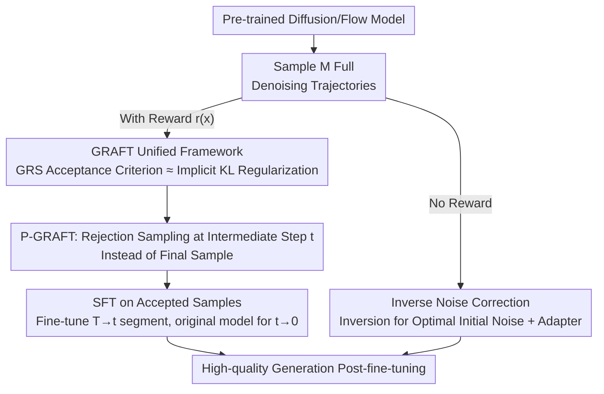

# Fine-Tuning Diffusion Models via Intermediate Distribution Shaping

**Conference**: ICLR 2026  
**arXiv**: [2510.02692](https://arxiv.org/abs/2510.02692)  
**Code**: None  
**Area**: Computational Biology  
**Keywords**: Diffusion Model Fine-tuning, Rejection Sampling, KL Regularization, Intermediate Distribution, Inverse Noise Correction

## TL;DR
This paper unifies rejection sampling fine-tuning methods into the GRAFT framework and proves that it implicitly performs KL-regularized reward maximization. Consequently, it proposes P-GRAFT to perform distribution shaping at intermediate denoising steps (achieving a better bias-variance trade-off) and Inverse Noise Correction to improve flow model quality without rewards, achieving an 8.81% VQAScore improvement on T2I tasks.

## Background & Motivation

**Background**: Fine-tuning diffusion models often employs PPO with KL regularization. However, the marginal likelihood of diffusion models is intractable, resulting in the KL term being either ignored (causing instability) or approximated by trajectory KL (leading to sub-optimality and initial value function bias).

**Limitations of Prior Work**: (1) Intractable marginal KL leads to necessary relaxations in PPO approximations; (2) Rejection sampling methods (e.g., RAFT, Best-of-N) are practical but lack clear theoretical connections; (3) Existing methods only shape the final data distribution, failing to exploit the structure of the intermediate steps in diffusion models.

**Key Challenge**: Diffusion models require KL regularization to stabilize fine-tuning, but the marginal KL is intractable to compute.

**Key Insight**: The authors prove that rejection sampling implicitly achieves marginal KL constraints (despite the likelihood being intractable). They then leverage the multi-step structure of diffusion to perform distribution shaping on intermediate distributions.

**Core Idea**: Rejection sampling = Implicit KL regularization $\to$ Perform rejection sampling at intermediate denoising steps $\to$ Achieve a superior bias-variance trade-off.

## Method

### Overall Architecture
The paper addresses the issue that "KL regularization cannot be effectively implemented" during diffusion model fine-tuning. While PPO-based methods attempt to balance reward maximization and KL constraints, the marginal likelihood of diffusion models is intractable, forcing the KL term to be ignored or crudely approximated. The authors propose an alternative route by unifying the commonly used but theoretically ambiguous rejection sampling methods into the GRAFT framework. They first prove that GRAFT implicitly performs reward maximization under marginal KL regularization. Following the "multi-step denoising" structure of diffusion models, they move rejection sampling from final samples to intermediate denoising states, resulting in P-GRAFT with a better bias-variance trade-off. Finally, leveraging the reversibility of flow models, they propose Inverse Noise Correction, which improves quality by refining initial noise without requiring rewards.

### Key Designs

**1. GRAFT Unified Framework: Consolidating Rejection Sampling as a KL-Regularized Solution**

Classical rejection sampling, Best-of-N, and Top-K are often treated as independent heuristics, lacking a bridge to the RL objectives of diffusion fine-tuning. GRAFT unifies them into Generalized Rejection Sampling (GRS). Lemma 2.3 provides the key conclusion: samples accepted by GRS follow a distribution $p^{\text{RL}}(x) \propto \exp(\hat{r}(x)/\alpha)\bar{p}(x)$, which is precisely the optimal solution for KL-regularized reward maximization where $\hat{r}$ is the reshaped reward. This means the "uncomputable" marginal KL does not need to be explicitly calculated—sampling according to the acceptance criterion is equivalent to optimization under an exponential tilt with temperature $\alpha$ and KL constraints.

**2. P-GRAFT: Moving Rejection Sampling to Intermediate Denoising States**

Shaping only the final data distribution wastes the intermediate structure of step-by-step denoising. P-GRAFT performs rejection sampling on a denoising state $X_t$ at some intermediate time $t$. Lemma 3.2 proves that this shapes the intermediate distribution $\bar p_t$ rather than the final distribution. The fine-tuned model manages the $T \to t$ denoising segment, while the remaining $t \to 0$ steps are handled by the original model. Selecting $t$ involves a clear bias-variance trade-off: a larger $t$ is closer to pure noise where the score function is simpler and the learning problem is easier, but the reward signal variance is higher. The optimal $t$ is the intermediate point that minimizes the product of bias and variance, rather than the default choice of the final step.

**3. Inverse Noise Correction: Refining Initial Noise via Flow Reversibility without Rewards**

While the previous components rely on reward functions, some scenarios only aim to improve generation quality without available rewards. Inverse Noise Correction utilizes the reversibility of flow models (mapping data to noise) to infer a superior initial noise distribution. A parameter-efficient adapter is then used to learn this correction in the noise space. This process requires no explicit reward function and effectively corrects the often-overlooked error source of "sub-optimal initial noise sampling."

### Loss & Training
The training workflow for P-GRAFT involves: first generating $M$ full denoising trajectories, then filtering samples using GRS at an intermediate step $t$, and finally performing SFT on these accepted samples to fine-tune only the $T \to t$ segment. Inverse Noise Correction employs parameter-efficient fine-tuning on a noise-space adapter.

## Key Experimental Results

### Main Results
Stable Diffusion v2 T2I Fine-tuning:

| Method | VQAScore | Gain vs Baseline | Description |
|------|----------|------------|------|
| SD v2 (Baseline) | Baseline | — | No fine-tuning |
| Policy Gradient | Medium | Medium | PPO-like methods |
| GRAFT (Final Step) | Good | Good | Standard rejection sampling |
| **P-GRAFT** | **Best** | **+8.81%** | Intermediate step rejection sampling |
| SDXL-Base | Comparison | — | Larger model |

### Multi-task Validation

| Task | Method | Performance |
|------|----------|------------|
| Layout Generation | P-GRAFT | Significant improvement |
| Molecule Generation | P-GRAFT + De-duplication | Improvement + Diversity preservation |
| Unconditional Image Gen | Inverse Noise Correction | FID improvement + Lower FLOPs |

### Key Findings
- P-GRAFT outperforms policy gradient methods (PPO) and standard GRAFT on T2I tasks.
- Hypothesis testing confirms: intermediate states $X_t$ at smaller $t$ carry more information regarding the final reward (variance analysis).
- A de-duplication variant of GRS in molecule generation effectively prevents mode collapse; the reshaped reward automatically incorporates a diversity term.
- Inverse Noise Correction improves FID without requiring rewards and reduces FLOPs per image.

## Highlights & Insights
- **GRS = Implicit KL Regularization**: This theoretical result resolves a fundamental technical difficulty in fine-tuning diffusion models. Marginal KL is intractable $\to$ it doesn't need to be computed as rejection sampling implements it implicitly.
- **Bias-Variance Perspective on Intermediate Shaping**: The choice of "which step to use" is not just an engineering heuristic but is supported by mathematical principles—selecting $t$ to minimize the product of bias and variance.
- **De-duplication GRS for Molecules**: The reshaped reward $\hat{r}$ automatically includes a diversity penalty $-\log(N_{\text{copies}})$, elegantly preventing mode collapse.

## Limitations & Future Work
- Searching for the optimal intermediate time $t$ in P-GRAFT requires experimental tuning.
- Inverse Noise Correction is only applicable to flow models (requires reversibility).
- Generating $M$ full trajectories incurs significant computational overhead.
- Theoretical derivations rely on the "well-trained denoiser" assumption.

## Related Work & Insights
- **vs PPO/DPPO**: Avoids KL computation difficulties; implicit KL constraints provide higher stability.
- **vs RAFT/RSO**: GRAFT provides a unified perspective, while P-GRAFT further optimizes by leveraging the diffusion structure.
- **vs DPO for diffusion**: While DPO uses preferences to shift KL, P-GRAFT utilizes more direct rejection sampling.

## Rating
- Novelty: ⭐⭐⭐⭐⭐ The GRAFT unified theory and P-GRAFT bias-variance analysis are significant contributions.
- Experimental Thoroughness: ⭐⭐⭐⭐ Covers T2I, Layout, Molecules, and Unconditional generation.
- Writing Quality: ⭐⭐⭐⭐⭐ Strong integration of theory and practice with clear mathematical derivations.
- Value: ⭐⭐⭐⭐⭐ Has a major theoretical and practical impact on the diffusion model fine-tuning paradigm.

<!-- RELATED:START -->

## Related Papers

- [\[ICLR 2026\] Iterative Distillation for Reward-Guided Fine-Tuning of Diffusion Models in Biomolecular Design](iterative_distillation_for_reward-guided_fine-tuning_of_diffusion_models_in_biom.md)
- [\[ICLR 2026\] Thompson Sampling via Fine-Tuning of LLMs](thompson_sampling_via_fine-tuning_of_llms.md)
- [\[ICLR 2026\] Antibody: Strengthening Defense Against Harmful Fine-Tuning for Large Language Models via Attenuating Harmful Gradient Influence](antibody_strengthening_defense_against_harmful_fine-tuning_for_large_language_mo.md)
- [\[ICML 2026\] Constrained Flow Optimization via Sequential Fine-Tuning for Molecular Design](../../ICML2026/computational_biology/constrained_flow_optimization_via_sequential_fine_tuning_for_molecular_design.md)
- [\[ICLR 2026\] VenusX: Unlocking Fine-Grained Functional Understanding of Proteins](venusx_unlocking_fine-grained_functional_understanding_of_proteins.md)

<!-- RELATED:END -->
