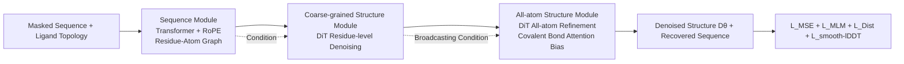

# FlexRibbon: Joint Sequence and Structure Pretraining for Protein Modeling

**Conference**: ICLR 2026  
**OpenReview**: [https://openreview.net/forum?id=B8BXHrshMi](https://openreview.net/forum?id=B8BXHrshMi)  
**Code**: [https://github.com/bjzgcai/FlexRibbon](https://github.com/bjzgcai/FlexRibbon)  
**Area**: Computational Biology / Protein Foundation Models  
**Keywords**: Protein Foundation Models, Joint Sequence-Structure Pretraining, Diffusion Models, Masked Language Model, Antibody Design, single-sequence  

## TL;DR
FlexRibbon bidirectionally couples amino acid sequences and 3D structures during pretraining using "Masked Language Modeling + Diffusion Denoising." Without relying on MSAs, it refreshes SOTA performance across 12 tasks—including antibody/nanobody CDRs, peptide interfaces, protein-ligand docking, and functional annotation—significantly outperforming MSA-based methods like AlphaFold in high-mutation and low-homology scenarios.

## Background & Motivation

**Background**: Protein Foundation Models (PFMs) primarily follow two paths. First, sequence language models (e.g., ESM-2, ProtT5) learn general representations from massive sequence datasets; they are efficient and versatile but lack 3D geometric priors. Subsequent works "inject" structural signals into sequence encoders (via geometric features, template/graph encoding, or representation distillation from structure predictors), but they remain sequence-centric—structure is merely an auxiliary signal rather than being modeled generatively and bidirectionally. Second, MSA structure predictors (AlphaFold 2/3) rely on evolutionary coupling for precise folding.

**Limitations of Prior Work**: MSA methods heavily rely on homologous sequences. When MSAs are shallow, sparse, or disrupted by heavy mutations (e.g., antibody CDR loops, intrinsically disordered interfaces, rapidly evolving pathogens), prediction signals degrade sharply. Furthermore, most existing "sequence + structure" models are unidirectional (sequence $\rightarrow$ structure) mappings, unable to perform collaborative sequence-structure design. Joint models also struggle with scalability due to the immense memory overhead of all-atom representations, often resulting in parameters being concentrated on the sequence side.

**Key Challenge**: Achieving high precision in a single-sequence (no MSA) setting while ensuring that structural representations are as scalable as sequence representations—and supporting bidirectional prediction and design simultaneously—is a difficult trilemma.

**Goal**: Train a 3-billion-parameter protein foundation model directly from sequence and large-scale structural corpora (PDB experimental structures + AFDB predicted structures) to unify structure prediction and design while maintaining reliability in high-mutation regions.

**Core Idea**: **[Bidirectional Sequence-Structure Pretraining]** Integrate diffusion denoising (structure generation) and masked language modeling (sequence recovery) into a unified objective to help the model learn bidirectional mappings (predicting sequence from structure and generating structure from sequence); **[Hierarchical Structural Modeling]** Utilize a three-tier architecture (sequence module $\rightarrow$ coarse-grained structure module $\rightarrow$ all-atom structure module) to allocate scalable capacity to both sequence and structure, overcoming the all-atom memory bottleneck.

## Method

### Overall Architecture
FlexRibbon represents each residue as a single embedding combining "sequence identity + structural context." The architecture follows a three-stage pipeline: a sequence module encodes protein residues and small-molecule atomic semantics; a coarse-grained structure module uses a DiT (Diffusion Transformer) to denoise coordinates at the residue/atom level for global organization; and an all-atom structure module refines coarse-grained results to every atom, outputting chemically consistent high-resolution coordinates. The training objective couples diffusion denoising loss with masked recovery (SIMLM), where sampling follows the reverse diffusion process.

### Key Designs

**1. Diffusion Pretraining: Converting Structure Generation into Denoising Score Matching.** Structure $R\in\mathbb{R}^{3N}$ is represented by all heavy-atom coordinates. Following the variance-exploding process of Karras (EDM) and AlphaFold 3, data distribution is linked to Gaussian noise: $R_t = R_0 + \sigma_t\epsilon,\ \epsilon\sim\mathcal{N}(0,I)$, where $\sigma_t$ increases with $t$. Sampling reverses this process by learning a score function $\nabla\log p_t$, parameterized by network $D_\theta(R,t)$ as $s_\theta(R,t)=\frac{D_\theta(R,t)-R}{\sigma_t^2}$. Training reduces to a weighted denoising loss: $\min_\theta \mathbb{E}\,w_t\lVert D_\theta(R_t,t)-R_0\rVert^2$. To ensure rigid-body invariance, the authors center the structure to remove translational degrees of freedom and use random SO(3) rotations for data augmentation, rather than using heavy SO(3)-equivariant architectures or alignment-based objectives that might risk stability or introduce unwanted reflection symmetry.

**2. Hierarchical Architecture: Enabling Truly Scalable Structural Capacity.** The sequence module uses a standard Transformer with RoPE for pure sequence semantics and a small MLP for small molecules to generate 2D bond feature matrices from atom types, recovering covalent bond patterns directly from identity. The coarse-grained structure module utilizes a DiT to denoise coordinates at the residue level (protein) and atom level (ligand), conditioned on sequence embeddings. The all-atom structure module then employs another DiT to explicitly represent each atom, using coarse-grained outputs as residue-level guidance and adding learnable attention biases for covalent bonds to ensure chemical validity. This "coarse-to-fine" allocation allows the structural side to scale effectively, solving the memory bottlenecks of previous all-atom models.

**3. Structure-Informed Masked Language Model (SIMLM): Three Modes Compelling Bidirectional Dependency.** The core idea is that masked residues must be inferred from both sequence correlations and structural contexts. MLM and Diffusion are fused via three complementary training modes: Mode 1 (Sequence $\rightarrow$ Structure) generates noisy structures from clean sequences (standard reconstruction); Mode 2 (Local Coupled Perturbation) masks 15% of residues' amino acids and adds noise to their local structures while keeping others intact; Mode 3 (Global Perturbation) masks 15% of residues while adding noise to the structure of **all** residues. By alternating between these modes, the model robustly learns the sequence $\leftrightarrow$ structure relationship.

**4. Four Losses + Three-stage Curriculum + Confidence Weighting.** Total loss $L = L_{\text{MSE}} + L_{\text{MLM}} + L_{\text{Dist}} + L_{\text{smooth-lDDT}}$. Training proceeds in three stages: Stage A (all except $L_{\text{MLM}}$, length 384) focuses on core structural patterns; Stage B (adds $L_{\text{MLM}}$, length 768) stabilizes joint optimization; Stage C (length 1024) trains a confidence head for residue-level uncertainty. A **confidence-weighted diffusion loss** derived from pLDDT is used throughout to weigh signals from AF2-predicted structures appropriately.

## Key Experimental Results

Pretraining data: AFDB + PDB (released before 2021-09-30). Test set protein chains share $\le$ 40% sequence identity with training data.

### Main Results: Flexible Interface Prediction and Design

Structure prediction success rate (SR for DockQ $\ge$ 0.23):

| Complex | Key Comparison | FlexRibbon | Gain (Absolute) |
|---|---|---|---|
| Antigen-Antibody | vs IgGM | **61.3%** | +14.6% |
| Antigen-Nanobody | vs IgGM | **51.1%** | +7.1% |
| Protein-Peptide | vs AF3 / PepGLAD | **91.4%** | +7.0% / +10.2% |

Antibody/Nanobody design (Input antigen sequence + structure, design all CDRs and generate complex):

| Method | Antibody H3-AAR | Antibody DockQ | Antibody SR | Nanobody H3-AAR | Nanobody DockQ | Nanobody SR |
|---|---|---|---|---|---|---|
| dyMEAN | 0.294 | 0.079 | 0.049 | - | - | - |
| DiffAb (AF3) | 0.226 | 0.208 | 0.368 | 0.156 | 0.211 | 0.346 |
| IgGM | 0.360 | 0.246 | 0.433 | 0.183 | 0.267 | 0.415 |
| **Ours** | **0.414** | **0.273** | **0.460** | **0.218** | **0.244** | **0.437** |

### Key Findings
- The advantage of joint bidirectional pretraining is most prominent in **high-mutation/low-homology** scenarios (antibody CDRs, nanobodies), which are traditionally blind spots for MSA methods.
- A single pretrained model achieves SOTA across five task categories: folding, design, docking, affinity, and function.
- Ligand context significantly improves conformational modeling (+0.012 TM-ens), validating the inclusion of small-molecule atoms in the unified representation.

## Highlights & Insights
- **Welding Diffusion and MLM together**: The three-mode design of SIMLM is key to realizing bidirectional dependencies, proving more effective than simple multi-tasking.
- **Single-sequence matching MSA performance**: Approaching AlphaFold 3 performance in docking as a single-sequence model is significant for real-world drug/antibody scenarios with low homology.
- **Hierarchical Architecture + Confidence Weighting**: These engineering choices allow for scalable structural representation and the safe utilization of noisy, large-scale AF2 predicted structures.

## Limitations & Future Work
- Lack of a confidence head for ranking docking poses; currently reports random-1 rather than top-1.
- High training costs for 3B parameters + all-atom diffusion; the three-stage curriculum increases hyperparameter complexity.
- Evaluation still relies on $\le$ 40% sequence identity; performance on completely novel folds or extremely large complexes ($>1024$ residues) remains to be verified.

## Related Work & Insights
- **Sequence PFMs**: ESM-2/ProtT5 provide embeddings but lack geometry. ESM-3 and DPLM-2 use structural tokenization; FlexRibbon chooses direct all-atom diffusion instead.
- **MSA Predictors**: AlphaFold 2/3 are the gold standard but are limited by homology signals. FlexRibbon proves single-sequence models can surpass them in difficult scenarios.
- **Insight**: For low-resource or highly variable domains, it is better to teach the model bidirectional causality between sequence and structure during pretraining than to rely on homologous information.

## Rating
- **Novelty**: ⭐⭐⭐⭐ — SIMLM effectively couples MLM and Diffusion for bidirectional pretraining without relying on structural tokenization.
- **Experimental Thoroughness**: ⭐⭐⭐⭐⭐ — Covers 12 tasks across prediction, design, docking, and function against both MSA and single-sequence baselines.
- **Writing Quality**: ⭐⭐⭐⭐ — Logical flow from motivation to experiments; engineering details are well-documented.
- **Value**: ⭐⭐⭐⭐⭐ — Provides a versatile foundation model for high-mutation scenarios, holding direct value for drug and antibody design.

<!-- RELATED:START -->

## Related Papers

- [\[ICLR 2026\] A Joint Diffusion Model with Pre-Trained Priors for RNA Sequence-Structure Co-Design](a_joint_diffusion_model_with_pre-trained_priors_for_rna_sequence-structure_co-de.md)
- [\[ICLR 2026\] SynCoGen: Synthesizable 3D Molecule Generation via Joint Reaction and Coordinate Modeling](syncogen_synthesizable_3d_molecule_generation_via_joint_reaction_and_coordinate_.md)
- [\[ICLR 2026\] Align Your Structures: Generating Trajectories with Structure Pretraining for Molecular Dynamics](align_your_structures_generating_trajectories_with_structure_pretraining_for_mol.md)
- [\[ICLR 2026\] PRISM: Enhancing Protein Inverse Folding through Fine-Grained Retrieval on Structure-Sequence Multimodal Representations](prism_enhancing_protein_inverse_folding_through_fine-_grained_retrieval_on_struc.md)
- [\[ICLR 2026\] AntigenLM: Structure-Aware DNA Language Modeling for Influenza](antigenlm_structure-aware_dna_language_modeling_for_influenza.md)

<!-- RELATED:END -->
