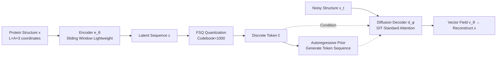

# Flow Autoencoders are Effective Protein Tokenizers

**Conference**: ICLR 2026  
**OpenReview**: [https://openreview.net/forum?id=5p9uled7JM](https://openreview.net/forum?id=5p9uled7JM)  
**Code**: Open-source package (independent repository provided in the paper)  
**Area**: Computational Biology / Protein Structure Generation  
**Keywords**: Protein structure tokenizer, Flow matching, Autoencoder, FSQ quantization, Autoregressive generation  

## TL;DR
This paper proposes Kanzi—a non-equivariant protein structure tokenizer trained with a flow matching loss. By using a diffusion decoder and an FSQ quantization bottleneck to replace the traditional SE(3)-invariant modules and complex loss functions, it achieves SOTA reconstruction with 1/20th the parameters and 1/400th the training data.

## Background & Motivation
**Background**: Discretizing continuous 3D protein structures $x\in\mathbb{R}^{L\times A\times 3}$ ($L$ for residue length, $A$ for backbone atoms) into tokens from a finite vocabulary is a crucial step in building multimodal large models for protein sequence-structure-function (e.g., ESM3, DPLM2). These structure tokenizers generally follow the AlphaFold2 paradigm, relying on SE(3)-invariant architectural components (invariant point attention) and SE(3)-invariant losses (frame-aligned point error) to explicitly encode symmetry inductive biases and prevent the generation of physically invalid structures.

**Limitations of Prior Work**: While these invariant modules are theoretically "safe," they are difficult to optimize at scale and challenging to extend to a wider range of biomolecules (proteins with post-translational modifications, RNA, DNA). The training pipelines often stack complex frame-based representations with multiple invariant losses (combinations of FAPE, dRMSD, Kabsch, violations, etc.), making the engineering both cumbersome and fragile.

**Key Challenge**: There is a tension between the "physical credibility" provided by inductive biases and scalability/flexibility. Recent works like AlphaFold3, Boltz, and Proteina have demonstrated that abandoning symmetric architectures in generative tasks can lead to better scaling—but the question of whether a "non-invariant tokenizer is feasible" remained unanswered, as such models did not exist.

**Goal**: To create the first protein structure tokenizer that matches or exceeds existing tokenizers without explicitly encoding spatial symmetries, and to verify that it can drive designable autoregressive structure generation.

**Core Idea**: **Use a diffusion/flow model as the decoder**. This reformulates the tokenizer reconstruction problem as "reconstructing the structure with a flow matching model conditioned on discrete codebooks." Consequently, frame representations can be replaced with global coordinates, a stack of invariant losses can be replaced by a single flow matching loss, and SE(3)-invariant attention can be replaced by standard attention—achieving three levels of simplification simultaneously.

## Method

### Overall Architecture
Kanzi is a non-equivariant flow autoencoder consisting of a lightweight encoder $e_\theta$ that compresses raw coordinates into a latent sequence, which is then discretized via an FSQ quantization bottleneck into tokens $\hat c$. A deeper diffusion Transformer decoder $d_\phi$ then reconstructs the structure by performing flow matching on noisy structures conditioned on $\hat c$. The entire system is trained end-to-end using a single diffusion loss without any auxiliary losses. Once trained, the token sequence can be fed into an autoregressive prior model for length-independent structure generation.

### Key Designs
**1. Diffusion Decoder + Single Flow Matching Loss: One loss to replace them all.** The pivot of this work is replacing the decoder with a flow model. This allows the tokenizer to be trained simply by minimizing a flow matching objective $L_{\text{flow}}=\mathbb{E}_{x_1\sim p_{\text{data}},\,x_0\sim\mathcal N(0,1)}\lVert v_\theta(x_t,t,\hat c)-(x_1-x_0)\rVert_2^2$, where $\hat c=\mathrm{FSQ}(e_\theta(x))$ and $x_t=(1-t)x_0+t x_1$ represents linearly interpolated noise, with the regression target being the conditional vector field $u=x_1-x_0$. This single term replaces the heterogeneous loss mixture of FAPE, violations, dRMSD, and binned direction used in ESM3/IST. The engineering difficulty of "how to measure structural error" is delegated to the diffusion model's implicit structural distribution learning, eliminating dependencies on frames and invariant losses.

**2. Asymmetric Encoder-Decoder + Single-Stream vs. Dual-Stream Trade-off.** The encoder is significantly smaller than the decoder (narrower and shallower, a common practice for tokenizers) and uses sliding window attention for local information mixing, introducing a causal-friendly bias for downstream autoregressive modeling. The decoder remains fully bidirectionally connected and utilizes RoPE for relative positional encoding. A critical detail highlighted by the authors is the use of a single-stream encoder while the decoder treats quantized latent variables as in-context conditions via dual-stream concatenation. Given the extremely low dimensionality of protein coordinates, this dual-stream conditioning allows gradients to pass efficiently back through the shallow encoder—a choice unique to low-dimensional data compared to the dual-stream encoder designs in image-domain FlowMo.

**3. FSQ Quantization + Straight-through Estimator.** The quantization bottleneck uses Finite Scalar Quantization (FSQ), discretizing continuous latents into $\hat c=\lfloor \ell/2\rfloor\tanh(\mathrm{Linear}(c))$, with levels $\ell=8,5,5,5$ per dimension, equivalent to a codebook size of approximately 1000. Gradients are propagated back to the encoder using a standard straight-through estimator. The authors observed that while codebook utilization is low during early training due to high coordinate correlation, **codebook utilization emerges spontaneously** and increases with long-term training without requiring additional load-balancing losses.

**4. Shared adaLN + Flexible Inference Sampling.** Unlike standard DiT, Kanzi shares the time-conditioning weights of adaLN across all DiT blocks, reducing parameters by about 30%. Since the decoder is a continuous flow model, it can leverage advanced image diffusion techniques during inference: the closed-form score field $s_\theta=\tfrac{t v_\theta(x_t,t,\hat c)-x_t}{1-t}$, classifier-free guidance $\tilde v_\theta=v_\theta(x_t,t,\hat c)+g\big(v_\theta(x_t,t,\hat c)-v_\theta(x_t,t,\varnothing)\big)$ (enabled by masking conditions with 0.1 probability during training), and an ad hoc SDE sampler that treats noise scale $\gamma$ and score scale $\eta$ as tunable hyperparameters—offering flexibility unattainable by discrete or purely autoregressive tokenizers.

## Key Experimental Results

### Main Results
Cα Reconstruction (CAMEO / CATH / AFDB, RMSD↓ / TM↑): Kanzi matches or exceeds large-scale models with far fewer parameters.

| Model (Params) | CAMEO RMSD | CATH RMSD | AFDB RMSD | AFDB TM |
|---|---|---|---|---|
| DPLM2 (118M) | 1.651 | 1.641 | 4.676 | 0.810 |
| ESM3 (648M) | 0.860 | 1.048 | 2.384 | 0.915 |
| IST (11M) | 1.637 | 1.201 | 2.872 | 0.862 |
| bio2token (1.1M) | 1.076 | — | 1.212 | 0.932 |
| **Kanzi (30M)\*** | **0.817** | **0.953** | **0.870** | **0.962** |
| Kanzi (11M)\* | 0.863 | 0.994 | 0.994 | 0.952 |

> Note: \* Sampling set with $\eta=0.45, \gamma=1.0, g=2.0$, and this configuration was intentionally "under-optimized" (only tuned on a 100-entry AFDB subset). Kanzi leads significantly in RMSD/TM on AFDB using roughly 1/20th the parameters and 1/400th the training data of ESM3.

### Ablation Study
Generative Evaluation (Autoregressive Prior, Designability↑ / scRMSD↓):

| Model (Params) | Designability | scRMSD | scTM | α% |
|---|---|---|---|---|
| ESM3-AR (300M) | 0.520 | 4.252 | 0.804 | 38.6 |
| DPLM2-AR (300M) | 0.320 | 8.989 | 0.706 | 41.2 |
| Kanzi-AR (250M), $\eta=0$ | 0.328 | 4.210 | 0.724 | 71.9 |
| Kanzi-AR (250M), $\eta=0.66$ | 0.562 | 3.781 | 0.795 | 88.7 |
| **Kanzi-AR (250M), $\eta=0.66$ + BoN** | **0.617** | **3.655** | 0.807 | 88.2 |

### Key Findings
- **Encoder requires token mixing for generation, but not for reconstruction**: Reducing the encoder window to 0 (pointwise MLP) still yields good reconstruction but severely degrades downstream generative quality—indicating that reconstruction and generability are distinct objectives.
- **Best-of-N ($N=2$ using log-likelihood as reward proxy)** further improves designability, proving that the autoregressive prior learns a meaningful distribution.
- Kanzi-AR is the **first known tokenized model to produce designable structures without massive pre-training**; however, it tends to over-predict α-helices (a known issue with synthetic data reliance) and has not yet equaled continuous diffusion SOTA.
- The introduction of **rFPSD** (reconstruction Fréchet Protein Structure Distance), a distribution-level reconstruction metric, reveals that "strong reconstruction $\neq$ strong generation"—DPLM2 has worse reconstruction than ESM3 but a better rFPSD.

## Highlights & Insights
- **"Changing the decoder" simplifies everything**: By shifting the tokenizer's difficulty from "designing correct invariant losses" to "letting a diffusion decoder implicitly learn structural distributions," the model eliminates the need for frame representations, invariant losses, and invariant attention, resulting in a minimalist and more extensible engineering approach.
- **Empirical evidence for the non-invariant route**: In tasks like cryoET density map conditional generation, where the "conditional signals are inherently non-invariant," other invariant tokenizers fail, whereas Kanzi tokens are naturally compatible.
- The counter-intuitive choice of "dual-stream conditional decoder + single-stream encoder" for low-dimensional data is key to making gradients learnable for shallow encoders.

## Limitations & Future Work
- While generative quality exceeds similar tokenized models, it still **lags behind continuous diffusion SOTA**; over-prediction of α-helices requires additional post-training correction (reserved for future work).
- Training data is **entirely synthetic structures** (AFDB clustered by Foldseek, ~499k entries), which may propagate distribution biases to generation.
- The trade-offs for sliding window/full attention and absolute/relative positional encodings in the encoder remain somewhat empirical; non-equivariant encoders still underperform invariant tokenizers in residue-level representation tasks.

## Related Work & Insights
- **Image flow autoencoders** (FlowMo, DiTo) proved that diffusion decoders can bypass the combination of perceptual and adversarial losses in VQGAN; this work is the first to migrate this concept to protein structures.
- **Generative models discarding symmetry** (AlphaFold3, Proteina, Boltz) provide prior confidence that "non-invariant can scale"; Kanzi extends this judgment to the tokenization phase.
- For developers of multimodal biological large models: a structural tokenizer that is scalable, easy to train, and compatible with non-invariant signals means the structural modality can be integrated into language models more efficiently.

## Rating
- Novelty: ⭐⭐⭐⭐ — First non-equivariant flow autoencoder protein tokenizer; while the "changing decoder to eliminate loss" migration mimics the image domain, it is pioneering for protein structures and fills the gap of non-existent non-invariant tokenizers.
- Experimental Thoroughness: ⭐⭐⭐⭐ — Covers 5 held-out test sets + Cα/full-backbone settings + reconstruction/generation/representation tasks + systematic ablations + new rFPSD metric; slightly lacks large-scale non-synthetic training validation.
- Writing Quality: ⭐⭐⭐⭐ — Clear motivation and a persuasive narrative of simplification; Figures 2 and 4 effectively visualize the architecture and the "simplified loss pipeline."
- Value: ⭐⭐⭐⭐ — Achieves reconstruction SOTA with minimal compute and is the first tokenized model to generate designable structures without massive pre-training, offering immediate value for multimodal biological modeling.

<!-- RELATED:START -->

## Related Papers

- [\[ICLR 2026\] ProteinAE: Protein Diffusion Autoencoders for Structure Encoding](proteinae_protein_diffusion_autoencoders_for_structure_encoding.md)
- [\[ICLR 2026\] La-Proteina: Atomistic Protein Generation via Partially Latent Flow Matching](la-proteina_atomistic_protein_generation_via_partially_latent_flow_matching.md)
- [\[ICLR 2026\] Riemannian Variational Flow Matching for Material and Protein Design](riemannian_variational_flow_matching_for_material_and_protein_design.md)
- [\[ICLR 2026\] Low rank adaptation of chemical foundation models generate effective odorant representations](low_rank_adaptation_of_chemical_foundation_models_generate_effective_odorant_rep.md)
- [\[ICLR 2026\] Extending Sequence Length is Not All You Need: Effective Integration of Multimodal Signals for Gene Expression Prediction](extending_sequence_length_is_not_all_you_need_effective_integration_of_multimoda.md)

<!-- RELATED:END -->
