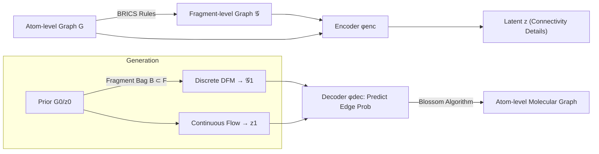

# FragFM: Hierarchical Framework for Efficient Molecule Generation via Fragment-Level Discrete Flow Matching

**Conference**: ICLR 2026  
**OpenReview**: [https://openreview.net/forum?id=tr6vRn2aPg](https://openreview.net/forum?id=tr6vRn2aPg)  
**Code**: [https://github.com/lee-jwon/FragFM](https://github.com/lee-jwon/FragFM)  
**Area**: Computational Biology / Molecular Graph Generation  
**Keywords**: Molecular Generation, Fragment-level Generation, Discrete Flow Matching, Coarse-to-fine Autoencoder, Natural Product Benchmark  

## TL;DR
FragFM elevates molecular generation to the level of "chemical fragments": it employs discrete flow matching for sampling on fragment-level graphs, followed by a coarse-to-fine autoencoder for lossless reduction to the atomic level. Combined with a "random fragment bag" strategy to bypass fixed vocabulary constraints, it generates larger, more realistic, and controllable molecules with fewer denoising steps.

## Background & Motivation
- **Background**: Diffusion and flow matching graph generative models (e.g., DiGress, DeFoG, Cometh) have made significant progress in de novo molecular graph generation, promising to accelerate drug and material discovery.
- **Limitations of Prior Work**: Most existing models operate on **atom-level representations**, facing severe scalability bottlenecks—the number of edges grows quadratically with graph size. Furthermore, chemical bonds are inherently sparse, making edge prediction difficult and prone to illegal connectivity. GNNs also struggle to capture topological structures like rings, often deviating from chemical validity.
- **Key Challenge**: Fragment-level generation is theoretically superior (preserving global structure, enhancing property control, and aligning with medicinal chemistry). However, existing fragment-based methods either rely on **small, fixed vocabularies**, which severely limit chemical space coverage and domain knowledge injection, or use data-driven automated segmentation (like BPE) that ignores synthesis-oriented chemical priors.
- **Goal**: To perform fragment-level generation while **handling massive fragment vocabularies**, achieving **lossless reconstruction of atomic connectivity**, and maintaining efficiency/quality on large molecules (e.g., natural products).
- **Core Idea**: **[Fragment-level Discrete Flow Matching + Coarse-to-fine Autoencoder + Random Fragment Bags]**—the choice of fragments is handled by a transferable GNN embedding + Info-NCE contrastive learning, while fragment assembly back to atoms is managed by an autoencoder + Blossom algorithm, enabling exploration of vast fragment spaces under controllable computational budgets.

## Method

### Overall Architecture
FragFM consists of two primary components: (i) a **coarse-to-fine autoencoder** that compresses an atom-level graph $G$ into a fragment-level graph $\mathcal{G}$ and a continuous latent variable $z$ (where $z$ encodes fine-grained intra/inter-fragment connectivity); (ii) a joint flow matching process on $X=(\mathcal{G}, z)$—Discrete Flow Matching (DFM) generates fragment types and inter-fragment edges, while Continuous Flow Matching generates $z$. After generation, the decoder predicts probabilities for all candidate atom-atom edges, followed by the **Blossom algorithm** to select the maximum likelihood edge set for lossless atomic reconstruction.

### Key Designs

**1. Coarse-to-fine Autoencoder: Encapsulating "Fragment-to-Atom" ambiguity in a latent variable.** Although fragment-level graphs provide high-level abstraction, a fragment-level connection $\mathcal{E}$ may correspond to multiple valid atom-level configurations; direct generation loses connectivity information. FragFM uses predefined chemical rules (e.g., BRICS) to transform $G$ into $\mathcal{G}$, then encodes $(G, \mathcal{G})$ into a continuous latent $z$ to capture atomic connections not inferable from $\mathcal{G}$: $G \xrightarrow{\text{Rule}} \mathcal{G},\ (G,\mathcal{G})\xrightarrow{\phi_{enc}} z$. At the decoding stage, given $(\mathcal{G}, z)$, the model outputs scores for candidate atomic edges between adjacent fragments, which are then discretized into valid connections $\mathcal{E}$ via the **Blossom maximum matching algorithm** (Edmonds 1965). This autoencoder achieves **>99% bond-order reconstruction accuracy** on standard benchmarks, ensuring fragment-level generation remains lossless.

**2. Masked DFM with Info-NCE Loss for Fragment Types: Approximating posteriors on massive vocabularies.** The fragment vocabulary $|F|$ in real chemical space is enormous, making a continuous-time Markov chain (CTMC) over the entire space computationally infeasible. FragFM employs a **masked DFM** where nodes remain fixed once unmasked and reformulates fragment type prediction as density ratio estimation: the network $f_\theta(X_t, x)$ approximates $p_{1|t}(x|X_t)/p_1(x)$. During training, a bag $B$ is constructed at each step containing one positive fragment $x_1^+\sim p_{1|t}(x_1|X_t)$ and $N-1$ negative samples from the marginal distribution $p_1(x)$. The within-bag posterior is defined as $p_{1|t}(x\mid X_t, B)=\dfrac{\mathbb{1}_B(x)\,p_{1|t}(x|X_t)/p_1(x)}{\sum_{y\in B} p_{1|t}(y|X_t)/p_1(y)}$, and trained using the Info-NCE loss $\mathcal{L}(\theta)=-\mathbb{E}_B\big[\log \frac{f_\theta(X_t,x^+)}{\sum_{y\in B} f_\theta(X_t,y)}\big]$. The **computational cost scales linearly with $N$ rather than $|F|$**. Since fragment embeddings are derived from a GNN, the model naturally generalizes to unseen fragments.

**3. Within-bag Transition Kernels for Random Fragment Bags: Balancing fidelity and computation.** In standard DFM, the one-step transition kernel requires an expectation over the entire fragment set $F$ for the rate matrix conditioned on $x_1$. FragFM instead operates on a random subset $B\subset F$. The within-bag $x_1$ posterior is $p^\theta_{1|t,B}(x_1|X_t,B)=\dfrac{\mathbb{1}_B(x_1) f_\theta(X_t,x_1)}{\sum_{y\in B} f_\theta(X_t,y)}$, inducing a bag-conditioned forward kernel $p^\theta_{t+\Delta t|t}(x_{t+\Delta t}|X_t,B)=\mathbb{E}_{x_1\sim p^\theta_{1|t,B}}\big[p_{t+\Delta t|t}(x_{t+\Delta t}|X_t,x_1)\big]$. This serves as a practical proxy: it converges to the exact kernel as $N\to|F|$, with negligible bias for small $\Delta t$ and moderate $N$.

**4. Dual Conditioning: Fragment bag reweighting + classifier guidance.** Property control (target $c$) is integrated at two points: first, by biasing the construction of bag $B$ using a property predictor $p_{\psi_{prop}}(c|x)$ and a tunable **fragment bag reweighting parameter $\lambda_B$**, ensuring the bag is enriched with target-compliant fragments; second, by applying a guidance strength $\lambda_X$ (following DiGress's classifier guidance) to the transition kernel. This dual approach provides a "pre-filtering" mechanism at the vocabulary level that atom-level models lack.

## Key Experimental Results

### Main Results

MOSES Benchmark (25,000 generated molecules, arrows indicate direction of improvement):

| Model | Representation | Valid↑ | Novel↑ | Filters↑ | FCD↓ | SNN↑ |
|---|---|---|---|---|---|---|
| JT-VAE | Fragment (Graph) | 100.0 | 99.9 | 97.8 | 1.00 | 0.53 |
| SAFE-GPT | Fragment (Seq) | 98.1 | 90.9 | 98.2 | 0.71 | 0.54 |
| DiGress | Atom (Graph) | 85.7 | 95.0 | 97.1 | 1.19 | 0.52 |
| DeFoG | Atom (Graph) | 92.8 | 92.1 | 98.9 | 1.95 | 0.55 |
| **FragFM** | Fragment (Graph) | **99.8** | 87.1 | **99.1** | **0.58** | **0.56** |

FragFM achieves near-100% validity without explicit constraints (comparable to the constrained JT-VAE), while its FCD of 0.58 significantly outperforms all baselines.

NPGen Natural Product Benchmark (30,000 molecules, avg. heavy atoms 35.0, vs. MOSES 21.7):

| Model | Representation | Val.↑ | Novel↑ | NP-likeness KL↓ | FCD↓ |
|---|---|---|---|---|---|
| JT-VAE | Fragment (Graph) | 100.0 | 99.5 | 0.5437 | 4.07 |
| SAFE-GPT | Fragment (Seq) | 96.5 | 73.5 | 0.0024 | 0.15 |
| DiGress | Atom (Graph) | 85.4 | 99.9 | 0.1957 | 2.05 |
| DeFoG | Atom (Graph) | 85.9 | 99.2 | 0.1550 | 4.46 |
| **FragFM** | Fragment (Graph) | **98.0** | 95.4 | **0.0374** | **1.34** |

FragFM leads among graph-based models in functional metrics (NP-likeness, NP-Classifier KL) and is approximately **5× faster** at sampling than DiGress.

### Ablation Study

| Dimension | Findings |
|---|---|
| Denoising Steps | Performance remains robust as steps decrease, highlighting the efficiency of fragment-level generation. |
| Fragment Bag Size $N$ | Larger $N$ approaches the exact kernel; moderate $N$ balances fidelity and compute (Appendix C.6). |
| Segmentation Rules | Investigated the impact of different rules (e.g., BRICS) (Section 5.5). |
| Vocab Transferability | Can generalize to unseen scaffolds by integrating test-set fragment vocabularies via GNN embeddings (Appendix C.4). |
| AE Reconstruction | >99% bond-order accuracy, validating the lossless fragment-to-atom reduction (Appendix C.3). |

### Key Findings
- **Fragments + Large Vocabularies Coexist**: Random fragment bags + Info-NCE reduce complexity from $O(|F|)$ to $O(N)$, allowing fragment methods to move beyond small fixed vocabularies.
- **Amplified Advantage on Large Molecules**: On complex molecules like natural products, FragFM's lead over atom-level diffusion models is more pronounced than on small molecule benchmarks.
- **Novelty Trade-off**: Lower Novelty/Scaffold metrics on MOSES stem from the fixed vocabulary + scaffold-split protocol (unseen scaffolds cannot be generated); however, this can be addressed by trading fidelity for novelty.

## Highlights & Insights
- **Scaling Vocabulary as a Tunable Parameter**: By using density ratios with within-bag sampling, FragFM converts the intractable problem of CTMCs on massive discrete spaces into a feasible linear-scaling problem.
- **Coarse-to-fine AE addresses a long-standing fragment-based challenge**: The ambiguity of fragment-to-atom mapping is cleanly resolved using a continuous latent $z$ and Blossom discretization, reaching >99% accuracy.
- **NPGen Benchmark Contribution**: While MOSES/GuacaMol metrics are stagnating and biased toward small molecules, NPGen (utilizing 658k COCONUT natural products) pushes evaluation toward larger, more difficult regions relevant to drug discovery.
- **Dual Property Control Levers**: Fragment bag reweighting allows property steering to begin at the vocabulary level, providing a layer of control finer than pure atomic-level guidance.

## Limitations & Future Work
- **Dependency on Fragment Vocabularies**: Unseen scaffolds cannot be generated if they are absent from the vocabulary (similar to JT-VAE), though this can be mitigated with vocabulary swaps.
- **Lower Novelty**: Under scaffold-split protocols, novelty metrics are less competitive, reflecting an inherent fidelity-novelty trade-off.
- **Segmentation Rule Sensitivity**: Performance depends on the choice of rules like BRICS, which dictate the fragment space structure.
- **Future Work**: Combining replaceable vocabularies with dynamic fragment discovery and extending to 3D conformations and target-aware drug design.

## Related Work & Insights
- **Atom-level Graph Diffusion/Flow**: DiGress, DisCo, Cometh, DeFoG—FragFM is designed specifically to bypass their quadratic edge complexity and sparsity issues.
- **Fragment-level Generation**: JT-VAE, HierVAE, SAFE-GPT, Levy & Rector-Brooks, Chen et al.—FragFM breaks the "fixed/small vocabulary" barrier via GNN embeddings and random bags.
- **Hierarchical Generation**: MolGrow, MolHF, Qiang et al.—FragFM differs by using **chemically-defined fragments** rather than data-driven coarse-grained subgraphs as the generative unit.
- **Insight**: Info-NCE density ratio + random subset sampling represents a generalizable framework for extending generative models to massive discrete vocabularies (e.g., retrieval-augmented generation), applicable beyond molecules.

## Rating
- **Novelty**: ⭐⭐⭐⭐ The combination of fragment-level DFM, random bags, and Info-NCE solves the "large vocabulary" problem for fragment methods; the coarse-to-fine AE is cleverly implemented.
- **Experimental Thoroughness**: ⭐⭐⭐⭐ Extensive coverage of MOSES/GuacaMol/ZINC250k/NPGen, including conditional generation, efficiency, and ablations.
- **Writing Quality**: ⭐⭐⭐⭐ Clear framework, strong link between math and motivation, and high-quality figures.
- **Value**: ⭐⭐⭐⭐ Enables fragment generation with both large vocabulary coverage and lossless atomic reconstruction; provides a more realistic and challenging benchmark in NPGen.

<!-- RELATED:START -->

## Related Papers

- [\[ICLR 2026\] La-Proteina: Atomistic Protein Generation via Partially Latent Flow Matching](la-proteina_atomistic_protein_generation_via_partially_latent_flow_matching.md)
- [\[ICLR 2026\] Efficient Prediction of Large Protein Complexes via Subunit-Guided Hierarchical Refinement](efficient_prediction_of_large_protein_complexes_via_subunit-guided_hierarchical_.md)
- [\[ICLR 2026\] Riemannian Variational Flow Matching for Material and Protein Design](riemannian_variational_flow_matching_for_material_and_protein_design.md)
- [\[ICML 2025\] Efficient Molecular Conformer Generation with SO(3)-Averaged Flow Matching and Reflow](../../ICML2025/computational_biology/efficient_molecular_conformer_generation_with_so3-averaged_flow_matching_and_ref.md)
- [\[ICLR 2026\] Multi-Marginal Flow Matching with Adversarially Learnt Interpolants](multi-marginal_flow_matching_with_adversarially_learnt_interpolants.md)

<!-- RELATED:END -->
