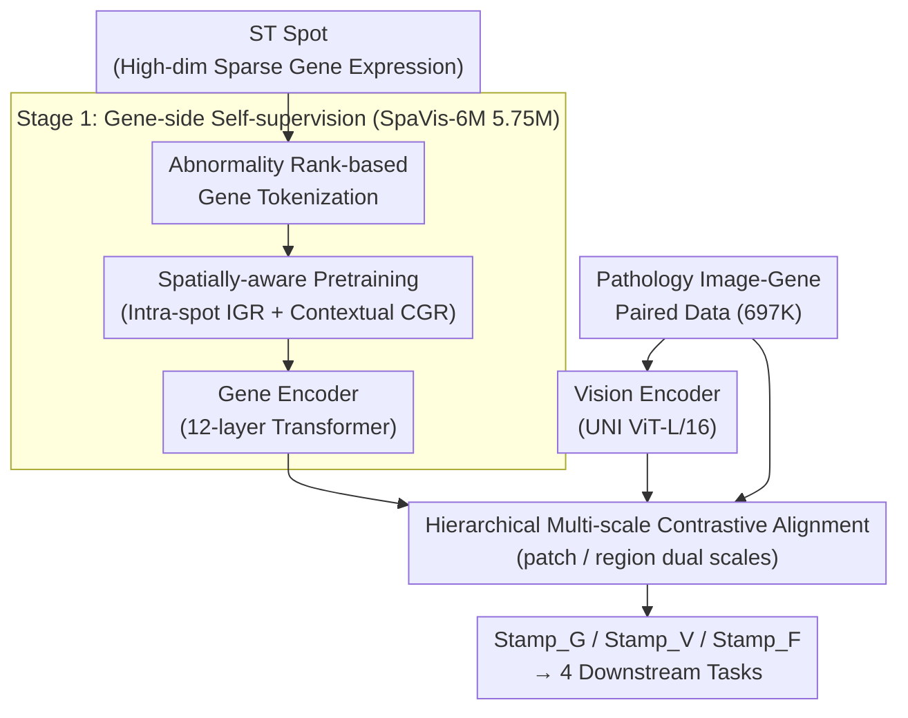

# Fusing Pixels and Genes: Spatially-Aware Learning in Computational Pathology

**Conference**: ICLR 2026  
**arXiv**: [2602.13944](https://arxiv.org/abs/2602.13944)  
**Code**: [https://github.com/Hanminghao/STAMP](https://github.com/Hanminghao/STAMP)  
**Area**: Computational Biology  
**Keywords**: Spatial Transcriptomics, Computational Pathology, Multimodal Pretraining, Gene Expression, Contrastive Learning

## TL;DR

This paper proposes the Stamp framework, which utilizes spatial transcriptomics (ST) gene expression data as supervisory signals. Through spatially-aware gene encoder pretraining and hierarchical multi-scale contrastive alignment, it achieves joint representation learning of pathological images and ST data, reaching State-of-the-Art (SOTA) performance across 4 downstream tasks on 6 datasets.

## Background & Motivation

**Background**: Foundation models in Computational Pathology (CPATH) are evolving from unimodal (purely visual self-supervised pretraining) to multimodal approaches. Methods like PLIP and CONCH align pathological images with natural language descriptions via image-text contrastive learning. TANGLE further introduces bulk RNA-seq gene expression data to guide Whole Slide Image (WSI) representation learning.

**Limitations of Prior Work**: Natural language lacks molecular-level specificity and cannot provide deep pathological supervision. For instance, a text description of "Infiltrating Ductal Carcinoma" cannot inform the model about which gene pathways are activated. Although bulk RNA-seq provides molecular information, it averages gene expression across the entire tissue section, failing to capture intra-sample spatial heterogeneity (e.g., massive gene expression differences between the tumor center and the invasive front). Existing works incorporating ST have two critical limitations: (1) simplified encoding (linear layers + few genes), requiring full-parameter fine-tuning of the visual backbone for each new dataset; (2) neglect of the inherent spatial multi-scale structure of ST data.

**Key Challenge**: ST data simultaneously contains spatial location and gene expression information, exhibiting strong cross-spot spatial dependencies. However, existing methods treat spots as independent samples, directly applying vision-language pretraining frameworks (treating each spot as an independent image-text pair), which wastes the most unique advantage of ST—spatial context.

**Goal**: (1) How to train a gene encoder capable of perceiving spatial structures? (2) How to achieve effective alignment between pathological images and genes with limited paired data? (3) How to capture multi-scale features in pathological analysis?

**Key Insight**: The authors construct SpaVis-6M (5.75 million entries), the largest 10X Visium ST dataset to date, to pretrain a spatially-aware gene encoder. This is followed by joint training with a pathological visual encoder using hierarchical multi-scale contrastive alignment. The two-stage strategy reduces dependence on paired data (only 697K paired data points for alignment).

**Core Idea**: Pretrain the gene encoder through spatial neighborhood sampling and contextual gene reconstruction, then align it with the visual encoder via cross-scale localization and hierarchical contrastive learning to achieve molecular-supervision-driven pathology image representation learning.

## Method

### Overall Architecture

Stamp aims to solve "how to use ST gene expression as a supervisory signal to train pathological image representations that understand both molecules and space." The process is linked in two stages. **Stage 1 (Gene-side Self-supervision)**: High-dimensional sparse gene expressions from each spot are converted into token sequences. Spatially-aware pretraining is performed on 5.75M unpaired SpaVis-6M entries, enabling a 12-layer Transformer gene encoder to learn both intra-spot gene co-expression and inter-spot spatial dependencies. **Stage 2 (Cross-modal Alignment)**: Using the frozen gene encoder, the visual encoder (UNI, ViT-L/16) is pulled toward the gene representation on 697K paired image-gene data points through hierarchical multi-scale contrastive alignment. This produces three types of embeddings—gene embedding Stamp_G, visual embedding Stamp_V, and their fusion Stamp_F—to be used by downstream tasks as needed.

### Key Designs

**1. Abnormality Rank-based Gene Tokenization: Using Ranking Instead of Values to Immunize Sparse Gene Expression Against Batch Effects**

Gene expression data is high-dimensional and sparse, while ST from different platforms and sections suffers from batch effects. Directly feeding absolute expression values into a Transformer is unstable and wastes sparse structures. Stamp first calculates the average non-zero expression level of each gene across all samples and normalizes each sample's expression by dividing it by the corresponding mean. Crucially, it **does not use the normalized values directly** (as they still carry batch offsets); instead, it ranks genes by their normalized deviation in descending order and takes the IDs of the top $N=1500$ genes as the token sequence:

$$T_i = \{id(ep_i^0), id(ep_i^1), \ldots, id(ep_i^{N-1}) : ep_i^k \geq ep_i^{k+1}\}$$

Genes with zero expression naturally fall to the end and are excluded. This "ranking is more stable than absolute values" approach ensures the token sequence is naturally robust to batch effects, as offsets change magnitudes but rarely relative order. Simultaneously, undetected genes are automatically removed, handling sparsity while allowing the sequence format to seamlessly integrate with BERT-style masked modeling.

**2. Spatially-Aware Pretraining (Dual IGR + CGR Loss): Enabling the Gene Encoder to Understand Both Intra-spot Co-expression and Inter-spot Spatial Dependency**

Existing ST works treat each spot as an independent sample, losing the spatial context. Stamp uses a neighborhood center sampling strategy to construct spatially coherent mini-batches—starting from a random seed spot and iteratively adding surrounding spots via nearest neighbors. Two objectives are set: **Intrinsic Gene Reconstruction (IGR)** randomly masks 15% of tokens and reconstructs them using unmasked tokens from the same spot:

$$\mathcal{L}_{IGR} = -\frac{1}{|M|}\sum_{j \in M} \log P(t_{i,j} \mid x_{i,L-1})$$

This forces the model to learn inherent gene expression associations (e.g., co-regulatory networks). **Contextual Gene Reconstruction (CGR)** uses aggregated features from neighboring spots:

$$h_i = \frac{1}{|N(s_i)|}\sum_{k \in N(s_i)} x_{i,L-1}^k$$

to predict the masked genes of the central spot. CGR is based on the biological prior that a spot's transcriptional state is highly correlated with its microenvironment, forcing the model to encode the spatial structure of the tissue into the representation.

**3. Hierarchical Multi-scale Contrastive Alignment: Aligning Images and Genes at Patch and Region Scales to Mimic Pathologist Zooming**

Traditional vision-language pretraining aligns at a single scale, ignoring the cross-scale nature of pathological analysis. The alignment phase optimizes four losses. **Cross-scale Patch Localization $\mathcal{L}_{CSP}$** simulates the pathologist's workflow: treating a patch as a sub-region within a $3 \times 3$ region grid and introducing a "pretext token" so a shared visual encoder can process both patch and region inputs, then using CE loss to predict which position the patch occupies in the region. **Patch-Gene Contrastive Alignment $\mathcal{L}_{P-S}$** and **Region-Gene Contrastive Alignment $\mathcal{L}_{R-S}$** are standard InfoNCE symmetric losses pulling visual scales toward corresponding gene expressions. **Patch-Region Intra-modal Alignment $\mathcal{L}_{P-R}$** aligns the two scales within the visual modality, expanding the effective receptive field and preventing representation collapse common in BERT-style methods. Total alignment loss:

$$\mathcal{L}_{Align} = \mathcal{L}_{CSP} + \mathcal{L}_{P-S} + \mathcal{L}_{R-S} + \mathcal{L}_{P-R}$$

### Loss & Training

Gene encoder pretraining loss: $\mathcal{L}_{Gene} = \mathcal{L}_{IGR} + \mathcal{L}_{CGR}$, with $\mathcal{L}_{IGR}$ alone for 1 epoch, then joining CGR for 1 epoch. Alignment pretraining loss: $\mathcal{L}_{Align} = \mathcal{L}_{CSP} + \mathcal{L}_{P-S} + \mathcal{L}_{R-S} + \mathcal{L}_{P-R}$, trained for 30 epochs. AdamW optimizer is used with a learning rate of $10^{-4}$ on 4 × A800 GPUs.

## Key Experimental Results

### Linear Probing and Unsupervised Clustering (DLPFC + HBC Datasets)

| Model | Pretraining Modality | DLPFC Bal.Acc | DLPFC ARI | HBC Bal.Acc | HBC ARI |
|------|-----------|-------------|-----------|-------------|---------|
| UNI | Vision | 0.544 | 0.144 | 0.859 | 0.499 |
| Hoptimus0 | Vision | 0.568 | 0.147 | 0.816 | 0.458 |
| CONCH | Vision+Language | 0.454 | 0.124 | 0.704 | 0.406 |
| mSTAR | Vision+Language+Gene | 0.540 | 0.159 | 0.869 | 0.505 |
| scGPT-Spatial | Gene | 0.558 | 0.215 | 0.610 | 0.208 |
| **Stamp_G** | Gene | **0.658** | **0.369** | 0.659 | 0.416 |
| **Stamp_V** | Vision+Gene | 0.624 | 0.246 | **0.872** | **0.526** |
| **Stamp_F** | Fusion | **0.721** | **0.342** | **0.899** | **0.590** |

Stamp_F outperforms the strongest unimodal visual model Hoptimus0 by 15.3% in Bal.Acc and 13.3x in ARI on DLPFC.

### Gene Expression Prediction (PSC, HHK, HER2+ Datasets)

| Method | Training Params | PSC MSE↓ | PSC PCC-V↑ | HHK MSE↓ | HER2+ MSE↓ |
|------|-----------|----------|-----------|----------|-----------|
| STNet | 12.08M | 0.330 | 0.110 | 1.357 | 1.190 |
| EGN | 146.02M | 0.345 | 0.094 | 1.321 | 1.112 |
| Stamp (Linear Probe) | Minimal | **Lowest** | **Highest** | **Lowest** | **Lowest** |

Stamp exceeds specialized models requiring full-parameter training using only linear probing of the frozen visual encoder.

### Key Findings

- **Gene Supervision Significantly Enhances Visual Representation**: On the DLPFC dataset, fine-tuning PLIP and CONCH with ST data significantly improved all clustering metrics (ARI from 0.128 to 0.174), confirming the value of molecular supervision.
- **Critical Role of Spatial Context**: Using the identical architecture, adding the CGR loss (utilizing neighborhood information) improved Stamp_G's ARI on DLPFC from 0.233 (IGR only) to 0.369 (+58%), validating the necessity of spatially-aware pretraining.
- **Cross-platform Generalization**: Although trained only on 10X Visium data, Stamp achieved optimal performance on the HER2+ dataset using a different sequencing platform, demonstrating strong generalization.
- **Complementarity of Fusion Embeddings**: Stamp_G and Stamp_V show strengths on different datasets (genes stronger on DLPFC, vision stronger on HBC); the fusion (Stamp_F) achieves the best results on both.

## Highlights & Insights

- **Significant Dataset Contribution**: SpaVis-6M is the largest Visium spatial transcriptomics dataset to date, covering 35 organs, 1982 sections, and 262 datasets/literatures, serving as a vital resource for the community.
- **Ingenious Gene Tokenization**: Replacing normalized values with ranking solves both batch effects and data sparsity in one move, naturally interfacing with the BERT sequence paradigm.
- **Practicality of Two-Stage Strategy**: Pretraining the gene encoder on 5.75M unpaired data points and aligning with 700K paired points significantly reduces reliance on expensive paired data.
- **"Pretext Token" Design**: Using a learnable token allows the same visual encoder to switch modes between patch and region processing, avoiding the overhead of dual encoders.

## Limitations & Future Work

- **Resolution Limits**: The 55μm resolution of 10X Visium corresponds to multiple cells, failing to reach sub-cellular precision, which may limit the capture of single-cell level heterogeneity.
- **Limited to Pathological Images**: The framework focuses on H&E stained sections and has not explored other imaging modalities like IHC or fluorescence.
- **Limited Depth in Downstream Evaluation**: While covering 4 tasks, it hasn't been validated on clinically critical tasks like prognosis or treatment response prediction.
- **Lack of Comparison with Newer Visual Backbones**: Uses UNI (ViT-L/16) as the backbone without results using newer models like Virchow2 or Hoptimus0 as backbones.
- **Training Costs Not Fully Discussed**: The total computation for 5.75M gene pretraining + 700K alignment training is not reported.

## Related Work & Insights

- **vs TANGLE (Jaume et al., 2024)**: TANGLE uses bulk RNA-seq to guide WSI representation learning, capturing only patient-level information. Stamp uses ST to preserve spatial heterogeneity and aligns at the spot level rather than WSI.
- **vs CONCH (Lu et al., 2024)**: CONCH aligns images with text (1.17M pairs), but text lacks molecular specificity. Stamp replaces text supervision with gene expression, increasing ARI from 0.124 to 0.342 on DLPFC.
- **vs OmiCLIP (Chen et al., 2025)**: OmiCLIP converts gene features into text sentences for alignment, which is indirect and suffers information loss. Stamp aligns genes and images directly in the embedding space, making it more efficient.

## Rating

- Novelty: ⭐⭐⭐⭐ First large-scale ST-pathology multimodal pretraining with innovative spatial-aware design.
- Experimental Thoroughness: ⭐⭐⭐⭐⭐ 6 datasets, 4 tasks, various metrics, and detailed ablation/comparison.
- Writing Quality: ⭐⭐⭐⭐ Clear framework and detailed descriptions, though symbols and formulas are dense.
- Value: ⭐⭐⭐⭐⭐ Significant contributions in both dataset and methodology, potentially driving a new paradigm from image-text to image-gene alignment.

<!-- RELATED:START -->

## Related Papers

- [\[ICML 2025\] Global Context-aware Representation Learning for Spatially Resolved Transcriptomics](../../ICML2025/computational_biology/global_context-aware_representation_learning_for_spatially_resolved_transcriptom.md)
- [\[AAAI 2026\] Dual-Path Knowledge-Augmented Contrastive Alignment Network for Spatially Resolved Transcriptomics](../../AAAI2026/computational_biology/dual-path_knowledge-augmented_contrastive_alignment_network_for_spatially_resolv.md)
- [\[ICLR 2026\] I2Mole: Interaction-aware Invariant Molecular Learning for Generalizable Drug-Drug Interaction Prediction](i2mole_interaction-aware_invariant_molecular_learning_for_generalizable_property.md)
- [\[ICLR 2026\] FACET: A Fragment-Aware Conformer Ensemble Transformer](facet_a_fragment-aware_conformer_ensemble_transformer.md)
- [\[ICLR 2026\] RankFlow: Property-aware Transport for Protein Optimization](rankflow_property-aware_transport_for_protein_optimization.md)

<!-- RELATED:END -->
