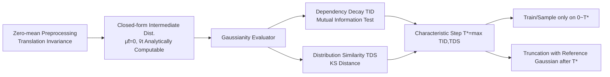

# GAGA: Gaussianity-Aware Gaussian Approximation for Efficient 3D Molecular Generation

**Conference**: ICLR 2026  
**OpenReview**: [https://openreview.net/forum?id=Q9gz8lVyAi](https://openreview.net/forum?id=Q9gz8lVyAi)  
**Code**: [https://github.com/QuJX/GAGA](https://github.com/QuJX/GAGA)  
**Area**: Computational Biology / 3D Molecular Generation / Acceleration of Diffusion and Flow Matching  
**Keywords**: Gaussian Probability Path Generative Models, 3D Molecular Generation, Trajectory Truncation, Gaussian Approximation, Training and Sampling Acceleration  

## TL;DR
GAGA discovers that 3D molecular data reaches a "sufficiently Gaussian" state **much earlier than images** during the forward noising process. By using statistical tests to locate this characteristic timestep $T^*$ and replacing the subsequent redundant trajectory with a closed-form Gaussian approximation, GAGA accelerates both training and sampling while improving generation quality—all **without changing the architecture or noise schedule**.

## Background & Motivation
- **Background**: Gaussian Probability Path based Generative Models (GPPGMs), represented by diffusion models and Gaussian flow matching, reached SOTA in 3D molecular generation. These models smoothly transform a simple Gaussian prior into the data distribution along a probability path.
- **Limitations of Prior Work**: Generating trajectories are modeled as SDE/ODE solutions, typically discretized into **hundreds or thousands of steps** for learning granularity, making training and sampling extremely expensive. Existing acceleration schemes fall into two categories: ① Inference-side step-reduction solvers (DDIM, DPM-Solver) only compress sampling while **training costs remain unchanged**, and coarsening trajectories may sacrifice granularity; ② Training-side adaptive priors or leapfrog initializers require modifying the noise process or specialized architectures, making them **domain-specific and hard to transfer to molecules**.
- **Key Challenge**: Saving computational power usually requires cutting trajectory steps, but cutting steps (coarsening/reparameterizing) often compromises learning granularity and inference fidelity—efficiency and quality seem mutually exclusive.
- **Goal**: Maintain **full-resolution learning of the original trajectory dynamics** while removing the redundant segment that "repeatedly moves between Gaussian-like distributions," achieving dual acceleration in training and sampling without sacrificing quality.
- **Key Insight** (**Gaussianity-Aware Truncation**): The time taken for different data modalities to reach a "sufficiently Gaussian" state during the forward process varies significantly. Molecular data, being sparse, low-dimensional, and translation-invariant, becomes approximately independent Gaussian **very early**. Once a characteristic step $T^*$ is reached, the subsequent trajectory can be replaced by a reference Gaussian with **analytically computable** mean and variance, shortening the trajectory from $T$ steps to $T^*$ steps.

## Method

### Overall Architecture
GAGA is built on two pillars: the **zero-mean invariance** of molecular coordinates ensures the mean of intermediate distributions remains 0, while the variance can be estimated from data statistics, giving any marginal distribution a closed-form Gaussian shape. A **Gaussianity Evaluator** (combining Trajectory Independence Dependency, TID, and Trajectory Distribution Similarity, TDS) is used to locate the characteristic timestep $T^*$ where data degrades into independent Gaussians. Training and sampling are only performed on the effective trajectory $[0, T^*]$, with truncation using the reference Gaussian $\mathcal{N}(\tilde\mu_{T^*}, \tilde v_{T^*}I)$ occurring after $T^*$.

### Key Designs

**1. Zero-mean Invariance → Analytical Intermediate Distribution:** Molecular coordinates possess translation invariance. Subtracting the empirical mean (zero-meaning) for each sample loses no structural information but ensures the intermediate distribution mean is always 0, bypassing the problem of "uncomputable means at intermediate steps." The variance is estimated using an unbiased estimator $\hat v$ by averaging per-sample statistics $v^{(i)}=\frac{1}{d-1}\sum_j (x^{(i)}_j-\mu^{(i)})^2$ across the dataset. Substituting $\hat v$ into the VP forward process yields a closed-form for any intermediate step $t$: $\tilde\mu_t = 0,\ \tilde v_t = 1-\bar\alpha_t(1-\hat v)$. Thus, $x_{T^*}$ can be directly approximated by the reference Gaussian $\mathcal{N}(0, \tilde v_{T^*}I)$, providing the foundation for the truncation strategy.

**2. Gaussianity Timing is Determined by Initial Distribution (Theoretical Guarantee):** Proposition 3.1 strictly links "when it is Gaussian enough" to "how close the initial data distribution is to Gaussian." A Gaussianity functional $H^{(K)}(x)=\beta\|\Pi_{D^\perp}(\mathrm{Cov}(x))\|_F+\mathbb{1}_{\{K\ge3\}}\sum_{k\ge3}w_k\|C^{(k)}(x)\|_F$ is defined, combining covariance off-diagonal terms and higher-order cumulants. It proves: if initial distribution A is closer to Gaussian than B across all orders, then for any $\varepsilon$, $T^*_A < T^*_B$. Intuitively, sparse molecular coordinates near equilibrium are naturally closer to Gaussian, reaching approximation at a **smaller $T^*$**—explaining why molecular data reaches Gaussianity hundreds of steps earlier than images under the same noise schedule.

**3. Locating $T^*$ via Dependency Decay and Distribution Similarity:** Analytical forms are insufficient; one must verify that $x_{T^*}$ is indeed **both independent and marginally Gaussian**. GAGA quantifies this from two complementary angles: first, **Data Dependency Decay**, using K-Nearest Neighbor mutual information to estimate $\mathrm{Dep}(x_t)$ (averaged over features and components), defining $T_{ID}=\min\{t\mid \mathrm{Dep}(x_t)\le\varepsilon_{dep}\}$. Disappeared dependency is a sufficient condition for independent Gaussian approximation. Second, **Distribution Similarity**, comparing the empirical CDF with a matched-variance Gaussian CDF via the Kolmogorov–Smirnov distance $D_t=\frac1d\sum_j\sup_x|F_{t,j}(x)-\Phi_{\tilde v_t}(x)|$, defining $T_{DS}=\min\{t\mid D_t\le\varepsilon_{DS}\}$. The final step is $T^*=\max(T_{ID}, T_{DS})$.

**4. Orthogonality and Triple Benefits:** Truncating at $T^*$ improves training (no longer optimizing on over-noised, non-informative segments) and sampling (preserving original granularity while focusing capacity on structure-containing steps), achieving a win-win in quality and efficiency. Furthermore, GAGA modifies the "trajectory range" rather than the solver, making it **fully orthogonal** to collectors like DDIM and allowing for stacked performance gains.

## Key Experimental Results

### Main Results (QM9, 10,000 samples, mean of 3 runs ± std)

| Model | Atom Sta(%) | Mol Sta(%) | Valid×Uniq(%) | Traj. Len.(Steps) |
|------|------|------|------|------|
| EDM | — | 90.7 | — | 1000 |
| EDM + GAGA | — | — | **92.0** | **550** |
| GeoLDM | — | 91.9 | — | 1000 |
| GeoLDM + GAGA | — | — | **94.4** | **650** |

> Note: GAGA improves molecular stability by up to **3.6%** and shortens trajectory length by up to **40%**.

### Main Results (GEOM-Drugs, average 44 atoms)

| Model | Atom Sta(%) | Valid(%) | S-Time(GPU sec) | Traj. Len.(Steps) |
|------|------|------|------|------|
| EDM | 81.3 | 92.6 | 10.9 | 1000 |
| EDM + GAGA | **84.3** | **93.4** | **6.4** | **650** |
| GeoLDM | 84.4 | 99.3 | 10.2 | 1000 |
| GeoLDM + GAGA | **85.9** | 99.3 | **7.9** | 800 |

### Ablation Study (QM9, Impact of $T^*$ Selection)

| Model | Valid×Uniq(%) | S-Time(GPU sec) |
|------|------|------|
| EDM ($T^*$=1000) | 90.7 | 0.65 |
| EDM+GAGA ($T^*$=450, too early) | 91.4 | 0.32 |
| EDM+GAGA ($T^*$=650, too late) | 91.6 | 0.45 |
| **EDM+GAGA ($T^*$=550, Ours)** | **92.0** | **0.36** |

### Compatibility (QM9, with 2× DDIM Acceleration)

| Backbone | DDIM | GAGA | Valid×Uniq(%) | Traj. Len. |
|------|------|------|------|------|
| EDM | ✗ | ✓ | 92.0 | 550 |
| EDM | ✓ | ✗ | 83.7 | 500 |
| EDM | ✓ | ✓ | **83.9** | **275** |

### Key Findings
- **$T^*$ Precision**: Truncating too early (450) collapses residual trajectories that still hold chemical validity, harming quality. Truncating too late (650) includes redundant noise steps. The evaluator identifies the optimal "just Gaussian" point.
- **Joint Quality and Efficiency**: Across EDM, GeoLDM, and both datasets, GAGA reduces sampling time while increasing stability **without changing the architecture**.
- **Complementarity**: When combined with DDIM, GAGA inherits efficiency gains while maintaining higher quality than DDIM alone, as it avoids the quality degradation caused by DDIM's coarsened trajectories.

## Highlights & Insights
- **New Acceleration Dimension**: While typical acceleration focuses on "how many steps to take across the whole path," GAGA asks "is the path necessary," identifying high-noise segments as meaningless transport between Gaussians.
- **Modality Differences as a Free Lunch**: Quantifies the fact that molecules reach Gaussianity much faster than images, moving zero-mean invariance from a "symmetry trick" to a lever for truncation.
- **Training Acceleration**: Unlike most DE solvers that only speed up sampling, GAGA saves training computation by removing ineffective optimization segments.
- **Statistical Positioning**: Replaces manual tuning with quantifiable criteria (MI + KS) to determine the truncation point.

## Limitations & Future Work
- **Dependency on Zero-Mean Invariance**: The "mean subtraction without information loss" holds for coordinates but not for natural images (where absolute means carry semantics), limiting direct transferability.
- **Scalar Variance Approximation**: Assuming isotropic variance ($\hat v$) may be weak for highly anisotropic structures.
- **Hyperparameter Sensitivity**: $T^*$ depends on $\varepsilon_{dep}$ and $\varepsilon_{DS}$; robustness across more datasets requires further study.
- **Future Work**: Design a unified GAGA version for both zero-mean and non-zero-mean modalities (e.g., video) to generalize the Gaussianity detection.

## Related Work & Insights
- **GPPGMs and Acceleration**: Diffusion and Flow Matching share the same Gaussian probability path. GAGA applies to both as their training objectives are equivalent (Gao et al., 2025).
- **Gaussian Approximation Tradition**: The CLT provides the basis for high-dimensional feature normality. Wang & Vastola observed that diffusion scores under high noise can be approximated by linear Gaussian models; GAGA formalizes this into a localized truncation point for both training and inference.
- **Path Design for Molecules**: EDM, GeoLDM, and EquiFM modify paths differently. GAGA is orthogonal—it keeps the original schedule but truncates redundant noise segments.

## Rating
- Novelty: ⭐⭐⭐⭐ — Truncating based on modality-specific Gaussianity timing is a novel, theoretically-backed perspective.
- Experimental Thoroughness: ⭐⭐⭐⭐ — Covers QM9 and GEOM-Drugs, multiple backbones, and compatibility; however, limited to molecular datasets.
- Writing Quality: ⭐⭐⭐⭐ — Clear logic from motivation to theory (Prop 3.1) and evaluation.
- Value: ⭐⭐⭐⭐ — Pluggable, architecture-free, and accelerates both training and sampling while improving quality.

<!-- RELATED:START -->

## Related Papers

- [\[AAAI 2026\] Apo2Mol: 3D Molecule Generation via Dynamic Pocket-Aware Diffusion Models](../../AAAI2026/computational_biology/apo2mol_3d_molecule_generation_via_dynamic_pocket-aware_diff.md)
- [\[ICLR 2026\] DCFold: Efficient Protein Structure Generation with Single Forward Pass](dcfold_efficient_protein_structure_generation_with_single_forward_pass.md)
- [\[ICLR 2026\] SynCoGen: Synthesizable 3D Molecule Generation via Joint Reaction and Coordinate Modeling](syncogen_synthesizable_3d_molecule_generation_via_joint_reaction_and_coordinate_.md)
- [\[ICLR 2026\] Convex Efficient Coding](convex_efficient_coding.md)
- [\[ICLR 2026\] FragFM: Hierarchical Framework for Efficient Molecule Generation via Fragment-Level Discrete Flow Matching](fragfm_hierarchical_framework_for_efficient_molecule_generation_via_fragment-lev.md)

<!-- RELATED:END -->
