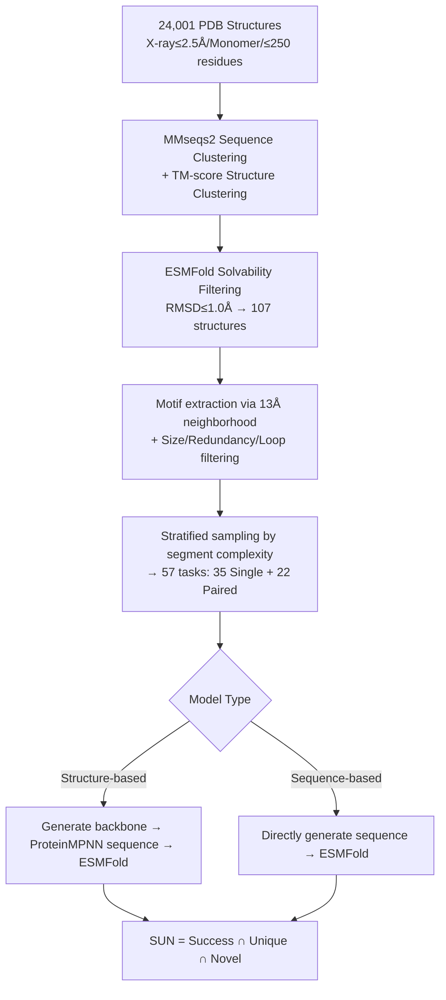

# GeomMotif: A Benchmark for Arbitrary Geometric Preservation in Protein Generation

**Conference**: ICLR 2026  
**OpenReview**: [https://openreview.net/forum?id=b4C3zAzRgH](https://openreview.net/forum?id=b4C3zAzRgH)  
**Code**: [GitHub + HuggingFace Dataset](https://openreview.net/forum?id=b4C3zAzRgH) (provided in the paper)  
**Area**: Computational Biology / Protein Generation / Benchmark  
**Keywords**: motif scaffolding, geometric preservation, protein generation, SUN score, modality-agnostic benchmark  

## TL;DR
GeomMotif decouples the protein motif scaffolding task from "functional sites," constructing 57 guaranteed solvable, modality-agnostic "pure geometric preservation" tasks. Through a unified SUN (Success × Unique × Novel) metric system, it reveals counterintuitive phenomena, such as structural models significantly outperforming sequence models and structural conditioning potentially interfering with generation.

## Background & Motivation
**Background**: Motif scaffolding (generating a complete protein scaffold around a given functional fragment) is a core task in deep learning protein design, analogous to "image outpainting" in computer vision. Generative models such as RFdiffusion, Genie2, ESM3, and DPLM treat this as a primary objective. Mainstream evaluation benchmarks like RFdiffusion's 25 functional motifs and MotifBench's 30 test cases focus on known functional sites like enzyme active sites and binding interfaces.

**Limitations of Prior Work**: Existing benchmarks suffer from a "diagnostic blind spot"—they conflate two fundamentally different challenges: **preserving 3D geometry** and **satisfying complex functional constraints** (residue identity, charge distribution, hydrophobic packing, side-chain conformation, etc.). When a model fails a functional motif task, it is impossible to determine whether it "lacked the basic ability to preserve geometric structure" or "achieved the correct geometry but failed functional requirements." Furthermore, some complex functional site tasks might be inherently unsolvable for current methods, contaminating the evaluation signal.

**Key Challenge**: In protein engineering, geometric precision is the prerequisite for function. The paper cites alarming data: for computationally designed protein binders, when the backbone RMSD of the binding motif deviates by just 1.0 Å, the experimental success rate can plummet from nearly 50% to 0. While geometric precision is the most critical computational filter before wet-lab experiments, existing benchmarks entangle this foundational capability with complex functions, making it impossible to measure independently.

**Goal**: Construct a benchmark that **tests only geometric preservation without functional specificity**, allowing for a clean evaluation of the core generative capability: "whether a model can maintain local and long-range geometric relationships between arbitrarily selected residues."

**Key Insight**: **[Uniformly sampling from PDB rather than functional bias]** Fragments are sampled from the Protein Data Bank (PDB) without functional bias, transforming the task into "protein outpainting." **[Guaranteed solvability]** Each task is derived from a real protein, ensuring at least one ground-truth solution exists. **[Modality-agnostic]** Task definitions do not rely on specific sequence or structure representations, allowing sequence-based and structure-based models to compete fairly. **[Attribute-rich annotation]** Each task is annotated with 8 structural/physicochemical attributes, supporting fine-grained analysis beyond simple success rates.

## Method

### Overall Architecture
The core of GeomMotif is a dual-stage pipeline comprising "benchmark construction" and "modality-agnostic evaluation." The construction stage involves multi-level filtering, clustering, and solvability verification from mass PDB structures, followed by stratified sampling of 57 tasks based on "segment complexity." The evaluation stage employs adapted folding pipelines for structure-based and sequence-based models, eventually converging on a unified SUN metric.

### Key Designs

**1. Task Construction with Guaranteed Solvability: Attributing failure solely to the model.** This is the fundamental design difference between GeomMotif and previous benchmarks. The authors first filter high-quality starts from the PDB using three strict criteria: X-ray crystallography with resolution ≤2.5 Å, biological monomers only (to avoid conformational drift of complexes in isolation), and length ≤250 residues (to avoid sub-structures requiring global context to fold), obtaining 24,001 structures. Redundancy is then removed using two-stage clustering: MMseqs2 at 80% sequence identity/90% coverage, followed by complete-linkage hierarchical clustering at TM-score 0.5/30% coverage. A critical step is **using ESMFold to predict each cluster representative, retaining only structures where the predicted fold and experimental structure have an RMSD ≤1.0 Å**, ensuring the evaluation pipeline itself can "recover" the structure. This addresses the loophole in MotifBench where some tasks might be unsolvable, leaving 107 solvable structures.

**2. Spatial Neighborhood-based Motif Definition and Segment Complexity Stratification.** Motifs are defined geometrically rather than functionally: every residue is traversed as a center, and all residues with $C\alpha$ within a 13 Å radius are defined as a motif. Three filters refine these (removing motifs <30 residues, redundant neighborhoods with >20% residue overlap, and loose motifs with >25% DSSP-determined loop content), resulting in 3,772 single-motif candidates. For paired-motif tasks, pairs with centers $\ge$30 Å apart within the same structure are taken, yielding 5,364 candidates. Since spatially adjacent residues are often discontinuous in sequence, the authors use **"segment complexity"**—the number of continuous sequence segments forming the motif—to characterize geometric difficulty. Stratified uniform sampling is performed (1–7 segments for single, 3–7 for paired), yielding 57 tasks (35 single + 22 paired) covering various CATH fold classes like mainly-$\alpha$, mainly-$\beta$, and $\alpha/\beta$. Variable regions are allowed to change length within reasonable biological limits while motifs remain geometrically fixed, forcing the model to truly understand geometry rather than memorize patterns.

**3. Eight-dimensional Physicochemical Attribute Annotation: Decomposing success rates into interpretable dimensions.** Each task is annotated with 8 additional attributes to support fine-grained attribution: three secondary structure components (helix / extended $\beta$ / loop content via DSSP), motif size (number of residues), mean hydrophobicity (Eisenberg scale), burial ratio (fraction of residues with RSA < 0.2), absolute charge density (sum of Arg/Lys +1 and Asp/Glu -1 per residue), and structural context (ratio of intra-motif to extra-motif contacts at a 4.5 Å threshold). These attributes elevate analysis from "success/failure" to identifying which structural features are most difficult for specific architectures.

**4. SUN Unified Metric and Modality-Agnostic Evaluation.** Evaluation considers geometric fidelity, structural diversity, and novelty relative to known proteins. A single generated protein is "Successful" if it satisfies: motif backbone scRMSD < 1.0 Å (geometric faithfulness) and mean pLDDT $\ge$70 (good overall folding). Within successful designs, diversity is measured by the number of hierarchical clusters at a TM-score 0.8 threshold (**Unique**), and novelty is determined by a TM-score < 0.8 against the ground truth (**Novel**). These are aggregated into the SUN score:

$$\text{SUN} = P(\text{Successful} \cap \text{Unique} \cap \text{Novel})$$

This rewards designs that balance precision, diversity, and originality. The evaluation adapts to two modalities: structure-based models follow "generate backbone $\rightarrow$ ProteinMPNN design 8 sequences $\rightarrow$ ESMFold validation," while sequence-based models skip ProteinMPNN. Both fixed-length and variable-length evaluations are conducted: the former serves as a controlled baseline, while the latter distinguishes true generalization from rote memorization.

## Key Experimental Results

### Main Results: Overall SUN for 10 Models (Variable Length)

| Category | Model | Success % | SUN % |
|---|---|---|---|
| Structure-based | Genie2 | — | **39.4** |
| Structure-based | La-Proteina | — | 38.8 |
| Structure-based | RFdiffusion | 54.4 | 37.8 |
| Structure-based | Protpardelle-1C | — | 33.8 |
| Structure-based | FrameFlow | — | 23.3 |
| Structure-based | RFdiffusion2 | 19.2 | 17.9 |
| Sequence-based | ESM3 (seq-only) | — | 3.5 |
| Sequence-based | DPLM-3B | — | 2.7 |
| Sequence-based | DPLM-650M | — | 2.1 |
| Sequence-based | ESM3 (seq+struct) | — | 1.0–1.4 |

Structure-based models outperform sequence-based models by an order of magnitude (best structure-based 39.4% vs. best sequence-based 3.5%).

### Ablation Study: Single vs. Paired Motifs (SUN Components)

| Model | Success (S/P) | Novel (S/P) | Unique (S/P) | SUN (S/P) |
|---|---|---|---|---|
| Genie2 | 60.1 / 32.9 | 60.1 / 26.6 | 59.9 / 22.5 | 59.9 / 18.8 |
| La-Proteina | 67.1 / 62.7 | 67.1 / 35.2 | 61.3 / 22.7 | 61.3 / 16.2 |
| RFdiffusion | 65.1 / 43.7 | 65.1 / 25.0 | 62.4 / 20.5 | 62.4 / 13.2 |
| Protpardelle-1C | 56.2 / 44.6 | 56.2 / 25.2 | 53.5 / 22.6 | 53.5 / 14.1 |
| FrameFlow | 30.6 / 25.1 | 30.6 / 19.7 | 30.6 / 20.2 | 30.6 / 16.0 |
| ESM3 (seq) | 17.4 / 6.5 | 11.3 / 0.1 | 10.1 / 0.1 | 6.8 / 0.1 |
| DPLM-3B | 19.3 / 11.0 | 10.2 / 0.9 | 9.8 / 0.6 | 4.9 / — |

### Key Findings
- **Order of magnitude gap between Structure vs. Sequence**: Structure-based models (Genie2 39.4%, RFdiffusion 37.8%) far exceed sequence-based models (best 3.5%), indicating that pure geometric preservation remains a major bottleneck for sequence generation paradigms.
- **Paired motifs are the "cliff" for sequence models**: SUN scores for sequence-based models drop nearly to zero on spatially separated paired motifs (ESM3 0.1%), whereas structure-based models remain usable (Genie2 18.8%), exposing architectural limitations.
- **Multi-modality can hinder performance**: ESM3 using sequence+structure (1.0–1.4%) consistently performs worse than sequence-only mode (3.5%), suggesting structural conditioning might introduce conflicting signals.
- **Scaling parameters $\neq$ Capability improvement**: DPLM-3B (2.7%) is only marginally better than DPLM-650M (2.1%), showing that simply increasing parameters does not solve the fundamental problem of sequence scaffolding.
- **Benchmark complementarity**: RFdiffusion2 achieves 41/41 on the atomic enzyme benchmark but only 17.9% on GeomMotif; the original RFdiffusion achieves 16/41 on the enzyme benchmark but 37.8% on GeomMotif. This suggests "narrow-domain optimization" and "broad-domain generalization" are distinct capabilities, and the benchmarks are complementary.

## Highlights & Insights
- **Elegant Decoupling**: Separating "geometry vs. function" is the greatest conceptual contribution of this benchmark, allowing "model failure" to be cleanly attributed for the first time.
- **Guaranteed Solvability** is a key engineering feat: reverse-validating each task with ESMFold avoids the systematic bias of testing models with unsolvable tasks.
- **Segment Complexity** provides deep insight: it transforms "geometric difficulty" from a vague concept into a continuous dimension suitable for stratified sampling and correlation analysis.
- Counterintuitive conclusions (multi-modality being worse, parameter scaling being ineffective, RFdiffusion2 regression) provide direct value for future model design.

## Limitations & Future Work
- **Tests Geometry Only, Not Function**: The authors explicitly exclude functional correctness; thus, GeomMotif is a supplement to, rather than a replacement for, functional benchmarks. It cannot predict final biological utility on its own.
- **Limited Scale**: 57 tasks and 107 source structures are a relatively small sample compared to the PDB, potentially limiting coverage of rare folds or topologies.
- **Dependency on ESMFold/ProteinMPNN**: Solvability screening and success determination are tied to specific folding/inverse-folding tools; the biases of these tools propagate to the benchmark.
- **Future Directions**: Combining geometric and functional dimensions into multi-axis evaluations, expanding task scale, and introducing atomic-level side-chain motifs will lead to more comprehensive diagnostics.

## Related Work & Insights
- **Functional Benchmarks**: RFdiffusion (25 functional motifs) and MotifBench (30 cases) focus on active sites/interfaces and are the targets for decoupling; the Atomic Motif Enzyme Benchmark represents "narrow-domain atomic-level" evaluation, complementing GeomMotif.
- **Generative Paradigms**: Structure diffusion/flow matching (RFdiffusion(2), Genie2, FrameFlow, La-Proteina, Protpardelle-1c) vs. sequence generation (ESM3, DPLM series); multi-motif formalization follows Lin et al. and Liu et al.
- **Metric Genealogy**: SUN (Successful, Unique, Novel) originates from Sriram et al. 2024; this paper adapts it to the motif scaffolding scenario.
- **Inspiration**: For any "generation + constraint preservation" task (e.g., molecules, layouts, image outpainting), decoupling "geometric fidelity of constraints" from "semantic/functional correctness" is a benchmark design philosophy worth adopting.

## Rating
- Novelty: ⭐⭐⭐⭐ — Not a new model but a new evaluation perspective. The combination of "geometry/function decoupling + guaranteed solvability + modality-agnosticism" is a pioneering conceptual contribution to protein design benchmarks.
- Experimental Thoroughness: ⭐⭐⭐⭐ — Covers 10 cross-paradigm models, 57 tasks with 100 samples each, including bootstrap uncertainty and double settings for fixed/variable length. Conclusions are well-supported by attribute-rich analysis.
- Writing Quality: ⭐⭐⭐⭐ — The motivation is compelling (the 1.0 Å deviation example is striking), the construction pipeline and metric definitions are clear, and tables/figures are well-organized.
- Value: ⭐⭐⭐⭐ — Provides a clean ruler for the community to diagnose geometric capabilities and reveals counterintuitive phenomena that offer practical guidance for model iteration.

<!-- RELATED:START -->

## Related Papers

- [\[ICLR 2026\] Protein Structure Tokenization via Geometric Byte Pair Encoding](protein_structure_tokenization_via_geometric_byte_pair_encoding.md)
- [\[ICLR 2026\] CAPSUL: A Comprehensive Human Protein Benchmark for Subcellular Localization](capsul_a_comprehensive_human_protein_benchmark_for_subcellular_localization.md)
- [\[ICLR 2026\] La-Proteina: Atomistic Protein Generation via Partially Latent Flow Matching](la-proteina_atomistic_protein_generation_via_partially_latent_flow_matching.md)
- [\[ICML 2025\] Geometric Representation Condition Improves Equivariant Molecule Generation](../../ICML2025/computational_biology/geometric_representation_condition_improves_equivariant_molecule_generation.md)
- [\[ICLR 2026\] DCFold: Efficient Protein Structure Generation with Single Forward Pass](dcfold_efficient_protein_structure_generation_with_single_forward_pass.md)

<!-- RELATED:END -->
