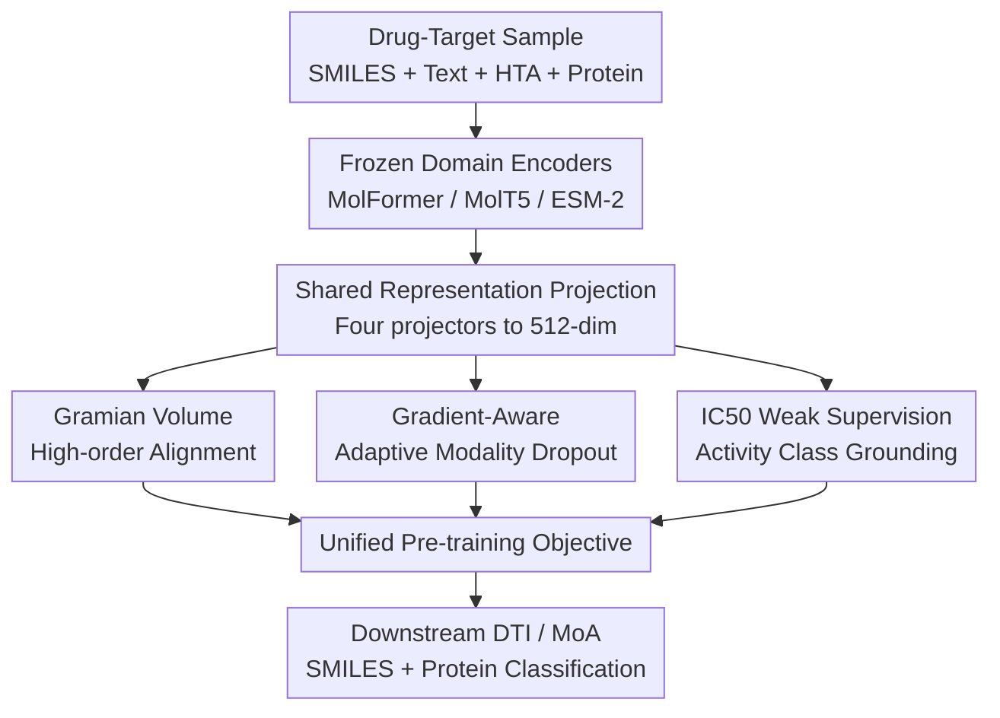

# GRAM-DTI: Adaptive Multimodal Representation Learning for Drug-Target Interaction Prediction

**Conference**: ICLR2026  
**OpenReview**: [https://openreview.net/forum?id=dbZeLxOCIs](https://openreview.net/forum?id=dbZeLxOCIs)  
**Code**: https://github.com/uta-smile/GRAM-DTI  
**Area**: Computational Biology / Drug-Target Interaction Prediction  
**Keywords**: Drug-target interaction, multimodal pre-training, Gramian volume alignment, adaptive modality dropout, IC50 weak supervision  

## TL;DR
GRAM-DTI integrates drug SMILES, molecular text, hierarchical taxonomic annotations (HTA), and protein sequences into a unified pre-training framework. It utilizes Gramian volume alignment, adaptive modality dropout, and IC50 weak supervision to learn robust drug-target representations, overall surpassing strong baselines in DTI / MoA prediction and zero-shot retrieval.

## Background & Motivation
**Background**: Drug-target interaction (DTI) prediction is a fundamental task in computational drug discovery, used to determine if a small molecule acts on a protein target. It is often extended to predicting activation/inhibition mechanisms. Most recent deep learning methods represent drugs as SMILES or molecular graphs and targets as amino acid sequences, using GNNs, Transformers, protein language models, or dual-tower architectures for binary classification.

**Limitations of Prior Work**: While "drug sequence + protein sequence" approaches cover basic structural information, they fail to fully exploit the multi-source information available in drug discovery. A small molecule has natural language descriptions, functional descriptions, and hierarchical taxonomic annotations (HTA) in addition to SMILES; proteins also have sequences and activity measurements. More problematically, existing multimodal DTI methods often rely on pairwise contrastive learning. This approach captures only local pairings as the number of modalities increases, failing to express high-order consistency where multiple perspectives converge on the same drug-target semantic.

**Key Challenge**: Multimodal DTI pre-training requires introducing more modalities without simply summing them with equal weights. Modality quality and information density vary across samples; some molecular texts are highly explanatory, while some HTA labels are coarse. Static fusion allows dominant modalities to overshadow complementary signals. Conversely, pairwise alignment loses the overall geometric constraints among four modalities.

**Goal**: The authors aim to solve three sub-problems: first, how to align SMILES, molecular text, HTA, and protein sequences in a unified space; second, how to dynamically adjust the participation of each modality during training; third, how to leverage partially available IC50 activity measurements from public databases to align pre-trained representations with actual drug-target binding intensity.

**Key Insight**: The paper leverages the volume loss from Gramian multimodal representation learning, treating multimodal alignment as a geometric volume minimization problem. Intuitively, if four modal embeddings from the same sample are semantically consistent in a shared space, the Gramian volume they span should be minimized, while mismatched negative samples should form a larger volume. This perspective is more suitable for four-modality scenarios than pairwise proximity.

**Core Idea**: GRAM-DTI uses Gramian volume loss for high-order alignment, determines the temporary dropout of modalities during training based on gradient information, and discretizes IC50 into a weak supervision objective to learn DTI representations that generalize better to cold-start drugs and targets.

## Method

### Overall Architecture
The input to GRAM-DTI consists of multimodal drug-target samples: SMILES, natural language descriptions, and HTA for the drug side, and amino acid sequences for the protein side. If an IC50 measurement exists, an activity class label is provided. The model extracts representations using frozen domain-specific pre-trained encoders, then trains lightweight projectors to map them into a shared 512-dimensional space. Here, the four-modality volume loss, SMILES-protein pairwise contrastive loss, and IC50 auxiliary classification loss are simultaneously applied. For downstream DTI/MoA prediction, only the pre-trained SMILES and protein representations are concatenated and passed through a lightweight MLP for classification.

The pre-training data is merged from TRIDENT multimodal molecular data and BindingDB protein binding information. TRIDENT provides SMILES, text descriptions, and HTA triplets; the authors link these to protein sequences and IC50 measurements for molecules that map to BindingDB, forming $\langle \text{SMILES}, \text{Text}, \text{HTA}, \text{Protein} \rangle$ quadruplets. The final pre-training set includes 50,968 quadruplets covering 6,545 molecules and 4,418 proteins, with 16,035 samples containing auxiliary IC50 labels.

Foundation models are reused for encoders: MoLFormer-XL for SMILES, MolT5 for text and HTA, and ESM-2 for protein sequences. All major backbones are frozen, concentrating the learning on the three-layer projection networks and the IC50 classification head.

### Key Designs
**1. Gramian Volume Alignment: Replacing Pairwise Similarity with Geometric Volume**

Traditional contrastive learning checks if two vectors match (e.g., SMILES and Protein proximity). The core change in GRAM-DTI is evaluating if four modalities are collectively consistent. For normalized projections $f_i^s, f_i^t, f_i^h, f_i^p$ of a sample, a Gram matrix $G$ is constructed where $G_{kj}=\langle f_i^k, f_i^j\rangle$. The Gramian volume is defined as $V(f_i^s,f_i^t,f_i^h,f_i^p)=\sqrt{\det(G)}$. Consistent modalities should occupy a compact space with small volume; swapping one modality with another from the batch should break consistency and increase volume. The loss $L_{vol}$ utilizes contrastive logits based on these volumes.

**2. Gradient-Aware Adaptive Modality Dropout: Preventing Modality Dominance**

A risk in multimodal alignment is one modality contributing too strongly, causing the model to over-rely on it. GRAM-DTI applies "hard dropout" with probability $p_{drop}$ during training. It decides which modality to temporarily remove from the volume loss based on recent gradient contributions. Specifically, it computes the gradient norm $g_{\tilde{t}}^m=\lVert \partial \tilde{L}_{\tilde{t}}/\partial f_{\tilde{t}}^m\rVert_2$ and uses an exponentially decayed history $\bar{g}_{\tilde{t}}^m$. If a modality's contribution exceeds a threshold $\mu_{\tilde{t}}+\lambda_\sigma\sigma_{\tilde{t}}$, it is prioritized for dropout. This forces the model to maintain alignment across the remaining modalities.

**3. IC50 Weak Supervision and Pairwise Alignment: Grounding Semantics in Activity**

Multimodal semantic consistency alone does not guarantee a model understands interaction strength. BindingDB's IC50 measurements are used as weak supervision. Due to noise and heterogeneity, IC50 is discretized into three categories: $IC50<10\mu M$ (active), $10\mu M\le IC50\le1000\mu M$ (intermediate), and $IC50>1000\mu M$ (inactive). A classification head processes the fused representation $f_{fused}=[f^s;f^t;f^h;f^p]$. Additionally, a CLIP-style dual contrastive loss $L_{bi}$ is added between SMILES and protein representations to explicitly strengthen the primary drug-target relationship.

**4. Frozen Foundation Models + Lightweight Projection**

By fixing large backbones like ESM-2 and MoLFormer, the pre-training remains computationally efficient, capable of being completed on a single A6000. This modularity allows the framework to benefit from future improvements in molecule or protein foundation models by simply swapping the frozen encoders.

### Loss & Training
The framework follows a two-stage process: offline embedding extraction followed by distributed training of projectors and the volume loss. Hyperparameters include batch size 1280, learning rate $1\times10^{-4}$, 40 epochs, temperature $\tau=0.07$, $p_{drop}=0.8$, and history length $K=5$. The total loss is $L_{total}=\lambda_1L_{vol}+\lambda_2L_{bi}+\lambda_3L_{IC50}$ with weights set to 1.

Downstream evaluation follows the DTIAM protocol, using a 1:10 positive-to-negative ratio. Splits include warm start, drug cold start, and target cold start. Benchmark datasets include Yamanishi 08, Hetionet, Activation, and Inhibition.

## Key Experimental Results

### Main Results
GRAM-DTI was evaluated against competitors on DTI and MoA tasks. It achieved SOTA performance in 10 out of 12 metrics for DTI and 8 out of 12 for MoA, with the most significant gains observed in target cold-start scenarios.

| Dataset/Task | Split | Metric | DTIAM | GRAM-DTI | Observation |
|--------|------|------|------|----------|------|
| Yamanishi 08 / DTI | Target cold start | AUROC / AUPR | 0.941 / 0.844 | 0.955 / 0.849 | More robust in unseen protein scenarios |
| Hetionet / DTI | Drug cold start | AUROC / AUPR | 0.752 / 0.514 | 0.855 / 0.529 | Significant AUROC gain in large-scale drug cold start |
| Activation / MoA | Target cold start | AUROC / AUPR | 0.792 / 0.391 | 0.834 / 0.450 | Largest gains in activation mechanism prediction |

Zero-shot retrieval results indicate that the pre-trained representations are inherently useful. In Activation protein-to-drug retrieval, Recall@K improved significantly over DTIAM without additional fine-tuning.

### Ablation Study
Ablations confirmed that the combination of $L_{vol}$, $L_{bi}$, $L_{IC50}$, and adaptive dropout is optimal. Removing $L_{vol}$ degraded performance across most splits, showing that pairwise alignment is insufficient for capturing high-order relationships. Removing $L_{IC50}$ also weakened results, proving that biological activity grounding is essential. The "hard dropout" strategy outperformed "Weighted-Modality Gradients" and "Standard Weighted Loss," suggesting that the regularization provided by temporary modality removal is superior to soft weighting.

### Key Findings
- **High-order alignment** is particularly beneficial for target cold starts, as it facilitates better transfer of semantics to unseen proteins.
- **IC50 weak supervision** bridges the gap between semantic consistency and actual biological interaction strength.
- **Adaptive modality dropout** prevents the training process from becoming dominated by a single "easier" modality.
- **Plug-and-play capability**: Replacing MoLFormer with Uni-Mol2 or BioT5+ further boosted performance, showing the framework scales with backbone strength.

## Highlights & Insights
- **Geometric Volume for Consistency**: Elevating DTI alignment from "edges" to "volumes" allows the model to constrain drug text, HTA, SMILES, and protein sequences within a collective semantic cluster.
- **Gradient-Driven Decisions**: Rather than using manual rules, dropout decisions are based on real-time gradient sensitivity, preventing long-term reliance on specific modality combinations.
- **Pragmatic IC50 Grounding**: Discretizing noisy IC50 values into three tiers provides a stable training signal that aligns representations with biological reality.
- **Framework over Architecture**: The modular design concentrates progress on the alignment mechanism rather than re-training massive foundational encoders.

## Limitations & Future Work
- **Data Constraints**: The requirement for complete quadruplets limits the pre-training set (approx. 51k samples). Extending the framework to handle missing modalities could scale the data utility.
- **Entity Overlap**: While exact drug-target pairs were removed from downstream tests, the presence of shared entities remains a concern. Stricter external validation is needed for true cold-start verification.
- **Protein Modality Simplicity**: While drug features are multimodal, protein features rely primarily on sequences. Integrating structures, pathways, or disease contexts remains a future direction.
- **Information Loss from Discretization**: Three-tier classification may lose nuances in binding affinity within the same category.

## Related Work & Insights
- **Comparison with DTIAM**: While DTIAM provides a strong multidisciplinary baseline, GRAM-DTI's high-order volume alignment and adaptive dropout generally offer better generalization in cold-start and zero-shot scenarios.
- **Comparison with TRIDENT**: GRAM-DTI extends molecular multimodal learning to the inter-entity level (drug-target), incorporating protein sequences and biological activity categories.

## Rating
- Novelty: ⭐⭐⭐⭐☆ Combines Gramian volume, adaptive dropout, and IC50 grounding effectively for DTI.
- Experimental Thoroughness: ⭐⭐⭐⭐☆ Extensive benchmarking and ablation, though entity-level overlap handling could be stricter.
- Writing Quality: ⭐⭐⭐⭐☆ Logical and clear explanation of mechanisms.
- Value: ⭐⭐⭐⭐☆ Strong potential for target discovery and drug repurposing through better latent alignments.

<!-- RELATED:START -->

## Related Papers

- [\[ICLR 2026\] DeepSADR: Deep Transfer Learning with Subsequence Interaction and Adaptive Readout for Cancer Drug Response Prediction](deepsadr_deep_transfer_learning_with_subsequence_interaction_and_adaptive_readou.md)
- [\[ICLR 2026\] I2Mole: Interaction-aware Invariant Molecular Learning for Generalizable Drug-Drug Interaction Prediction](i2mole_interaction-aware_invariant_molecular_learning_for_generalizable_property.md)
- [\[ICLR 2026\] Adaptive Data-Knowledge Alignment in Genetic Perturbation Prediction](adaptive_data-knowledge_alignment_in_genetic_perturbation_prediction.md)
- [\[ICML 2026\] Learning the Interaction Prior for Protein-Protein Interaction Prediction: A Model-Agnostic Approach](../../ICML2026/computational_biology/learning_the_interaction_prior_for_protein-protein_interaction_prediction_a_mode.md)
- [\[NeurIPS 2025\] GFlowNets for Learning Better Drug-Drug Interaction Representations](../../NeurIPS2025/computational_biology/gflownets_for_learning_better_drug-drug_interaction_representations.md)

<!-- RELATED:END -->
## Related Papers

- [\[ICLR 2026\] DeepSADR: Deep Transfer Learning with Subsequence Interaction and Adaptive Readout for Cancer Drug Response Prediction](deepsadr_deep_transfer_learning_with_subsequence_interaction_and_adaptive_readou.md)
- [\[ICLR 2026\] I2Mole: Interaction-aware Invariant Molecular Learning for Generalizable Drug-Drug Interaction Prediction](i2mole_interaction-aware_invariant_molecular_learning_for_generalizable_property.md)
- [\[ICLR 2026\] Adaptive Data-Knowledge Alignment in Genetic Perturbation Prediction](adaptive_data-knowledge_alignment_in_genetic_perturbation_prediction.md)
- [\[ICML 2026\] Learning the Interaction Prior for Protein-Protein Interaction Prediction: A Model-Agnostic Approach](../../ICML2026/computational_biology/learning_the_interaction_prior_for_protein-protein_interaction_prediction_a_mode.md)
- [\[NeurIPS 2025\] GFlowNets for Learning Better Drug-Drug Interaction Representations](../../NeurIPS2025/computational_biology/gflownets_for_learning_better_drug-drug_interaction_representations.md)

<!-- RELATED:END -->
