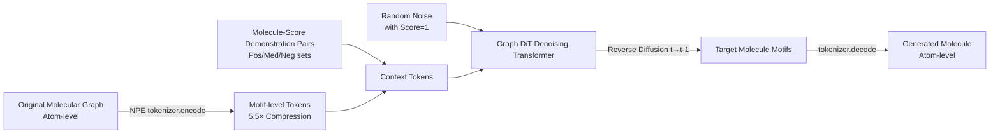

# Graph Diffusion Transformers are In-Context Molecular Designers

**Conference**: ICLR 2026  
**OpenReview**: [https://openreview.net/forum?id=lJ87GN5zJc](https://openreview.net/forum?id=lJ87GN5zJc)  
**Code**: TBD  
**Area**: Computational Biology / Molecular Design / Generative Models  
**Keywords**: In-Context Learning, Graph Diffusion Models, Molecular Design, Molecular Foundation Models, motif tokenizer, Node Pair Encoding  

## TL;DR
By using "molecule-score" demonstration pairs as surrogates for text prompts to define task context, this work trains a 0.7B molecular foundation model, DemoDiff, based on a Graph Diffusion Transformer. It matches or exceeds the performance of Large Language Models (LLMs) that are 100–1000× larger across 33 design tasks using only a few dozen in-context examples.

## Background & Motivation
**Background**: In-context learning (ICL) allows large models to adapt to new tasks via a few demonstrations. However, it has struggled with molecular design. Molecular tasks span millions of biological assays and material measurements, where each property often has only a handful of labeled samples—enough to define a task but far from sufficient to train a model from scratch.

**Limitations of Prior Work**: (1) Directly adopting the autoregressive framework of LLMs is infeasible because molecules are discrete graphs with numerical properties rather than sequential text; (2) Previous Graph Diffusion Transformers (Graph DiT) could only encode approximately five properties using a single vector, whereas the real property space consists of millions of dimensions. Using one-hot property vectors with massive embedding tables is both sparse and fails to generalize to unseen properties; (3) Atom-level molecular representations are akin to "character-level text modeling," resulting in too many tokens, which severely limits the number of demonstrations that can fit into the context.

**Key Challenge**: The property space is massive and sparse vs. the model's need for dense and generalizable conditional representations; context capacity is limited vs. the need for more demonstrations to characterize task concepts.

**Goal**: Build a molecular foundation model that uses in-context demonstrations (rather than property vectors or text) to define arbitrary molecular design tasks, performing inverse molecular design under realistic conditions of label scarcity and limited Oracle access.

**Key Insight**: **Demonstration-conditioned task definition** — Represent the task context as a set of "molecule-score" pairs, where the score $\in [0, 1]$ acts as a relative position (replacing position IDs), and the design goal is to "query for a molecule with score=1." This is paired with a **motif-level tokenizer (NPE)** that compresses molecules by 5.5×, allowing more demonstrations to fit into a fixed context.

## Method

### Overall Architecture
DemoDiff uses a Graph DiT as its backbone, formulating inverse molecular design as "given a context $C$ (a set of molecule-score pairs) and a query score $Q=1$, denoise and generate the target molecule $X$." It consists of two parts: first, Node Pair Encoding compresses atom-level molecular graphs into motif-level tokens; then, the denoising Transformer simultaneously attends to the "molecule tokens being denoised" and the "demonstration context tokens," progressively refining molecules from random noise through reverse diffusion to align with target properties.

### Key Designs

**1. Node Pair Encoding (NPE): BPE-style motif tokenization for molecular graphs.** Previous works used domain heuristics like BRICS or molecular grammars to slice motifs, where vocabularies were independent of pre-training data and often missed high-frequency substructures. NPE adopts a frequency-driven approach inspired by BPE: the vocabulary $\mathcal{M}$ is initialized with 118 atoms from the periodic table plus an aggregation point "*" (ensuring the worst case degrades to atom-level representation), followed by an iterative three-step process: neighborhood merging (enumerating adjacent mergeable motif pairs in the dataset), frequency selection (adding the most frequent candidates to the vocabulary), and graph updating (replacing the motif pairs throughout the dataset). Each motif $m=(\tilde{A},\tilde{B})$ is a connected substructure. Molecules are partitioned into disjoint motif sets connected by directed edges carrying two attributes: bond type and attachment index (specifying which atom in the source motif the bond originates from), ensuring lossless `decode` reconstruction. To prevent cycles (e.g., aromatic rings) from producing ambiguous directed edges, the authors added **Constrained NPE**: top-$K_{ring}$ high-frequency rings are merged into the vocabulary as single units during initialization. With a vocabulary size $K=3000$ (including $K_{ring}=300$), it achieves an average compression ratio of $5.446\pm2.569$ on 1 million molecules, reducing the median from 30 atoms to 5 motifs—the key to fitting more demonstrations.

**2. Diffusion Objective with Demonstrations as Conditions: Replacing property vectors with $C$ and $Q$.** Standard Graph DiT minimizes negative log-likelihood conditioned on properties $\{c_i\}$ in discrete diffusion. DemoDiff replaces conditions with the entire context and query, making the pre-training objective: $\mathcal{L}_{pretrain}=\mathbb{E}_{q(x_0)}\mathbb{E}_{q(x_t|x_0)}\big[-\log p_\theta(x_0\mid x_t, C, Q)\big]$. The forward discrete diffusion $q(x_t|x_{t-1})=\mathrm{Cat}(x_t; p=x_{t-1}Q_t)$ gradually corrupts the molecule. The reverse process samples from $q(x_T)$ and denoises via the Transformer. This interprets ICL as implicit Bayesian inference on the latent task concept $\theta$ along the diffusion trajectory: $p(X|C,Q)=\int_\theta p(X|\theta,C,Q)p(\theta|C,Q)d\theta$. The more demonstrations provided, the more the posterior concentrates on the true task concept. Scores $Y_i\in[0,1]$ are encoded using RoPE to provide positional signals for demonstration molecules; since molecular structures in the context are disjoint, edge connectivity naturally defines demonstration boundaries without explicit separators.

**3. Positive/Middle/Negative Demonstration Sets: Fully characterizing task concepts.** Using only positive demonstrations (molecules close to the target or active in an assay) is insufficient—positive examples might overlap across tasks due to task correlation or sampling bias. DemoDiff partitions demonstrations into three groups based on normalized scores: Positive [0.75, 1], Middle [0.5, 0.75), and Negative [0, 0.5), with up to 15 examples per group to provide a panoramic view of the task. Pre-training data is constructed from ChEMBL (drugs) and multiple polymer sources (materials). Highly bio-active molecules (pChEMBL > 6) are assigned score 1 as targets, and others are normalized as context scores based on pChEMBL differences. This yielded 1 million molecules, 155K unique properties, and ~1.6 million tasks, with property frequencies following Zipf’s law $P(Y_{rank})\propto rank^{-1.13}$.

**4. Consistency Score: Filtering false positives during inference.** Given a query, the fingerprint similarity of the generated molecule $X$ is compared against the Positive, Middle, and Negative groups. It checks if the relative relationship (pos > med > neg) holds, yielding a consistency score to measure alignment with the contextual order. During inference, this acts as a confidence filter to select high-consistency generations before Oracle evaluation, effectively removing false positives without calling the Oracle, leading to improvements of 0.8%–27.5% across tasks.

## Key Experimental Results

### Main Results
33 tasks are categorized into 6 types. The report shows the harmonic mean of the Oracle score and Diversity score for Top-10 generations (higher is better), and the average rank among all methods (lower is better):

| Method | Type | Drug Rediscovery | Drug MPO | Material | Avg Rank↓ |
|---|---|---|---|---|---|
| GraphGA | Optimization (100 oracle) | 0.36 | 0.52 | 0.58 | 6.56 |
| GenMol | Optimization (100 oracle) | 0.42 | 0.51 | 0.62 | 7.98 |
| Graph-DiT | Conditional Gen. | 0.43 | 0.50 | 0.55 | 8.53 |
| DeepSeek-V3 | LLM ICL | 0.45 | 0.51 | 0.39 | 8.08 |
| GPT-4o | LLM ICL | 0.47 | 0.53 | 0.43 | 7.89 |
| Qwen3-8B-FT | LLM ICL | 0.37 | 0.27 | 0.44 | 10.96 |
| **DemoDiff (0.7B)** | **Diffusion ICL** | **0.44** | **0.54** | **0.67** | **4.10** |

DemoDiff achieves an average rank of 4.10, significantly outperforming the best baseline GraphGA (6.56), despite having 1/100–1/1000 the parameters of LLM baselines. Its advantage is most pronounced in property-driven tasks like target-based design (0.79) and material design (0.67).

### Ablation Study
Model scaling (Top-10 harmonic mean):

| Scale | Drug Rediscovery | Drug MPO | Structure Constrained | Drug Design | Target-Based | Material |
|---|---|---|---|---|---|---|
| 78M | 0.39 | 0.46 | 0.47 | 0.57 | 0.73 | 0.62 |
| 311M | 0.40 | 0.46 | 0.50 | 0.53 | 0.75 | 0.62 |
| 739M | 0.44 | 0.54 | 0.56 | 0.79 | 0.78 | 0.67 |

- **Context Length**: Increasing motif tokens from 50 to 150 raised the Albuterol rediscovery harmonic score from 0.705 to 0.752—confirming that longer contexts for more demonstrations validate the utility of motif tokenization.
- **Positive Example Ratio**: A ratio of 0.5 was optimal (0.752), while using only positive examples (1.0) dropped the score to 0.708, proving that a mix of pos/med/neg examples is essential.
- **Consistency Score**: Using this as a confidence filter provided 0.8%–27.5% gains across tasks.

### Key Findings
- **Small Model, Big Impact**: The 0.7B diffusion model matches or exceeds LLMs 100–1000× its size using dozens of examples. Its generated molecules are closer to target scores and show better structural diversity (LLMs often generate high-scoring but repetitive molecules).
- **Property-Driven > Structure-Constrained**: DemoDiff excels in drug/material property design (0.67–0.79) but is relatively weaker in rediscovery/structure-constrained tasks (0.44–0.56), where Oracle scores are tied to specific narrow solution spaces.
- **Scaling Gains Vary by Task**: Medium-scale models show improvements in most tasks, while the large-scale model shows clear scaling dividends in 5 out of 6 categories.

## Highlights & Insights
- **Elegant Paradigm Shift**: Porting the "demonstrations as prompts" concept from NLP to molecular design by using "molecule-score pairs" instead of text and scores instead of position IDs provides an elegant solution to the long-standing "massive sparse property space" problem.
- **NPE is a True Enabler**: The 5.5× compression is not just an engineering detail; it is the prerequisite for ICL to function (fitting more demonstrations to better characterize task concepts). Constrained NPE also cleverly solves decoding ambiguities for rings.
- **Value of Negative Examples**: The experiments demonstrate that exclusive use of positive examples is inferior to a mixture, providing counter-intuitive but solid evidence for "demonstration diversity."
- **Zero-Oracle Purification**: The consistency score allows for filtering false positives during inference without consuming Oracle budget, which is highly practical for real-world drug discovery.

## Limitations & Future Work
- **Weakness in Structure-Constrained Tasks**: Performance in rediscovery and structure-constrained design remains moderate (0.44–0.56). Fingerprint similarity struggles to capture subtle changes like methyl groups, leading to weak correlations between consistency and target scores.
- **High Pre-training Cost**: The 0.7B model required approximately 146 H100 GPU days, posing a significant barrier to reproduction.
- **Data Biased toward ChEMBL/Polymers**: While it covers drugs and materials, its generalization to other chemical spaces like proteins or crystals remains to be verified.
- **Score Normalization Dependency**: Context scores rely on normalized pChEMBL/property differences. Whether score semantics are consistent across assays and robust to noisy labels remains an open question.

## Related Work & Insights
- **Bayesian Perspective of ICL** (Xie et al., 2021): Interprets ICL as implicit Bayesian inference over latent concepts, which this paper applies to diffusion trajectories.
- **Graph Diffusion Transformer** (Liu et al., 2024c): The backbone of DemoDiff, which this work extends from "$\le$ 5 property vector conditioning" to "demonstration conditioning for millions of assays."
- **Discrete Graph Diffusion** (Vignac et al., 2022): Provides the foundation for discrete diffusion modeling of molecular structures.
- **BPE to NPE**: Migrating frequency-based subword merging from NLP to molecular graphs suggests that any "overly fragmented" discrete structure can benefit from frequency-driven motif compression.
- **Insight**: When the property/label space is massive and sparse, instead of maintaining a giant conditional embedding table, feeding "a few labeled demonstrations" directly to the generative model is a superior approach—a strategy applicable to materials, proteins, and other scientific inverse design problems.

## Rating
- **Novelty**: ⭐⭐⭐⭐⭐ The combination of "molecule-score pairs for task definition + scores as position IDs + motif-level NPE" is a distinct new paradigm that successfully makes ICL work for molecules.
- **Experimental Thoroughness**: ⭐⭐⭐⭐ Comparison against 19 baselines across 33 tasks and 6 categories, with systematic ablations on scaling/context/ratios. However, failure analysis for structure-constrained tasks could be deeper.
- **Writing Quality**: ⭐⭐⭐⭐ Clear motivation and well-aligned Bulgarian frameworks/diagrams. Formulas are dense and require occasional cross-referencing with the appendix.
- **Value**: ⭐⭐⭐⭐⭐ Matching LLM performance with 1/100th of the parameters as a molecular foundation model is highly significant for real-world discovery where labels are scarce and Oracles are expensive.

<!-- RELATED:START -->

## Related Papers

- [\[ICML 2025\] Supercharging Graph Transformers with Advective Diffusion](../../ICML2025/computational_biology/supercharging_graph_transformers_with_advective_diffusion.md)
- [\[ICLR 2026\] SigmaDock: Untwisting Molecular Docking with Fragment-Based SE(3) Diffusion](sigmadock_untwisting_molecular_docking_with_fragment-based_se3_diffusion.md)
- [\[ICLR 2026\] Learning Flexible Forward Trajectories for Masked Molecular Diffusion](learning_flexible_forward_trajectories_for_masked_molecular_diffusion.md)
- [\[ICLR 2026\] Enhancing Diffusion-Based Sampling with Molecular Collective Variables](enhancing_diffusion-based_sampling_with_molecular_collective_variables.md)
- [\[ICLR 2026\] TetraGT: Tetrahedral Geometry-Driven Explicit Token Interactions with Graph Transformer for Molecular Representation Learning](tetragt_tetrahedral_geometry-driven_explicit_token_interactions_with_graph_trans.md)

<!-- RELATED:END -->
