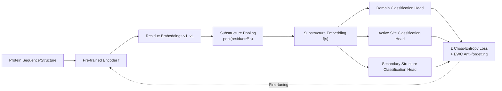

# Greater than the Sum of Its Parts: Building Substructure into Protein Encoding Models

**Conference**: ICLR 2026  
**OpenReview**: [https://openreview.net/forum?id=7LoFonLZqs](https://openreview.net/forum?id=7LoFonLZqs)  
**Code**: [https://github.com/rcalef/magneton](https://github.com/rcalef/magneton)  
**Area**: Computational Biology / Protein Representation Learning  
**Keywords**: Protein representation learning, substructure, supervised fine-tuning, ESM, domains, function prediction  

## TL;DR
This paper introduces the **Magneton** environment (including a dataset of 530,000 proteins and 1.7 million substructure annotations, a training framework, and 13 benchmark tasks) and **substructure-tuning**, a model-agnostic supervised fine-tuning method. It explicitly injects the biological prior that "proteins are assembled from evolutionarily conserved recurring substructures (domains, active sites, etc.)" into pre-trained protein encoders, systematically improving performance on function-related tasks without relying on global structure inputs.

## Background & Motivation

**Background**: Protein representation learning has evolved from pure sequence models (ESM2, ProtTrans) to models integrating experimental or predicted structures (GearNet, SaProt, ProSST), achieving significant progress in folding, function prediction, and variant effect prediction. However, almost all these models encode proteins as **residue-level token sequences** or a **single global embedding**.

**Limitations of Prior Work**: This encoding approach ignores a core property of protein organization—proteins are not uniform amino acid chains but are assembled from **recurring, evolutionarily conserved substructures** (ranging from local motifs of a few residues to domains, active sites, and binding sites covering large sequence segments). These substructures are the actual units carrying core molecular functions such as catalysis, metal coordination, and signaling. Although databases like Pfam, InterPro, and DSSP have systematically cataloged these substructures, they are rarely used as training signals or representation units.

**Key Challenge**: Incorporating substructures into models faces four technical challenges: (1) substructures span multiple spatial and functional scales; (2) they are often **discontinuous** in sequence space, making them difficult for standard sequence models to encode; (3) a single residue can belong to multiple overlapping substructures simultaneously, forming hierarchical and context-dependent relationships that flat representations cannot naturally handle; (4) annotated substructures exhibit a **long-tail distribution** (secondary structures are abundant, while specialized motifs are scarce), complicating the design of training objectives and evaluation protocols.

**Goal**: To answer "how to systematically inject decades of biological knowledge regarding protein substructures into protein encoding models."

**Core Idea**: **[Dual Track: Environment + Method]** On one hand, the researchers build the Magneton environment (data + training framework + benchmarks) to provide infrastructure for substructure-aware modeling. On the other hand, they propose substructure-tuning—**treating the 'classification of evolutionarily conserved substructures' as a supervised fine-tuning objective** to distill substructure knowledge into any pre-trained encoder. This objective requires only residue-level embeddings and is independent of specific model architectures.

## Method

### Overall Architecture
Magneton consists of three parts: **(1) Dataset**—starting from UniProtKB/SwissProt, it integrates annotations from InterPro (homologous superfamilies, domains, conserved sites, active sites, binding sites) and DSSP (secondary structure), resulting in 530,000 proteins with 1.7 million substructure annotations across 13,075 types in 6 categories; **(2) Training Framework**—treating each protein simultaneously as a residue-level view $P=(a_1,\dots,a_l)$ and a substructure-level view $P=(s_1,\dots,s_n)$, fine-tuning the encoder by performing supervised classification on substructures; **(3) Benchmark**—13 tasks across four scales (residue, substructure, protein, and interaction) to probe representation quality. The core substructure-tuning workflow is "residue embeddings → substructure pooling → type classification head → cross-entropy fine-tuning."

### Key Designs

**1. Substructure Representation Construction: Pooling feeds the prior of "which residues belong to this substructure" into the model**. Given a protein model $f$, residue-level embeddings $f(P)=(v_1,\dots,v_l)$ are calculated first. Then, a substructure representation $f(s)=\mathrm{pool}(\{v_i:a_i\in s\})\in\mathbb{R}^d$ (defaulting to mean pooling) is generated for the residues constituting substructure $s$. Crucially, the residue membership of a substructure is **explicitly provided** by InterPro/DSSP annotations; the model does not need to discover boundaries itself. Thus, substructure classification is positioned as a diagnostic task to "probe whether the model can represent known substructures" rather than "identifying unlabeled substructures." Since substructure residues can be scattered discontinuously across the sequence, pooling naturally supports the encoding of discontinuous substructures.

**2. substructure-tuning: Distilling knowledge using substructure classification as a supervised fine-tuning objective**. Building on the diagnostic task, the **encoder parameters are unfrozen**, and the entire base model is updated via the cross-entropy loss of substructure type classification. This forces the model to learn to distinguish between thousands of biologically relevant substructure types. Since this objective only relies on residue-level embeddings, it is **model-agnostic** and can be applied to pure sequence models (ESM2, ESM-C) and sequence-structure models (SaProt, ProSST). It is also compatible with parameter-efficient fine-tuning like LoRA. Experiments show that even fine-tuning with tiny substructures like active sites (only ~12 residues) yields gains in functional tasks.

**3. Multi-scale Multi-task Loss: Independent prediction heads per substructure category with summed loss across scales**. As substructures span multiple scales (secondary structure, domains, active sites, etc.), the method **assigns an independent prediction module to each substructure category**. The total loss is the sum of cross-entropy losses across all types: $\mathcal{L}=\sum_{c}\mathcal{L}_{\mathrm{CE}}^{(c)}$. This multi-task format allows a single fine-tuning session to inject substructure knowledge across different scales. After scanning representative subsets of 26 category combinations, the authors selected the **active site + binding site + conserved site** combination for its positive gains on functional tasks and neutral impact on localization/variant effect tasks, achieving the best trade-off.

**4. EWC for Anti-forgetting: Preserving original pre-training capabilities of the base model**. Substructure-tuning is a supervised objective that might wash out the self-supervised representations of the base model. The method introduces Elastic Weight Consolidation (EWC) regularization to protect parameters important to the original objective. Ablations show that while EWC **moderately weakens** the positive gains from substructure-tuning, it **significantly reduces** degradation in tasks negatively affected (such as residue-level variant effects), representing a trade-off between gain and robustness.

## Key Experimental Results

Experiments covered 6 SOTA base models (ESM2-150M/650M, ESM-C 300M/600M, SaProt-650M, ProSST-2048), comparing base vs. +ST (substructure-tuned) versions across 13 Magneton tasks.

### Substructure Representation Diagnostics (macro accuracy)

| Model | Homologous Superfamily | Domain | Conserved Site | Binding Site | Active Site | Secondary Structure |
|---|---|---|---|---|---|---|
| ESM2-150M | 0.899 | 0.969 | 0.988 | 1.000 | 0.995 | 0.827 |
| SaProt-650M | 0.916 | 0.967 | 0.992 | 0.999 | 0.996 | 0.955 |
| ProSST-2048 | 0.888 | 0.945 | 0.995 | 0.996 | 0.993 | 0.927 |

→ Base models can already represent substructures across various scales; structure-based models generally outperform pure sequence models. Classification relies on **local structural cues** rather than global similarity (multiple domains within a single protein can be correctly classified individually).

### Cross-model Substructure-tuning (Protein-level tasks, selected)

| Model | EC (Fmax) | GO:MF | Thermostability (ρ) |
|---|---|---|---|
| ESM-C 300M | 0.688 | 0.429 | 0.703 |
| ESM-C 300M +ST | **0.761** | **0.488** | 0.681 |
| SaProt-650M | 0.778 | 0.538 | 0.784 |
| SaProt-650M +ST | **0.839** | **0.584** | 0.741 |

### Key Findings
- **Universal improvement in functional tasks**: Function-related tasks such as EC, GO:MF, GO:BP, and Thermostability consistently benefit. Localization tasks (GO:CC, Subcellular) and residue-level variant effects show neutral to slight decreases.
- **Complementarity with global structure**: Even for SaProt and ProSST, which already take structure as input, substructure-tuning provides gains, suggesting substructure information is **orthogonally complementary** to global structure.
- **Generalization to unseen types**: Silhouette scores show that substructure-tuning significantly enhances the model's ability to cluster similar substructures. It remains more consistent even for **rare substructure types completely unseen during training**, indicating the model learns **general features** of functional substructures rather than specific signatures.
- **No data leakage**: The authors verified that gains are not due to leakage between the Magneton training set and evaluation test sets; full task-specific fine-tuning tends to "overrule" substructure knowledge.

## Highlights & Insights
- **Biological priors as training signals**: Moving beyond the binary of "residue tokens vs. global embeddings," this work is the first to systematically use decades of cataloged evolutionarily conserved substructures as supervised units. The logic is clean and immediately applicable.
- **Model-agnostic + Plug-and-play**: Substructure-tuning only requires residue-level embeddings, making it effective for both sequence-only and sequence-structure models. It is compatible with LoRA, ensuring low deployment costs.
- **Environment-centric delivery**: Beyond the method, the authors provide a 530,000-protein dataset, a Python library, and 13 standardized benchmarks, establishing a reproducible and extensible research base for "substructure-aware modeling."
- **Honest negative results**: The paper explicitly reports degradation in localization and residue-level tasks and uses EWC to quantify the gain-robustness trade-off, avoiding exaggeration.

## Limitations & Future Work
- **Gain bias toward functional tasks**: The added substructure information is not universally beneficial, showing neutral or even harmful effects on tasks like subcellular localization and residue-level variant effect prediction.
- **Overwhelmed by task fine-tuning**: When aggressive task-specific full fine-tuning is applied downstream, the advantages of substructure-tuning are largely neutralized, limiting its value in heavy fine-tuning scenarios.
- **Supervision depends on annotation coverage**: The method relies on existing InterPro/DSSP annotations. Long-tail rare substructures are truncated by a frequency filter (≥75 occurrences), making it difficult to cover truly rare functional motifs.
- **Unexplored contrastive or generative objectives**: While cross-entropy is currently used, the authors suggest alternative objectives like contrastive loss are worth exploring; integration with atom-level geometric encoders is also left for future work.

## Related Work & Insights
- **Sequence-Structure Fusion**: SaProt, ProSST (structure tokenization), ISM, and ESM-S (structure distillation) inject global/residue-level structure into sequence models. This work is **orthogonal** to those, focusing on cross-protein conserved substructures rather than global structure.
- **Hierarchy/Substructure-Awareness**: GearNet (intra-protein multi-view contrastive), SES-Adapter (DSSP secondary structure cross-attention), xTrimoPGLM (random span mask), and ESM3 (multi-track tokenization) all touch on local or hierarchical information. However, they either use a single scale or rely on intra-protein partitioning/random spans/ontological proxies without supervised training on **cross-protein conserved substructures**.
- **Insight**: Transforming structured biological knowledge from domain databases into supervised objectives is a path that is more "data-efficient and prior-rich" than pure self-supervised scaling, offering lessons for other prior-rich fields like chemistry and materials science.

## Rating
- **Novelty**: ⭐⭐⭐⭐ — The "substructure as a representation unit/training signal" perspective is novel, filling a clear gap left by sequence-structure fusion works; the method itself (supervised classification fine-tuning) is relatively direct.
- **Experimental Thoroughness**: ⭐⭐⭐⭐⭐ — 6 SOTA models × 13 multi-scale tasks, including configuration scans, cross-model validation, mechanistic analysis, leakage testing, and EWC ablation. Very comprehensive.
- **Writing Quality**: ⭐⭐⭐⭐ — Clear motivation, honest reporting of negative results, and well-organized charts.
- **Value**: ⭐⭐⭐⭐⭐ — The open-source dataset, library, and benchmarks provide a reproducible research foundation, while the model-agnostic method is plug-and-play, offering ongoing catalytic value to the protein representation learning community.

<!-- RELATED:START -->

## Related Papers

- [\[ICLR 2026\] Fast and Interpretable Protein Substructure Alignment via Optimal Transport](fast_and_interpretable_protein_substructure_alignment_via_optimal_transport.md)
- [\[ICLR 2026\] ProteinAE: Protein Diffusion Autoencoders for Structure Encoding](proteinae_protein_diffusion_autoencoders_for_structure_encoding.md)
- [\[ICLR 2026\] Protein Structure Tokenization via Geometric Byte Pair Encoding](protein_structure_tokenization_via_geometric_byte_pair_encoding.md)
- [\[ICLR 2026\] SimpleFold: Folding Proteins is Simpler Than You Think](simplefold_folding_proteins_is_simpler_than_you_think.md)
- [\[ICLR 2026\] Towards Understanding the Shape of Representations in Protein Language Models](towards_understanding_the_shape_of_representations_in_protein_language_models.md)

<!-- RELATED:END -->
