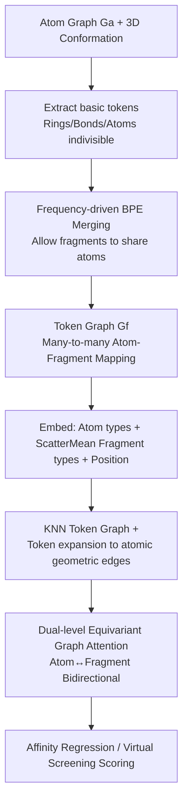

# h-MINT: Modeling Pocket-Ligand Binding with Hierarchical Molecular Interaction Network

**Conference**: ICLR 2026  
**OpenReview**: [https://openreview.net/forum?id=ajywV0kKXk](https://openreview.net/forum?id=ajywV0kKXk)  
**Code**: [https://github.com/Atomu2014/hmint](https://github.com/Atomu2014/hmint)  
**Area**: Computational Biology / Drug Discovery / Molecular Representation Learning  
**Keywords**: Protein-ligand binding, molecular tokenization, fragmented representation, hierarchical graph network, SE(3) equivariant, virtual screening  

## TL;DR
This paper proposes OverlapBPE, an overlapping molecular tokenization algorithm, along with h-MINT, a hierarchical molecular interaction network. By utilizing many-to-many mappings where "fragments can share atoms," it preserves chemical contexts such as aromaticity, chirality, and charge, outperforming existing state-of-the-art methods in affinity prediction, virtual screening, and high-throughput screening.

## Background & Motivation
**Background**: Precise modeling of protein-ligand binding is central to early-stage drug discovery (affinity prediction, virtual screening) and enzyme engineering. To characterize key interactions like H-bonds, $\pi$-stacking, and $\pi$-cationic interactions that only emerge in specific local environments, representations must express the molecular chemical environment. Mainstream approaches model molecules as atom-level graphs and process them with E(n)-equivariant or directional message-passing networks.

**Limitations of Prior Work**: (1) Pure atom-level tokens struggle to learn high-order chemical contexts such as stereochemistry, lone pairs, and conjugated systems; (2) Fragmentation methods (e.g., Principal Subgraph, predefined functional groups, BRICS) pack local contexts into coarse-grained units but **hard-partition molecules into disjoint subsets**. This naive division destroys chirality, aromatic bond integrity, and ionic states—the very factors that determine whether interactions occur.

**Key Challenge**: Boundaries of small molecule substructures are inherently **fuzzy and overlapping** (e.g., naphthalene can be seen as two benzene rings sharing 2 aromatic carbons). However, almost all existing hierarchical molecular networks only support **1-1 disjoint mapping** from atoms to fragments, failing to represent this overlap. Preserving aromatic integrity requires allowing fragments to overlap, but once they overlap, many-to-many mappings arise, which existing architectures cannot handle.

**Goal**: To break through from both the representation and architecture perspectives—requiring a tokenization method that preserves complete chemical context and allows overlapping fragments, and a network capable of processing the resulting many-to-many mappings while circulating information bidirectionally between atom and fragment scales.

**Core Idea**:
- **Data-driven + Overlapping Tokenization (OverlapBPE)**: Allows fragments to share atoms based on BPE frequency merging, with charge, aromaticity, and 3D conformation (chirality) explicitly encoded into token identifiers.
- **Overlapping-aware Hierarchical Equivariant Network (h-MINT)**: Uses dual-level (atom/fragment) attention to support many-to-many mappings, expanding fragment-level relations into atom-level geometric edges to achieve cross-scale bidirectional information flow while maintaining SE(3) equivariance.

## Method

### Overall Architecture
The method consists of two parts: first, OverlapBPE transforms the molecule from an atom graph to an **overlapping** token graph (bottom-up BPE merging, with aromatic rings/bonds/atoms as indivisible basic tokens), encoding chirality, charge, and aromatic states in token identifiers. Then, the "atoms + overlapping fragments + global nodes" are fed into h-MINT. Through dual-level equivariant attention, messages are passed bidirectionally between atom and fragment levels to predict affinity or screening scores.

### Key Designs

**1. OverlapBPE: Making fragment boundaries "fuzzy" to maintain chemical integrity.** Traditional fragmentation cuts molecules into disjoint sets, which may sever aromatic rings or lose ionic states. OverlapBPE addresses this by first fixing a set of basic tokens—including all single atoms, bonds, and rings in the training set—and prioritizing covering the graph with rings, then bonds, and finally atoms to ensure token set completeness and aromatic unit integrity. In the token graph $G^f=(V^f, E^f)$, "two tokens are connected if they share atoms," which is key to allowing overlap. Subsequently, bottom-up BPE is performed: enumerating all adjacent token pairs $C=\{\mathrm{Merge}(f_i,f_j)\}$, selecting the highest frequency $f^*$ from the training corpus to add to the vocabulary $\Phi_{comp}$, and replacing all occurrences in the corpus with super-nodes. Note that original tokens are **not removed from the graph** until all their adjacent candidates are merged, ensuring overlapping structures are preserved. Finally, the vocabulary is filtered by a frequency threshold to obtain $\Phi_{final}=\{f\in\Phi_{basic}\cup\Phi_{comp}\mid \mathrm{freq}(f)>t\}$. The decomposition of naphthalene into two benzene rings sharing 2 aromatic carbons is a direct result of this overlapping mechanism.

**2. Encoding chemical knowledge into token identifiers.** Overlap solely is insufficient; chemical context must be representable. OverlapBPE overlays 3D conformation information on the 2D graph during tokenization, assigning each token a unique **isomeric SMILES** as its vocabulary identifier—e.g., L-lactic acid and R-lactic acid are recorded as `C[C@H](O)C(=O)O` and `C[C@@H](O)C(=O)O`, natively embedding chirality into the vocabulary. Aromatic integrity is guaranteed by the dual mechanism of "aromatic rings as indivisible basic tokens + overlapping progressive merging to discover extended conjugated systems." Charges and aromatic atoms are carried by explicit identifiers, such as `[Cl-]` for negatively charged chlorine and `[n+]` for positively charged aromatic nitrogen. Compared to standard SMILES, which often omit these details on isolated atoms, these tokens explicitly retain all chemically significant attributes.

**3. Hierarchy Construction: Expanding token-level KNN relations into atom-level geometric edges.** h-MINT receives pocket-ligand pairs of atoms $(V^a_p,V^a_l)$, tokens $(V^f_p,V^f_l)$, and atom-token mappings $T$, adding a `<global>` node to each list to collect global information. The embedding layer sums atom type, fragment type aggregated via ScatterMean, and position encoding: $H^0=\mathrm{Embed}(V^a)+\mathrm{ScatterMean}(\mathrm{Embed}(V^f),T_{f2a})+\mathrm{Embed}(\mathrm{Pos}(V^a))$. At the token level, a KNN graph is built using the minimum inter-token atomic distance $\mathrm{dist}(f_i,f_j)=\min_{a_s\in f_i,a_t\in f_j}\mathrm{dist}(a_s,a_t)$ (global tokens aggregate pocket/ligand information and interconnect to exchange pairing info). Each token-level edge $(f_i,f_j)$ is then **expanded into several atom-level edges**—where each atom in $f_i$ connects only to the $k$ nearest atoms in $f_j$. This captures both short-range interactions within neighborhoods and long-range interactions bridged by token edges, making cross-scale information flow both flexible and controlled.

**4. Dual-level Equivariant Attention: Bidirectional atom-fragment message passing.** This is the core operator for handling many-to-many mappings. For a token edge and its expanded atomic edges, atom-level cross-attention is first calculated: scores $S_{i,j}[a_s,a_t]=\mathrm{MLP}(Q[a_s],K[a_t],\mathrm{RBF}(D[a_s,a_t]),e_{i,j})$ incorporate relative position RBFs and edge types $e_{i,j}$ (distinguishing intra/inter-molecular edges), with weights $\alpha_{i,j}$ obtained via Softmax over $a_t\in\mathrm{knn}(f_j,a_s)$. Token-level attention then averages the scores of all atomic edges expanded from the same token edge $S_{i,j}=\frac{1}{|\mathrm{knn}(f_i,f_j)|}\sum M_{i,j}[a_s,a_t]$, with $\beta_{i,j}$ derived via Softmax over $f_j\in\mathrm{KNN}(f_i)$. Messages are aggregated via two-level weighted summation $m_i[a_s]=\sum_{f_j}\beta_{i,j}\mathrm{MLP}(\sum_{a_t}\alpha_{i,j}[a_s,a_t]V[a_t])$. Finally, $H^l[a_s]\leftarrow H^{l-1}[a_s]+\mathrm{ScatterMean}(m_i[a_s],T_{f2a})$ uses ScatterMean to distribute information back to multiple fragments—it is this step that naturally compatibilizes the many-to-many structure where one atom belongs to multiple overlapping tokens. Combined with equivariant feed-forward layers and equivariant layer normalization, these are stacked into an SE(3)-equivariant Graph Transformer.

## Key Experimental Results

### Main Results

**PDBBind Affinity Prediction (Mean of 3 runs)**

| Model | RMSE ↓ | Pearson ↑ | Spearman ↑ |
|------|--------|-----------|------------|
| GET (Prev. Bi-level SOTA) | 1.430 | 0.586 | 0.575 |
| GET-PS (Main baseline) | 1.387 | 0.601 | 0.582 |
| **Ours (h-MINT)** | **1.295** | **0.640** | **0.625** |

**LBA Affinity Prediction**

| Model | RMSE ↓ | Pearson ↑ | Spearman ↑ |
|------|--------|-----------|------------|
| LEFTNet (Best atom-level) | 1.343 | 0.610 | 0.598 |
| GET-PS (Best bi-level) | 1.312 | 0.631 | 0.642 |
| **Ours** | **1.276** | **0.660** | **0.661** |

**DUD-E Zero-shot Virtual Screening (Trained on PDBBind only)**

| Model | AUC% | BEDROC% | EF@0.5% | EF@1% | EF@5% |
|------|------|---------|---------|-------|-------|
| DrugCLIP* | 81.39 | 45.96 | 34.27 | 29.01 | 10.18 |
| LigUnity* | 81.69 | 46.01 | 34.44 | 29.07 | 10.26 |
| **Ours\*** | **84.45** | **47.64** | **35.06** | **29.91** | **10.76** |

Significant leads in BEDROC (6.27 vs 4.34) and EF@0.5%/1% (7.01/5.20 vs 4.11/4.06) on LIT-PCBA demonstrate strong early enrichment capability.

### Ablation Study

**PubChem HTS Chirality Ablation (OverlapBPE + XGBoost only, logAUC[0.001,0.1])**

| Variant | Description | Performance |
|------|------|------|
| Ours (non-chiral) | Vocab without stereochemistry | Significantly lower |
| Ours (chiral) | Vocab with chirality | Best average rank, beats ChiRo / MolKGNN |

Comparison of three tokenization variants for GET (Murcko/BRICS/PS) also shows that tokenization directly impacts downstream accuracy, with OverlapBPE outperforming all predefined/PS schemes.

### Key Findings
- **Chirality information is essential**: The chiral vocabulary significantly outperforms the non-chiral one; even a simple Bag-of-Tokens feature with XGBoost can surpass GNNs specifically designed for chirality (like ChiRo, MolKGNN), with training and prediction completing in under 1 second.
- **Chemical context fidelity yields precise predictions**: In LBA case studies, OverlapBPE preserves the `[N+]` positive charge and benzene ring integrity, enabling the modeling of $\pi$-cationic interactions (error 0.56 vs 0.67 for PS tokenization).
- **Strong zero-shot generalization**: Training only on PDBBind leads across DUD-E/LIT-PCBA, suggesting overlapping tokenization captures transferable inductive biases.

## Highlights & Insights
- **"Fuzzy boundaries" as a key chemical intuition**: Abandoning the obsession that "molecules must be cut into disjoint blocks" and allowing fragments to share atoms is the fundamental premise for maintaining both aromaticity and ionic states—a counter-intuitive but essential design philosophy.
- **Synergistic design of representation and architecture**: The many-to-many mappings generated by OverlapBPE are naturally absorbed by h-MINT's ScatterMean distribution mechanism; the two are integrated rather than independent.
- **Efficiency of lightweight methods**: For HTS, Bag-of-Tokens + XGBoost without deep networks outperforms complex chiral GNNs, indicating that value primarily stems from the representation rather than model capacity.

## Limitations & Future Work
- Residues are still used as tokens on the pocket side; OverlapBPE has not been applied to proteins, leaving the impact of asymmetric granularity across the protein-ligand interface to be explored.
- Expanding tokens into atom-level edges increases the edge count; while the authors control scale by connecting only $k$ nearest atoms, scalability on ultra-large complexes or pockets requires further validation.
- The vocabulary is mined based on training corpus frequency; coverage and generalization for novel scaffolds or rare functional groups absent from the training set remains an open question.
- In HTS scenarios, using XGBoost bypasses h-MINT; there is potential for optimizing the efficiency of end-to-end hierarchical models in large-scale screening.

## Related Work & Insights
- **Fragment Tokenization Lineage**: Ranges from manual junction-tree/predefined fragment libraries (Jin et al.) to data-driven frequent subgraph mining, such as PS-VAE (Principal Subgraph, Kong et al. 2022b). This work directly benchmarks against PS-VAE, differing by enriching atomic attributes, introducing 3D stereochemistry, and allowing overlaps.
- **Molecular Interaction Modeling**: Atom-level E(n)-equivariant/directional message passing (SchNet, EGNN, LEFTNet, etc.) excels at local physics but is often limited to a single resolution. GET (Kong et al. 2024) serves as a bi-level SOTA baseline for comparison. h-MINT's delta lies in the atom-token overlap mechanism + expanding token relations into atomic geometry edges to bridge bidirectional cross-scale information flow.
- **Virtual Screening**: Benchmarked against contrastive learning frameworks like DrugCLIP and LigUnity, h-MINT can be used independently or as a lightweight adapter on top of UniMol pretrained encoders.

## Rating
- **Novelty**: ⭐⭐⭐⭐⭐ —— "Overlapping fragment tokenization" challenges the fundamental assumption of the fragmentation paradigm (disjoint partitioning), complemented by an equivariant hierarchical network supporting many-to-many mappings. The representation and architecture are both innovative and self-consistent.
- **Experimental Thoroughness**: ⭐⭐⭐⭐ —— Covers three tasks across multiple datasets: affinity prediction (PDBBind/LBA), virtual screening (DUD-E/LIT-PCBA), and HTS (PubChem), including chirality ablations and chemical context case studies. Protein-side tokenization and scalability for ultra-large systems could be further explored.
- **Writing Quality**: ⭐⭐⭐⭐ —— Motivation, contradiction, and methodology follow a clear logic with complete formulas and diagrams. Some details (position encoding tables, algorithms) being relegated to the appendix slightly increases reading jumps.
- **Value**: ⭐⭐⭐⭐⭐ —— Directly addresses the core pain point of "chemical context fidelity" in drug discovery. Improvements are clear (Affinity +2~4%, Screening +1~3%) with strong zero-shot generalization, offering practical significance for structure-based drug design. Code and checkpoints are open-sourced.

<!-- RELATED:START -->

## Related Papers

- [\[ICLR 2026\] Pallatom-Ligand: an All-Atom Diffusion Model for Designing Ligand-Binding Proteins](pallatom-ligand_an_all-atom_diffusion_model_for_designing_ligand-binding_protein.md)
- [\[ICLR 2026\] Physically Valid Biomolecular Interaction Modeling with Gauss-Seidel Projection](physically_valid_biomolecular_interaction_modeling_with_gauss-seidel_projection.md)
- [\[ICLR 2026\] Quantifying Cross-Attention Interaction in Transformers for Interpreting TCR-pMHC Binding](quantifying_cross-attention_interaction_in_transformers_for_interpreting_tcr-pmh.md)
- [\[ICLR 2026\] Hierarchical Multi-Scale Molecular Conformer Generation](hierarchical_multi-scale_molecular_conformer_generation.md)
- [\[ICLR 2026\] I2Mole: Interaction-aware Invariant Molecular Learning for Generalizable Drug-Drug Interaction Prediction](i2mole_interaction-aware_invariant_molecular_learning_for_generalizable_property.md)

<!-- RELATED:END -->
