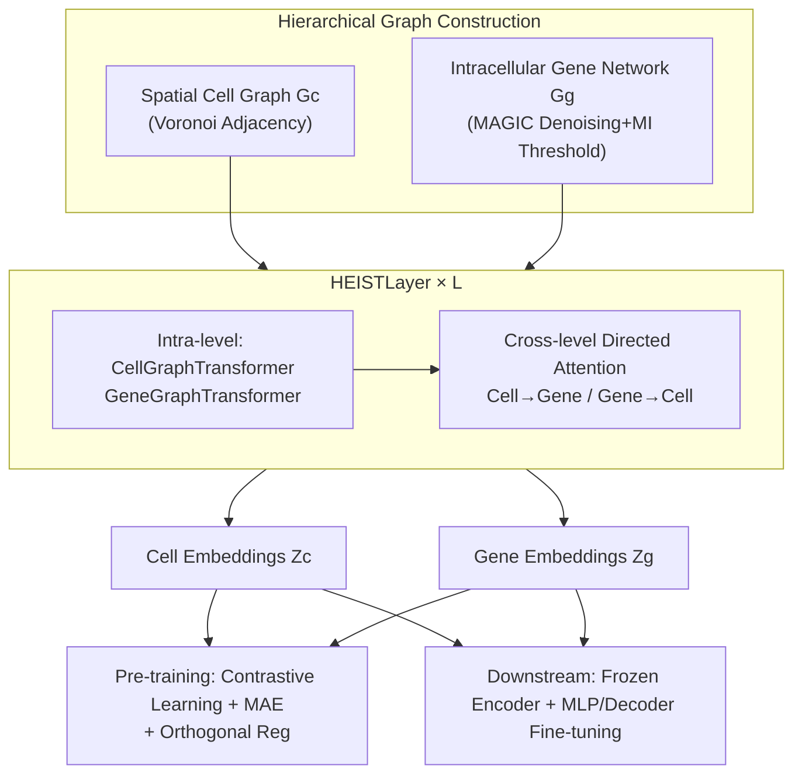

# HEIST: A Graph Foundation Model for Spatial Transcriptomics and Proteomics Data

**Conference**: ICLR 2026  
**Code**: [https://github.com/Graph-and-Geometric-Learning/HEIST](https://github.com/Graph-and-Geometric-Learning/HEIST)  
**Area**: Computational Biology / Spatial Omics Foundation Models / Graph Neural Networks  
**Keywords**: Spatial transcriptomics, spatial proteomics, hierarchical graph Transformer, gene co-expression network, cross-level message passing, self-supervised pre-training  

## TL;DR
HEIST models tissue as a two-layer hierarchical graph consisting of a "spatial cell graph + intracellular gene co-expression networks." Through cross-level directed attention, gene representations are modulated by the spatial microenvironment while cell representations are shaped by internal transcriptional states. This approach overcomes fixed gene vocabularies, enables zero-shot migration to proteomics, and sets new SOTA performance in clinical prediction, cell annotation, and gene imputation tasks.

## Background & Motivation
**Background**: Single-cell RNA sequencing (scRNA-seq) allows for studying gene expression at single-cell resolution but loses the spatial location of cells within tissues. Spatial transcriptomics (e.g., MERFISH, Xenium) and spatial proteomics (e.g., CODEX, MIBI) preserve both spatial coordinates and molecular counts, enabling the characterization of tissue architecture, cell-cell communication, and the tumor microenvironment.

**Limitations of Prior Work**: Current foundation models have distinct limitations. Single-cell foundation models like scGPT, scFoundation, and CellPLM either ignore cell-cell spatial structures or are locked into **predefined gene vocabularies**, failing to generalize to unseen genes or protein markers. Graph-based methods like GraphST and STAGATE capture spatial neighborhoods but are task-specific and non-transferable. scGPT-spatial treats all genes in a cell as a fully connected graph, discarding the inductive bias of gene co-expression.

**Key Challenge**: Intracellular gene regulatory programs and extracellular spatial microenvironments are coupled—the same gene should be encoded differently under different microenvironments. However, no model has unified the "molecular level" and "tissue level" in a framework allowing bidirectional influence, and none can migrate from transcriptomics to proteomics without retraining.

**Goal**: To build the first spatial omics foundation model that explicitly models both spatial proximity and intracellular co-expression networks while supporting cross-modal transfer to proteomics.

**Core Idea**: **Model tissue as a two-layer hierarchical graph**. The top layer is a spatial cell graph, where each cell node expands downward into a gene co-expression network. **Cross-level message passing** allows the two layers to shape each other. By **dynamically computing gene embeddings from co-expression networks** instead of using a fixed vocabulary, out-of-the-box generalization to unseen genes/proteins is achieved.

## Method

### Overall Architecture
HEIST takes a set of hierarchical graphs as input: one spatial cell graph $G_c(C,E,P,T)$ (cells, spatial edges, coordinates, cell types) and one gene co-expression network $G_g^{t_k}(V, E^{t_k}, X_k)$ for each cell $k$. These graphs are fed into $L$ stacked HEISTLayers. Each layer performs **intra-level message passing** (updating cell and gene graphs separately) followed by **cross-level directed attention** (bidirectional interaction between cells and genes), ultimately producing cell embeddings $Z_c$ and gene embeddings $Z_g$. Pre-training is driven by joint spatial-aware contrastive learning and masked autoencoding objectives.

### Key Designs

**1. Dual-layer Hierarchical Graph Construction: Integrating "Spatial Location" and "Gene Co-expression" into one graph.** During preprocessing, outliers are removed, data is normalized, and highly variable genes are retained. MAGIC is used for graph diffusion denoising to mitigate spatial transcriptomics-specific dropout. Cells are then grouped by type (labels or Leiden clustering), and mutual information (MI) is calculated for gene pairs within each group. Pairs exceeding a threshold $\tau$ are connected, resulting in $|T|$ co-expression networks with MI priors. On the spatial side, Voronoi tessellation is applied to cell coordinates, with edges connecting adjacent polygons. Each cell is linked to the co-expression network of its respective cell type, forming a hierarchical structure.

**2. Cross-level Directed Attention: Microenvironment modulates genes, while transcriptional states shape cells.** Each HEISTLayer updates intermediate representations $\tilde{H}_c^{(l)}, \tilde{H}_g^{(l)}$ via intra-level graph transformers, then stitches them using directed cross-level attention:
$$\text{CrossMP}(H_{to}, H_{from}) = \left(\frac{\langle H_{to}W_q,\, H_{from}W_k\rangle}{\sqrt{d}}\right)\cdot (H_{to}W_v)$$
For genes, $H_g^{(l)} = \text{CrossMP}(\tilde{H}_g^{(l)}, \tilde{H}_c^{(l),\text{repeat}})$—each gene receives information from its parent cell, allowing spatial context to modulate gene-level representations. For cells, $H_c^{(l)} = \text{CrossMP}(\tilde{H}_c^{(l)}, \bar{H}_g^{(l)})$, where $\bar{H}_g^{(l)}$ is an aggregation (MEAN or DiffPool) of intracellular gene embeddings. This **directed** design preserves distinct biological roles without collapsing them.

**3. Dynamic Gene Embeddings vs. Fixed Vocabulary: To generalize to unseen genes and protein markers.** Instead of a "gene-to-vector" lookup table, HEIST initializes gene embeddings using rank-based and sinusoidal positional encodings, which are updated dynamically via message passing in the co-expression graph. Since representations are grounded in "co-expression dynamics + spatial context" rather than gene identity, the model can **construct co-expression networks directly from observed protein markers and include all markers without retraining** for proteomics.

**4. Joint Pre-training Objectives: Contrastive + MAE + Orthogonal Regularization.** The contrastive loss pulls together cell/gene pairs of the same type within a spatial radius $r$ while pushing different types apart. It includes a cell↔gene cross-level alignment term. MAE randomly masks cell coordinates and gene expressions, using MSE for reconstruction to force the model to recover space from signals and predict expression from spatial cues. The final objective is balanced by a learnable scalar $\gamma$ and includes an orthogonal regularization $\lambda(\|I_d - Z_c^\top Z_c\|_F^2 + \|I_d - Z_g^\top Z_g\|_F^2)$ to decorrelate dimensions and prevent representation collapse:
$$L = \sigma(\gamma)\cdot L_{\text{contrastive}} + (1-\sigma(\gamma))\cdot L_{\text{mae}} + \lambda(\|I_d - Z_c^\top Z_c\|_F^2 + \|I_d - Z_g^\top Z_g\|_F^2)$$
Due to sparse modeling avoiding full self-attention, HEIST is 8× faster than scGPT-spatial and 48× faster than scFoundation.

## Key Experimental Results

Pre-training: 22.3M cells / 124 tissue slices / 15 organs / 2 technologies (MERFISH, Xenium). Downstream evaluation covers 4 tasks × 4 technologies × 5 organs.

### Main Results

Clinical Outcome Prediction (AUC-ROC, including proteomics datasets):

| Model | Placenta-Condition | Charville-Outcome | UPMC-Recurrence | DFCI-Recurrence | Melanoma-Response |
|-------|-------|-------|-------|-------|-------|
| STAGATE | 0.578 | 0.657 | 0.602 | 0.659 | 0.533 |
| GraphST | 0.659 | 0.828 | 0.582 | 0.683 | 0.644 |
| scFoundation | 0.601 | 0.713 | 0.678 | 0.689 | 0.500 |
| CellPLM (unaligned) | 0.682 | 0.744 | 0.681 | 0.667 | 0.580 |
| scGPT-spatial (unaligned) | 0.602 | 0.834 | 0.717 | 0.676 | 0.600 |
| **HEIST** | **0.769** | **0.861** | **0.835** | **0.929** | **0.866** |
| HEIST Gain % | +12.7 | +3.2 | -3.3 | +5.2 | +44.3 |

Ours achieved SOTA in six out of seven evaluation scenarios. In predicting immunotherapy response in melanoma, the Gain reached 44.3%.

Cell Type Annotation (F1): HEIST was best in four out of five datasets, with significant gains in UPMC (+12.2%) and DFCI (+28.7%, +17.9%). Gene Imputation (Pearson): After fine-tuning, Placenta 0.821 (+2.5%) and Skin 0.807 (+9.0%) outperformed all baselines.

### Ablation Study

| Variant | Charville-Outcome | Skin-Imputation | SEA-Cell Class. |
|---------|---------|---------|---------|
| **HEIST Full** | **0.861** | **0.807** | **0.995** |
| w/o Spatial Graph (No Hierarchy) | 0.596 | 0.345 | 0.179 |
| w/o Gene Graph (No Hierarchy) | 0.764 | 0.173 | 0.194 |
| w/o Pre-training | 0.500 | 0.623 | 0.784 |
| w/o Cross-level MP | 0.625 | 0.531 | 0.955 |
| w/o Positional Encoding | 0.523 | 0.458 | 0.220 |
| w/o Contrastive Learning | 0.623 | 0.536 | 0.966 |
| w/o MAE | 0.658 | 0.495 | 0.162 |

### Key Findings
- **Hierarchical modeling and spatial information are critical**: Removing either the spatial or gene graph layer leads to significant performance collapse.
- **Cross-level MP and contrastive learning significantly enhance cell classification**, while MAE is vital for gene imputation and classification.
- **Pre-training is crucial for clinical prediction** (w/o Pre-training degrades to random 0.500 on Charville-Outcome) due to skewed label distributions.
- HEIST embeddings can resolve three spatial-information-driven subclusters within L4-IT cells, which other models collapse.

## Highlights & Insights
- **Engineering biological intuition**: The directed attention allows gene representations to adapt to the spatial context of the parent cell, which fixed-vocabulary models cannot achieve.
- **Elegant Zero-shot Cross-modal Transfer**: By anchoring representations in co-expression dynamics rather than alignment tricks, the model overcomes the "vocabulary curse."
- **Interpretability as a Product**: High attention scores correspond to known ligand-receptor communication and pathological microenvironments, providing utility for biological discovery.
- **Efficiency**: Sparse modeling enables an 8×/48× speedup, making foundation models for large-scale spatial omics practical.

## Limitations & Future Work
- **Zero-shot gene imputation remains weak** (Placenta 0.574, Skin 0.350), indicating strong dataset-specific gene expression patterns. Decoder fine-tuning is necessary.
- Co-expression networks depend on cell typing and MI thresholds; construction quality impacts downstream results.
- Training data overlaps with scGPT-spatial/CellPLM; stricter isolation for out-of-distribution evaluation is needed.
- Only pre-trained on MERFISH/Xenium; coverage of more platforms (e.g., Visium spot-level) could be expanded.

## Related Work & Insights
- **Single-cell Foundation Models**: scGPT and CellPLM demonstrate the value of self-supervision, but HEIST addresses their "fixed vocabulary + spatial ignorance" bottlenecks.
- **Spatial Graph Methods**: GraphST and STAGATE capture spatial neighborhoods via GNNs but are non-transferable; HEIST incorporates these biases into a transferable foundation model framework.
- **Hierarchical Graph Learning**: Differentiable pooling and directed attention are organized into a clear biological structure, serving as a template for other problems requiring multi-level coupling (e.g., molecule-cell-tissue).

## Rating
- **Novelty**: ⭐⭐⭐⭐⭐ First to explicitly model spatial proximity + intracellular co-expression while enabling zero-shot proteomics transfer. The hierarchical architecture is highly original.
- **Experimental Thoroughness**: ⭐⭐⭐⭐ Comprehensive tasks and organs; sets 6 SOTA benchmarks. Weakness in zero-shot imputation and data isolation.
- **Writing Quality**: ⭐⭐⭐⭐ Clear motivation-method-experiment pipeline; good alignment between formulas and biological intuition.
- **Value**: ⭐⭐⭐⭐⭐ Solves key spatial omics pain points; cross-modal transfer and interpretability are highly valuable for clinical and biological research.

<!-- RELATED:START -->

## Related Papers

- [\[ICML 2025\] SToFM: a Multi-scale Foundation Model for Spatial Transcriptomics](../../ICML2025/computational_biology/stofm_a_multi-scale_foundation_model_for_spatial_transcriptomics.md)
- [\[ICLR 2026\] ProTDyn: A Foundation Protein Language Model for Thermodynamics and Dynamics Generation](protdyn_a_foundation_protein_language_model_for_thermodynamics_and_dynamics_gene.md)
- [\[ICLR 2026\] A Foundation Model with Multi-Variate Parallel Attention to Generate Neuronal Activity](a_foundation_model_with_multi-variate_parallel_attention_to_generate_neuronal_ac.md)
- [\[ICLR 2026\] Towards All-atom Foundation Models for Biomolecular Binding Affinity Prediction](towards_all-atom_foundation_models_for_biomolecular_binding_affinity_prediction.md)
- [\[CVPR 2026\] FEAST: Fully Connected Expressive Attention for Spatial Transcriptomics](../../CVPR2026/computational_biology/feast_fully_connected_expressive_attention_for_spatial_transcriptomics.md)

<!-- RELATED:END -->
