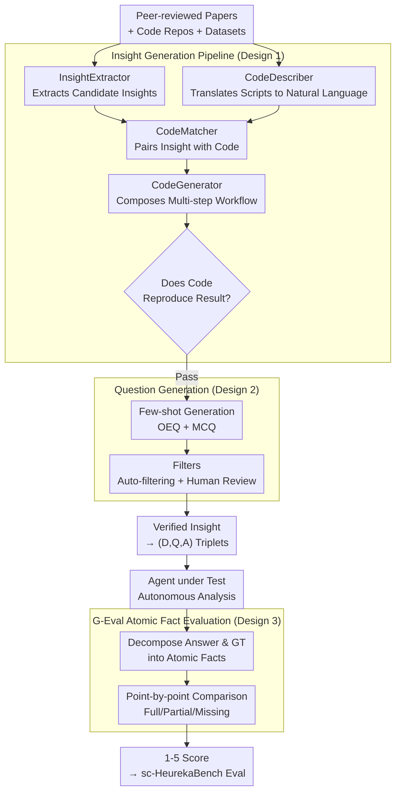

# HeurekaBench: A Benchmarking Framework for AI Co-scientist

**Conference**: ICLR 2026  
**arXiv**: [2601.01678](https://arxiv.org/abs/2601.01678)  
**Code**: [brbiclab.epfl.ch/projects/heurekabench](https://brbiclab.epfl.ch/projects/heurekabench)  
**Area**: Computational Biology  
**Keywords**: AI co-scientist, benchmark, scientific agents, single-cell biology, open-ended evaluation

## TL;DR
Ours proposes HeurekaBench, a framework for building evaluation benchmarks based on real-world scientific workflows. It extracts verifiable scientific insights from papers through a multi-LLM pipeline and generates open-ended research questions to evaluate the end-to-end capabilities of AI co-scientists in data-driven discovery.

## Background & Motivation
The advancement of LLM reasoning has led to numerous scientific agents (e.g., CellVoyager, Biomni) designed to autonomously analyze experimental data and generate scientific insights. However, existing benchmarks suffer from fundamental **Limitations of Prior Work**: most only test static knowledge retrieval or single-step computation (e.g., "How many miRNAs are significant after p ≤ 0.05?"). These "instruction-following" tasks differ significantly from the role of a true co-scientist, who should autonomously plan analysis workflows, explore datasets, and generate new discoveries. While BaisBench attempts to generate research questions, it relies on a single LLM, leading to unreliable quality. The **Key Challenge** is that current benchmarks cannot evaluate open-ended, data-driven scientific discovery. The **Key Insight** of this work is to root benchmark construction in the scientific process itself—extracting verified scientific insights from peer-reviewed papers as the ground truth for evaluation.

## Method

### Overall Architecture
The **Core Problem** HeurekaBench addresses is ensuring the benchmark is grounded in real scientific processes rather than synthetic tasks. The **Mechanism** decomposes benchmark construction into three consecutive stages: first, extracting candidate insights from peer-reviewed papers and verifying them with code (Insight Generation Pipeline); then, converting verified insights into Open-ended Questions (OEQ) and Multiple Choice Questions (MCQ) pairs (Question Generation); finally, allowing the agent under test to design multi-step analyses to answer, followed by an LLM Judge decomposing answers into atomic facts for scoring against ground truth (G-Eval Atomic Fact Evaluation). The **Core Idea** is to use "conclusions reproducible via code in papers" as the trusted gold standard. This pipeline yields triplets of $(D, Q, A)$ (dataset, research question, gold standard answer).

### Key Designs

**1. Insight Generation Pipeline: Filtering via Code Reproducibility**
Unlike prior work like BaisBench, which relies on single LLM generation without verification, HeurekaBench uses four LLM components: `InsightExtractor` (GPT-4o) extracts candidate insights with structured fields (summary, technique, evidence); `CodeDescriber` translates repository scripts into natural language; `CodeMatcher` pairs insights with relevant code; and `CodeGenerator` (Claude-3.5-Sonnet) assembles scripts into a runnable verification workflow. Insights are retained only if the code successfully reproduces the conclusion, ensuring ground truth credibility through execution rather than appearance.

**2. Question Generation: Converting Insights into OEQ and MCQ**
For each verified insight, few-shot prompting generates two question types: Open-ended Questions (OEQ) that allow multiple analysis paths, reflecting real research openness, and Multiple Choice Questions (MCQ) with high-quality distractors for lightweight benchmarking. Post-generation filters remove simple questions solvable via LLM internal knowledge and human review eliminates hallucinations or duplicates.

**3. G-Eval Atomic Fact Evaluation: Fact-based Decomposition**
To address the lack of unique answers in open-ended tasks, HeurekaBench employs GPT-4o as a Judge to score answers (1-5). Before scoring, both the response and ground truth are decomposed into atomic facts (conditions, trends, conclusions). Full points are awarded only when all ground truth facts are present without contradiction; additional non-contradictory findings do not trigger penalties, rewarding data-driven discovery over rote memorization.

In the single-cell biology domain, this is instantiated as **sc-HeurekaBench**: starting from 22 Nature/Cell papers, it yields 41 verified insights across 13 papers, producing 50 OEQs and 50 MCQs. The pipeline reliability is evidenced by `InsightExtractor` findings having 44/50 strong correlations on FlyBase and `CodeMatcher` achieving a 74.6% average file matching accuracy.

## Key Experimental Results

### Main Results

| Agent | OEQ Correctness [1-5] | MCQ Accuracy (%) | MCQ Recall (%) | MCQ Precision (%) |
| :--- | :--- | :--- | :--- | :--- |
| BixBench-Agent | 2.34 | 44.44 | 80.56 | 62.96 |
| CellVoyager | 2.03 | 27.78 | 38.89 | 32.41 |
| Biomni | 2.31 | **50.00** | **88.24** | **76.96** |

### Ablation Study (Planner Ablation for Biomni Agent)

| Model | Open Source | OEQ Correctness | MCQ Accuracy (%) |
| :--- | :--- | :--- | :--- |
| MedGemma-27B | ✓ | 1.53 | 20.41 |
| Qwen2-32B | ✓ | 1.47 | 40.00 |
| Qwen2.5-72B-instruct | ✓ | 1.85 | 46.00 |
| Llama-3-70B | ✓ | 2.08 | 42.00 |
| Claude-3.5-Sonnet | ✗ | **2.58** | 44.00 |

### Key Findings
- Biomni and BixBench-Agent outperform CellVoyager, suggesting flexible agent loops are better for constructing robust workflows.
- Claude-3.5-Sonnet as a Planner significantly outperforms other models (2.58 vs 2.08), showing frontier closed-source models still hold a lead in co-scientist tasks.
- **End-critic** (adding a critic at the end of the agent loop) significantly improves open-source LLM performance, raising low-tier scores from 1.32 to 1.91.
- Parameter scale and reasoning capabilities (e.g., thinking modes) are critical for co-scientist performance.

## Highlights & Insights
- The approach of "rooting the benchmark in the scientific process itself" by using reproducibility as a verification standard is highly effective.
- The modular design of the multi-LLM pipeline allows the framework to be transferred to other scientific domains.
- The End-critic strategy can bridge the gap between open-source and closed-source models by up to 22%, offering a lightweight but effective improvement.

## Limitations & Future Work
- Currently instantiated only in single-cell biology; generalization to chemistry or physics requires further validation.
- The sc-HeurekaBench scale (50 OEQ + 50 MCQ) might be too small for fine-grained capability diagnostics.
- The verification process still requires human involvement (running code, checking results), suggesting room for increased automation.

## Related Work & Insights
- **vs BaisBench**: While BaisBench uses a single LLM without verification, HeurekaBench ensures reliability via multi-LLM pipelines and code execution.
- **vs BixBench**: BixBench focuses on computational questions; whereas HeurekaBench tests open-ended scientific exploration.

## Rating
- **Novelty**: ⭐⭐⭐⭐ Innovative framework rooted in reproducibility.
- **Experimental Thoroughness**: ⭐⭐⭐⭐ Detailed multi-dimensional ablations, though dataset size is limited.
- **Writing Quality**: ⭐⭐⭐⭐⭐ Clear structure and excellent visualizations.
- **Value**: ⭐⭐⭐⭐ Provides a significant evaluation framework for AI for Science.

## Related Papers

- [\[ICLR 2026\] PoseX: AI Defeats Physics-based Methods on Protein Ligand Cross-Docking](posex_ai_defeats_physics-based_methods_on_protein_ligand_cross-docking.md)
- [\[ICLR 2026\] Drugging the Undruggable: Benchmarking and Modeling Fragment-Based Screening](drugging_the_undruggable_benchmarking_and_modeling_fragment-based_screening.md)
- [\[ICML 2026\] Protein Fold Classification at Scale: Benchmarking and Pretraining](../../ICML2026/computational_biology/protein_fold_classification_at_scale_benchmarking_and_pretraining.md)
- [\[ICLR 2026\] FragFM: Hierarchical Framework for Efficient Molecule Generation via Fragment-Level Discrete Flow Matching](fragfm_hierarchical_framework_for_efficient_molecule_generation_via_fragment-lev.md)
- [\[ICLR 2026\] SAVE: A Generalizable Framework for Multi-Condition Single-Cell Generation with Gene Block Attention](save_a_generalizable_framework_for_multi-condition_single-cell_generation_with_g.md)

<!-- RELATED:END -->

<!-- RELATED:START -->

## Related Papers

- [\[ICLR 2026\] PoseX: AI Defeats Physics-based Methods on Protein Ligand Cross-Docking](posex_ai_defeats_physics-based_methods_on_protein_ligand_cross-docking.md)
- [\[ICLR 2026\] Drugging the Undruggable: Benchmarking and Modeling Fragment-Based Screening](drugging_the_undruggable_benchmarking_and_modeling_fragment-based_screening.md)
- [\[ICML 2026\] Protein Fold Classification at Scale: Benchmarking and Pretraining](../../ICML2026/computational_biology/protein_fold_classification_at_scale_benchmarking_and_pretraining.md)
- [\[ICLR 2026\] FragFM: Hierarchical Framework for Efficient Molecule Generation via Fragment-Level Discrete Flow Matching](fragfm_hierarchical_framework_for_efficient_molecule_generation_via_fragment-lev.md)
- [\[ICLR 2026\] SAVE: A Generalizable Framework for Multi-Condition Single-Cell Generation with Gene Block Attention](save_a_generalizable_framework_for_multi-condition_single-cell_generation_with_g.md)

<!-- RELATED:END -->
