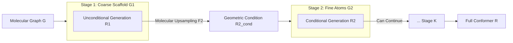

# Hierarchical Multi-Scale Molecular Conformer Generation

**Conference**: ICLR 2026  
**OpenReview**: [https://openreview.net/forum?id=uYlNjHC7ag](https://openreview.net/forum?id=uYlNjHC7ag)  
**Code**: [https://github.com/Taserita/MSGEN-Full](https://github.com/Taserita/MSGEN-Full)  
**Area**: Computational Biology / Molecular Conformer Generation / Diffusion Generative Models  
**Keywords**: Molecular Conformer Generation, Multi-scale Hierarchical Generation, Geometric Guidance, Molecular Upsampling, Diffusion Models, Plug-and-play Framework  

## TL;DR
MSGEN decomposes molecular conformer generation into a multi-stage hierarchical process from "coarse scaffold to fine atoms." It utilizes the positions of key substructures generated in previous stages as geometric guidance and incorporates "molecular upsampling" that respects chemical connectivity to bridge scale gaps. This plug-and-play framework enables various generative models like GeoDiff, ET-Flow, and EBD to produce more stable and chemically reasonable conformations.

## Background & Motivation
**Background**: Molecular conformer generation (predicting 3D geometry from 2D molecular graphs) is a fundamental task in drug discovery and material design. Recently, deep generative models such as diffusion models (GeoDiff), torsion diffusion (TorsionDiff), and flow matching (ET-Flow) have been able to produce diverse and accurate conformations.

**Limitations of Prior Work**: Most existing methods operate at a **single scale**—either denoising atom coordinates directly or modeling local geometry like torsion angles, neglecting the natural hierarchical organization of molecules. Even works introducing structural priors have flaws: SubgDiff preserves local connectivity by denoising within subgraphs but disrupts global consistency; fragment-level methods (e.g., EBD) retain coarse-grained features for coarse-to-fine generation but **treat all fragments equally**, ignoring differences in functional importance and conformational flexibility.

**Key Challenge**: Molecules are not uniform clouds of atoms; rigid ring systems and heavy-atom scaffolds serve as "anchors" defining the overall geometric distribution. The spatial arrangement of flexible side chains is often **conditional** on the positions of these key substructures. Existing generators lack explicit constraints on these key substructures, leading to conformations that are "locally legal but globally distorted." The authors validated this with a preliminary experiment (Table 1): using ground-truth positions of heavy-atom scaffolds as geometric guidance improved COV-R from 64% to 99.58% and reduced MAT-R from 1.14 to 0.50, far surpassing local or fragment-level guidance.

**Goal**: Transform this geometric guidance from "key substructure positions" into an available inductive bias for generation—the difficulty lies in the fact that ground-truth guidance is unavailable during inference when only the molecular graph is provided.

**Core Idea**: **Hierarchical Multi-Scale Generation**—defining a nested sequence of subgraphs $G_1 \subset G_2 \subset \cdots \subset G_K = G$. Each fine-scale stage uses the structure **generated by itself** in the previous coarse-scale stage as geometric guidance. "Molecular upsampling" is employed to align coarse-scale coordinates into conditional inputs for the fine scale, propagating spatial constraints from the scaffold level step-by-step.

## Method

### Overall Architecture
MSGEN is a **plug-and-play multi-stage framework** wrapped around existing generative models. Given a molecular graph, it first generates the coordinates of the coarsest key substructures (e.g., heavy-atom scaffold), then converts them into geometric conditions for the next stage via molecular upsampling, refining until all atoms (e.g., hydrogen atoms) are completed. Each stage is an independent generative model (diffusion or flow matching), linked by the sequence: "previous stage output → upsampling → current stage condition." The main experiments utilize two stages (heavy-atom scaffold + hydrogens) but can be extended to three stages (Murcko scaffold rings + heavy atoms + hydrogens).

### Key Designs

**1. Multi-scale Hierarchical Conditional Generation: Using previous outputs as geometric guidance.** The framework decomposes the conformer distribution into $p_{\theta_1}(R^1|G^1)$ (unconditional first stage) and subsequent $p_{\theta_k}(R^k|G^k, R^{k-1})$. Each stage uses an independent forward diffusion process $q_k(R^k_t|R^k_0)=\mathcal{N}(R^k_t;\sqrt{\bar\alpha^k_t}R^k,(1-\bar\alpha^k_t)I)$, allowing distributions to be tailored for different scales. During reverse denoising, the mean network of subsequent stages takes an extra geometric condition $R^k_{cond}=F_k(R^{k-1},G^{k-1},G^k)$ derived from the previous level: $p_{\theta_k}(R^k_{t-1}|G^k,R^k_t,R^k_{cond})$. During sampling, conditions are computed using $\hat R^{k-1}$ **obtained from sampling** the previous stage, passing spatial constraints downstream. This design is decoupled from specific generators like DDPM, score matching, or flow matching.

**2. Molecular Upsampling: Anchor-based coordinate completion respecting chemical connectivity.** Directly using coarse-scale $R^{k-1}$ as a condition faces scale mismatch ($m$ coarse atoms vs. $n$ fine atoms). Interpolation or transposed convolutions are unsuitable for continuous 3D molecules. The authors propose completion along the chemical graph: first, perform **topological sorting** (Algorithm 1) starting from boundary atoms to obtain an upsampling order $O$, ensuring each atom has localized neighbors and no cycles. Then, assign coordinates to each fine atom sequentially (Algorithm 2) by using the mean ofLocalized neighbors as an anchor, plus a controlled random perturbation:
$$R_{cond}[i]=\frac{1}{|N(i)\cap P|}\sum_{j\in N(i)\cap P}R_j + \tau\cdot d_i,\quad d_i\sim\mathcal{N}(0,I),$$
where $\tau$ controls the sampling radius and $d_i$ introduces spatial diversity while maintaining structural consistency.

**3. Condition Augmentation: Simulating inference noise during training to eliminate distribution shift.** At training time, conditions are constructed using ground truth $R^{k-1}_0$, but at inference, only sampled approximations $\hat R^{k-1}$ are available. This deviation can accumulate across stages. To address this, the authors inject controlled noise into ground-truth coarse structures during training: choosing a small step $s$, perturbing $R_s=\sqrt{\bar\alpha^{k-1}_s}R^{k-1}_0+\sqrt{1-\bar\alpha^{k-1}_s}\,\varepsilon$, then passing it through upsampling $R^k_{cond}=F_k(R_s,G^{k-1},G^k)$. This allows the fine-scale model to learn conditioning on "controlled variants of the coarse structure."

**4. Decoupled Hierarchical ELBO Training Objective.** The authors prove the evidence lower bound (ELBO) for the framework under condition augmentation (Proposition 1). The key conclusion is that the ELBO **can be decoupled by stage**, allowing each stage to be trained independently using standard denoising loss: $L(\theta_k)=\mathbb{E}_{t,R^k_0,\varepsilon}[\|\varepsilon-\varepsilon_{\theta_k}(R^k_t,G^k,R^k_{cond},t)\|]$. This makes multi-stage training theoretically grounded yet engineering-wise simple.

## Key Experimental Results

### Main Results
Geometric evaluation on GEOM-Drugs ($\delta=1.25$Å), where MSGEN consistently improves backbone models:

| Model | COV-R Mean↑ | MAT-R Mean↓ | COV-P Mean↑ | MAT-P Mean↓ |
|------|------|------|------|------|
| RDKit | 45.74 | 1.5376 | 54.79 | 1.3341 |
| ConfGF | 62.15 | 1.1629 | 23.42 | 1.7219 |
| GeoDiff | 87.86 | 0.8686 | 60.17 | 1.1871 |
| **GeoDiff+MSGEN** | **90.41** | **0.8424** | **66.26** | **1.1217** |

Chemical property MAE (QM9 subset, eV): GeoDiff's average energy error $\bar E$ 0.2597 → **0.1795**, HOMO-LUMO gap $\triangle\epsilon$ 0.3091 → **0.2035**, all decreased.

### Ablation Study
Cross-backbone + Multi-stage (GEOM-Drugs):

| Backbone | Variant | COV-R Mean↑ | MAT-R Mean↓ |
|------|------|------|------|
| GeoDiff | Baseline | 87.86 | 0.8686 |
| GeoDiff | +MSGEN(2-stage) | 90.41 | 0.8424 |
| GeoDiff | +MSGEN(3-stage) | **91.05** | **0.8410** |
| ET-Flow | Baseline | 74.47 | 0.5514 |
| ET-Flow | +MSGEN(2-stage) | 80.50 | 0.4579 |
| ET-Flow | +MSGEN(3-stage) | **81.91** | **0.4363** |
| EBD | Baseline | 92.10 | 0.8292 |
| EBD | +MSGEN(2-stage) | 91.92 | 0.8257 |

Step-by-stage hierarchical ablation (quality of coarse layer atoms): From scratch COV-R 87.86 → After Stage 1 89.17 → After Stage 2 90.41, showing progressive improvement.

### Key Findings
- **Plug-and-play & Universal**: It brings improvements across four generative paradigms: GeoDiff (DDPM), ConfGF (score matching), ET-Flow (flow matching), and EBD (blurring diffusion), with the largest MAT-R reduction on ET-Flow (0.55 → 0.44).
- **More Chemical Priors = Better**: 3-stage (adding Murcko scaffold) consistently outperforms 2-stage, suggesting higher gains when structural decomposition aligns with chemical hierarchy.
- **Strong Domain Generalization**: Trained on Drugs and tested on QM9 ($\delta=0.5$Å), GeoDiff+MSGEN COV-R improved from 74.94 to 83.73, outperforming multiple baselines trained specifically on QM9.
- **Efficiency**: With the same total diffusion steps, 2-stage MSGEN+GeoDiff achieves better metrics and shorter average generation time, utilizing diffusion steps more efficiently.
- **Component Contributions**: Molecular upsampling is superior to random or centroid sampling; removing condition augmentation degrades MAT metrics.

## Highlights & Insights
- **Explicitly Encoding Hierarchy into Generation**: Rather than inventing a new generator, it reveals that "key substructure positions are anchors defining the global distribution" and provides strong evidence via preliminary experiments (ground-truth skeleton guidance pushed COV-R to 99.58%).
- **Clever Molecular Upsampling**: Performing "upsampling" on non-Euclidean molecular graphs using topological sorting, anchor means, and controlled noise respects chemical connectivity much better than standard visual interpolation.
- **Theory Meets Engineering**: The hierarchical ELBO proof validates the decoupled stage training, reducing complex multi-stage training to standard denoising losses.
- **Framework over Model**: Being decoupled from the underlying generative paradigm makes it applicable to DDPM, score, flow, and blurring models, with the ability to inject domain priors via additional stages.

## Limitations & Future Work
- **Stage Partitioning Relies on Chemical Priors**: Defining coarse/fine subgraphs (heavy atoms vs. hydrogen, Murcko scaffold) requires manual chemical knowledge; it lacks a mechanism for automatically learning hierarchy and may be difficult to apply to non-drug molecules without clear scaffolds.
- **Error Propagation**: Although mitigated by condition augmentation, if the first stage fails, subsequent stages will be hindered by incorrect anchors.
- **Multi-stage = Multi-model**: Each stage requires an independent generator, causing training and storage costs to grow with the number of stages.
- **Evaluation Limited to Small Molecules**: Experiments were conducted on GEOM-QM9/Drugs; future work aims to extend this to systems with stronger natural hierarchies like proteins or polymers.

## Related Work & Insights
- **Hierarchical Diffusion**: Cascaded diffusion in vision is a direct inspiration; the amortized training in this work draws from Ho et al. 2022. EBD is the closest molecular work but lacks multi-scale awareness.
- **Molecular Conformer Generation**: This framework enhances backbones such as GeoDiff, TorsionDiff, MCF, and ET-Flow.
- **Equivariant Deep Learning**: $SO(3)$ equivariant/invariant networks (EGNN, TFN) serve as the foundation for the denoising networks in each stage.
- **Insight**: "Explicitly encoding inherent domain hierarchies into a multi-stage conditional generative chain" is a transferable paradigm applicable to any data with natural coarse-to-fine organization (protein structures, point clouds, scene graphs).

## Rating
- **Novelty**: ⭐⭐⭐⭐ Explicitly modeling hierarchical organization as a self-generated multi-scale geometric guidance chain is a fresh and self-consistent perspective.
- **Experimental Thoroughness**: ⭐⭐⭐⭐ Evaluated across 4 paradigms, 2/3 stages, and dimensions of geometry, chemistry, generalization, and efficiency.
- **Writing Quality**: ⭐⭐⭐⭐ Motivation is quantitatively supported, methodology is progressive, and algorithms/ELBO proofs are complete.
- **Value**: ⭐⭐⭐⭐ High practical value for drug discovery and material design due to its plug-and-play nature and ability to inject domain priors.

<!-- RELATED:START -->

## Related Papers

- [\[ICML 2025\] Efficient Molecular Conformer Generation with SO(3)-Averaged Flow Matching and Reflow](../../ICML2025/computational_biology/efficient_molecular_conformer_generation_with_so3-averaged_flow_matching_and_ref.md)
- [\[ICLR 2026\] h-MINT: Modeling Pocket-Ligand Binding with Hierarchical Molecular Interaction Network](h-mint_modeling_pocket-ligand_binding_with_hierarchical_molecular_interaction_ne.md)
- [\[ICLR 2026\] FACET: A Fragment-Aware Conformer Ensemble Transformer](facet_a_fragment-aware_conformer_ensemble_transformer.md)
- [\[ICLR 2026\] FragFM: Hierarchical Framework for Efficient Molecule Generation via Fragment-Level Discrete Flow Matching](fragfm_hierarchical_framework_for_efficient_molecule_generation_via_fragment-lev.md)
- [\[ICML 2025\] SToFM: a Multi-scale Foundation Model for Spatial Transcriptomics](../../ICML2025/computational_biology/stofm_a_multi-scale_foundation_model_for_spatial_transcriptomics.md)

<!-- RELATED:END -->
