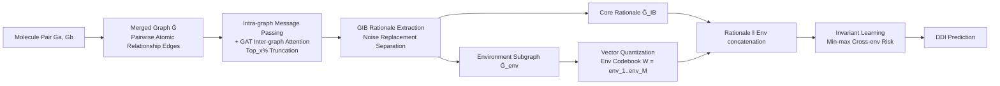

# I2Mole: Interaction-aware Invariant Molecular Learning for Generalizable Drug-Drug Interaction Prediction

**Conference**: ICLR 2026  
**OpenReview**: [https://openreview.net/forum?id=IqwF00TCmf](https://openreview.net/forum?id=IqwF00TCmf)  
**Code**: [https://anonymous.4open.science/r/I2Mol-C616](https://anonymous.4open.science/r/I2Mol-C616)  
**Area**: Computational Biology / Molecular Relationship Learning / Graph Information Bottleneck / Invariant Learning  
**Keywords**: Drug-Drug Interaction (DDI), Molecular Relationship Learning, Graph Information Bottleneck (GIB), Invariant Learning, Vector Quantization, OOD Generalization  

## TL;DR
I2Mole merges pairs of drug molecules into a "merged graph," first using attention to model cross-molecular interactions between atoms, then employing an improved Graph Information Bottleneck (GIB) to extract decisive core substructures (rationales). It utilizes vector quantization to cluster training environments into an "environment codebook" as a controllable noise source for invariant learning, achieving robust drug-drug interaction predictions under both inductive settings and cross-domain distribution shifts.

## Background & Motivation

**Background**: Drug-Drug Interaction (DDI) prediction is a crucial task in computational pharmacy, as the combined use of two drugs may produce synergistic or adverse effects. Predominant approaches model molecules as graphs and use GNNs to extract "rationales" to enhance interpretability and generalization, as seen in representative works like CGIB and MoleOOD.

**Limitations of Prior Work**: The authors identify two overlooked drawbacks. First, **insufficient modeling of molecular interactions**: existing methods excel at characterizing key substructures of individual molecules, but the decisive substructures can shift significantly when two drugs are used together. For example, Propranolol (a $\beta$-blocker) and Verapamil (a calcium channel blocker) each have their own pharmacophores, but their combined interaction can excessively inhibit cardiac conduction, leading to bradycardia—a "chemical reaction" across molecules that cannot be captured by looking at single molecules in isolation. Second, **lacking generalization capability**: in real-world scenarios, training and testing molecules often come from different distributions (OOD). Naive noise injection suffers from three pitfalls: simulated noise fails to reflect environment vectors in the actual chemical space, indiscriminate injection destroys semantic information hindering convergence, and insufficient noise variance causes the noise effect to vanish.

**Key Challenge**: The tension between faithfully modeling cross-molecular interactions without losing generalizability, versus injecting random noise for generalization at the cost of destroying chemical semantics.

**Goal**: To explicitly model atom-level cross-molecular interactions while performing invariant learning using environment representations derived from the "real chemical space" within a unified framework.

**Core Idea**: **Merged Graph + Improved GIB + Environment Codebook**—merging drug pairs into a single graph, using attention to filter critical inter-molecular relationship edges, employing GIB to extract core rationales, and discretizing the extracted "non-core environment subgraphs" into a finite set of environment categories via VQ. This ensures the environment acts as both a noise source and a carrier of chemical semantics.

## Method

### Overall Architecture
I2Mole consists of four steps: first, constructing a **merged graph** by connecting atoms of two molecules with pairwise edges, performing message passing with global features within graphs, and using GAT between graphs to calculate relationship edge weights (retaining the top_x%); second, using **Graph Information Bottleneck (GIB)** to extract the core rationale $\tilde{G}_{IB}$ from the merged graph while collecting nodes "replaced by noise" as the environment subgraph $\tilde{G}_{env}$; third, performing **Vector Quantization (VQ)** on the environment subgraphs to build an environment codebook, clustering the infinite environment space into M discrete environments; finally, concatenating the rationale with various environment vectors for **Invariant Learning**, minimizing the maximum risk across environments.

### Key Designs

**1. Merged Graph and Cross-Molecular Interaction Modeling: Turning "two molecules" into a "unified conversational graph."** Since molecular interactions often occur at specific structures (e.g., -OH, =O, N), the authors connect atoms of $G_a$ and $G_b$ with weighted relationship edges to form a merged graph $\tilde{G}=\{R,E,V,U\}$. During intra-graph message passing, bond features $e_{ij}$ aggregate both atomic and global features $u$; for inter-graph modeling, GAT computes attention weights for each relationship edge: $r_{ij}=\text{LeakyReLU}(\text{FC}(Wv'_{ai},Wv'_{bj}))$. Crucially, not all atom pairs are significant—the authors perform **global ranking and keep only the top_x%**, setting $r'_{ij}=r_{ij}$ if $r_{ij}\ge X$ and 0 otherwise. This focuses on truly strong cross-molecular interactions while reducing the complexity of the merged graph. The updated atomic features $v''_{ai}=(1-\sum_j\alpha_{ij})v'_{ai}+\sum_j\alpha_{ij}v'_{bj}$ integrate information from the partner molecule based on importance.

**2. GIB-based Core Substructure Extraction: Separating rationale from noise via Information Bottleneck.** The optimization objective on the merged graph is $\tilde{GIB}=\arg\min_{\tilde{G}_{sub}} -I(Y;\tilde{G}_{sub})+\beta I(\tilde{G};\tilde{G}_{sub})$, where the former utilizes cross-entropy prediction loss $L_{pre}$ to maximize mutual information with labels, and the latter uses **noise injection** to compress mutual information with the original graph. Specifically, a probability $p_i=\text{Sigmoid}(\text{FC}(h_i))$ of being replaced by noise is learned for each node, incorporating the relationship edge probabilities $p_k/N$ to reflect cross-molecular contributions. The selection $z_i=\lambda_i h_i+(1-\lambda_i)\epsilon$ where $\lambda_i\sim\text{Bernoulli}(p_i)$ is simplified via concrete relaxation for differentiability. The replaced components $h^r_i=(1-\lambda_i)h_i$ naturally form the "non-core substructures," serving as environment material—achieving both compression and environment collection in one step.

**3. Environment Codebook and Invariant Learning: Ensuring noise originates from real chemical space rather than random numbers.** Since min-max optimization over all possible environments is infeasible with limited data, the authors introduce a VQ-based trainable environment codebook $W=\{env_1,\dots,env_M\}$. Environment subgraph representations $\tilde{s}_{env}$ are mapped to the nearest codeword $env_m$. The codebook update loss is $L_{vq}=\|\text{sg}[\tilde{s}_{env}]-env_m\|^2_2+\delta\|\tilde{s}_{env}-\text{sg}[env_m]\|^2_2$ (with stop-gradient and a commitment term, $\delta{=}0.25$). Once $L_{vq}$ converges, the codebook clusters the infinite environment space into M discrete environments. For invariant learning, the rationale $\tilde{s}_{IB}$ is concatenated with each environment vector and fed into the classification head, with the objective $L_{inv}$ minimizing weighted cross-entropy across environments. This codebook acts as a controllable noise source while retaining chemical semantics, bypassing the common pitfalls of random noise.

The overall training objective is $L_{total}=L_{inv}+L_{pre}+\beta L_{MI}+\gamma L_{vq}$.

## Key Experimental Results

Benchmarks include three common DDI event prediction datasets: ZhangDDI, ChChMiner, and DeepDDI. Eight SOTAs (DeepDDI, SSI-DDI, CGIB, CMRL, MDF-SA-DDI, DSN-DDI, IE-HGNN, IGIB-ISE) were compared using ACC / AUROC / F1, averaged over 8 runs.

### Main Results (Transductive Setting, AUROC %)

| Method | ZhangDDI | ChChMiner | DeepDDI |
|------|----------|-----------|---------|
| CGIB | 94.43 | 98.38† | 98.08† |
| CMRL | 94.08 | 98.37 | 98.03 |
| IGIB-ISE | 94.71† | 98.24 | 98.02 |
| **I2Mole (Ours)** | **95.12** | **98.84** | **99.04** |

(† = strongest baseline) On the large-scale DeepDDI, I2Mole improves AUROC by 0.98% over the runner-up. The advantage becomes more pronounced as the dataset size, drug diversity, and complexity of DDI relationships increase.

### Generalization Test (Inductive + Cross-domain)

| Setting | Dataset | Best Baseline AUROC | Ours AUROC |
|------|--------|---------------|------------|
| Type 1 (Known × Unknown Drug) | DeepDDI | 85.41† | **85.62** |
| Type 2 (Unknown × Unknown Drug) | ChChMiner | 69.94† | **70.02** |
| Domain Gen (ZhangDDI → DeepDDI) | DeepDDI | 68.67† | **68.72** |

While all models show performance degradation when facing unseen drugs, I2Mole maintains the lowest sensitivity to unseen pairs and consistently leads in cross-domain transfer (training on small ZhangDDI and testing on a differently distributed DeepDDI).

### Ablation Study (ZhangDDI)

| Variant | ACC | AUROC | F1 |
|------|-----|-------|-----|
| w/o VQ (No Env Codebook) | 74.52 | 83.61 | 74.01 |
| w/o ∆ (No Cross-Molecular Interaction) | 84.51 | 87.21 | 80.21 |
| w/o GIB (No Information Bottleneck) | 84.72 | 87.21 | 81.07 |
| **Ours** | **88.64** | **95.12** | **85.87** |

Removing the VQ environment codebook results in the largest performance drop (AUROC drops by 11.5%), confirming the codebook as the core source of generalization. Both cross-molecular interactions and GIB contribute approximately 8% to AUROC.

### Key Findings
- **Clear Environment Codebook Boundaries**: t-SNE visualization shows distinct boundaries for the 10 environment embeddings, with molecular substructure embeddings clustered around corresponding environment vectors. Updating the codebook is essentially equivalent to clustering molecular embeddings.
- **Environments Encode Real Local Contexts**: Atomic composition differs significantly across environment codes (e.g., Category 7 is carbon-dominant, while Nitrogen/Oxygen are critical in Category 5/6), aligning with the motivation that environments should reflect real data distributions.
- **Sensitivity**: Optimal performance is found at $\beta{=}1\text{E-}4$, while $\gamma$ is robust within the 2E-5 to 1E-3 range.

## Highlights & Insights
- **The "Merged Graph" elevates molecular pair modeling from simple representation concatenation to a unified, interactive graph**, allowing GIB and attention to operate directly on inter-molecular atomic relationships. This addresses the core DDI challenge of substructure migration that occurs only upon co-administration.
- **Environment subgraphs are a byproduct of GIB noise replacement**—the compressed non-core nodes serve as environment material. This elegant design avoids the need for an additional independent environment extraction module.
- **Using VQ to create a discrete "Environment Codebook" is the most ingenious aspect of the work**: it solves the data scarcity issue for min-max invariant learning and ensures noise sources originate from real data with chemical semantics, effectively bypassing the defects of random noise injection.

## Limitations & Future Work
- Evaluation is limited to three DDI classification datasets; the model's performance on regression-based molecular pair tasks (e.g., solute-solvent Gibbs free energy) mentioned in the introduction remains unverified.
- Hyperparameters such as the number of environment codes M and the top_x% truncation ratio are preset. Future work could explore how M might adapt to data scale and the robustness of truncation ratios across different molecular sizes.
- The complexity of pairwise atomic edges in the merged graph grows quadratically with the number of atoms. Although mitigated by top_x% truncation, scalability for macromolecules or long peptide chains requires further investigation.
- Interpretability of rationales is primarily qualitative (t-SNE and atomic composition); quantitative alignment with expert-annotated pharmacophores is yet to be validated.

## Related Work & Insights
- **Graph Information Bottleneck**: Works like CGIB and IGIB-ISE apply GIB to molecular substructure extraction. I2Mole extends GIB from single molecules to merged graphs and modifies the noise injection term.
- **Invariant/OOD Learning**: Works like MoleOOD and IRM introduce environment variables for invariant learning. I2Mole's innovation lies in using VQ to instantiate "environments" as discrete representations from real chemical space.
- **Vector Quantization**: While borrowing the codebook mechanism from VQ-VAE, I2Mole repurposes it for "environment clustering + controllable noise sources," presenting a novel application of VQ in molecular relationship learning.
- **Insight**: Replacing "stochastic perturbations" with "discrete prototypes learned from data" for generalization is a transferable strategy for other OOD relationship prediction tasks, such as protein-protein or catalyst-substrate interactions.

## Rating
- **Novelty**: ⭐⭐⭐⭐ — The combination of Merged Graph + Improved GIB + VQ Environment Codebook is fresh, particularly the use of the codebook as a semantically-aware noise source.
- **Experimental Thoroughness**: ⭐⭐⭐⭐ — Covers transductive/inductive (Type 1/2)/domain generalization/scaffold-size settings with 8 baselines and comprehensive ablation/sensitivity analysis. However, it is limited to three DDI classification datasets.
- **Writing Quality**: ⭐⭐⭐ — The motivation using real pharmacological cases is clear and formulas are complete, though some phrasing is slightly awkward.
- **Value**: ⭐⭐⭐⭐ — DDI prediction has clear clinical significance. The dual focus on cross-molecular interaction modeling and real-world environment codebooks has practical and methodological implications for computational pharmacy and general molecular relationship learning.

<!-- RELATED:START -->

## Related Papers

- [\[NeurIPS 2025\] GFlowNets for Learning Better Drug-Drug Interaction Representations](../../NeurIPS2025/computational_biology/gflownets_for_learning_better_drug-drug_interaction_representations.md)
- [\[ICLR 2026\] h-MINT: Modeling Pocket-Ligand Binding with Hierarchical Molecular Interaction Network](h-mint_modeling_pocket-ligand_binding_with_hierarchical_molecular_interaction_ne.md)
- [\[ICML 2026\] Learning the Interaction Prior for Protein-Protein Interaction Prediction: A Model-Agnostic Approach](../../ICML2026/computational_biology/learning_the_interaction_prior_for_protein-protein_interaction_prediction_a_mode.md)
- [\[ICLR 2026\] KGOT: Unified Knowledge Graph and Optimal Transport Pseudo-Labeling for Molecule-Protein Interaction Prediction](kgot_unified_knowledge_graph_and_optimal_transport_pseudo-labeling_for_molecule-.md)
- [\[ICLR 2026\] Quantifying Cross-Attention Interaction in Transformers for Interpreting TCR-pMHC Binding](quantifying_cross-attention_interaction_in_transformers_for_interpreting_tcr-pmh.md)

<!-- RELATED:END -->
