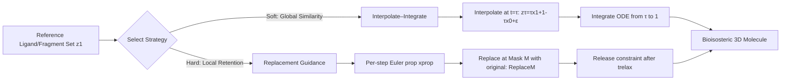

# Interpolation-Based Conditioning of Flow Matching Models for Bioisosteric Ligand Design

**Conference**: ICLR 2026  
**OpenReview**: [https://openreview.net/forum?id=b1HJLCzYN5](https://openreview.net/forum?id=b1HJLCzYN5)  
**Code**: [https://github.com/oxpig/cond-semla](https://github.com/oxpig/cond-semla)  
**Area**: Computational Biology / 3D Molecule Generation / Drug Design  
**Keywords**: flow matching, training-free conditional generation, bioisostere design, pharmacophore, SemlaFlow  

## TL;DR
Based on pre-trained E(3)-equivariant flow matching molecular generation models, this work proposes two **inference-only conditioning strategies requiring zero retraining**—Interpolate–Integrate (soft global similarity) and Replacement Guidance (hard local anchoring)—to enable 3D bioisostere design conditioned on reference ligands or fragment sets.

## Background & Motivation
- **Background**: Fast unconditional 3D generative models (e.g., SemlaFlow) can sample valid molecules with high quality and scale. However, applying them to specific drug design tasks typically requires **retraining** a conditional model for every new constraint.
- **Limitations of Prior Work**: Ligand-Based Drug Design (LBDD) aims to preserve key binding determinants (shape, pharmacophores) of reference ligands while optimizing properties like synthetic accessibility without protein structures. Existing conditional generators have drawbacks: REINVENT is not 3D-native and requires post-hoc conformation generation; SQUID/ShapeMol only condition on overall shape and fail to capture fine-grained pharmacophores; SOTA ShEPhERD requires **retraining for every additional condition channel**, and multi-fragment scenarios require manual construction of aggregated ESP and interaction profiles.
- **Key Challenge**: The conflict between the high cost of retraining and the demand for flexibility—reusing powerful pre-trained bases to maintain high sampling speed while providing fine-grained, on-demand guidance.
- **Goal**: Provide modular, fine-grained inference-time control without modifying model weights to generate bioisosteric molecules that "do not necessarily retain original fragment atoms but preserve key shape and pharmacophore interactions."
- **Core Idea**: **Transform conditioning into two geometric operations on ODE sampling trajectories**—either restarting and integrating from the middle of the probability path (soft) or hard-replacing fragment regions back to original values after each Euler update (hard).

## Method

### Overall Architecture
The method is built upon SemlaFlow (an E(3)-equivariant flow matching model for joint generation of coordinates and discrete chemistry). SemlaFlow uses Conditional Flow Matching (CFM) to train a network that predicts clean data $\tilde{z}_1=\mathbb{E}[z_1\mid t,z_t]$, where coordinates follow OT-like linear paths and atom/bond types follow discrete CTMC paths, sampled using a 100-step log-spaced Euler solver. Neither conditioning strategy touches the training; they modify only the sampler operation: one restarts after interpolation mid-trajectory (global soft constraint), and the other continuously anchors fragments (local hard constraint). These two are complementary.

### Key Designs

**1. Interpolate–Integrate: Seed-guided resampling starting from mid-path.** This provides soft, global conditioning. Unlike standard generation starting from pure noise at $t=0$, it selects an intermediate time $\tau\in[0,1]$. It first interpolates the seed molecule $z_1$ towards noise along the SemlaFlow probability path to obtain $z_\tau$—coordinates are computed as $x_\tau=\tau x_1+(1-\tau)x_0+\varepsilon$ (where $\varepsilon\sim\mathcal{N}(0,\sigma_\tau^2 I)$ is optional jitter), and atom/bond types are linearly mixed between the one-hot truth and a uniform distribution as $\mathrm{Cat}(\tau\delta_{a_1}+(1-\tau)\tfrac{1}{|A|}\mathbf{1}_A)$. The ODE is then integrated forward from $(t,z_t)=(\tau,z_\tau)$ to $t=1$. $\tau$ serves as an intuitive "conservatism" knob: as $\tau\to1$, it performs minor editing with high fidelity to the seed; as $\tau\to0$, it degrades to unconditional generation. This is the first interpolate-integrate scheme for deterministic ODE trajectories in flow matching, particularly suitable for similarity control where global rewriting is allowed.

**2. Replacement Guidance: Hard fragment anchoring with relaxation strategies.** This provides hard, local conditioning for merging multiple fragments. The goal is for the molecule to strictly maintain the spatial and chemical identity of fragments without necessarily containing the exact original atoms. A fragment mask $M\in\{0,1\}^N$ is introduced. In each ODE integration step, a normal Euler proposal $x^{\text{prop}}_{t+\Delta t}=x_t+\frac{\Delta t}{1-t}(\tilde{x}_1-x_t)$ is made, followed by **replacing the masked region back to the unperturbed original fragment values** $x_{t+\Delta t}=\mathrm{Replace}_M(x^{\text{prop}}_{t+\Delta t};x^{\text{frag}})$. Atom and bond types are replaced similarly. This creates a "projected flow" where fragments are preserved while complementary regions $\bar{M}$ evolve freely to synthesize linkers or local substitutions. Constraint strength is user-controlled—stopping replacement after a relaxation time $t_{\text{relax}}$ or at a specific set of free steps $T_{\text{free}}$.

**3. Strictly Inference-time Intervention with Zero Overhead.** Both methods operate entirely during inference and keep the original 100-step Euler schedule. Interpolate–Integrate performs a single $O(N)$ interpolation before integration. Replacement Guidance adds a lightweight $O(N)$ mask tensor update per step, which is negligible compared to the model forward pass. Consequently, inference efficiency remains comparable to unconditional baselines—a core advantage over ShEPhERD, which requires retraining and manual grid construction for every condition.

## Key Experimental Results

The methods were validated on three drug-related tasks: natural product ligand hopping, bioisosteric fragment merging, and pharmacophore merging. Metrics include PoseBusters validity, Synthetic Accessibility (SA) score (lower is better), 3D similarity (ESP/pharmacophore), and AutoDock Vina docking scores.

### Main Results

Natural Product Ligand Hopping (NP1, filtered for SA < 4.5):

| Method | Valid ↑ | SA ↓ | Valid(SA<4.5) ↑ | ESP sim ↑ | Pharma sim ↑ |
|------|---------|------|-----------------|-----------|--------------|
| MolSnapper | 26.2% | 6.43 | 0.32% | 0.51 | 0.16 |
| ShEPhERD | 57.3% | 4.75 | 24.7% | 0.63 | 0.34 |
| Interpolate–Integrate | 71.5% | 4.67 | 35.6% | **0.81** | 0.49 |
| Replacement Guidance | 60.5% | **3.74** | **50.2%** | **0.81** | **0.52** |

EV-D68 3C protease bioisostere merging (ShEPhERD profile settings):

| Method | Valid ↑ | SA ↓ | Valid(SA<4) ↑ | Pharma sim ↑ | Vina top10 ↓ |
|------|---------|------|---------------|--------------|--------------|
| DiffSBDD | 43.1% | 6.91 | 0% | — | — |
| ShEPhERD | 33.8% | 4.45 | 10.8% | **0.27** | −6.16 |
| Interpolate–Integrate | 39.5% | 4.96 | 8.7% | 0.18 | −4.84 |
| Replacement Guidance | 31.9% | **3.47** | **23.5%** | 0.22 | **−6.62** |

SARS-CoV-2 Mpro Pharmacophore Merging: Replacement Guidance achieved SA 3.61 and Vina top10 −7.63. ProLIF fingerprint analysis showed both methods could **fully replicate** all interaction types observed in 81 conditional fragments.

### Ablation Study

| Checkpoint | Setting | Result |
|--------|------|------|
| Replacement vs. Inpainting | DiffLinker set (≥3 disconnected fragments) | Hard replacement Valid 58.6% vs. full-noise inpainting 32.0% |
| Interpolate–Integrate fixing disconnected seeds | Varying interpolation time τ | Smaller τ (more noise) increased Valid from 65.3% to 84.4% |

### Key Findings
- The two strategies have distinct strengths: Replacement Guidance yields the best SA scores across targets, making it ideal for "hard" fragment merging; Interpolate–Integrate favors conservative editing and highest ESP/pharmacophore similarity, suitable for high-fidelity interaction preservation.
- In bioisostere merging, Replacement Guidance is competitive with SOTA ShEPhERD—slightly lower pharmacophore similarity (0.22 vs. 0.27) but superior synthetic accessibility (3.47 vs. 4.45) and comparable or better Vina scores (−6.62 vs. −6.16).
- **Significant Speed Advantage**: On a single RTX 6000, batching 10 molecules, Interpolate–Integrate takes 2.85s and Replacement Guidance takes 3.9s; ShEPhERD takes 3–4 minutes on a V100.

## Highlights & Insights
- **Reframing Conditioning**: Recasts the problem from "retraining conditional models" to "modifying sampler trajectories" using pure geometric operations (interpolation-restart and projection-replacement), providing a clean and interpretable spectrum from global similarity to local hard constraints.
- **Training-free & Modular**: No weights are modified, making it naturally suitable for ligand-only scenarios where protein structures are unknown and easy to upgrade with better base models.
- **Automatic Multi-fragment Conditioning**: Unlike ShEPhERD, which requires manual aggregation of ESP/interaction profiles, the random atom seeding here automatically samples pharmacophores from original fragments, approximating the performance of manually refined profiles at lower expert cost.
- **Clever Relaxation Strategy**: Continuous adjustment between "strict fragment preservation" and "free linker synthesis" via $t_{\text{relax}}$ / $T_{\text{free}}$ translates the essence of bioisostere merging (interaction preservation, atom discard) into sampling steps.

## Limitations & Future Work
- Batch processing currently only supports identical input seeds within a batch, limiting the throughput for large-scale heterogeneous conditions.
- High-throughput evaluation pipelines involve approximations (e.g., docking to a single rigid receptor); pharmacophore similarity still lags slightly behind specifically retrained models like ShEPhERD.
- A gap remains compared to known binders (Vina −7.63 on Mpro vs. known binder −9.95); generated molecules are "competitive starting points" rather than endpoints.
- Performance depends on the generation quality and OT path assumptions of the underlying SemlaFlow; hyperparameters like $\tau$ and relaxation time require task-specific tuning.

## Related Work & Insights
- **Unconditional 3D Generation Bases**: Foundation laid by EDM; SemlaFlow (base of this work) achieves 87% success on GEOM-Drugs and is the fastest.
- **Joint Conditioning Models (Training-time)**: SQUID/ShapeMol (by shape), ShEPhERD (shape+ESP+pharmacophores, but requires retraining + manual grids).
- **Inference-time Conditioning & Editing**: Diffusion inpainting (RePaint), DiffSBDD, PILOT, MolSnapper (pharmacophore projections), FLOWR (equivariant flow matching for pockets); fragment merging/linking via DiffLinker, LinkerNet, TurboHopp (accelerated by consistency models).
- **Mechanism Insight**: As the deployment cost of generative models rises, "training-free inference guidance" is a cost-effective route to leverage a single strong base for multiple tasks. This work provides a clean geometric paradigm for flow matching applicable to other equivariant ODE generation scenarios.

## Rating
- **Novelty**: ⭐⭐⭐⭐ First interpolate-integrate conditioning for deterministic flow matching ODEs, combined with controllable relaxation replacement; well-motivated.
- **Experimental Thoroughness**: ⭐⭐⭐⭐ Three real-world drug tasks + multiple baseline comparisons + two key ablations; comprehensive metrics (validity/SA/3D similarity/docking/interaction replication).
- **Writing Quality**: ⭐⭐⭐⭐ Clear formalization of methods, distinct comparison between soft/hard approaches, and well-explained trade-offs.
- **Value**: ⭐⭐⭐⭐ High practical value by enabling bioisostere design on SOTA bases without retraining, at speeds two orders of magnitude faster than ShEPhERD.

<!-- RELATED:START -->

## Related Papers

- [\[ICLR 2026\] Riemannian Variational Flow Matching for Material and Protein Design](riemannian_variational_flow_matching_for_material_and_protein_design.md)
- [\[ICLR 2026\] La-Proteina: Atomistic Protein Generation via Partially Latent Flow Matching](la-proteina_atomistic_protein_generation_via_partially_latent_flow_matching.md)
- [\[ICML 2025\] Flexibility-conditioned Protein Structure Design with Flow Matching](../../ICML2025/computational_biology/flexibility-conditioned_protein_structure_design_with_flow_matching.md)
- [\[ICLR 2026\] Multi-Marginal Flow Matching with Adversarially Learnt Interpolants](multi-marginal_flow_matching_with_adversarially_learnt_interpolants.md)
- [\[NeurIPS 2025\] Energy Matching: Unifying Flow Matching and Energy-Based Models for Generative Modeling](../../NeurIPS2025/computational_biology/energy_matching_unifying_flow_matching_and_energy-based_models_for_generative_mo.md)

<!-- RELATED:END -->
