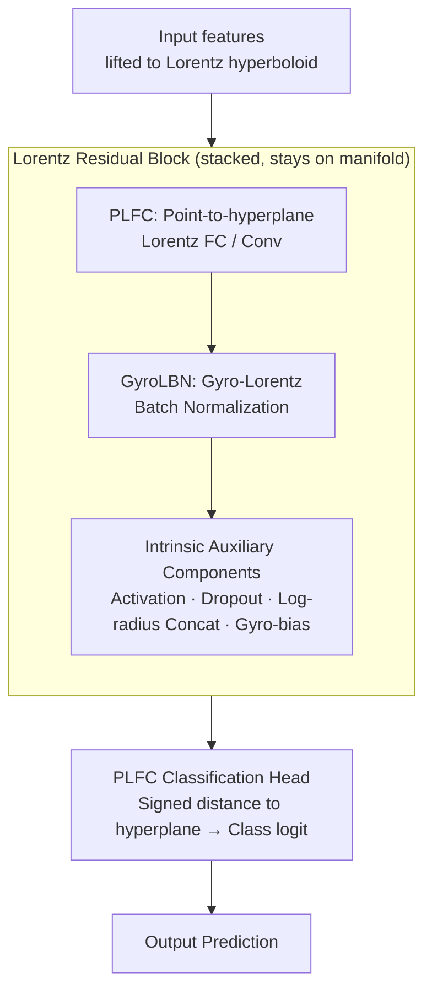

# Intrinsic Lorentz Neural Network

**Conference**: ICLR 2026  
**arXiv**: [2602.23981](https://arxiv.org/abs/2602.23981)  
**Code**: To be confirmed  
**Area**: Computational Biology  
**Keywords**: hyperbolic neural network, Lorentz model, intrinsic operations, batch normalization, geometric deep learning  

## TL;DR
The paper proposes ILNN, a fully intrinsic hyperbolic neural network where all operations are conducted within the Lorentz model. This eliminates the geometric inconsistency found in existing methods that mix Euclidean operations, achieving SOTA results in image classification, genomics, and graph classification.

## Background & Motivation
**Background**: Hyperbolic neural networks utilize the exponentially growing volume of hyperbolic space to represent hierarchical data. The Lorentz model is often preferred over the Poincaré model due to its superior numerical stability.

**Limitations of Prior Work**: Existing hyperbolic networks "fall back" to Euclidean space for certain operations (e.g., linear transformations in tangent space, Euclidean BN), leading to geometric inconsistencies.

**Key Challenge**: How to design sufficiently expressive and numerically stable components while maintaining all operations on the hyperbolic manifold?

**Goal**: To build a comprehensive set of fully intrinsic Lorentz space operations.

**Key Insight**: Using signed distances to Lorentz hyperplanes to replace affine transformations, and utilizing gyrostructures to implement intrinsic statistics.

**Core Idea**: Point-to-hyperplane distance $\to$ FC layer; gyro-centering + gyro-scaling $\to$ BatchNorm.

## Method

### Overall Architecture
ILNN rewrites a full suite of neural network components on the Lorentz hyperboloid $\mathbb{L}_K^n$ ($K<0$), ensuring that features remain on the same manifold from input to output. This approach avoids detour linear transformations or normalization through tangent or Euclidean spaces. The forward path consists of a stack of "Lorentz residual blocks": within each block, features first pass through a PLFC (acting as a manifold-based fully connected or convolutional layer), followed by GyroLBN for normalization. They then pass through a set of intrinsic auxiliary components (activation, dropout, log-radius concatenation, gyro-bias) to complete the non-linearity and regularization. Finally, a PLFC classification head interprets the signed distance from the feature points to the hyperplanes as class logits. A common constraint of this design is that as the curvature $K \to 0$ and the manifold flattens, each component analytically degenerates to its standard Euclidean counterpart, ensuring that the hyperbolic network performs no worse than a Euclidean network at the flat limit.

### Key Designs

**1. PLFC (Point-to-hyperplane Lorentz Full Connection): Replacing affine transformations with intrinsic signed distance**

The geometric essence of a Euclidean fully connected layer $y = Wx + b$ is projecting input into a set of hyperplanes defined by weights and reading the signed distance. Existing hyperbolic networks often use log maps to pull points back to tangent space, perform linear transformations, and then use exponential maps back to the manifold, which introduces geometric distortion. PLFC directly learns $m$ Lorentz hyperplanes on the manifold, treating the **signed hyperbolic distance** from the input point to each hyperplane as the logit for that dimension. This process never leaves the hyperboloid. After obtaining these distances, $\sinh$ maps them back to spatial coordinates, and the time coordinate $x_0$ is analytically solved via the hyperboloid constraint $-x_0^2 + \sum_i x_i^2 = 1/K$, ensuring the output remains a valid point on the manifold. This distance formula converges to $Wx + b$ as $K \to 0$, allowing PLFC to seamlessly replace any standard FC layer.

**2. GyroLBN (Gyro-Lorentz Batch Normalization): Replacing iterative means and Euclidean normalization with closed-form hyperbolic statistics**

Performing BatchNorm on a hyperboloid requires a "hyperbolic mean" and "hyperbolic variance." However, the Fréchet mean typically lacks a closed-form solution and requires iterative updates, while falling back to Euclidean space destroys intrinsic consistency. GyroLBN solves this in two steps using gyrostructures: **gyro-centering** utilizes the closed-form Lorentzian centroid to directly calculate the hyperbolic centroid of a batch and translates the data to the origin, eliminating the need for iteration; **gyro-scaling** then performs normalization based on Fréchet variance to control the dispersion scale of features. Compared to GyroBN, which requires iterative Fréchet mean calculation, it is faster (closed-form vs. iterative). Compared to LBN, which uses Euclidean means, it is more intrinsic (true hyperbolic mean vs. Euclidean approximation), excelling in both speed and accuracy in experiments.

**3. Intrinsic Auxiliary Components: Moving the remaining network parts onto the manifold**

To ensure the entire forward path remains on the hyperboloid, ILNN intrinsicizes several conventional components. The most critical is **log-radius concatenation**: directly stacking spatial components of $N$ Lorentz patches causes the feature norm to grow systematically with dimension $Nd$, overwhelming subsequent layers. It uses a scale derived from the digamma function to align the "expected log-radius," ensuring the scale of the concatenated result remains independent of the number of patches (parameter-free, robust to heavy-tailed radii, and maintaining the hyperboloid constraint). Through PLFC and log-radius concatenation, convolutional layers are rewritten as fully intrinsic Lorentz convolutions. Other components include Lorentz dropout, Lorentz activation, and gyro-additive bias (using gyro-addition to add bias/residuals directly on the manifold). These complete the non-linearity, regularization, and biasing stages, truly closing the loop on the goal of "remaining on $\mathbb{L}_K^n$ from input to output."

## Key Experimental Results

### Image Classification

| Method | CIFAR-10 | CIFAR-100 |
|------|----------|----------|
| Euclidean ResNet-18 | 95.14% | 77.72% |
| HCNN-Lorentz | 95.14% | 78.07% |
| **Ours (ILNN)** | **95.36%** | **78.41%** |

### Genomics (TEB) — MCC Metric

| Task | Euclidean | **Ours (ILNN)** | Gain |
|------|-----------|---------|------|
| Processed Pseudogene | 60.66 | **70.26** | +9.6 |
| Unprocessed Pseudogene | 51.94 | **64.90** | +13.0 |

### Genomics (GUE)

| Task | Best Prior | **Ours (ILNN)** |
|------|-----------|----------|
| Covid Classification | 36.71 | **64.76** |
| Core Promoter (tata) | 79.87 | **83.90** |

### Graph Classification
Airport 96.03%, Cora 85.68%, PubMed 82.52%—all are SOTA.

### Key Findings
- Improvements on CIFAR are relatively small (+0.2-0.7pp), but the gains in genomics tasks are massive (+10-28pp).
- HCNN-S collapses on Covid classification (36.71), while ILNN remains robust—intrinsic operations provide numerical stability.
- GyroLBN outperforms both GyroBN and LBN in terms of speed and effectiveness.

## Highlights & Insights
- **Fully Intrinsic Design Philosophy**: Operating on the hyperboloid consistently is superior to mapping to tangent space and back.
- **Closed-form Centroid replacing Iterative Solvers**: GyroLBN is both fast and accurate.
- **$K \to 0$ Degeneracy**: The property is elegant—hyperbolic networks should not be inferior to Euclidean ones at the flat limit.
- Huge gains in genomics suggest that hyperbolic representations are particularly effective for biological sequences.

## Limitations & Future Work
- Based only on ResNet-18; modern architectures like ViT have not been verified.
- Absolute improvement on CIFAR is very small.
- Fixed curvature $K=-1$; learnable curvature was not explored.
- Only classification tasks were verified.

## Related Work & Insights
- **vs HCNN**: HCNN returns to tangent space for some operations; ILNN is fully intrinsic.
- **vs Poincaré Networks**: The Lorentz model is more numerically stable, and ILNN reinforces this advantage.
- Could inspire hyperbolic embedding designs for LLMs.

## Supplementary Technical Details

### Geometric Intuition of PLFC
In Euclidean space, a fully connected layer calculates $y = Wx + b$, essentially projecting the input onto multiple hyperplanes. PLFC intrinsicizes this: it defines hyperplanes on the Lorentz hyperboloid and calculates the hyperbolic distance from points to these hyperplanes as features. This distance naturally degenerates to Euclidean distance as $K \to 0$, ensuring compatibility.

### Why is the Improvement in Genomics so Significant?
Gene sequences possess a natural hierarchical structure (gene family → gene → exon → sequence motif). Hyperbolic space can better capture such exponentially growing hierarchical relationships with limited dimensions, whereas Euclidean space suffers from representation crowding in low dimensions. The collapse of HCNN-S on Covid classification likely results from its mixed operations losing critical hierarchical information.

### Lorentz vs. Poincaré Model
The Lorentz model uses an $(n+1)$-dimensional ambient space where coordinates $(x_0, x_1, ..., x_n)$ satisfy $-x_0^2 + x_1^2 + ... + x_n^2 = 1/K$. Compared to the Poincaré ball model, which exhibits numerical instability near the boundary, the Lorentz model avoids such issues by analytically calculating the time coordinate $x_0$.

## Rating
- Novelty: ⭐⭐⭐⭐ Fully intrinsic operation design is valuable.
- Experimental Thoroughness: ⭐⭐⭐⭐ Covers image, genomic, and graph tasks.
- Writing Quality: ⭐⭐⭐⭐ Clear mathematics and elegant degeneracy analysis.
- Value: ⭐⭐⭐⭐ A significant advancement for hyperbolic geometry in deep learning.

<!-- RELATED:START -->

## Related Papers

- [\[CVPR 2026\] Cell-Type Prototype-Informed Neural Network for Gene Expression Estimation from Pathology Images](../../CVPR2026/computational_biology/cell-type_prototype-informed_neural_network_for_gene_expression_estimation_from_.md)
- [\[ICLR 2026\] h-MINT: Modeling Pocket-Ligand Binding with Hierarchical Molecular Interaction Network](h-mint_modeling_pocket-ligand_binding_with_hierarchical_molecular_interaction_ne.md)
- [\[ICML 2026\] Demystifying Multimodal Biomolecular Co-design with Intrinsic Geodesic Coupling](../../ICML2026/computational_biology/demystifying_multimodal_biomolecular_co-design_with_intrinsic_geodesic_coupling.md)
- [\[ICLR 2026\] Temporally Detailed Hypergraph Neural ODEs for Disease Progression Modeling](temporally_detailed_hypergraph_neural_ode_for_disease_progression_modeling.md)
- [\[ICLR 2026\] Coupled Transformer Autoencoder for Disentangling Multi-Region Neural Latent Dynamics](coupled_transformer_autoencoder_for_disentangling_multi-region_neural_latent_dyn.md)

<!-- RELATED:END -->
