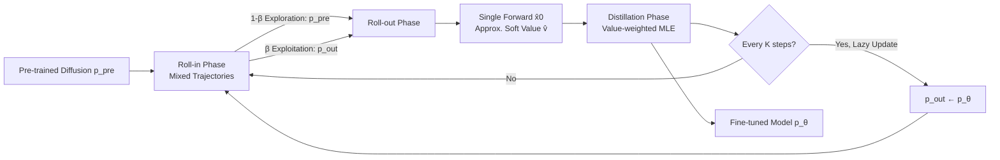

# Iterative Distillation for Reward-Guided Fine-Tuning of Diffusion Models in Biomolecular Design

**Conference**: ICLR 2026  
**OpenReview**: [https://openreview.net/forum?id=NFffW9tBmC](https://openreview.net/forum?id=NFffW9tBmC)  
**Code**: [https://divelab.github.io/VIDD/](https://divelab.github.io/VIDD/)  
**Area**: Computational Biology / Diffusion Model Fine-tuning / Reinforcement Learning  
**Keywords**: Diffusion Models, Reward-guided Fine-tuning, Policy Distillation, Non-differentiable Rewards, Protein Design, Molecular Generation, Soft-optimal Policy  

## TL;DR
VIDD reformulates "fine-tuning diffusion models with rewards" as **offline policy distillation**: using a soft-optimal policy as a teacher, it is distilled into a student model by minimizing forward KL (value-weighted MLE). This achieves more stable and efficient reward optimization than PPO-based RL methods for biomolecular design tasks (proteins, DNA, small molecules) involving **non-differentiable rewards**.

## Background & Motivation
**Background**: Diffusion models are the primary generators for biomolecules like proteins, small molecules, and regulatory DNA. However, practical applications require optimizing specific downstream rewards—such as binding affinity, secondary structure matching, or docking scores—rather than just "generating samples like the training distribution."

**Limitations of Prior Work**: Common practices in computer vision involve backpropagating gradients through differentiable rewards. However, most rewards in biomolecular design are **inherently non-differentiable**: DSSP secondary structure matching uses look-up tables, AlphaFold3 binding affinity predictions and AutoDock Vina docking scores are based on physical simulations or hard scientific rules. Alternative policy gradient methods like PPO/DDPO suffer from three chronic issues—training instability, low sample efficiency, and mode collapse.

**Key Challenge**: The authors identify two fundamental properties of PPO-like methods as the source of these issues. First, they are **on-policy**: training trajectories are generated by the current strategy, locking exploration near already visited regions and leading to sub-optimal local optima. Second, they inherently minimize **reverse KL** (mode-seeking), which tends to cause collapse into a single mode.

**Goal**: Propose a fine-tuning framework for diffusion models that stably optimizes **arbitrary (potentially non-differentiable) rewards** while avoiding the exploration constraints of on-policy methods and the mode collapse of reverse KL.

**Core Idea** (**Offline Policy Distillation + Forward KL**): The problem is viewed as "distilling a reward-guided soft-optimal teacher policy into a student diffusion model." The teacher is constructed by multiplying the pre-trained policy with a value-weighting term. The distillation objective is the forward KL between teacher and student, equivalent to **value-weighted Maximum Likelihood Estimation (MLE)** in RL. This objective naturally supports offline sampling (the roll-in distribution can be arbitrary) and uses forward KL to eliminate the two root causes of PPO's limitations.

## Method

### Overall Architecture
VIDD (Value-guided Iterative Distillation for Diffusion models) splits fine-tuning into three alternating phases: **roll-in** (defining the data distribution for loss calculation using exploratory offline trajectories), **roll-out** (sampling along the roll-out policy and calculating soft values as distillation weights), and **distillation** (minimizing the KL between teacher and student on the roll-in distribution). These three phases cycle for $S$ rounds, with the teacher (roll-out policy) "lazily" refreshed every $K$ steps, allowing the teacher and student to align and improve progressively, similar to the policy improvement theorem in RL.

### Key Designs

**1. Soft-optimal teacher policy: Folding rewards into the pre-trained denoising kernel.** The teacher distilled by VIDD is a soft-optimal policy naturally emerging from the entropy-regularized MDP framework. It multiplies the pre-trained denoising kernel $p^{\text{pre}}_{t-1}$ by a value-weighting factor: $p^\star_{t-1}(\cdot|x_t) = p^{\text{pre}}_{t-1}(\cdot|x_t)\cdot\frac{\exp(v_{t-1}(\cdot)/\alpha)}{\exp(v_t(x_t)/\alpha)}$, where the soft value function $v_{t-1}(\cdot) := \alpha\log \mathbb{E}_{x_0\sim p^{\text{pre}}}[\exp(r(x_0)/\alpha)\,|\,x_{t-1}=\cdot]$ measures the expected reward from the current noisy state following the pre-trained policy. This construction ensures that the final marginal distribution sampled via $\{p^\star_t\}$ approximates the target distribution $\exp(r(\cdot)/\alpha)p^{\text{pre}}(\cdot)$, which is the theoretical optimum for reward maximization.

**2. Offline roll-in: Mixed sampling for exploration and exploitation.** Since the distillation objective $\arg\min_\theta\sum_t\mathbb{E}_{x_t\sim u_t}[\text{KL}(p^\star_{t-1}\|p^\theta_{t-1})]$ allows an arbitrary roll-in distribution $u_t$ (off-policy), VIDD can freely design the source of training data. It uses a hybrid strategy: sampling from the pre-trained policy $p^{\text{pre}}_t$ with probability $1-\beta_s$ for **broad coverage exploration**, and from the periodically updated roll-out policy $p^{\text{out}}_t$ with probability $\beta_s$ to **exploit** high-reward regions already learned by the student.

**3. Single forward pass for soft value approximation.** The soft value function is a conditional expectation, which is expensive to estimate via Monte Carlo or additional value networks. VIDD uses a simple approximation: $\hat v_{t-1}(\bar x_{t-1}) := r(\hat x_0(\bar x_{t-1};\theta^{\text{out}}))$, directly feeding the denoised result $\hat x_0$ predicted by the diffusion model into the reward function. This replaces the expectation with the posterior mean, requiring only one forward pass.

**4. Value-weighted MLE + Lazy target update.** Combining these, the final parameter update rule is $\theta_{s+1}\leftarrow\theta_s+\gamma\nabla_\theta\sum_i\sum_t\frac{\exp(\hat v_{t-1}(\bar x^{[i]}_{t-1})/\alpha)}{\exp(\hat v_t(x^{[i]}_t)/\alpha)}\log p^\theta_{t-1}(\bar x^{[i]}_{t-1}|x^{(i)}_t)$. This is a standard **value-weighted MLE** objective. Due to noise in samples and the value function, the roll-out policy is updated lazily every $K$ steps with the latest student parameters. This lazy update is crucial for stability in off-policy settings, preventing the teacher from jumping drastically while allowing asymptotic improvement.

**Key Difference from Policy Gradient**: Through Theorem 1, the authors prove that PPO's objective $J(\theta)$ is equivalent to minimizing the **reverse KL** $\text{KL}(p^\theta_{0:T}\|p^\star_{0:T})$ between trajectory distributions, whereas VIDD's objective is closer to **forward KL**. Avoiding the mode-seeking nature of reverse KL results in a more stable optimization landscape and prevents mode collapse.

## Key Experimental Results

### Main Results (Protein / DNA / Molecule Comprehensive, reported as 50% Median ± 95% CI)

| Method | Protein β-sheet%↑ | pLDDT↑ | DNA Pred-Activity↑ | ATAC-Acc↑ | Molecule Docking↑ | NLL↓ |
|------|------|------|------|------|------|------|
| Pre-trained | 0.05 | 0.37 | 0.14 | 0.000 | 7.2 | 971 |
| Best-of-N (N=32) | 0.26 | 0.38 | 1.30 | 0.000 | 10.2 | 951 |
| DRAKES (DNA only) | - | - | 6.44 | 0.825 | - | - |
| Standard Fine-tuning | 0.48 | 0.30 | 1.17 | 0.094 | 7.8 | 908 |
| DDPP | 0.63 | 0.36 | 5.33 | 0.305 | 7.9 | 981 |
| DDPO (PPO-like) | 0.81 | 0.55 | 7.38 | 0.086 | 8.5 | 929 |
| **VIDD** | **0.83** | **0.82** | **8.28** | **0.820** | 9.4 | **741** |

On DNA Pred-Activity, VIDD (8.28) outperforms DRAKES (6.44), a specialized method that backpropagates differentiable rewards. On the orthogonal ATAC-Acc metric, VIDD (0.820) far exceeds DDPO (0.086), suggesting it does not merely "game" the reward model at the expense of true biological activity.

### Protein Binder Design (PD-L1 / IFNAR2, ipTM Binding Affinity)

| Method | PD-L1 ipTM↑ | PD-L1 Reward↑ | IFNAR2 ipTM↑ | IFNAR2 Reward↑ |
|------|------|------|------|------|
| Pre-trained | 0.147 | 0.085 | 0.118 | 0.061 |
| Best-of-N (N=128) | 0.266 | 0.265 | 0.246 | 0.223 |
| DDPP | 0.189 | 0.207 | 0.138 | 0.124 |
| DDPO | 0.788 | 0.877 | 0.240 | 0.314 |
| **VIDD** | **0.818** | **0.908** | **0.509** | **0.512** |

IFNAR2 is a more difficult target. DDPO reaches only 0.240 ipTM, whereas VIDD doubles this to 0.509, demonstrating the advantage of offline exploration on difficult reward landscapes.

### Key Findings
- **Stable and Comprehensive Lead**: VIDD is the top performer across protein, DNA, and molecular tasks. Its NLL (naturalness) is also the best, indicating high rewards are not achieved at the cost of sample naturalness.
- **Anti-overoptimization**: Performance remains strong on orthogonal metrics like ATAC-Acc, where DDPO fails.
- **Superior to Differentiable Baselines**: In DNA tasks, VIDD outperforms DRAKES even though the latter utilizes gradient information.
- **Ablation Study**: Analyzes the impact of critical hyperparameters like the roll-in mix ratio $\beta$, lazy update interval $K$, and regularization coefficient $\alpha$.

## Highlights & Insights
- **Conceptual Shift**: Recasting reward fine-tuning as "policy distillation" naturally balances rewards and naturalness without requiring explicit reward shaping.
- **Off-policy + Forward KL**: This combination decouples exploration from the current policy and theoretically avoids mode collapse, directly addressing PPO's fundamental weaknesses.
- **Engineering Efficiency**: Approximating soft values with a single forward pass makes the method lightweight and eliminates the need for independent value networks.
- **Unified Handling of Non-differentiable Rewards**: Methods like DSSP or Vina docking can be used plug-and-play, making the framework friendly to real-world scientific scenarios.

## Limitations & Future Work
- **Bias in Reward Approximation**: Using $r(\hat x_0)$ might introduce bias in early denoising stages (large $t$), potentially affecting convergence.
- **Hyperparameter Sensitivity**: While more stable than PPO, $\alpha$, $\beta_s$, and $K$ still require tuning.
- **Diversity Trade-off**: Under strong reward optimization (e.g., IFNAR2), Diversity drops from 0.90 to 0.52.
- **Biosafety Risks**: The acceleration of biomolecular design could be misused for generating harmful molecules, necessitating safety mechanisms.
- **Future Work**: Integration with test-time guidance and scaling to larger protein structure diffusion models.

## Related Work & Insights
- **Differentiable Reward Backpropagation**: SOTA in CV, but fails in most bio-scenarios—this is VIDD’s target niche.
- **RL for Diffusion Fine-tuning (DDPP/DDPO)**: Handles non-differentiable rewards but suffers from instability and collapse.
- **Inference-time Guidance / Best-of-N**: High inference costs and does not improve the base model; VIDD ports these soft-value concepts into the training phase.
- **Value-weighted MLE / AWR**: VIDD successfully adapts these stable offline RL ideas to diffusion fine-tuning.

## Rating
- **Novelty**: ⭐⭐⭐⭐ Reformulating reward fine-tuning as offline distillation with forward KL is a clear contribution.
- **Experimental Thoroughness**: ⭐⭐⭐⭐ Extensive tasks across proteins, DNA, and molecules with orthogonal metric validation.
- **Writing Quality**: ⭐⭐⭐⭐ Logic is clear; the comparison with Policy Gradient is particularly insightful.
- **Value**: ⭐⭐⭐⭐ Directly addresses the need for non-differentiable reward optimization in drug and protein design.

<!-- RELATED:START -->

## Related Papers

- [\[ICLR 2026\] Fine-Tuning Diffusion Models via Intermediate Distribution Shaping](fine-tuning_diffusion_models_via_intermediate_distribution_shaping.md)
- [\[ICLR 2026\] Thompson Sampling via Fine-Tuning of LLMs](thompson_sampling_via_fine-tuning_of_llms.md)
- [\[NeurIPS 2025\] Iterative Foundation Model Fine-Tuning on Multiple Rewards](../../NeurIPS2025/computational_biology/iterative_foundation_model_fine-tuning_on_multiple_rewards.md)
- [\[ICLR 2026\] Antibody: Strengthening Defense Against Harmful Fine-Tuning for Large Language Models via Attenuating Harmful Gradient Influence](antibody_strengthening_defense_against_harmful_fine-tuning_for_large_language_mo.md)
- [\[ICML 2026\] Constrained Flow Optimization via Sequential Fine-Tuning for Molecular Design](../../ICML2026/computational_biology/constrained_flow_optimization_via_sequential_fine_tuning_for_molecular_design.md)

<!-- RELATED:END -->
## Related Papers

- [\[ICLR 2026\] Fine-Tuning Diffusion Models via Intermediate Distribution Shaping](fine-tuning_diffusion_models_via_intermediate_distribution_shaping.md)
- [\[ICLR 2026\] Thompson Sampling via Fine-Tuning of LLMs](thompson_sampling_via_fine-tuning_of_llms.md)
- [\[NeurIPS 2025\] Iterative Foundation Model Fine-Tuning on Multiple Rewards](../../NeurIPS2025/computational_biology/iterative_foundation_model_fine-tuning_on_multiple_rewards.md)
- [\[ICLR 2026\] Antibody: Strengthening Defense Against Harmful Fine-Tuning for Large Language Models via Attenuating Harmful Gradient Influence](antibody_strengthening_defense_against_harmful_fine-tuning_for_large_language_mo.md)
- [\[ICML 2026\] Constrained Flow Optimization via Sequential Fine-Tuning for Molecular Design](../../ICML2026/computational_biology/constrained_flow_optimization_via_sequential_fine_tuning_for_molecular_design.md)

<!-- RELATED:END -->
