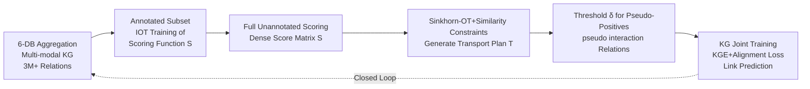

# KGOT: Unified Knowledge Graph and Optimal Transport Pseudo-Labeling for Molecule-Protein Interaction Prediction

**Conference**: ICLR 2026  
**OpenReview**: [https://openreview.net/forum?id=UoYdZQIZWj](https://openreview.net/forum?id=UoYdZQIZWj)  
**Code**: To be confirmed (anonymous repository mentioned in paper)  
**Area**: Computational Biology / Drug Discovery  
**Keywords**: Molecule-Protein Interaction, Optimal Transport, Pseudo-Labeling, Knowledge Graph, Virtual Screening, Semi-Supervised Learning  

## TL;DR
KGOT models "pseudo-labeling unannotated molecule-protein pairs" as an Optimal Transport (OT) matching problem. The generated transport plan is then written back as a new relation into a large-scale biological Knowledge Graph (KG) for joint training. This closed loop of OT + KG effectively mitigates label scarcity in MPI tasks, comprehensively outperforming docking and DrugCLIP in both virtual screening and link prediction.

## Background & Motivation
- **Background**: Molecule-Protein Interaction (MPI) prediction is a core task in drug discovery and molecular function annotation. With self-supervised pre-trained encoders like Uni-Mol and ESM, representation learning for molecules and proteins has matured. However, downstream MPI prediction remains limited by two factors.
- **Limitations of Prior Work ①—Label Scarcity**: Each new molecule-protein interaction requires validation through expensive and slow experiments (high-throughput screening, docking simulations). Existing datasets (e.g., PrimeKG, TDC) are small, biased toward specific protein families, and lack consistency in annotations, making it difficult for deep models to learn generalizable interaction patterns.
- **Limitations of Prior Work ②—Narrow Modalities**: Most methods only utilize molecular structures and protein sequences, ignoring biological contexts such as genetic variations, metabolic pathways, and functional annotations that also influence binding. Although large biological knowledge graphs (e.g., PrimeKG) aggregate heterogeneous entities, they contain almost no direct molecule-protein edges and are not specifically tailored for MPI.
- **Key Challenge**: Knowledge graphs can provide rich multi-modal context, and pseudo-labels can supplement scarce supervision signals. However, existing works either treat KGs as auxiliary features trained only on observed edges or utilize heuristic pseudo-labels, leading to a disconnection between the two and a lack of global consistency in pseudo-labels.
- **Goal**: Construct a unified framework that integrates multi-modal biological data and generates globally consistent high-quality pseudo-labels in a principled manner, allowing the two to enhance each other.
- **Core Idea**: **[Pseudo-labeling as Distribution Matching]** Instead of independent pair-wise judgments, Optimal Transport is used to perform global matching between molecule and protein distributions to generate pseudo-labels; **[OT↔KG Loop]** The OT transport plan is treated as a new `pseudo interaction` relation and written back into the KG. Joint training of KG embeddings and the retrieval model creates a closed loop between score learning, pseudo-label generation, and graph training.

## Method

### Overall Architecture
KGOT is a four-stage closed-loop pipeline: First, it aggregates six public databases to construct a multi-modal biological KG with over 3 million relations. Second, it trains a scoring function on the annotated molecule-protein subset using Inverse Optimal Transport (IOT). Third, it scores all unannotated pairs to obtain a dense score matrix and generates pseudo-labels using Sinkhorn-OT with similarity constraints. Finally, pseudo-labels are written back to the KG as new relations for joint link prediction with original edges.

### Key Designs

**1. Inverse Optimal Transport for Scoring Function Training: Upgrading contrastive learning to transport plan alignment.** The scoring function is defined as $S(x,y)=W(f(x)\oplus g(y))$, where $f,g$ are Uni-Mol pre-trained encoders, $\oplus$ denotes concatenation, and $W$ is trainable. During training, a ground-truth cost matrix $C_{gt}(i,j)=0$ (for positive pairs where $j=i$) or $1$ (for negatives) is constructed for a batch of $N$ samples. The theoretical optimal transport matrix $T_{gt}$ is solved via Sinkhorn-Knopp. Then, $T_{pred}$ is derived from the predicted scores as $C_{pred}(i,j)=1-S(x_i,y_j)$, and the KL divergence between the two is minimized: $L_{score}=\mathrm{KL}(T_{pred}\Vert T_{gt})$. The authors point out that InfoNCE contrastive learning is a special case of this framework, while explicitly aligning transport plans better models global matching structures.

**2. OT Pseudo-Label Generation with Molecular Similarity Constraints: Ensuring pseudo-labels match scores while respecting chemical similarity.** Given $M$ molecules and $N$ proteins in the full graph, the transport plan $T$ is sought using $C_{ij}=1-S_{ij}$ as the cost and uniform distributions $r_i=1/M, c_j=1/N$ as marginals. A key innovation is the introduction of an additional constraint: using a pre-trained encoder to calculate pairwise molecular cosine similarity $\mathrm{Sim}_{i,k}$, and requiring the similarity induced by pseudo-labels $\mathrm{Sim}^T_{i,k}=\sum_j T_{i,j}T_{k,j}$ to be as close as possible to $\mathrm{Sim}_{i,k}$. The objective is rewritten as $\min_T \sum_{i,j}T_{i,j}C_{i,j}+\lambda\sum_{i,k}(\mathrm{Sim}_{i,k}-\mathrm{Sim}^T_{i,k})^2$ (where $\lambda=0.1$). This constraint injects chemical priors, ensuring similar molecules receive similar protein pseudo-labels and suppressing noise.

**3. Sinkhorn Iteration + Alternate Gradient Correction: Incorporating non-standard similarity terms into entropy-regularized OT.** Standard entropy-regularized OT $\min_T \sum T_{i,j}C_{i,j}+\epsilon\sum T_{i,j}\log T_{i,j}$ (where $\epsilon=0.01$) can be solved via closed-form Sinkhorn iterations. However, the quadratic similarity term disrupts this structure. The authors utilize alternating optimization: first running several Sinkhorn steps ($u\leftarrow r/(Kv)$, $v\leftarrow c/(K^\top u)$, $T=\mathrm{diag}(u)K\mathrm{diag}(v)$) to approximate marginal constraints, then applying a correction step $T\leftarrow T-\eta\nabla T$ according to the similarity term gradient $\nabla T_{i,j}=2\lambda\sum_k(\mathrm{Sim}_{i,k}-\mathrm{Sim}^T_{i,k})T_{k,j}$, and finally projecting back onto the feasible set. High-confidence pseudo-positives are extracted by thresholding the transport quality $P_\delta=\{(x_i,y_j)\mid T_{ij}\ge\delta\}$ (where $\delta=0.5$).

**4. Unified OT↔KG Link Prediction Framework: Treating pseudo-labels as graph relations.** The extracted pseudo-label matrix $T$ is encoded as a brand-new relation `pseudo interaction` within the KG and fed into KG embedding (KGE) models alongside all real observed edges. Optimization uses a multi-objective loss: a graph embedding loss for KG triplets and an alignment term for predicted interaction scores against the pseudo-label matrix. This design is model-agnostic—PairRE, RotatE, MuRE, TorusE, and ComplEx-FF can all be used. To prevent data leakage, a set of disjoint molecule-protein edges is reserved for evaluation and excluded from pseudo-label generation and training; virtual screening also includes filters for scaffold similarity and sequence identity.

## Key Experimental Results

### Main Results: Virtual Screening (zero-shot)

DUD-E Benchmark (102 protein targets, 22,886 active pairs):

| Model | AUROC (%) | BEDROC (%) | EF@0.5% | EF@1% | EF@2% |
|---|---|---|---|---|---|
| Glide-SP (docking) | 76.70 | 40.70 | 19.39 | 16.18 | 7.23 |
| Vina (docking) | 71.60 | – | 9.13 | 7.32 | 4.44 |
| Planet | 71.60 | – | 10.23 | 8.83 | 5.40 |
| DrugCLIP | 80.93 | 50.52 | 38.07 | 31.89 | 10.66 |
| **KGOT** | **83.45 ± 0.42** | **51.20 ± 0.35** | **39.10 ± 0.50** | **33.00 ± 0.47** | **11.20 ± 0.30** |

LIT-PCBA Benchmark (more difficult, 15 targets, 7,844 active vs 407,381 inactive):

| Model | AUROC (%) | BEDROC (%) | EF@0.5% | EF@1% | EF@5% |
|---|---|---|---|---|---|
| Gnina | 60.93 | 5.40 | – | 4.63 | – |
| BigBind | 60.80 | – | – | 3.82 | – |
| DrugCLIP | 57.17 | 6.23 | 8.56 | 5.51 | 2.27 |
| **KGOT** | **62.45 ± 0.38** | **6.52 ± 0.22** | **9.12 ± 0.40** | **5.90 ± 0.28** | **2.50 ± 0.15** |

### Link Prediction: Pseudo-label Enhancement (Hits@K, 60,000 held-out real edges)

| Method | Hits@1 | Hits@3 | Hits@5 |
|---|---|---|---|
| RotatE | 48.5% | 61.6% | 66.6% |
| RotatE + KGOT | 52.0% | 63.9% | 68.0% |
| TorusE | 49.4% | 64.2% | 70.0% |
| TorusE + KGOT | 53.4% | 65.2% | **74.9%** |
| ComplEx-FF | 30.8% | 40.2% | 44.4% |
| ComplEx-FF + KGOT | **43.6%** | 54.3% | 58.6% |

### Ablation Study
The paper reports three types of ablations (see Appendix E for details), with trends consistently showing positive contributions from each component:

| Ablation Dimension | Conclusion |
|---|---|
| OT loss vs InfoNCE | OT loss outperforms standard InfoNCE contrastive loss |
| Pseudo-label Strategy | OT + similarity constrained pseudo-labels achieve best Hits@5 |
| Multi-source Knowledge Integration | Incremental addition of GO, protein family, and pathway relations yields Hits@1 gains |

### Key Findings
- Improvements in early recognition metrics (BEDROC, EF) are particularly significant, indicating that OT-guided pseudo-labels are better at ranking active molecules at the top—a primary concern in virtual screening.
- Pseudo-label enhancement is effective across all five KGE architectures (e.g., ComplEx-FF Hits@1 jumped from 30.8% to 43.6%), validating the model-agnostic claim.
- Even on the more difficult LIT-PCBA benchmark, gains remained stable, demonstrating the strong generalization of the OT + KG paradigm.

## Highlights & Insights
- **Unified Semantics**: Utilizes an OT perspective to explain both scoring function training (Inverse OT, where InfoNCE is a special case) and pseudo-label generation (Forward OT), using the Sinkhorn toolchain for both, which is theoretically elegant.
- **Pseudo-labels as Relations**: Writing the transport plan back to the KG as a `pseudo interaction` relation is a simple yet clever interface—allowing any existing KGE model to benefit from pseudo-labels without architectural changes.
- **Similarity Constraints Inject Chemical Priors**: Using $\mathrm{Sim}^T_{i,k}=\sum_j T_{i,j}T_{k,j}$ to enforce the idea that "similar molecules should have similar binding profiles" within the OT objective is an effective regularization for pure score-driven pseudo-labeling.
- **Robust Leakage Control**: Tanimoto/Murcko scaffold filtering + MMseqs2 sequence identity + Pfam family-out ensure that zero-shot evaluation reliability is higher than works that only use random partitioning.

## Limitations & Future Work
- **Scalability of OT Solving**: The memory and time overhead for an $M\times N$ transport matrix with alternating gradient corrections at a million-molecule/protein scale was not fully stress-tested; practical deployment may require chunking or low-rank approximations.
- **Uniform Marginal Assumption**: Both source and sink distributions assume uniformity to force "balanced coverage," but real biological molecule/protein interaction degrees are highly long-tailed.
- **Single Pseudo-label Confidence**: Only a hard threshold $\delta=0.5$ is used to extract pseudo-positives; the continuous confidence of the transport quality is not utilized for weighted training.
- **Lack of End-to-End Training**: The four-stage process is a sequential pipeline rather than fully end-to-end; the scoring function and KG training are separated.
- **Multi-objective Loss Details in Appendix**: The main text provides only qualitative descriptions of the multi-objective loss for KG training, making reproduction dependent on Appendix F.

## Related Work & Insights
- **DrugCLIP**: The strongest baseline, using contrastive learning for cross-modal molecular-protein retrieval. KGOT improves AUROC by approximately 2.5% through OT pseudo-labels and KG context, showing that "contrastive retrieval + global OT matching" can be stacked.
- **Inverse Optimal Transport (Shi et al. 2023)**: Directly inspired the scoring function training. The perspective of incorporating contrastive learning into the IOT framework is worth migrating to other retrieval tasks.
- **Biological KGs like PrimeKG**: Provided multi-modal entities but lacked direct MPI edges. KGOT's approach—using pseudo-labels to "fill" missing edges—is a generalizable strategy for KG completion in data-scarce biological tasks.
- **Semi-supervised + Sinkhorn Pseudo-labels (e.g., SwAV)**: KGOT adapts the OT clustering pseudo-label idea from vision self-supervision to biomolecular retrieval and adds chemical similarity constraints, demonstrating the value of cross-domain method migration.

## Rating
- **Novelty**: ⭐⭐⭐⭐ — Unifying scoring training (Inverse OT) and pseudo-labeling (Forward OT) while treating the plan as a KG relation is a novel combination; individual components are not new, but the integration is self-consistent.
- **Experimental Thoroughness**: ⭐⭐⭐⭐ — Covers two virtual screening benchmarks, link prediction across five KGEs, and solid leakage control. However, scalability and marginal distribution assumptions lack stress testing.
- **Writing Quality**: ⭐⭐⭐⭐ — Clear motivation and articulation of what is new; includes complete formulas and pseudo-code. Multi-objective loss in the main text is somewhat brief.
- **Value**: ⭐⭐⭐⭐ — Provides a practical, model-agnostic paradigm for MPI tasks with scarce labels, holding direct utility for virtual screening and potential for migration to other data-sparse computational biology problems.

<!-- RELATED:START -->

## Related Papers

- [\[ICLR 2026\] Optimal Transport Unlocks End-to-End Learning for Single-Molecule Localization](optimal_transport_unlocks_end-to-end_learning_for_single-molecule_localization.md)
- [\[ICLR 2026\] Fast and Interpretable Protein Substructure Alignment via Optimal Transport](fast_and_interpretable_protein_substructure_alignment_via_optimal_transport.md)
- [\[ICLR 2026\] WFR-FM: Simulation-Free Dynamic Unbalanced Optimal Transport](wfr-fm_simulation-free_dynamic_unbalanced_optimal_transport.md)
- [\[ICLR 2026\] RankFlow: Property-aware Transport for Protein Optimization](rankflow_property-aware_transport_for_protein_optimization.md)
- [\[ICLR 2026\] I2Mole: Interaction-aware Invariant Molecular Learning for Generalizable Drug-Drug Interaction Prediction](i2mole_interaction-aware_invariant_molecular_learning_for_generalizable_property.md)

<!-- RELATED:END -->
