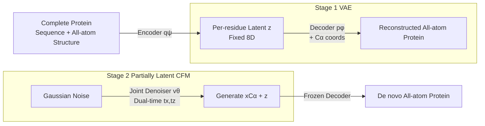

# La-Proteina: Atomistic Protein Generation via Partially Latent Flow Matching

**Conference**: ICLR 2026  
**OpenReview**: [https://openreview.net/forum?id=RDerF20JYT](https://openreview.net/forum?id=RDerF20JYT)  
**Code**: [https://research.nvidia.com/labs/genair/la-proteina/](https://research.nvidia.com/labs/genair/la-proteina/)  
**Area**: Computational Biology / Protein Generation  
**Keywords**: All-atom protein design, partially latent variables, flow matching, joint sequence-structure generation, motif scaffolding  

## TL;DR
La-Proteina utilizes a "partially latent" representation—explicitly modeling $\alpha$-carbon coordinates while compressing other atomistic details and sequences into a fixed-dimension per-residue latent variable. This approach transforms the mixed discrete-continuous and variable-dimension challenge of all-atom protein modeling into a pure continuous, fixed-dimension problem. By applying flow matching to jointly generate sequences and all-atom structures, it achieves SOTA performance in all-atom co-designability, diversity, and structural plausibility, scaling effectively to proteins up to 800 residues.

## Background & Motivation
**Background**: De novo protein design requires capturing the relationship between sequence and structure. However, mainstream methods often decouple them—either generating sequences followed by folding or designing backbones followed by inverse folding. Methods for direct joint modeling of sequences and all-atom structures remain scarce.

**Limitations of Prior Work**: Joint all-atom generation is inherently difficult due to three factors: (1) the need to simultaneously handle discrete sequences (20 amino acids) and continuous coordinates; (2) sidechain atom counts vary by amino acid type, leading to **sequence-dependent dimensionality**; (3) networks explicitly modeling all atoms consume massive memory, hindering scalability to long proteins (e.g., P(all-atom) requires >140GB VRAM for a single 500-residue sample).

**Key Challenge**: Modeling directly in data-space struggles with precision and scalability, while fully-latent approaches are conceptually elegant but often suffer from inferior empirical performance. Neither path has effectively combined high-quality backbone generation frameworks with atomistic detail modeling.

**Goal**: To solve the additional challenges of all-atom modeling cleanly while utilizing mature backbone generation frameworks, achieving high quality, scalability, and support for atom-level structural conditional design tasks like motif scaffolding.

**Core Idea**: **Partially latent representation**. The model explicitly retains $\alpha$-carbon coordinates as a global backbone while compressing the sequence and all non-$\alpha$-carbon atom coordinates into a **fixed 8-dimensional continuous latent variable $z$ per residue**. Consequently, the main generative component operates in a "fixed-dimension, purely continuous" space suitable for efficient flow matching. The complexity of discrete and variable dimensions is offloaded to a VAE encoder/decoder.

## Method

### Overall Architecture
La-Proteina is trained in two stages. The first stage trains a VAE: the encoder maps the complete protein ($x_{C\alpha}, x_{\neg C\alpha}, s$) to a fixed-dimension per-residue latent $z$, while the decoder reconstructs the sequence and all-atom structure given $z$ and $x_{C\alpha}$ coordinates. The second stage freezes the VAE and trains a flow matching denoiser to jointly generate $(x_{C\alpha}, z)$ in the partially latent space. During inference, $(x_{C\alpha}, z)$ are sampled via the flow model and then reconstructed into a full all-atom protein via the decoder. The three networks (Encoder ~130M, Decoder ~130M, Denoiser ~160M) share a transformer architecture with pair-biased attention.

### Key Designs

**1. Partially Latent Decomposition: Offloading mixed-modality challenges to VAE.** The model learns the latent distribution $p_{\theta,\phi}(x_{C\alpha}, x_{\neg C\alpha}, s, z)=p_\theta(x_{C\alpha}, z)\,p_\phi(x_{\neg C\alpha}, s\mid x_{C\alpha}, z)$. The first term $p_\theta(x_{C\alpha}, z)$ is defined in a continuous, per-residue, fixed-dimension space, which is handled by flow matching. The second term is the VAE decoder, responsible for mapping latents back to "sequence + non-$\alpha$-carbon atoms." Key insight: once conditioned on both $\alpha$-carbon coordinates and an expressive latent $z$, the decoding distribution can be approximated by simple factorized forms—categorical for sequence $p_\phi(s\mid x_{C\alpha}, z)$ and unit-variance factorized Gaussian for non-$\alpha$-carbon coordinates $p_\phi(x_{\neg C\alpha}\mid x_{C\alpha}, z)$. To handle varying sidechain atom counts, the decoder outputs a fixed $[L,37,3]$ Atom37 tensor, and atoms are selected based on the sequence (ground truth during training, predicted during inference). The VAE is trained with a $\beta$-weighted ELBO ($\beta=10^{-4}$ with a standard isotropic Gaussian prior), where reconstruction terms simplify to sequence cross-entropy and structural L2 loss. **Why not put $\alpha$-carbons into the latent space?** Ablations show significantly worse performance—retaining an explicit backbone is critical to leveraging high-performance backbone modeling frameworks.

**2. Dual-time Partially Latent Flow Matching: Synchronizing backbone and details.** The denoiser $v_\theta(x_{C\alpha}^{t_x}, z^{t_z}, t_x, t_z)$ uses **two independent interpolation times** $t_x, t_z$ instead of a single coupled time $t$. The CFM objective is:
$$\min_\theta \mathbb{E}\big[\,\|v_\theta^x - (x_{C\alpha}-x_{C\alpha}^0)\|^2 + \|v_\theta^z - (z-z^0)\|^2\,\big].$$
Independent times allow for **different discretization/integration schedules** for $\alpha$-carbons and latents during inference, which is vital for high performance. Forcing two modalities to synchronize via a single time yields notably worse results. The time sampling distribution is designed as $p_{t_x}=0.02\,\text{Unif}(0,1)+0.98\,\text{Beta}(1.9,1)$ and $p_{t_z}=0.02\,\text{Unif}(0,1)+0.98\,\text{Beta}(1,1.5)$, ensuring $(t_x, t_z)$ pairs where $t_x > t_z$ (backbone generated faster than details) are sampled more frequently.

**3. Stochastic Sampler + Independent Scheduling.** Since Gaussian flows are used, the intermediate density score $\zeta$ can be estimated from $v_\theta$, enabling a stochastic sampler. Generation simulates a pair of SDEs from $(t_x,t_z)=(0,0)$ to $(1,1)$:
$$dx_{C\alpha}^{t_x}=v_\theta^x\,dt_x+\beta_x(t_x)\zeta_x\,dt_x+\sqrt{2\beta_x(t_x)}\,\eta_x\,dW_{t_x},$$
and similarly for $z$. Here $\beta_x, \beta_z$ adjust Langevin thermalization strength, while noise scaling $\eta_x, \eta_z \le 1$ controls injected noise magnitude (typical in protein design to trade diversity for higher designability). Euler-Maruyama simulation with $\alpha$-carbons generated at a faster rate than latents is empirically superior.

**4. Scalability via Omitting Triangular Updates.** The main model deliberately omits the computationally/memory-intensive triangular multiplicative update layers used in AlphaFold, relying on an efficient transformer to achieve high performance. This allows scaling to large datasets (~46M structure-sequence pairs) and long proteins (up to 896 residues). Triangular layers can be optionally added back (`tri` variants) to further improve pair representation and co-designability at the cost of diversity and scalability. The latents act as "extra channels" on $\alpha$-carbon coordinates and do not increase sequence length.

## Key Experimental Results

### Main Results (Unconditional All-atom Generation, Length 100–500)

| Method | All-atom Co-designability(%) ↑ | $C\alpha$ Co-designability(%) ↑ | Diversity(Clusters) ↑ | Designability(%) ↑ |
|---|---|---|---|---|
| P(all-atom) | 36.7 | 37.9 | 148/165 | 57.9 |
| Protpardelle-1c | 35.8 | 44.8 | 138/61 | 62.0 |
| APM | 19.0 | 32.2 | 64/59 | 61.8 |
| PLAID | 11.0 | 19.2 | 38/27 | 37.6 |
| ProteinGenerator | 9.8 | 17.8 | 28/24 | 54.2 |
| Protpardelle | 8.8 | 35.2 | 37/21 | 56.2 |
| **La-Proteina (0.1,0.1)** | **68.4** | 72.2 | 216/301 | 93.8 |
| **La-Proteina tri (0.1,0.1)** | **75.0** | **78.2** | 199/247 | 94.6 |

Ours significantly outperforms all baselines in co-designability, designability, and diversity while remaining competitive in novelty. The `tri` variant achieves higher co-designability but lower diversity.

### Ablation Study (Core Design Effectiveness)

| Ablation Component | Setting | Conclusion |
|---|---|---|
| $C\alpha$ in latent space | Explicit $C\alpha$ vs. Latent $C\alpha$ | Fully latent significantly worse; confirms "partially latent" superiority. |
| Time Coupling | Dual-time $(t_x,t_z)$ vs. Single time $t$ | Single time synchrony significantly degrades quality. |
| Discretization Schedule | $C\alpha$ faster than $z$ vs. others | Backbone-first schedule yields optimal (co-)designability. |
| Noise scale $\eta$ | Various $(\eta_x,\eta_z)$ values | Lower scale increases co-designability but reduces diversity; tunable trade-off. |

### Key Findings
- **Long Protein Scalability**: Trained on ~46M samples, La-Proteina leads in (co-)designability and diversity for 300–800 residues. Above 500 residues, all other all-atom baselines **collapse** (fail to produce co-designable samples), while P(all-atom) is limited by VRAM (>140GB per sample). It even exceeds the previous backbone-only SOTA (Proteina).
- **Biophysical Quality**: MolProbity metrics (MP score, clash score, Ramachandran outliers, covalent bond outliers) are superior to baselines. Sidechain dihedral distributions (e.g., TRP $\chi_1$) accurately recover major rotamer states and frequencies, where baselines often miss modes or place atoms in implausible regions.
- **Atomistic Motif Scaffolding**: On 26 tasks, La-Proteina solves 21–25 (depending on all-atom/tip-atom, indexed/unindexed), far exceeding Protpardelle (4/26) and outperforming Protpardelle-1c in 21/26. It also supports the more difficult unindexed setting.

## Highlights & Insights
- **The "Partially Latent" Strategic Positioning**: By avoiding both fully explicit (poor scalability) and fully latent (poor performance) extremes, it combines mature backbone modeling strengths with the capacity of latents to absorb mixed modalities.
- **Unified Dimensioning**: Fixed 8D latents + Atom37 output effectively eliminates "sequence-dependent sidechain dimensionality" from the generative core, permitting pure continuous flow matching.
- **Dual-time Decoupling**: Applying different sampling schedules to different modalities is a simple but powerful performance lever, applicable to general multi-modal joint generation.
- **Scalability via Subtraction**: Removing triangular layers rather than increasing compute allows entry into the 800-residue regime that baselines cannot reach.

## Limitations & Future Work
- **Two-stage Training**: The VAE and flow model are trained separately; latent space quality is limited by the first stage. End-to-end optimization is a potential future direction.
- **Denoising Sampling Costs**: $\eta \le 1$ improves co-designability but sacrifices diversity, requiring manual tuning of the trade-off.
- **Triangular Layer Trade-off**: Improving co-designability via triangular layers sacrifices scalability and diversity; a more balanced solution is needed.
- **Task Scope**: This work focuses on unconditional monomer generation and motif scaffolding; PPI and binder design are left for future work.

## Related Work & Insights
- **Backbone Generation Lineage**: RFDiffusion and Chroma focused on backbones. Successors diverged into $SO(3)$ manifold diffusion and Euclidean flow matching (FrameFlow, Proteina). La-Proteina builds on the transformer architecture of Proteina (Geffner et al., 2025).
- **All-atom/Co-design**: Data-space routes (P(all-atom), APM, Protpardelle) vs. latent routes (PLAID, McPartlon et al.) are the two main camps. La-Proteina's "partially latent" approach is a synthesis and improvement over both.
- **Latent Generation Paradigm**: Philosophically follows Stable Diffusion/LSGM by compressing data before applying generative modeling, but innovates by partial compression.

## Rating
- **Novelty**: ⭐⭐⭐⭐⭐ — "Partially latent + dual-time flow matching" is a clear and original reformulation of all-atom protein representation.
- **Experimental Thoroughness**: ⭐⭐⭐⭐⭐ — Comprehensive coverage across unconditional generation, 800-residue scaling, biophysical validation, and 26 motif scaffolding tasks.
- **Writing Quality**: ⭐⭐⭐⭐ — Rationales for designs are clear; figures are effective, though some sampling details reside in the appendix.
- **Value**: ⭐⭐⭐⭐⭐ — Sets new SOTA across multiple metrics (co-designability, long proteins, atomistic scaffolding) with public code and project page.

<!-- RELATED:START -->

## Related Papers

- [\[ICLR 2026\] Riemannian Variational Flow Matching for Material and Protein Design](riemannian_variational_flow_matching_for_material_and_protein_design.md)
- [\[ICML 2026\] LineageFlow: Flow Matching for High-Fidelity Family-Aware Protein Sequence Generation](../../ICML2026/computational_biology/lineageflow_flow_matching_for_high-fidelity_family-aware_protein_sequence_genera.md)
- [\[ICLR 2026\] FragFM: Hierarchical Framework for Efficient Molecule Generation via Fragment-Level Discrete Flow Matching](fragfm_hierarchical_framework_for_efficient_molecule_generation_via_fragment-lev.md)
- [\[ICLR 2026\] Flow Autoencoders are Effective Protein Tokenizers](flow_autoencoders_are_effective_protein_tokenizers.md)
- [\[ICLR 2026\] Multi-Marginal Flow Matching with Adversarially Learnt Interpolants](multi-marginal_flow_matching_with_adversarially_learnt_interpolants.md)

<!-- RELATED:END -->
