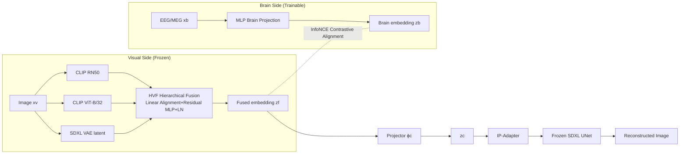

# Learning Brain Representation with Hierarchical Visual Embeddings

**Conference**: ICLR 2026  
**OpenReview**: [https://openreview.net/forum?id=IEq71qS8B7](https://openreview.net/forum?id=IEq71qS8B7)  
**Code**: TBD  
**Area**: Neuroscience / Visual Brain Decoding / Cross-modal Alignment  
**Keywords**: Brain signal decoding, EEG/MEG, Hierarchical visual representation, Contrastive learning, Fusion Prior, Diffusion reconstruction  

## TL;DR
This work constructs a "hierarchical visual representation" as an alignment target by combining multiple pre-trained visual encoders with different inductive biases (CLIP semantics + VAE pixels). A Fusion Prior, pre-trained on large-scale images, is employed to stably map fused features to diffusion conditions. This allows EEG/MEG brain signals to align with both high-level semantics and low-level pixels, balancing zero-shot retrieval accuracy and reconstruction fidelity.

## Background & Motivation
- **Background**: Decoding visual content from brain signals (fMRI/EEG/MEG) is a cross-disciplinary hotspot in neuroscience and AI. While fMRI offers high spatial resolution, its low temporal resolution limits its utility compared to EEG/MEG, which provide millisecond-level resolution and larger data scales suitable for retrieval. The mainstream approach utilizes contrastive learning to align brain signals with a strong visual prior (CLIP semantic embeddings or VAE pixel latents) as the decoding target.
- **Limitations of Prior Work**: Most existing methods align with only a **single** visual feature—either high-level semantics (CLIP) or low-level pixels (VAE). Aligning with CLIP preserves "what the object is" but loses low-level details like color, texture, and layout. This restricts reconstruction fidelity and hinders the assessment of how much visual information is actually encoded in brain signals. Even recent improvements like Blur Prior (UBP) or depth information (CognitionCapturer) remain primarily at the semantic level.
- **Key Challenge**: There exists a **structural gap** between the temporal dynamics of brain signals and the hierarchical organization of visual representations. Directly aligning brain signals to a single visual feature fails to capture the multi-scale representations shared by both.
- **Goal**: Construct a hierarchical visual representation that spans from "pixel details to high-level semantics" as the alignment target, and solve the instability of diffusion models when conditioned on fused features to achieve a balance between retrieval accuracy and reconstruction fidelity.
- **Core Idea**: **[Hierarchical Fusion]** Use $K$ pre-trained encoders with different inductive biases to construct multi-scale visual tokens for alignment via contrastive learning. **[Fusion Prior]** Pre-train a stable, text-free mapping from fused features to diffusion conditions on large-scale images, then map brain embeddings to match this frozen prior to avoid representation drift.

## Method

### Overall Architecture
The proposed method, **Hierarchical Visual Fusion (HVF) + Fusion Prior**, consists of two pipelines. The retrieval pipeline aligns brain embeddings $z_b$ with fused visual embeddings $z_f$ using symmetric InfoNCE, performing nearest neighbor retrieval in the fused space during evaluation. The reconstruction pipeline pre-trains a "Fusion Prior" (HVF + Projector + IP-Adapter) on large-scale images. Once frozen, only the brain-side components are updated to project $z_b$ into $z_c$, which is injected into a frozen SDXL UNet for image generation. Visual encoders and the UNet remain frozen throughout, with only the brain-side modules being trained.

### Key Designs

**1. Hierarchical Visual Fusion (HVF): Enabling "Pixels + Semantics" in a single token.** The authors use $K=3$ pre-trained encoders to capture visual information at different scales: high-level semantics utilize multiple CLIP encoders (ViT [CLS] and ResNet pooled projection), while low-level details are captured by the SDXL VAE encoder. The VAE encoder outputs a latent of $[H/8, W/8, 4]$, which is flattened into a vector of length $HW/16$ to preserve local structure and pixel details. Each encoder is aligned to a shared dimension $d=1024$ via a learned linear mapping $W_v^{(k)}\in\mathbb{R}^{d_k\times d}$: $\bar{z}_v=\sum_{k=1}^{K}z_v^{(k)}W_v^{(k)}$, followed by a post-norm residual MLP fusion: $z_f=\text{LayerNorm}(\bar{z}_v+\phi_v(\bar{z}_v))$. A key insight is that semantic encoders like CLIP inherently fail to capture fine-grained local information; stacking semantic encoders (RN50+B32) yields minimal gains. **The inclusion of VAE pixel latents is what significantly boosts retrieval accuracy**, serving as a core scientific finding of the study.

**2. Symmetric InfoNCE for Alignment.** On the brain side, an MLP Brain Projection (MBP) is used. Pre-processed brain signals are flattened into $x_b'\in\mathbb{R}^{C\cdot T}$ and aligned to the visual width via $W_b\in\mathbb{R}^{CT\times d}$, followed by a residual structure identical to the visual side: $z_b=\text{LayerNorm}(\bar{z}_b+\phi_b(\bar{z}_b))$. Alignment is performed using CLIP-style InfoNCE: cosine similarity logits $s_{ij}=\hat{z}_b^{(i)\top}\hat{z}_f^{(j)}/\tau$ are calculated after L2 normalization (with learnable temperature $\tau$ starting at 0.07). The loss is the symmetric average of cross-entropy in both row and column directions. Symmetry is crucial as it pulls matching pairs together from both directions, significantly improving cross-subject generalization.

**3. Fusion Prior: Domesticating fused features into stable diffusion conditions.** The authors observed that feeding fused representations directly into diffusion models for reconstruction leads to unstable outputs. This is caused by the **lack of a stable conditional prior**, where brain-driven features do not yet fall within the distribution expected by the generative model. The solution is a two-stage approach: first, pre-train a Fusion Prior on large-scale images (ImageNet-1k). $z_f$ is passed through a projector to obtain $z_c=z_f+\phi_c(z_f)$ (hidden layer 4096), and $z_c$ is injected into the frozen SDXL UNet via decoupled cross-attention using an IP-Adapter. The standard diffusion noise prediction loss $L_{prior}=\|\epsilon-\delta(x_t,t,z_c)\|_2^2$ is minimized with **empty text prompts**, forcing the model to learn a text-free mapping from "fused features to diffusion conditions." After pre-training, HVF, the projector, IP-Adapter, and UNet are frozen, and only the brain encoder (MBP) is updated using InfoNCE to map $z_b$ into this stable pre-trained space. This design prevents representation drift during brain-side training.

## Key Experimental Results

### Main Results

200-way zero-shot retrieval Top-1/Top-5 accuracy (%), THINGS-EEG / THINGS-MEG:

| Method | EEG In-Subj T1/T5 | EEG Cross-Subj T1/T5 | MEG In-Subj T1/T5 | MEG Cross-Subj T1/T5 |
|---|---|---|---|---|
| NICE | 16.1/43.6 | 6.2/21.4 | 12.8/36.0 | – |
| MB2C / ATM | 28.5/60.4 | 11.8/33.7 | – | – |
| CC-All | 35.6/80.2 | – | – | – |
| UBP (Strongest baseline) | 50.9/79.7 | 12.4/33.4 | 26.7/55.2 | 2.2/10.4 |
| **Ours** | **75.7/94.6** | **20.0/44.1** | **33.7/60.5** | **5.4/15.2** |

Reconstruction Quality (EEG, higher is better except for SwAV):

| Method | PixCorr↑ | AlexNet(5)↑ | Inception↑ | CLIP↑ | SwAV↓ |
|---|---|---|---|---|---|
| C.C.(All) | 0.150 | 0.623 | 0.669 | 0.715 | 0.590 |
| **Ours (EEG avg)** | **0.195** | **0.905** | **0.756** | **0.808** | **0.554** |
| ATM (subj-8) | 0.160 | 0.866 | 0.734 | 0.786 | 0.582 |
| **Ours (subj-8)** | **0.227** | **0.924** | **0.796** | **0.826** | **0.531** |

### Ablation Study

Ablation of visual encoder combinations for EEG retrieval (Top-1/Top-5, In-Subj / Cross-Subj):

| Configuration | In-Subj T1/T5 | Cross-Subj T1/T5 |
|---|---|---|
| B32 (Single Semantic) | 52.2/83.3 | 13.3/33.9 |
| RN50 (Single Semantic) | 48.1/80.4 | 12.7/31.7 |
| VAE (Single Pixel) | 44.3/75.2 | 10.2/23.9 |
| RN50+B32 (Dual Semantic) | 56.9/86.1 | 14.4/36.8 |
| B32+VAE (Semantic+Pixel) | 73.6/94.3 | 19.1/41.2 |
| **RN50+B32+VAE (Full)** | **75.7/94.6** | **20.0/44.1** |

Fusion Prior combination ablation for reconstruction: H14+B32+VAE achieved the highest PixCorr (0.195), while pure H14+VAE performed worst (0.173), indicating that semantic encoders remain the skeleton for reconstruction semantic consistency.

### Key Findings
- **VAE pixel latents are key to retrieval accuracy**: Adding a second semantic encoder (RN50+B32) only increased performance from 52.2 to 56.9, but adding VAE (B32+VAE) resulted in a leap to 73.6. This proves brain signals encode low-level visual details simultaneously; semantics or pixels alone cannot recover the full brain-visual structure.
- **Maximized Cross-Subject Gains**: Compared to UBP, the improvement in cross-subject settings is most significant, suggesting fused representations provide stronger generalization across participants.
- **Plug-and-play**: The framework is robust to different brain encoder backbones (ShallowNet/DeepNet/EEGNet), indicating the method is not sensitive to the specific brain-side architecture.

## Highlights & Insights
- Transfers the neuroscience question of "how much visual information is encoded in brain signals" into a quantifiable engineering discovery: **adding VAE pixel latents to semantic encoders consistently improves decoding performance**, providing a scientific conclusion rather than merely higher scores.
- The two-stage design of Fusion Prior—pre-training stable diffusion conditions before aligning the brain—effectively decouples "brain signal noise" from "diffusion generation stability."
- The scheme is text-free, plug-and-play, and efficient; visual and UNet components are frozen, with only the brain side being trained (25 epochs on a single GPU for retrieval).

## Limitations & Future Work
- The pre-training cost for Fusion Prior is relatively high (100k steps on ImageNet-1k, approximately 15 hours on 2 GPUs per config); changing the diffusion backbone or encoder combination requires re-training.
- Encoder combinations are determined manually via ablation studies; there is a lack of an automated mechanism for selecting or weighting hierarchical features.
- Remains limited to controlled stimulus datasets like THINGS-EEG/MEG; absolute accuracy for cross-subject MEG is still low (Top-1 only 5.4%), indicating a gap for real-world open-scenario decoding.
- While flattening VAE latents preserves local structure, the optimality of this method and whether spatial arrangement information is lost are not deeply explored.

## Related Work & Insights
- **Brain Visual Decoding**: NICE, ATM (Adaptive Thinking Mapper), MB2C, UBP (Uncertainty-aware Blur Prior), CognitionCapturer—ours differs by upgrading from "aligning single visual features" to "aligning hierarchical fusion features."
- **Cross-modal Contrastive Learning**: CLIP/ALIGN-style InfoNCE dual encoders are standard for brain-visual alignment, but the "modality gap" and sensitivity to noisy pairs are known issues; this work uses Fusion Prior to mitigate distribution inconsistency.
- **Diffusion Adapters**: IP-Adapter, ControlNet, T2I-Adapter—this work repurposes IP-Adapter as a lightweight bridge for injecting fusion tokens into frozen SDXL.
- **Insights**: When the information content of a modality (brain signals) is uncertain, it is more effective to assemble a hierarchical target from multiple complementary encoders and "pre-train for stability" before aligning the weak modality.

## Rating
- **Novelty**: ⭐⭐⭐⭐ — Hierarchical fusion (semantic + pixel) as an alignment target combined with the two-stage Fusion Prior is novel and addresses a genuine neuroscience question.
- **Experimental Thoroughness**: ⭐⭐⭐⭐ — Extensive testing across EEG/MEG, in/cross-subject settings, retrieval/reconstruction tasks, and various backbones provides solid conclusions, though limited to THINGS datasets.
- **Writing Quality**: ⭐⭐⭐⭐ — Clear motivation, complete formulas, self-consistent ablation logic, and well-organized figures.
- **Value**: ⭐⭐⭐⭐ — Significantly advances the SOTA in retrieval accuracy (EEG in-subject 50.9→75.7) and provides a reusable plug-and-play interface for brain-visual research.

<!-- RELATED:START -->

## Related Papers

- [\[ICLR 2026\] MindPilot: Closed-loop Visual Stimulation Optimization for Brain Modulation with EEG-guided Diffusion](mindpilot_closed-loop_visual_stimulation_optimization_for_brain_modulation_with_.md)
- [\[ICLR 2026\] TRIBE: Trimodal Brain Encoder for Whole-Brain fMRI Response Prediction](tribe_trimodal_brain_encoder_for_whole-brain_fmri_response_prediction.md)
- [\[NeurIPS 2025\] Generative Distribution Embeddings: Lifting Autoencoders to the Space of Distributions for Multiscale Representation Learning](../../NeurIPS2025/computational_biology/generative_distribution_embeddings_lifting_autoencoders_to_the_space_of_distribu.md)
- [\[ICLR 2026\] PETRI: Learning Unified Cell Embeddings from Unpaired Modalities via Early-Fusion Joint Reconstruction](petri_learning_unified_cell_embeddings_from_unpaired_modalities_via_early-fusion.md)
- [\[ICLR 2026\] TetraGT: Tetrahedral Geometry-Driven Explicit Token Interactions with Graph Transformer for Molecular Representation Learning](tetragt_tetrahedral_geometry-driven_explicit_token_interactions_with_graph_trans.md)

<!-- RELATED:END -->
