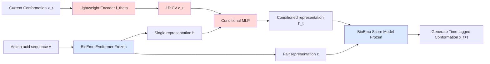

# Learning Collective Variables from BioEmu with Time-Lagged Generation

**Conference**: ICLR 2026  
**OpenReview**: [https://openreview.net/forum?id=1PYj4fMeLe](https://openreview.net/forum?id=1PYj4fMeLe)  
**Code**: To be confirmed  
**Area**: Computational Biology / Molecular Dynamics / Enhanced Sampling  
**Keywords**: Collective Variables (CV), Enhanced Sampling, BioEmu, Time-Lagged Generation, Protein Folding, Diffusion Models  

## TL;DR
The frozen protein generation foundation model BioEmu is re-purposed as a "time-lagged generator" — by providing it the current conformation $x_t$ and forcing it to generate the conformation $x_{t+\tau}$ after time $\tau$, a lightweight encoder is trained to automatically learn a 1D CV that encodes only slow degrees of freedom. These CVs can be directly applied to enhanced sampling methods such as OPES and Steered MD.

## Background & Motivation

**Background**: Molecular Dynamics (MD) integrates at femtosecond ($10^{-15}$ s) steps, while rare events like protein folding occur on microsecond to millisecond scales, separated by billions of integration steps, making them unobservable by naive MD. Enhanced sampling (metadynamics, REMD, OPES, etc.) accelerates the crossing of energy barriers by applying bias forces to the system based on low-dimensional descriptors called Collective Variables (CVs). The quality of CV encoding determines whether enhanced sampling can accurately drive folded/unfolded transitions.

**Limitations of Prior Work**: Traditional CVs rely on manual selection by domain experts (e.g., specific backbone dihedrals for Alanine Dipeptide), which can miss true slow modes and are restricted to small systems. Machine learning CVs (MLCV) have emerged — supervised methods (DeepLDA, DeepTDA) require predefined labels and RMSD thresholds, while self-supervised methods (DeepTICA, TAE, VDE) encode kinetic information from time-lagged data. However, most have only been validated on toy systems like alanine dipeptide, **lacking scalability to real protein scales and a unified, systematically comparable benchmark.**

**Key Challenge**: The training paradigm for self-supervised MLCVs (such as VDE using autoencoders to reconstruct $x_{t+\tau}$ from $x_t$) requires a powerful and scalable decoder. Training such a protein-level generative decoder from scratch is computationally expensive. Furthermore, existing methods often fail to meet the basic criterion of effectively distinguishing between folded and unfolded states in larger systems.

**Goal**: (1) Propose a simple, lightweight, and scalable framework to extract CVs from the latent representations of molecular foundation models; (2) Establish a systematic, head-to-head benchmark for MLCVs on fast-folding proteins much larger than alanine dipeptide (tasks include free energy difference estimation and transition path sampling).

**Core Idea**: **Re-purpose a foundation model** + **Time-lagged generation** — instead of training a decoder from scratch, the frozen BioEmu model, which already generates protein ensembles, is utilized as a decoder. Only a lightweight encoder is trained. The generation target is shifted from "reconstructing the current state" to "predicting the time-lagged state $x_{t+\tau}$," forcing the CV to retain only slow information shared between $x_t$ and $x_{t+\tau}$ while discarding fast stochastic fluctuations present in the current state.

## Method

### Overall Architecture
The method is termed **BIOEMU-CV**. It attaches a trainable lightweight encoder $f_\theta$ on top of a **frozen** protein foundation model, BioEmu. The encoder compresses the current conformation $x_t$ into a 1D CV $c_t = f_\theta(x_t)$, which is then integrated via a small MLP into BioEmu's single representation as a condition. The score network of BioEmu then generates the **time-lagged** conformation $x_{t+\tau}$ (instead of the current $x_t$) under this condition. Training only updates the encoder and the conditional MLP, while the BioEmu backbone remains frozen.

### Key Designs

**1. Re-purposing a frozen foundation model as a CV decoder: Leveraging BioEmu's generation capabilities.** BioEmu is a sequence-conditioned denoising diffusion model $g_\phi(x|A)$ capable of sampling multiple conformations from the equilibrium distribution $p(x|A)$ at all-atom resolution (distinguished from structure prediction models like AlphaFold that provide a single low-energy structure). It uses Evoformer to produce single representation $h$ and pair representation $z$ from amino acid tokens, and a score model to generate Cα coordinates and residue orientations. The authors' insight is: just as text-to-image diffusion models can use lightweight adapters (like ControlNet) to extract conditional representations, MLCVs can be viewed as "conditions driving molecular generation." Thus, instead of training a decoder from scratch, BioEmu is used as a pre-existing frozen decoder that understands protein physics. The **encoder only needs to output a low-dimensional condition that correctly guides BioEmu**, significantly reducing training costs and inheriting BioEmu's priors for protein conformational space.

**2. Time-lagged generation constraint: Forcing CVs to capture only slow degrees of freedom by "predicting the future."** This is the core of the method. After establishing the conditional path, the authors do not have the model reconstruct the current state. Instead, they encode the CV of the current conformation $x_t$ but require the score model to generate the time-lagged conformation $x_{t+\tau}$. Intuitively, $c_t$ must compress the **shared** information between $x_t$ and $x_{t+\tau}$ — namely, the slow-changing degrees of freedom. Fast fluctuations present only in $x_t$ that are randomized after $\tau$ provide no help in predicting the future and are discarded. This motivation is consistent with VDE, but the authors use a scalable diffusion architecture for the decoder and eliminate the need for VDE's extra auto-correlation loss, making training more concise.

**3. Lightweight conditioning + Denoising score-matching objective.** To keep the adapter lightweight and maintain the dimensions of the score model, a small MLP merges the encoder output $c_t$ with the single representation $h$ into a conditioned representation $h_t = \mathrm{MLP}(h, c_t)$. The pair representation $z$ remains unchanged. Both are fed into the score model. With BioEmu parameters $\phi$ frozen, only the encoder and conditioning MLP are updated using the denoising score-matching objective:

$$
\mathcal{L}(x_t, x_{t+\tau}, A) = \mathbb{E}_{s\sim U[0,1]}\Big[\lambda_s \big\| \nabla \log p_{s|0}\big(x^{(s)}_{t+\tau}\,\big|\,x^{(0)}_{t+\tau}, x_t, A\big) - g_\phi(s, h_t, z) \big\|^2 \Big]
$$

where $s$ is the diffusion time, $p_{s|0}$ is the density of $x^{(s)}_{t+\tau}$ given $x^{(0)}_{t+\tau}, x_t, A$, $\lambda_s$ is the time weighting, and $g_\phi$ is the BioEmu score network. This objective places the entire pressure of "reconstructing the time-lagged conformation" on the CV $c_t$, forcing it to encode slow degree-of-freedom representations suitable for enhanced sampling.

**4. 1D CV + Triple criteria constraint.** The CV dimension is fixed to 1 (for visualization and biasing convenience). The authors specify that the CV must meet three criteria for enhanced sampling: (i) low dimensional; (ii) captures the slow degrees of freedom of the system; (iii) distinguishes between the folded and unfolded states of the protein. After training, all MLCVs are normalized to $[-1,1]$ over the full DESRES trajectory, with the convention that the folded state corresponds to positive values for consistency in visualization and comparison.

## Key Experimental Results

Evaluation was performed on three fast-folding proteins (explicit water) significantly larger than alanine dipeptide: **Chignolin, Trp-cage, and BBA** (from DESRES long trajectories by Lindorff-Larsen et al.). Baselines included self-supervised MLCVs: DeepTICA, TAE, and VDE, all trained from scratch using the `mlcolvar` package with the same data and time lags. Inputs were rotation/translation-invariant Cα pairwise distances, and the CV dimension was fixed to 1.

### Main Results

**Task 1: Free energy difference estimation (1 µs OPES, explicit water)** — closer to reference $\Delta F_{ref}$ and smaller PMF MAE is better.  

| Protein | Method | $\Delta F_{ref}$ | $\Delta F$ | $\|\Delta F_{ref}-\Delta F\|$ ↓ | PMF MAE ↓ |
|------|------|------|------|------|------|
| Chignolin | DeepTICA | -3.73 | -2.02±3.65 | 1.71 | 2.64±3.80 |
| Chignolin | TAE | -3.79 | -1.26±3.69 | 2.53 | 3.15±2.81 |
| Chignolin | VDE | -17.24 | 0.24±5.00 | N/A | 4.09±3.20 |
| Chignolin | **BIOEMU-CV (Ours)** | -3.71 | -3.19±3.97 | **0.52** | 3.07±2.53 |
| Trp-cage | DeepTICA | 3.70 | 6.53±7.31 | 2.73 | 8.94±7.43 |
| Trp-cage | **BIOEMU-CV (Ours)** | 4.15 | 5.97±3.01 | **1.82** | **6.86±4.38** |
| BBA | DeepTICA | 2.76 | 13.95±13.28 | 11.19 | 10.51±5.85 |
| BBA | **BIOEMU-CV (Ours)** | 2.77 | 9.99±5.43 | **7.22** | **8.34±7.46** |

(TAE/VDE labeled as N/A on Trp-cage and BBA where they failed to discriminate states or produced signs opposite to the reference.)

**Task 2: Transition path sampling (16 Steered MD runs, explicit water)** — lower RMSD and transition state energy $E_{TS}$, and higher Target Hit Percentage (THP) are better.  

| Protein | Method | RMSD(Å)↓ | THP(%)↑ | $E_{TS}$(kJ/mol)↓ |
|------|------|------|------|------|
| Chignolin | DeepTICA | 2.45±0.86 | 37.5 | -81102.41±521.27 |
| Chignolin | TAE | 1.95±0.72 | 43.8 | -81914.87±114.30 |
| Chignolin | VDE | 2.08±0.56 | 43.8 | -82026.62±77.63 |
| Chignolin | **BIOEMU-CV (Ours)** | **1.20±0.33** | **100.0** | **-82055.15±98.48** |
| Trp-cage | DeepTICA | **2.37±0.47** | 31.2 | -63611.88±57.49 |
| Trp-cage | **BIOEMU-CV (Ours)** | 2.31±0.52 | 31.2 | **-63787.51±31.23** |
| BBA | DeepTICA | 2.67±0.37 | 18.8 | -130418.50±477.68 |
| BBA | **BIOEMU-CV (Ours)** | **2.05±0.24** | **93.8** | **-131315.59±116.23** |

BIOEMU-CV leads in transition path sampling: 100% THP for Chignolin and 93.8% for BBA, while TAE/VDE dropped to 0% or N/A on larger proteins.

### Ablation Study

Removing the time-lag condition (switching to current state $x_t$ generation) or unfreezing BioEmu:  

| Time-Lag | Frozen | $\|\Delta F_{ref}-\Delta F\|$↓ | PMF MAE↓ | RMSD↓ | THP↑ | $E_{TS}$↓ |
|------|------|------|------|------|------|------|
| ✓ | ✓ | 0.52 | 3.07±2.53 | 1.20±0.33 | **100.0** | -82055±98 |
| ✗ | ✓ | 2.10 | 1.41±1.56 | 1.57±0.36 | 81.3 | -82085±63 |
| ✓ | ✗ | 1.22 | 3.53±3.73 | 1.62±0.31 | **100.0** | -82076±98 |

The full design (Time-Lag ✓ + Frozen ✓) is optimal. Removing the time-lag increased the free energy error from 0.52 to 2.10 and dropped THP. Unfreezing BioEmu added cost without major benefits.

### Key Findings
- **Scalability is the watershed**: VDE failed completely on larger proteins (Trp-cage, BBA), where CV values for folded/unfolded states overlapped. BIOEMU-CV provided clear separation.
- **Physical interpretability**: Sensitivity analysis shows BIOEMU-CV consistently prioritizes long-range contacts that distinguish folded states (e.g., TYR1-TYR10 in Chignolin).
- **Alignment with known descriptors**: In Chignolin, BIOEMU-CV showed a 0.748 Pearson correlation with the committor function. It also assigned distinct CV values to α-helix/β-sheet structures.

## Highlights & Insights
- **Repurposing a frozen foundation model as a decoder** is effectively executed, migrating the ControlNet-style adapter paradigm from text-to-image to molecular dynamics.
- **Time-lagged generation acts as an elegant "Information Bottleneck"**, naturally separating slow and fast degrees of freedom through self-supervised prediction.
- **The contribution of a systematic benchmark**: This study is among the first to evaluate multiple MLCVs head-to-head on real fast-folding proteins in explicit water using downstream thermodynamics and kinetics tasks.

## Limitations & Future Work
- **CV dimension fixed to 1**: While convenient, slow degrees of freedom in larger proteins may require higher-dimensional CVs.
- **Dependency on time-lagged trajectory data**: The encoder training still requires MD trajectories with time-lagged labels, which may be unavailable for new proteins.
- **BioEmu upper bound**: CV quality is limited by BioEmu's coverage. Generalization to larger, more complex folding systems remains to be seen.
- **Quantitative accuracy**: Free energy errors for large proteins like BBA (7.22 kJ/mol) remain relatively high.

## Related Work & Insights
- **MLCV Lineage**: BIOEMU-CV is essentially a diffusion-based foundation model version of the DeepTICA/TAE/VDE lineage.
- **Frozen Models + Adapters**: Inspired by ControlNet, proving that this paradigm can be successfully migrated to molecular sciences.
- **Enhanced Sampling**: The work ties CV learning directly to downstream evaluation (OPES, Steered MD), emphasizing that CV performance should be judged by thermodynamic consistency.

## Rating
- **Novelty**: ⭐⭐⭐⭐  
- **Experimental Thoroughness**: ⭐⭐⭐⭐  
- **Writing Quality**: ⭐⭐⭐⭐  
- **Value**: ⭐⭐⭐⭐  

<!-- RELATED:START -->

## Related Papers

- [\[ICLR 2026\] Enhancing Diffusion-Based Sampling with Molecular Collective Variables](enhancing_diffusion-based_sampling_with_molecular_collective_variables.md)
- [\[ICLR 2026\] DCFold: Efficient Protein Structure Generation with Single Forward Pass](dcfold_efficient_protein_structure_generation_with_single_forward_pass.md)
- [\[ICLR 2026\] DriftLite: Lightweight Drift Control for Inference-Time Scaling of Diffusion Models](driftlite_lightweight_drift_control_for_inference-time_scaling_of_diffusion_mode.md)
- [\[ICLR 2026\] Hierarchical Multi-Scale Molecular Conformer Generation](hierarchical_multi-scale_molecular_conformer_generation.md)
- [\[ICLR 2026\] Test-Time Adaptation without Source Data for Out-of-Domain Bioactivity Prediction](test-time_adaptation_without_source_data_for_out-of-domain_bioactivity_predictio.md)

<!-- RELATED:END -->
