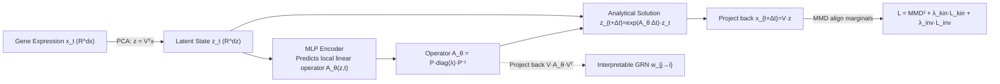

# Learning Explicit Single-Cell Dynamics Using ODE Representations

**Conference**: ICLR 2026  
**OpenReview**: [https://openreview.net/forum?id=DzSNH5APPl](https://openreview.net/forum?id=DzSNH5APPl)  
**Code**: [github.com/czi-ai/cell-mnn](https://github.com/czi-ai/cell-mnn)  
**Area**: Computational Biology / Single-cell Dynamics  
**Keywords**: Single-cell trajectory inference, cell differentiation, ODE representation, local linearization, gene regulatory networks, mechanistic neural networks  

## TL;DR
This paper proposes Cell-MNN—an encoder-decoder architecture that represents single-cell differentiation dynamics as "state-conditioned locally linear ODEs." This approach **discards expensive Optimal Transport (OT) preprocessing and multi-stage training**, achieving SOTA average performance on single-cell interpolation benchmarks through an end-to-end single-stage process. It simultaneously produces interpretable gene regulatory interactions validated against the TRRUST database.

## Background & Motivation
- **Background**: The differentiation of cells from stem cells into various tissue cells is a core mechanism in diseases such as cancer and neurodegeneration. Single-cell sequencing data is growing at a rate exceeding Moore's Law, making "reconstructing cell trajectories from snapshot data" a hot research area in machine learning. The primary difficulty is that measurement destroys the cells; thus, each cell provides only a **single-point snapshot observation** on a trajectory without continuous labels.
- **Limitations of Prior Work**: Current SOTA methods (OT-MFM, DeepRUOT, OT-CFM, etc.) almost exclusively rely on **Optimal Transport (OT) preprocessing** to artificially construct velocity labels. The Sinkhorn algorithm complexity grows quadratically with the number of samples $n$, creating memory/time bottlenecks (often OOM) on large datasets. These methods also typically require **multi-stage training and multiple networks**, making amortized joint training across datasets difficult.
- **Key Challenge**: Methods proficient in prediction (high interpolation accuracy) do not learn **explicit gene interactions**, while methods specialized in Gene Regulatory Network (GRN) discovery underperform on interpolation benchmarks. These two paths remain disconnected.
- **Goal**: Design a scalable, single-stage, end-to-end mechanistic model that can accurately predict cell evolution while directly providing interpretable gene interactions.
- **Core Idea**: **[Locally Linearized ODE Representation]**—Instead of attempting to learn a global non-linear velocity field, the network acts as a hypernetwork to predict a **conditioned local linear operator $A_\theta(z,t)$** at each "operating point." Local dynamics are approximated by $\dot z = A_\theta z$. Linear ODEs possess analytical solutions (matrix exponentials), which eliminates the need for numerical solvers and inherently provides interpretability as the operator can be projected back into the gene space.

## Method

### Overall Architecture
Cell-MNN follows an encoder-decoder structure: standard PCA compresses high-dimensional gene expression $x\in\mathbb{R}^{d_x}$ into a low-dimensional latent space $z=V_{\text{PCA}}^\top x$ ($d_z\ll d_x$). The MLP encoder predicts a local linear operator $A_\theta(z,t)$ given the current state $(z,t)$. The decoder analytically solves the linear ODE $\dot z = A_\theta z$ using the matrix exponential to obtain future states, which are then projected back to the gene space. Aside from PCA, the entire model is trained in a single stage, end-to-end, with a loss function using MMD to align predicted marginal distributions with empirical ones.

### Key Designs

**1. Locally Linearized ODE: Decomposing global ODE discovery into solvable local subproblems.** The true dynamics in latent space $\dot z = f(z,t)$ are usually highly non-linear. Directly searching for a global explicit form is infeasible due to the expansion of basis function combinations with $d_z$. The key observation is that if $f(0,t)=0$, the right-hand side can be reparameterized as $f(z,t)=A(z,t)\,z$. Thus, a linear operator is used at each operating point $(z^{(i)},t^{(i)})$ for local approximation: $\dot z \approx A_\theta(z^{(i)},t^{(i)})\,z$. While the operator itself is linear, it is a **non-linear** function of the current state and time. This allows the MLP to act as a hypernetwork, outputting a "white-box" local linear function $g_\theta(z,t\mid z^{(i)},t^{(i)})=A_\theta z$ rather than a global black-box velocity field like Neural ODEs. Unlike neural operators that learn a single global operator, Cell-MNN predicts **state-conditioned** operators, naturally supporting amortization across multiple states and datasets.

**2. Analytical Decoding + Eigendecomposition Parameterization: Closed-form solutions for linear ODEs.** Once the operator at an operating point is fixed, the system $\dot z = A_\theta z$ is a linear time-invariant (LTI) ODE with the closed-form solution $z(t^{(i)}+\Delta t)=\exp(A_\theta\Delta t)\,z^{(i)}$. The result is projected back: $x_{t+\Delta t}=V_{\text{PCA}}z(t+\Delta t)$. To facilitate the calculation of the matrix exponential and allow fine-grained control, the MLP directly predicts the eigendecomposition $A_\theta=P_\theta\,\text{diag}(\lambda_\theta)\,P_\theta^{-1}$. To ensure $P_\theta$ is invertible, a regularization term $L_{\text{inv}}(\theta)=1/(\det(P_\theta)+\epsilon)$ is added. Inductive biases can be injected by fixing certain eigenvalues (e.g., to zero). In terms of complexity, solving at $T$ time points is $O(Td_z^2)$ time and $O(d_z^2)$ space, while the one-time $P_\theta^{-1}$ cost is $O(d_z^3)$. Compared to the $O(d_z n^2)$ of OT (where $n$ is the number of samples, typically $n\gg d_z$), this offers significant advantages on large datasets.

**3. MMD-based Single-stage Distribution Matching Loss: Fitting marginals without OT velocity labels.** Since snapshot data lacks cell-wise trajectory labels, the model uses Maximum Mean Discrepancy (MMD) to directly align the model-induced marginal distribution $q_t^\theta$ with the empirical marginal $p_t$. Differences are calculated in latent space via a pullback kernel $k_x(x,x')=k_z(V^\top x, V^\top x')$. The loss includes a future discount factor $\gamma$: $L_{\text{MMD}^2}(\theta)=\mathbb{E}_t\big[\sum_{t'=t}^{t_K}\gamma^{t'}\text{MMD}^2(q_{t'}^\theta,p_{t'};k_x)\big]$. Additionally, following Benamou–Brenier theory, a kinetic energy regularization $L_{\text{kin}}(\theta)=\mathbb{E}\|A_\theta(z_t,t)z_t\|^2$ is added to softly constrain trajectories toward the optimal transport flow to improve generalization. The final loss is $L_{\text{total}}=L_{\text{MMD}^2}+\lambda_{\text{kin}}L_{\text{kin}}+\lambda_{\text{inv}}L_{\text{inv}}$, optimized in a single stage.

**4. Explicit Gene Interaction Extraction: Interpretable GRN from latent operators.** Since the PCA projection is linear, the local linear dynamics projected back to the gene space are $\frac{d}{dt}x=V_{\text{PCA}}A_\theta V_{\text{PCA}}^\top x$. The interaction weight from gene $j$ to gene $i$ is defined as $w_{j\to i}(x,t):=\big(V_{\text{PCA}}A_\theta V_{\text{PCA}}^\top\big)_{i,j}\cdot x_j$, representing the contribution of gene $j$ expression to the time derivative of $x_i$. This makes the model **fully interpretable**—directed, signed (activation/inhibition), and time-varying interactions can be inspected and validated against the TRRUST literature database. These interpretations are a "by-product" of fitting the dynamics and require no additional training phase.

## Key Experimental Results

### Main Results Table (Single-cell Interpolation, 5-dim PCA, EMD/W1 lower is better)

| Method | Cite | EB | Multi | Average ↓ |
|:---|:---:|:---:|:---:|:---:|
| I-CFM | 0.965 | 0.872 | 1.085 | 0.974 |
| OT-CFM | 0.882 | 0.790 | 0.937 | 0.870 |
| DeepRUOT* | 0.845 | 0.776 | 0.919 | 0.846 |
| OT-Interpolate* | 0.821 | 0.749 | 0.830 | 0.800 |
| OT-MFM | **0.724** | 0.713 | 0.890 | 0.776 |
| **Cell-MNN (Ours)** | 0.791 | **0.690** | **0.742** | **0.741** |

Cell-MNN performs best on EB and Multi datasets, second on Cite, achieving the **SOTA average score**. It is the only method to outperform the OT-Interpolate baseline across all three datasets (the latter implies an "oracle upper bound" for many OT-based methods).

### Ablation Study

| Experiment | Key Results |
|:---|:---|
| Scalability (250k cells, MMD↓) | OT-CFM / DeepRUOT hit **OOM**; Cell-MNN is optimal on Cite/EB/Multi (e.g., Multi 0.0252 vs Batch-OT-CFM 0.0302). |
| Amortized Training (Cite+Multi) | Cell-MNN outperforms OT-CFM and I-CFM, nearing the performance of "separate training." |
| GRN Discovery (TRRUST, F1%) | JUN 71% / FOS 71% / POU5F1 67%, exceeding SCODE and OT-CFM(J) on most source genes. |

### Key Findings
- **Scalability through OT Removal**: OT-based methods collectively OOM on expanded datasets, whereas Cell-MNN scales robustly due to its lack of OT preprocessing.
- **End-to-End Single-Stage as a Prerequisite for Amortization**: Without multi-stage or dataset-specific regularization, Cell-MNN enables successful joint training across datasets, showcasing potential for "foundation models" in single-cell analysis.
- **Verifiable Interpretability**: Learned operators cluster by time/cell type (e.g., EN-1) on UMAP, and predicted activation/inhibition signs have significantly higher F1 scores on TRRUST than random guessing.

## Highlights & Insights
- **"Local Linear + Hypernetwork" is an Elegant Strategy**: Using state-conditioned linear operators instead of a global black-box velocity field achieves solvability, interpretability, and amortization simultaneously. This draws inspiration from local linearization traditions in control theory (Apollo navigation filters, musculoskeletal control, etc.).
- **Zero-Cost Interpretability**: Gene interactions are direct products of projecting the linear operator back to the input space, unlike most GRN methods that require separate modeling or sacrifice performance.
- **Insightful OT-Interpolate Baseline**: The authors note that any method using OT velocity labels implicitly treats OT-Interpolate as ground truth; consistently outperforming it is a strong signal of model effectiveness.

## Limitations & Future Work
- **Cubic Complexity of Latent Dimension**: Constructing the full operator requires $O(d_z^3)$, which becomes difficult for high-dimensional latents. Sparse assumptions on $A_\theta$ are suggested.
- **Limited Radius of Local Linearity**: Evolving a system too far might exit the neighborhood where the linear ODE is accurate, requiring re-updates (not encountered in experiments, but a theoretical risk).
- **Heterogeneous Gene Sets**: Amortized experiments involve inconsistent gene sets; transfer learning was limited to shared PCA subspaces. True cross-gene-set transfer remains an open problem.
- **Interpretation is Correlation, Not Causation**: Learned weights are by-products of fitting; their use as evidence for causal regulation or perturbation design requires stronger validation.

## Related Work & Insights
- **Single-cell Interpolation**: Ranges from early RNNs (Hashimoto 2016) to Neural ODE approaches (TrajectoryNet) and OT-based flow matching (OT-CFM, OT-MFM). Cell-MNN is "simulation-free" but **avoids OT and learns explicit dynamics**, differing from Action Matching which lacks explicit forms.
- **Mechanistic Neural Networks (MNN)**: This is an adaptation of Pervez et al.'s MNN for single-cell snapshots and latent-space interpretability, distinct from SINDy or ODEFormer which require full trajectories.
- **GRN Discovery**: Compared to static GRNs (SCODE, etc.) and multi-omic/velocity-dependent GRNs (Dynamo, SCENIC+), Cell-MNN produces context-varying signed interactions directly from standard scRNA-seq UMI counts.
- **Insight**: Bringing "local linearization from control theory" into generative dynamic modeling is a general paradigm applicable to other snapshot distribution matching problems (e.g., perturbation response).

## Rating
- **Novelty**: ⭐⭐⭐⭐ The combination of locally linearized ODEs and hypernetwork operators is a refreshing and self-consistent design for single-cell dynamics.
- **Experimental Thoroughness**: ⭐⭐⭐⭐ Covers three real datasets and four types of experiments (interpolation, scalability, amortization, GRN); includes OOM controls and TRRUST validation.
- **Writing Quality**: ⭐⭐⭐⭐ Logical flow from motivation to method and experiment; the inclusion of the OT-Interpolate baseline shows depth of thought.
- **Value**: ⭐⭐⭐⭐ Provides a practical push toward large-scale, interpretable, and amortized single-cell foundation models.

<!-- RELATED:START -->

## Related Papers

- [\[AAAI 2026\] Gene Incremental Learning for Single-Cell Transcriptomics](../../AAAI2026/computational_biology/gene_incremental_learning_for_single-cell_transcriptomics.md)
- [\[ICLR 2026\] TetraGT: Tetrahedral Geometry-Driven Explicit Token Interactions with Graph Transformer for Molecular Representation Learning](tetragt_tetrahedral_geometry-driven_explicit_token_interactions_with_graph_trans.md)
- [\[ICLR 2026\] scDFM: Distributional Flow Matching for Robust Single-Cell Perturbation Prediction](scdfm_distributional_flow_matching_model_for_robust_single-cell_perturbation_pre.md)
- [\[ICLR 2026\] Learning Residue Level Protein Dynamics with Multiscale Gaussians](learning_residue_level_protein_dynamics_with_multiscale_gaussians.md)
- [\[ICLR 2026\] Clustering by Denoising: Latent Plug-and-Play Diffusion for Single-Cell Embeddings](clustering_by_denoising_latent_plug-and-play_diffusion_for_single-cell_embedding.md)

<!-- RELATED:END -->
