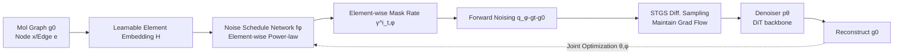

# Learning Flexible Forward Trajectories for Masked Molecular Diffusion

**Conference**: ICLR 2026  
**OpenReview**: [https://openreview.net/forum?id=raVuVPbnQL](https://openreview.net/forum?id=raVuVPbnQL)  
**Code**: [https://holymollyhao.github.io/MELD](https://holymollyhao.github.io/MELD)  
**Area**: Computational Biology / Molecular Generation / Discrete Diffusion  
**Keywords**: Masked Diffusion Models, Molecular Graph Generation, Learnable Noise Schedule, state-clashing, Element-wise Diffusion  

## TL;DR
This paper discovers that directly applying Masked Diffusion Models (MDM) to molecular graph generation leads to severe degradation due to "state-clashing," where different molecules collapse into the same intermediate state during forward noise addition. The authors propose MELD, which uses a learnable noise schedule network to assign unique masking rates to each atom/bond, effectively staggering forward trajectories. This achieves 100% chemical validity and SOTA distribution alignment on QM9 and ZINC250K.

## Background & Motivation
**Background**: Masked Diffusion Models have shown impressive performance on discrete data like text and images (D3PM, MaskGIT, MDLM, MD4). They define the forward process as "element-wise masking" and the reverse process as parallel filling of masked elements, combining autoregressive quality with diffusion-style parallel sampling efficiency. Previously, molecule generation relied primarily on score-based (GDSS, GruM) or substitution-based discrete diffusion (DiGress); MDM remained largely unexplored for molecular graphs.

**Limitations of Prior Work**: The authors applied standard MDM to molecular graphs and found that performance dropped significantly—while it could generate valid molecules, distribution alignment was poor (FCD on ZINC250K was 91% higher than the best baseline, and scaffold similarity was 99.8% lower). This is a structural flaw rather than a parameter-tuning issue.

**Key Challenge**: The root cause is **state-clashing**. Molecular graph vocabularies are small and symmetries are strong. When using an "element-agnostic" masking rate for all atoms and bonds, two semantically distinct molecules are easily masked into the same intermediate state. For example, masking the nitrogen-carbon bonds in both o-phenylenediamine and m-phenylenediamine collapses both into the same symmetric benzene ring skeleton. At this point, the posterior $p(g\mid g_t)$ is highly multimodal, but the MDM denoiser is **unimodal**—it independently predicts each node and edge $p_\theta(g\mid g_t)=\prod_i p_\theta(x^i\mid g_t)\prod_{i<j}p_\theta(e^{ij}\mid g_t)$, outputting only an "average graph." Combined with the mode-covering nature of KL divergence, the model spreads probability mass into a high-entropy distribution, causing generated molecules to deviate from the true distribution or violate chemical rules.

**Goal**: Enable MDM to maintain the advantages of parallel decoding while preventing different molecules from colliding into the same intermediate states during the forward process.

**Core Idea**: **[Make the forward process learnable]** Instead of using a fixed, element-agnostic noise schedule, the model learns an exclusive corruption trajectory for each graph element (atom, bond). This staggers the noise paths of different molecules, reducing state-clashing at the source.

## Method

### Overall Architecture
MELD (Masked Element-wise Learnable Diffusion) adds a **noise schedule network** to the standard MDM, transforming the forward process from a "fixed schedule" to a "learnable, element-wise" schedule, trained jointly with the denoiser. During training, both the forward process (noise schedule network $\phi$) and the reverse process (denoiser $\theta$) are optimized, allowing each atom/bond to have a distinct masking rate $\gamma^i_{t,\phi}$, thereby pulling apart forward trajectories that would otherwise clash.

### Key Designs

**1. Learnable Element-wise Embeddings: Assigning a Unique "ID" to Each Element** To allow the schedule network to assign different rates, elements must be distinguishable. The authors note that graph positional encodings fail in symmetric structures like aromatic rings (unable to distinguish equivalent nodes), and feeding the noisy graph itself into the schedule network breaks the closed-form solvability of the forward marginal $q(g_t\mid g_0)$. Instead, they learn an embedding matrix $H\in\mathbb{R}^{D\times N}$, where the $i$-th column $h_i$ serves as the node embedding, and the edge embedding for $\{i,j\}$ is $h_{ij}=h_i+h_j$. Randomly permuting columns of $H$ during training allows the model to distinguish graph states with identical node/edge counts but different topologies.

**2. Element-wise Power-law Noise Schedule: Letting the Network Decide "When to Mask"** The noise schedule follows a power-law form, but the exponent is determined by element embeddings. For node $i$, the masking probability is:

$$\gamma^i_{t,\phi}=1-(1-\epsilon)\cdot t^{w^i_\phi},\qquad w^i_\phi=\sigma_{sf}\big(f_\phi(h_i)\big)$$

where $\sigma_{sf}$ is softplus, $f_\phi$ is a linear layer, and $\epsilon=10^{-4}$ ensures numerical stability. Each atom and bond thus gains its own corruption rate—for example, delaying the masking of nitrogen atoms can prevent o-phenylenediamine from collapsing prematurely into a symmetric benzene ring. The training loss uses the weighted cross-entropy integral from MDM, but $\gamma$ and its derivative $\dot\gamma$ now depend on $\phi$, integrating the schedule network into the gradient flow.

**3. STGS to Maintain Gradient Flow in Discrete Sampling** Each step of discrete molecular diffusion involves **sampling** a one-hot graph from a categorical distribution. The argmax operation cuts off gradients to the schedule parameters $\phi$. The authors use Straight-Through Gumbel-Softmax: first, a soft distribution is obtained via $p_{soft,k}=\frac{\exp((z_k+g_k)/\eta)}{\sum_l\exp((z_l+g_l)/\eta)}$ (where $g_k$ is Gumbel noise); then $p_{hard}$ is obtained via argmax, and finally $p=p_{hard}-\text{sg}(p_{soft})+p_{soft}$. The forward pass uses discrete $p_{hard}$ to construct the graph, while the backward pass treats it as continuous $p_{soft}$, allowing the gradient $\frac{\partial p}{\partial z}=\frac{\partial p_{soft}}{\partial z}$ to flow through the entire forward process for end-to-end training.

**4. Permutation Marginalization for Distribution Invariance** Element-wise scheduling and learnable embeddings naturally depend on node ordering, yet graph generation requires learned distributions to be permutation-invariant. MELD does not constrain the architecture; instead, it marginalizes over all permutations: $p(g)=\sum_\pi p(g,\pi)$. Randomly permuting columns of $H$ during training maximizes the ELBO of this marginal log-likelihood: $\log p(g)\ge \mathbb{E}_\pi[\log p(g\mid \pi)]+\text{const}$. This stochastic symmetrization is a mature paradigm in autoregressive graph generation.

## Key Experimental Results

### Main Results Table

Unconditional generation on QM9 / ZINC250K (Generating 10k molecules; ↑ higher is better / ↓ lower is better):

| Method | QM9 Valid.↑ | QM9 FCD↓ | QM9 Scaf.↑ | ZINC Valid.↑ | ZINC FCD↓ | ZINC Scaf.↑ |
|---|---|---|---|---|---|---|
| GruM (Strongest baseline) | 99.69 | 0.11 | 0.945 | 98.65 | 2.26 | 0.530 |
| DiGress | 98.19 | 0.10 | 0.936 | 94.99 | 3.48 | 0.416 |
| MDM w/ power-law | 100.00 | 3.62 | 0.628 | 100.00 | 26.09 | 0.001 |
| **MELD (Ours)** | **100.00** | **0.09** | **0.947** | **100.00** | **1.51** | **0.559** |

While standard MDM achieves 100% validity, it suffers from severe distribution mismatch (ZINC Scaf. only 0.001). MELD reduces FCD from 26.09 to 1.51 and improves Scaf. to 0.559, maintaining 100% validity.

Polymer property conditional generation (11 constraints + synthetic score), average MAE:

| Method | Valid.↑ | FCD↓ | MAE↓ |
|---|---|---|---|
| GraphDiT (Prev. SOTA) | 82.45 | 6.64 | 0.921 |
| MDM w/ power-law | 17.31 | 26.56 | 1.620 |
| **MELD (Ours)** | **99.10** | **5.93** | **0.798** |

Compared to GraphDiT, MELD reduces average MAE by 13.4%. Compared to standard MDM, validity increases fivefold and property alignment improves by 50% on average.

### Ablation Study Table

Comparison of different noise schedule strategies on ZINC250K:

| Schedule | Method | FCD↓ | NSPDK↓ | Scaf.↑ |
|---|---|---|---|---|
| Fixed | Power-law | 26.09 | 0.0683 | 0.001 |
| Fixed | DiffusionBERT | 1.95 | 0.0009 | 0.491 |
| Learnable | GenMD4 (Class-level) | 3.19 | 0.0017 | 0.429 |
| Learnable | TabDiff (Col-shared) | 2.15 | 0.0009 | 0.486 |
| Learnable | MELD (Nodes only) | 1.63 | 0.0009 | 0.536 |
| Learnable | MELD (Edges only) | 1.73 | 0.0009 | 0.525 |
| Learnable | **MELD (Nodes+Edges)** | **1.51** | **0.0006** | **0.559** |

Class-level (GenMD4) or column-shared (TabDiff) schedules are inferior to true element-wise scheduling—delaying all carbon atoms can still lead to collapse into a symmetric ring. Only per-element control fully resolves state-clashing.

### Key Findings
- **Near-Zero Overhead**: MELD adds only an embedding matrix $H$, roughly +0.01M parameters. At 10–200 atom scales, FLOPs, memory, and step time are nearly identical to standard MDM (0.165s vs 0.132s for 200 atoms).
- **Faster Reconstruction**: The learnable schedule allows MELD to restore molecular fragments earlier in the reverse process (significant recovery at $t=T/4$).
- **Scalable to Large Molecules**: Outperforms all diffusion baselines on the large-scale Guacamol dataset within 300 epochs (DiGress requires 1000), achieving 100% validity.

## Highlights & Insights
- **Diagnosis is More Valuable Than Method**: The core contribution is identifying and formalizing state-clashing—attributing the failure of MDM on molecules to the combination of "symmetric structure + small vocabulary + element-agnostic masking." This is supported by prediction entropy visualization.
- **Learnable Forward Process**: While most diffusion work treats the forward process as a fixed prior, MELD parameterizes and jointly trains the noise schedule, providing a clean and universal perspective shift.
- **High ROI**: A mere +0.01M parameters pulls distribution alignment from collapse to SOTA, making it practically effortless to integrate into existing DiT-based MDMs.

## Limitations & Future Work
- **Domain-Specific Advantages**: As noted by the authors, for text or protein sequences with large vocabularies and low symmetry, state-clashing is rare, which may diminish MELD's relative gains.
- **Approximated Permutation Invariance**: Relying on random permutation of $H$ provides an ELBO lower bound rather than a strict guarantee, raising questions about coverage for very large or highly symmetric graphs.
- **Alignment-Diversity Tradeoff**: In conditional generation, MELD's diversity (85.91) is slightly lower than some baselines, indicating an inherent tradeoff between property alignment and diversity.
- **Interpretability of Embeddings**: Systematic analysis of what the learned element-wise rates correspond to in chemical terms (e.g., which bonds should be masked later) is currently lacking.

## Related Work & Insights
- **Masked Diffusion Lineage**: D3PM introduced absorbing masks; MaskGIT performs parallel decoding; MD4/MDLM simplify objectives to weighted cross-entropy. MELD extends this to molecular graphs with "per-element" learnable schedules.
- **Two Paths in Molecular Diffusion**: Score-based (GDSS, GruM using continuous SDE relaxation) and substitution-based discrete diffusion (DiGress with Markov transitions). MELD establishes a third path based on masking while retaining parallel decoding.
- **Insights**: The state-clashing perspective can be generalized to any "high-symmetry + small-vocabulary" discrete generation task (e.g., structured code or sequences). Parameterizing the forward noise schedule may also benefit continuous diffusion models.

## Rating
- **Novelty**: ⭐⭐⭐⭐ — The discovery and formalization of state-clashing is novel and highly explanatory. Element-wise learnable scheduling is a clean perspective shift, though learnable schedules have precedents in text/tabular data.
- **Experimental Thoroughness**: ⭐⭐⭐⭐ — Covers unconditional/conditional generation, five datasets, ablation, overhead analysis, and scalability. Tradeoffs in diversity and ELBO approximations are discussed less deeply.
- **Writing Quality**: ⭐⭐⭐⭐⭐ — The narrative of "diagnosing the disease before prescribing medicine" is extremely clear. Visualizations of prediction entropy and reconstruction are 
compelling.
- **Value**: ⭐⭐⭐⭐ — Brings MDM from failure to SOTA in molecule generation at near-zero cost. While gains are domain-specific to molecular graphs, the engineering utility is high.

<!-- RELATED:START -->

## Related Papers

- [\[ICLR 2026\] Align Your Structures: Generating Trajectories with Structure Pretraining for Molecular Dynamics](align_your_structures_generating_trajectories_with_structure_pretraining_for_mol.md)
- [\[ICLR 2026\] MolEditRL: Structure-Preserving Molecular Editing via Discrete Diffusion and Reinforcement Learning](moleditrl_structure-preserving_molecular_editing_via_discrete_diffusion_and_rein.md)
- [\[ICLR 2026\] DCFold: Efficient Protein Structure Generation with Single Forward Pass](dcfold_efficient_protein_structure_generation_with_single_forward_pass.md)
- [\[ICLR 2026\] Graph Diffusion Transformers are In-Context Molecular Designers](graph_diffusion_transformers_are_in-context_molecular_designers.md)
- [\[ICLR 2026\] Enhancing Diffusion-Based Sampling with Molecular Collective Variables](enhancing_diffusion-based_sampling_with_molecular_collective_variables.md)

<!-- RELATED:END -->
