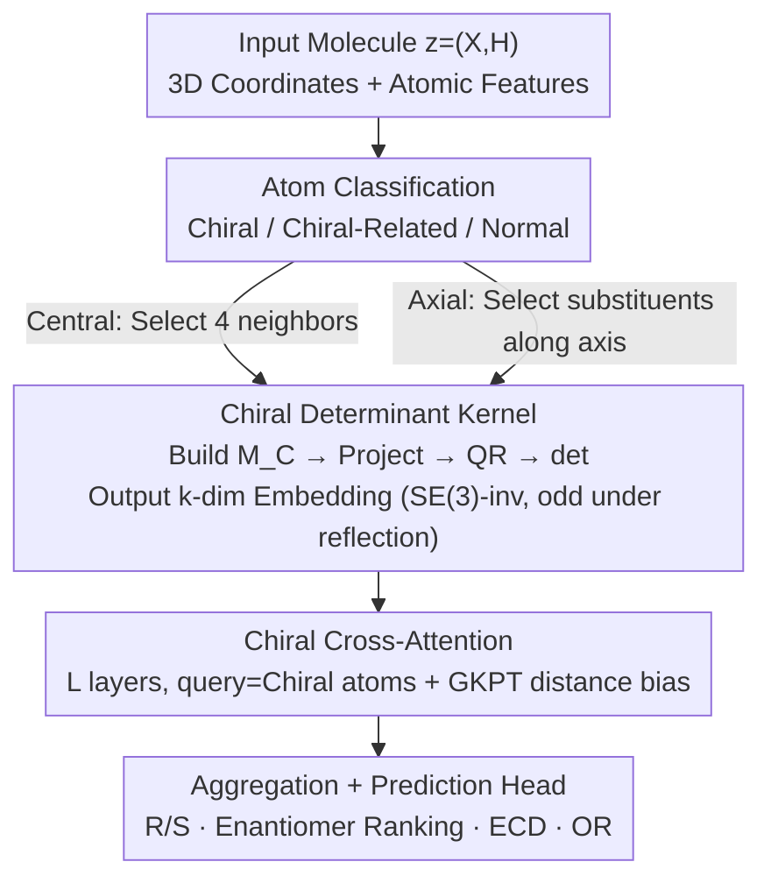

# Learning Molecular Chirality via Chiral Determinant Kernels

**Conference**: ICLR2026  
**arXiv**: [2602.07415](https://arxiv.org/abs/2602.07415)  
**Code**: To be confirmed  
**Area**: Computational Biology  
**Keywords**: Molecular Chirality, Chiral Determinant Kernels, Equivariant GNNs, Axial Chirality, SE(3) Invariance  

## TL;DR
The paper proposes Chiral Determinant Kernels (ChiDeK) to encode SE(3)-invariant chiral matrices, unifying central and axial chirality within a GNN framework for the first time. By combining this with cross-attention to propagate stereochemical information, it achieves a >7% accuracy improvement on a newly constructed axial chirality benchmark.

## Background & Motivation
- Chirality is a core concept in medicinal chemistry: enantiomers have the same chemical formula but 3D structures that are mirror images, often resulting in vastly different biological activities (e.g., the R-configuration of thalidomide is a sedative, while the S-configuration is teratogenic).
- Existing GNN molecular representation methods mainly focus on **central chirality** (tetrahedral carbons), but **axial chirality** (arising from restricted rotation in biphenyl bonds, etc.) is equally important in drug chemistry and more difficult to model.
- **Limitations of Prior Work**: Traditional methods use CIP rules (R/S labels) or chiral volume to encode chirality, facing two issues:
  1. They only handle central chirality and ignore axial chirality.
  2. Chiral volume is an SE(3)-invariant scalar with limited information content.
- **Goal**: Develop a unified framework to capture both types of chirality while maintaining SE(3) invariance.

## Method

### Overall Architecture
ChiDeK represents a molecule as $\bm{z} = (\bm{X}, \bm{H})$ (3D coordinates plus atomic features). Atoms are first classified into three categories: chiral atoms $\mathcal{I}_c$, chiral-related atoms $\mathcal{I}_r$, and normal atoms $\mathcal{I}_n$. A Chiral Encoder then uses determinant kernels to calculate SE(3)-invariant stereochemical embeddings for each chiral atom. Finally, a Chiral Transformer, using chiral atoms as queries and other atoms as keys/values, diffuses this chiral information across the graph before passing it to a prediction head. The core innovation lies in using determinants to encode chirality into vectors that are invariant yet distinguish mirror images, and unifying central and axial chirality mathematically.

### Key Designs

**1. Chiral Determinant Kernel: Encoding Chirality as SE(3)-Invariant, Reflection-Sensitive Vectors**
Traditional methods use discrete R/S labels (losing geometry) or single-scalar chiral volumes (insufficient information). ChiDeK constructs a $3\times3$ chiral matrix $\bm{M}_C(i)$ from the coordinates of 4 substituents of chiral atom $i$. It then applies a learnable projection $\bm{W}\in\mathbb{R}^{k\times d_p\times 3}$, performs QR decomposition, and takes the determinant $\det(\bm{R})$ of the upper triangular matrix as the feature. The key property is $\det(\bm{R}) = \alpha(\bm{W})\cdot P_C(i)$, meaning it is proportional to the original chiral product $P_C(i)$: it remains invariant under molecular rotation/translation (SE(3) invariance) but flips sign under reflection. This naturally distinguishes enantiomers, which E(3)-invariant models like DimeNet cannot do. Using $k$ kernels yields a $k$-dimensional embedding.

**2. Unified Central and Axial Chirality: A Single Mathematical Framework**
Central chirality arises from tetrahedral carbons, while axial chirality stems from restricted rotation (e.g., biphenyls). ChiDeK found that by changing how the "four points forming the chiral matrix" are selected, the same $\bm{M}_C$ formula covers both. For central chirality, it uses the center atom and its 4 neighbors; for axial chirality, it uses the restricted rotation bond as the axis and selects the nearest substituent atoms on each side. Sharing the same kernels and proofs eliminates the need for specialized modules for axial chirality.

**3. Chiral Cross-Attention: Propagating Chiral Signals Globally**
Chirality is defined locally but affects global properties (e.g., ECD spectra, optical rotation). ChiDeK uses chiral atom embeddings as queries and projects chiral-related/normal atoms into keys/values for cross-attention. A GKPT (Gaussian Kernel with Pair Type) distance bias is added to the attention mechanism to distinguishably encode spatial distances based on atom pair types (Chiral–Chiral Related, Chiral–Normal). Ablations show that removing cross-attention increases ECD RMSE from 2.75 to 3.12.

### Loss & Training
Training uses standard classification/regression losses plus a weighting regularization term $\mathcal{L}_{reg} = \|W^\top W - I_3\|^2$ to constrain projection matrices toward orthogonality, ensuring they are full-rank. This is critical because rank-deficient $\bm{W}$ matrices would result in zero determinants and loss of chiral information. QR decomposition is applied directly to weights before projection to ensure column independence. Evaluation covers R/S classification, enantiomer ranking, ECD spectrum prediction, and optical rotation (OR) prediction.

## Key Experimental Results

### Main Results

| Task | Metric | ChiDeK | ChiGNN | SphereNet | Gain |
|------|------|--------|--------|-----------|------|
| Central R/S Classification | Acc↑ | 98.2% | 97.8% | 94.5% | +0.4% |
| Enantiomer Ranking | Acc↑ | 77.8% | 75.6% | 65.7% | +2.2% |
| Central ECD (Position) | RMSE↓ | 2.75 | 3.21 | 3.85 | -14.3% |
| **Axial ECD** | RMSE↓ | **Strong** | **N/A** | Weak | **>7%↑** |
| **Axial OR** | RMSE↓ | **Strong** | **N/A** | Weak | **>7%↑** |

### Ablation Study

| Configuration | R/S Acc | ECD RMSE | Description |
|------|---------|----------|------|
| ChiDeK Full | 98.2% | 2.75 | Det Kernels + Cross-Attention |
| w/o Det Kernels (Scalar Volume) | 95.1% | 3.45 | Insufficient scalar information |
| w/o Cross-Attention | 96.0% | 3.12 | Information limited to centers |
| w/o GKPT Bias | 97.3% | 2.95 | Distance information is beneficial |

### Key Findings
- ChiDeK outperforms the strongest baselines by >7% on axial chirality tasks, providing the first systematic evaluation of axial chirality.
- Determinant kernels provide richer stereochemical information than scalar chiral volumes.
- Cross-attention allows chiral information to diffuse and influence the entire molecular representation rather than staying localized.
- Weight regularization is essential for training stability; rank-deficient projections lead to complete loss of chiral signals.

## Highlights & Insights
- **Novelty**: First unified GNN treatment of central and axial chirality.
- **Theoretical Rigor**: Mathematical design of chiral determinant kernels includes rigorous SE(3) proofs (Proposition 3.1, Lemma 3.1, Lemma 4.1).
- **Benchmark Contribution**: The construction of the ACMP (Axial Chiral Molecular Properties) benchmark fills a gap in axial chirality evaluation.
- **Mechanism**: Cross-attention with GKPT bias enables local-to-global propagation of stereochemical signals.
- **Robustness**: QR decomposition ensures differentiability while maintaining the chiral discriminative power of the determinant.

## Limitations & Future Work
- Identification of axial chirality currently relies on chemical knowledge/heuristics to locate restricted bonds; automatic detection is a future direction.
- Validated primarily on small molecules; chirality modeling for macro-molecules (proteins/peptides) remains unexplored and computationally expensive.
- Integration with 3D coordinate prediction tasks (e.g., conformation generation) has not been explored.
- More complex chiral forms (e.g., planar, helical chirality) are not yet covered, though the framework is theoretically extendable.

## Related Work & Insights
- **vs. ChIRo**: ChIRo learns 3D representations invariant to bond rotation but sensitive to stereoisomers, but only for central chirality.
- **vs. ChiGNN**: ChiGNN encodes chirality via atom permutation parsing but lacks explicit local chiral descriptors.
- **vs. SphereNet/DimeNet**: E(3)-invariant models cannot distinguish enantiomers (distances/angles remain same); ChiDeK's determinant flips sign under reflection.
- **vs. Tetra-DMPNN**: 2D graph chiral encoding uses only symbolic info (R/S labels) and lacks 3D geometric context.
- **Insight**: Determinants as a mathematical representation of chirality may apply to other geometric deep learning tasks requiring mirror-symmetry differentiation (e.g., crystal classification, nanomaterial design).

## Rating
- Novelty: ⭐⭐⭐⭐⭐ 
- Experimental Thoroughness: ⭐⭐⭐⭐ 
- Writing Quality: ⭐⭐⭐⭐ 
- Value: ⭐⭐⭐⭐ 

<!-- RELATED:START -->

## Related Papers

- [\[ICML 2026\] Cross-Chirality Generalization by Axial Vectors for Hetero-Chiral Protein-Peptide Interaction Design](../../ICML2026/computational_biology/cross-chirality_generalization_by_axial_vectors_for_hetero-chiral_protein-peptid.md)
- [\[ICML 2026\] Flexible Kernels for Protein Property Prediction](../../ICML2026/computational_biology/flexible_kernels_for_protein_property_prediction.md)
- [\[ICLR 2026\] Learning Flexible Forward Trajectories for Masked Molecular Diffusion](learning_flexible_forward_trajectories_for_masked_molecular_diffusion.md)
- [\[ICLR 2026\] Enhancing Molecular Property Predictions by Learning from Bond Modelling and Interactions](enhancing_molecular_property_predictions_by_learning_from_bond_modelling_and_int.md)
- [\[ICLR 2026\] MolEditRL: Structure-Preserving Molecular Editing via Discrete Diffusion and Reinforcement Learning](moleditrl_structure-preserving_molecular_editing_via_discrete_diffusion_and_rein.md)

<!-- RELATED:END -->
