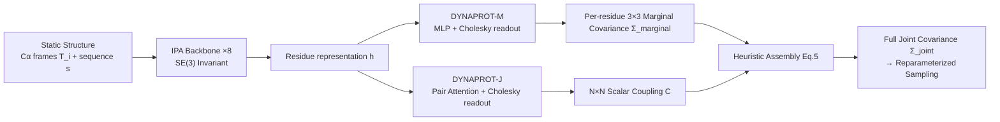

# Learning Residue Level Protein Dynamics with Multiscale Gaussians

**Conference**: ICLR 2026  
**OpenReview**: [https://openreview.net/forum?id=uKn9PdREBA](https://openreview.net/forum?id=uKn9PdREBA)  
**Code**: To be confirmed  
**Area**: Computational Biology / Protein Dynamics Prediction  
**Keywords**: Protein Dynamics, Multivariate Gaussian, RMSF, SE(3) Invariant, Covariance Prediction, Conformational Ensemble Generation  

## TL;DR
DYNAPROT models protein dynamics as a "multivariate Gaussian distribution over Cα coordinates on a static structure." It utilizes a lightweight SE(3)-invariant network to directly predict per-residue 3×3 marginal covariances and residue-pair N×N scalar couplings from a single static structure. A heuristic then assembles the full 3N×3N joint covariance, achieving fast and interpretable flexibility prediction and conformational ensemble sampling with three orders of magnitude fewer parameters.

## Background & Motivation
**Background**: Understanding dynamic conformational fluctuations (rather than a single static structure) is crucial for revealing biological functions—enzymatic catalysis, allosteric signaling, and GPCR state switching all depend on conformational fluctuations. Molecular Dynamics (MD) simulation is the gold standard, but simulating a single protein for 100 ns takes days to weeks, making proteome-scale prediction unfeasible.

**Limitations of Prior Work**: Deep learning approaches fall into two categories. One is **implicit ensemble generators** (AlphaFlow, BioEMU, MSA subsampling), which adapt AlphaFold2 into flow-matching/diffusion models for sampling. These require large-scale PDB pre-training and multiple stochastic forward passes during inference, making them slow and heavy. Furthermore, many scenarios only require compact, interpretable dynamic descriptors rather than a full ensemble. The second category is **explicit dynamics predictors**: FlexPert3D only predicts scalar RMSF (one fluctuation magnitude per residue), losing directionality and inter-residue coupling; Normal Mode Analysis (NMA) is a classic physics-based method that does not learn from data, relying on low-frequency normal modes calculated from input structures, making it sensitive to structure quality and unable to capture local anisotropy or conformational heterogeneity.

**Key Challenge**: The trade-off between expressivity and efficiency—either using expensive sampling for rich dynamic information (MD, AlphaFlow) or cheap computation for sparse scalar descriptors (RMSF, NMA).

**Goal**: Design a model on the "expressivity × efficiency" Pareto frontier that captures rich dynamic behavior (anisotropy, residue coupling, and full joint covariance) without the cost of sampling or simulation.

**Core Idea**: **[Gaussian Perspective for Unified Dynamics]** Unify dynamics as a multivariate Gaussian over structural coordinates $X\sim\mathcal{N}(\mu,\Sigma_{\text{joint}})$, where the second-order moment $\Sigma_{\text{joint}}$ theoretically encodes all dynamic information (principal components, distance variance, global flexibility). Since directly learning the $3N\times 3N$ joint covariance is infeasible, the model adopts **[Multiscale Modeling]** to explicitly learn two tractable scales—per-residue 3×3 marginal anisotropy + residue-pair N×N scalar coupling. It then uses **[Heuristic Joint Assembly]** to combine the two into an approximate full joint covariance for rapid sampling.

## Method

### Overall Architecture
DYNAPROT consists of two sub-models sharing a common backbone with different readouts: DYNAPROT-M predicts per-residue 3×3 marginal Gaussians, and DYNAPROT-J predicts residue-pair N×N scalar couplings. The input consists of local Cα residue coordinate frames $\{T_i=(R_i,t_i)\}\in SE(3)$ plus sequence embeddings. The shared backbone uses 8 layers of Invariant Point Attention (IPA) from the AlphaFold2 structure module to ensure invariance to global SE(3) transformations, outputting per-residue representations $h\in\mathbb{R}^{N\times D}$. The outputs of the two readouts are combined via the heuristic in Section 3.4 to form the full joint covariance for ensemble sampling.

### Key Designs

**1. Hierarchical Gaussian Representation: Decomposing dynamics into two learnable scales.** The paper treats the Cα coordinates of N residues as a random variable $X\in\mathbb{R}^{3N}$ following $\mathcal{N}(\mu,\Sigma_{\text{joint}})$. Taking the input structure as the ensemble mean $\mu$, the problem reduces to predicting the covariance. The model extracts 3×3 marginals $\Sigma^{(i)}_{\text{marginal}}$ (anisotropic "Gaussian ellipsoids," where the square root of the trace $\text{RMSF}_i=\sqrt{\text{Tr}(\Sigma^{(i)}_{\text{marginal}})}$ naturally degenerates to scalar flexibility) and projects each 3×3 block into a scalar via MeanPooling to obtain the residue-pair coupling matrix $C\in\mathbb{R}^{N\times N}$. This forms a 4-level dynamic hierarchy (Scalar RMSF → 3×3 Marginal → N×N Scalar Coupling → Full 3N×3N). DYNAPROT explicitly learns levels 2 and 3, maintaining local interpretability and global synergy while avoiding the intractability of learning the full joint covariance directly.

**2. Cholesky Parameterization for Positive Semi-Definiteness.** Covariance matrices must be Symmetric Positive Definite (SPD). Directly predicting 9 elements or 6 symmetrized elements cannot guarantee positive definiteness. The paper utilizes the property that any SPD matrix is uniquely determined by its Cholesky decomposition. The model predicts the 6 elements of a lower triangular matrix $L_i$, uses Softplus to force the diagonal to be positive, and reconstructs $\Sigma^{(i)}_{\text{marginal}}=L_iL_i^\top$, ensuring SPD by construction. The marginal module uses a simple MLP readout, while the pair module concatenates residue embeddings $[h_i\|h_j]$ and processes them through AlphaFold-style Evoformer triangular attention blocks (modeling higher-order geometric dependencies) to output scalars for a large lower triangular matrix $L$, ensuring $C=LL^\top$ is also SPD.

**3. Log-Frobenius Loss on the SPD Manifold.** SPD matrices lie on a non-Euclidean Riemannian manifold. Standard Euclidean distances (MSE/Frobenius) ignore curvature, leading to unstable gradients. The paper adopts the log-Euclidean distance $L_{\text{LogFrob}}=\|\log(\Sigma_{\text{pred}})-\log(\Sigma_{\text{true}})\|_F^2$, where $\log(\Sigma)=Q\log(\Lambda)Q^\top$ maps the SPD matrix to the tangent space via matrix logarithm. This makes the Euclidean metric valid in the "locally Euclidean" tangent space (ablations show this is more stable than Bures-Wasserstein and significantly better than naive MSE).

**4. Heuristic Reconstruction of Joint Covariance for Fast Sampling.** Given the predicted marginals $\{\Sigma^{(i)}_{\text{marginal}}=L_iL_i^\top\}$ and scalar coupling $C$, the paper generalizes the univariate identity $\text{Cov}(i,j)=\text{Corr}(i,j)\cdot\sigma_i\sigma_j$ to the multivariate case. It defines the residue-pair cross-covariance block $\Sigma^{(i,j)}_{\text{joint}}=L_i\tilde{C}_{ij}L_j^\top$ (where $L_i$ acts as a matrix square root and $\tilde C$ is the normalized correlation matrix). Using the Kronecker product, this is written as $\Sigma_{\text{joint}}=L_{\text{marginal}}(\tilde C\otimes I_3)L_{\text{marginal}}^\top$, which is proven to be SPD (Proposition 3.1). With the joint covariance and mean, the ensemble can be sampled extremely fast via the reparameterization trick $x=\mu+L\epsilon,\ \epsilon\sim\mathcal{N}(0,I)$, replacing expensive diffusion/flow-matching forward passes with a single matrix decomposition and sampling step.

## Key Experimental Results

Data is sourced from the ATLAS Molecular Dynamics dataset (1390 proteins filtered by ECOD structural diversity, each with three 100 ns replicate trajectories). Training uses only ~1000 MD proteins **without large-scale PDB pre-training**. Two splits are used: a main split aligned with AlphaFlow (1265/39/82) and a topological split for comparison with FlexPert3D (1112/139/139).

### Main Results: Residue Flexibility RMSF (FlexPert Test Split, Pearson r, Median/75th Percentile)

| Method | RMSF r (↑) | Parameter Count |
|------|-----------|--------|
| **DYNAPROT-M** | **0.865 / 0.930** | 955 K |
| FlexPert-3D | 0.830 / 0.899 | 1.2 B |
| NMA (ANM) | 0.697 / 0.784 | – |

DYNAPROT-M achieves higher RMSF correlation while solving a harder task (predicting anisotropy instead of scalars) with **three orders of magnitude fewer** parameters (955K vs 1.2B).

### Anisotropic Marginal Prediction (ATLAS Test Split, Runtime for Length 271 Protein, 25th/Median, ↓ Better)

| Method | RMWD Var | Sym. KL Var | Parameter Count | Time |
|------|----------|-------------|--------|------|
| **DYNAPROT-M** | 0.84 / 1.18 | 0.53 / 0.91 | 955 K | ∼0.02 s |
| AFMD+T | 0.87 / 1.10 | 0.37 / 0.60 | 95 M | ∼7000 s |
| NMA (ANM) | 1.14 / 1.45 | 3.03 / 4.56 | – | ∼5.37 s |

DYNAPROT-M significantly outperforms NMA and is comparable to AlphaFlow+Templates, while being ~**350,000 times faster** and ~100 times smaller.

### Conformational Ensemble Generation (ATLAS, Cα Ensemble Evaluation)

| Metric | AFMD+T | DYNAPROT | NMA |
|------|--------|----------|-----|
| Pairwise RMSD (gt=2.89) | 2.18 | 2.17 | 0.91 |
| Per-target RMSF r (↑) | 0.92 | 0.86 | 0.76 |
| MD PCA W2 (↓) | 1.25 | 1.74 | 1.86 |
| Joint PCA W2 (↓) | 1.58 | 2.39 | 2.45 |
| Parameter Count (↓) | 95 M | 2.86 M | – |
| Sampling Time (↓) | ∼10,000 s | ∼0.14 s | ∼5.69 s |

### Key Findings
- **Flexibility and target correlation approach AlphaFlow, with ~70,000x speedup**: DYNAPROT is comparable to AFMD+T in pairwise RMSD and per-target RMSF correlation, though slightly inferior in distribution similarity (PCA W2) and transient contact observables.
- **Residue coupling outperforms NMA**: DYNAPROT-J is significantly stronger than NMA (r=0.71 vs r=0.59) in short-to-medium range couplings, precisely where coupling is strongest.
- **Zero-shot cryptic pocket discovery**: For Adenylosuccinate Synthetase (apo 1ADE / holo 1CIB), DYNAPROT-M's predicted high-variance residues on the apo structure precisely surround the binding pocket, and the ellipsoid directions align with the pocket-opening motion, demonstrating the functional insight potential of anisotropic marginals.

## Highlights & Insights
- **The unified Gaussian perspective** organizes fragmented dynamic descriptors (RMSF, anisotropy, coupling, joint covariance) into a clear, interpretable four-level hierarchy.
- **The "train marginals + coupling, reconstruct joint" approach is the cleverest step**: The model is never explicitly trained on the full 3N×3N joint covariance, yet it reconstructs it via Cholesky factors (acting as matrix square roots) and the Kronecker product of the correlation matrix, substituting expensive generative sampling with a single analytical sampling step.
- **Extreme parameter efficiency**: 955K~2.86M parameters versus 95M~1.2B, with no PDB pre-training required—only ~1000 MD proteins suffice for training. This suggests explicit prediction of dynamic descriptors is a viable, scalable alternative.
- Anisotropic directionality provides functional signals (e.g., cryptic pocket orientation) beyond scalar RMSF, which scalar methods cannot capture.

## Limitations & Future Work
- **Coarse-grained to Cα backbone**: Only models Cα, ignoring side-chain flexibility, which limits the description of allosteric/catalytic mechanisms involving side-chain rearrangement.
- **Gaussian approximation ceiling**: A single multivariate Gaussian cannot express multimodal conformational distributions (e.g., distinct apo↔holo state switching), causing it to lag behind true ensemble generators in distribution coverage (PCA W2) and transient/weak contact recovery.
- **Heuristic joint covariance**: The Eq.5 reconstruction is an approximation that may distort long-range strong couplings or non-Gaussian correlation structures.
- **Cryptic pocket evidence is anecdotal**: Only qualitative demonstration on a single enzyme; lacks a systematic benchmark.
- Future work could move towards Gaussian mixtures/hierarchical generation, incorporate side-chains/all-atom models, and integrate dynamic prediction into downstream drug design loops.

## Related Work & Insights
- **Implicit Ensemble Generators**: AlphaFlow (flow-matching reusing AF2), BioEMU (PDB+AFDB pre-training, diffusion fine-tuned on 200ms MD), MSA subsampling—rich but slow and requiring massive pre-training.
- **Explicit Dynamics Predictors**: FlexPert3D (scalar RMSF), Dyna-1 (predicting µs–ms motion using NMR chemical shift missingness as a latent variable), NMA/ANM (physical normal modes, non-learning)—DYNAPROT is the first to explicitly learn marginal + pairwise Gaussians and reconstruct the full 3N×3N covariance in a data-driven manner.
- **Insight**: When downstream tasks only require "second-order statistics" rather than full samples, direct regression of covariance structure + analytical sampling may be far more cost-effective than generative sampling. Cholesky parameterization on the SPD manifold + log-Euclidean loss is a general paradigm for covariance prediction, transferable to other uncertainty/anisotropy regression tasks.

## Rating
- **Novelty**: ⭐⭐⭐⭐ Uses a unified Gaussian perspective to decompose protein dynamics into learnable multiscale covariances and reconstructs the full joint covariance in a data-driven way for the first time.
- **Experimental Thoroughness**: ⭐⭐⭐⭐ Covers RMSF, anisotropy, residue coupling, and ensemble generation; compares against FlexPert3D/AlphaFlow/NMA with reported parameter counts and runtimes; includes ablations and a cryptic pocket case study. Lacks systematic functional validation and multimodal distribution handling.
- **Writing Quality**: ⭐⭐⭐⭐ Mathematical derivations (SPD, Cholesky, Kronecker reconstruction, SPD closure propositions) are clear, figures are well-structured, and the motivation for the Pareto frontier is consistent throughout.
- **Value**: ⭐⭐⭐⭐ Provides a scalable, interpretable, and practical alternative for proteome-level dynamics prediction, approaching the flexibility accuracy of expensive ensemble generators with models three orders of magnitude smaller.

<!-- RELATED:START -->

## Related Papers

- [\[ICLR 2026\] Fast Proteome-Scale Protein Interaction Retrieval via Residue-Level Factorization](fast_proteome-scale_protein_interaction_retrieval_via_residue-level_factorizatio.md)
- [\[ICLR 2026\] Learning Explicit Single-Cell Dynamics Using ODE Representations](learning_explicit_single-cell_dynamics_using_ode_representations.md)
- [\[ICLR 2026\] ProTDyn: A Foundation Protein Language Model for Thermodynamics and Dynamics Generation](protdyn_a_foundation_protein_language_model_for_thermodynamics_and_dynamics_gene.md)
- [\[ICLR 2026\] Scalable Spatio-Temporal SE(3) Diffusion for Long-Horizon Protein Dynamics](scalable_spatio-temporal_se3_diffusion_for_long-horizon_protein_dynamics.md)
- [\[ICLR 2026\] Automatic Image-Level Morphological Trait Annotation for Organismal Images](automatic_image-level_morphological_trait_annotation_for_organismal_images.md)

<!-- RELATED:END -->
