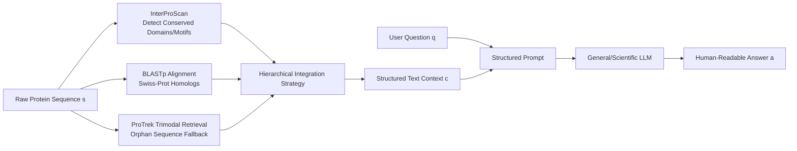

# Lost in Tokenization: Context as the Key to Unlocking Biomolecular Understanding in Scientific LLMs

**Conference**: ICLR 2026  
**OpenReview**: [https://openreview.net/forum?id=RDAhLHEHDm](https://openreview.net/forum?id=RDAhLHEHDm)  
**Code**: To be confirmed  
**Area**: Computational Biology / Scientific LLMs  
**Keywords**: Scientific LLM, Biomolecular Understanding, Tokenization, Context-driven, Protein Function Prediction, Bioinformatics Tools  

## TL;DR
This paper systematically validates a counter-intuitive conclusion: instead of forcing Scientific LLMs (Sci-LLMs) to directly "read" raw biomolecular sequences, it is more effective to use mature bioinformatics tools like BLAST, Pfam, or GO to preprocess sequences into high-level, human-readable text contexts. Providing "Context-only" significantly outperforms "Sequence-only" in protein QA tasks, and **feeding both raw sequences and context together actually degrades performance**, suggesting that the true value of existing Sci-LLMs lies in being "knowledge reasoning engines" rather than "sequence decoders."

## Background & Motivation
- **Background**: Scientific LLMs (such as Intern-S1, Evolla, NatureLM) attempt to integrate the "language of life" (DNA/RNA/Proteins) into LLMs. Two main paradigms exist: sequence-as-language (expanding the vocabulary to tokenize amino acids/nucleotides directly) and sequence-as-modality (using encoders like ESM/Evo for embeddings and aligning them to the LLM).
- **Limitations of Prior Work**: The authors define these two paths as the two horns of the **tokenization dilemma**. The first horn is **weak representation**—splitting sequences into atomic tokens of single amino acids/nucleotides destroys hierarchical structures like motifs, domains, and regulatory elements that carry biological meaning. Models are forced to relearn biological "words" from a pile of "letters," which is inefficient and hard to generalize. The second horn is **semantic misalignment**—the latent space of specialized encoders is governed by biophysics and evolution, while the LLM latent space is shaped by human language. Alignment modules must bridge this gap, where imperfect alignment introduces ambiguity or misunderstanding.
- **Key Challenge**: Both paradigms assume that the LLM should personally interpret low-level sequence syntax, which is precisely where LLMs are least proficient and currently weakest. Meanwhile, decades of biological wisdom accumulated in expert tools like BLAST, Pfam, and Gene Ontology are being bypassed.
- **Goal**: Through systematic empirical comparison (Sequence-only / Context-only / Sequence+Context), answer whether the success of Sci-LLMs stems from a true understanding of raw sequences or from reasoning over structured knowledge.
- **Key Insight**: **[Paradigm Reconstruction]** Use bioinformatics tools to convert raw sequences into information-dense text contexts that are natively aligned with the LLM's language space. By **deliberately discarding the raw sequence** and reframing the task from "low-level sequence interpretation" to "high-level knowledge synthesis and reasoning," both horns of the tokenization dilemma can be bypassed simultaneously.

## Method

### Overall Architecture
The authors first characterize the three paradigms using unified notation: the task is to learn a function $f: \mathcal{S} \times \mathcal{Q} \to \mathcal{A}$, mapping sequence $s$ and question $q$ to answer $a = M(s,q;\theta)$. Sequence-as-language concatenates the input as $X_{input}=[T_{text}(q); T_{seq}(s)]$. Sequence-as-modality uses an encoder $E_{bio}$ and an alignment module $A_{align}$ to get $X_{input}=[T_{text}(q); E_{aligned\_seq}]$. The proposed **context-driven** paradigm defines a tool function $C:\mathcal{S}\to\mathcal{T}_{context}$, converting the sequence into a structured text context $c=C(s)$. The raw sequence is **intentionally omitted** from the input $X_{input}=[T_{text}(q); T_{text}(c)]$, approximating the distribution as $P(a|s,q)\approx P(a|c,q)$. This comparison requires no training and serves as a plug-and-play prompt-level solution.

### Key Designs

**1. Multi-source Toolchain Functional Profiling: "Translating" Sequences into Expert Annotations.** The core of context generation is a three-stage bioinformatics pipeline that extracts functional signals from sequences. InterProScan identifies conserved domains and motifs based on intrinsic sequence features, providing *ab initio* feature-level analysis. BLASTp retrieves close homologs from Swiss-Prot to borrow annotations. For "orphan sequences" with no homology or domain hits, the trimodal retrieval model ProTrek serves as a backup to generate a basic semantic description. Outputs are integrated via an empirically driven hierarchical strategy to ensure rich text information for sequences of varying novelty.

**2. Structured Prompting to Organize Heterogeneous Annotations into Reasonably Textual Format.** The integrated context is not just concatenated but placed into a role-playing prompt. The model is cast as a "Senior Systems Biologist," and content is organized into three hierarchical blocks: "Conserved Domains (from Pfam)," "Functional Annotations (GO terms from BLASTp homologs)," and "Fallback Semantic Analysis (from ProTrek, used only if previous ones are missing)." This structure allows the LLM to process what it does best: information-dense, natively aligned structured text, shifting its role from a "sequence decoder" to a "knowledge synthesizer."

**3. Dual-axis Anti-leakage Design: Ensuring Evaluation Fairness.** Since context comes from databases, the primary risk is label leakage. The authors explicitly avoid this along two complement axes. First, **intrinsic analysis instead of identity queries**: InterProScan detects motifs based on structural features in domain knowledge bases, meaning even a novel protein can be identified as having a "kinase domain" without looking up its own label. Second, **homology-based inference instead of direct annotation matching**: When using BLASTp, only the GO annotations of **homologous sequences** are read, never the record of the query protein itself. This follows standard bioinformatics practice: predicting unknown sequence function by analogy to known homologs.

## Key Experimental Results

### Main Results
The benchmark focuses on three aspects of protein biology: Molecular Function (Func.), Biological Pathway (Path.), and Subcellular Localization (Sub. Loc.), using a general LLM as a judge (LLM-Score). Comparing three input configurations (Seq-only / Seq+Context / Context-only):

| Model | Seq | Ctx | Func. | Path. | Sub. Loc. | All |
|------|-----|-----|-------|-------|-----------|-----|
| Intern-S1 | ✓ | | 20.57 | 26.56 | 69.75 | 43.33 |
| Intern-S1 | ✓ | ✓ | 74.18 | 98.85 | 93.00 | 84.03 |
| Intern-S1 | | ✓ | 76.22 | 97.60 | 95.60 | **86.15** |
| Evolla | ✓ | | 40.23 | 72.71 | 79.76 | 59.93 |
| Evolla | ✓ | ✓ | 57.46 | 84.69 | 83.05 | 70.53 |
| Evolla | | ✓ | 65.77 | 83.33 | 81.88 | **74.02** |
| NatureLM | ✓ | | 3.58 | 5.52 | 10.45 | 6.82 |
| NatureLM | | ✓ | 44.77 | 51.35 | 32.51 | **39.50** |
| Deepseek-v3 | ✓ | | 10.98 | 24.54 | 74.72 | 40.77 |
| Deepseek-v3 | | ✓ | 75.79 | 93.96 | 93.65 | 84.99 |
| Gemini2.5 Pro | | ✓ | 79.17 | 98.65 | 94.56 | **87.19** |
| GPT-5 | | ✓ | 77.25 | 85.73 | 73.05 | 75.76 |
| Qwen3-235B | | ✓ | 75.63 | 92.19 | 94.28 | 84.99 |

**Core Phenonmenon**: Context-Only is optimal or near-optimal for every model. NatureLM almost completely fails with only sequences (All=6.82) but jumps to 39.50 with context. Most counter-intuitively, **Seq+Context is generally worse than Context-Only** (Evolla 74.02→70.53, Intern-S1 86.15→84.03), proving that raw sequences are not just redundant but are active "informational noise."

### Ablation Study / In-depth Analysis

| Analysis Dimension | Key Findings |
|----------|----------|
| Representation Quality (t-SNE + ARI on 50% MMseqs2 clusters) | NatureLM 0.492, Intern-S1 0.690, Evolla 0.809, while **Contextual Text Representation reached 0.958**, showing near-perfect functional separation. |
| Semantic Misalignment (Layer-wise Evolla) | SaProt encoder ARI 0.945 → Q-Former alignment 0.916 → LLM final layer 0.809; degradation occurs at the **alignment stage** rather than encoding. |
| Temporal Generalization (1995–2024, ~100 proteins/year) | Ours shows only a slight decline; Evolla collapses on proteins from the last decade; Intern-S1 remains consistently low. |
| Efficiency (Single vs. Batch) | Single instance is ~23× cheaper and 1.3× faster than Evolla; Batch processing is ~30× cheaper and **154× faster** (CPU tools + API). |
| Wet-lab Validation (Novel unpublished sequences) | Rhodopsin 100%, PETase 97.3% accuracy; Evolla failed catastrophically on PETase. |

### Key Findings
- **Context is the protagonist, sequence is noise**: Even for Sci-LLMs with specialized tokenization, adding raw sequences causes a drop in performance, empirically demonstrating being "lost in tokenization."
- **Deconstruction of the Dilemma**: Weak representation (via ARI comparison) and semantic misalignment (via layer-wise ARI degradation in Evolla) are supported by visual evidence.
- **Dual Robustness**: The method is robust to both sequence novelty and temporal drift, indicating that reasoning over stable high-level knowledge is more reliable than decoding raw sequences.

## Highlights & Insights
- **Minimalist Method with Impacting Conclusions**: Without training or architectural changes, simply switching the input paradigm pulls protein QA scores from the 40s to 85+, revealing the impactful observation that "sequences can be harmful."
- **Quantifiable Analysis of the "Dilemma"**: Using ARI and layer-wise t-SNE to pin "weak representation" and "semantic misalignment" to concrete numbers creates a clean chain of logic.
- **Realistic Efficiency Gains**: Analysis based on AWS on-demand pricing for single/batch processing highlights a 154× speedup in batch mode, resolving a major pain point for high-throughput research.
- **Repositioning Sci-LLMs**: Argues for viewing Sci-LLMs as "reasoning engines for expert knowledge" rather than "sequence decoders," pointing toward "hybrid scientific AI agents" (LLM + tools).

## Limitations & Future Work
- **Dependence on Knowledge Base Coverage**: Context quality is tied to the hit rates of tools like BLAST/Pfam/GO. For true orphan sequences lackng homologs, context becomes sparse, leading to the slight performance dip over time.
- **Task Limitation to Protein QA**: Experiments focus on function/pathway/localization. Whether these conclusions hold for other biomolecules (DNA/RNA/small molecules) or generative tasks requiring de novo design remains to be verified.
- **"Sequence is Useless" as a Current Conclusion**: The authors argue that under current tokenization paradigms, sequences are noise, but they do not negate the potential value of better future sequence representations. How to make sequence information truly complementary to context remains an open question.
- **Judge bias with LLM-Score**: Evaluation relies on a general LLM as a judge, which may introduce preference bias. Wet-lab validation mitigates this but uses a smaller sample size.

## Related Work & Insights
- **Biological Sequence Foundation Models**: ProtBERT, ESM series, DNABERT, etc., are strong in representation learning, but their embeddings are "black boxes" difficult to map into human-interpretable units like motifs or pathways—motivating the use of text context.
- **Scientific LLMs**: Galactica, NatureLM, and Intern-S1 extend general LLM capabilities to science. Evolla and BioReason take the sequence-as-modality route and are the primary baselines here.
- **Tool-Augmented / Agent Paradigm**: GeneAgent and ChemCrow allow LLMs to call external tools. This paper aligns with that spirit but further proves that for many understanding tasks, simply providing the tool-generated context and discarding the raw sequence is optimal, providing a strong baseline for hybrid scientific agent design.

## Rating
- **Novelty**: ⭐⭐⭐⭐ — The method itself (using tools for context) is not complex, but the counter-intuitive conclusion (sequence as noise, context-only is optimal) provides a significant cognitive shift for the Sci-LLM field.
- **Experimental Thoroughness**: ⭐⭐⭐⭐ — Covers specialized Sci-LLMs and general LLMs, three input configurations, and five types of analysis (representation, alignment, time, efficiency, wet-lab). Loss of points for task limitations and LLM judging.
- **Writing Quality**: ⭐⭐⭐⭐ — The "two horns of the tokenization dilemma" framework is clear, supported by strong visualizations (ARI contrasts, trade-off landscape).
- **Value**: ⭐⭐⭐⭐ — Provides a low-cost, high-performance, and immediately applicable baseline while offering evidentiary support for the "LLM as reasoning engine + tool as perceiver" paradigm.

<!-- RELATED:START -->

## Related Papers

- [\[ICLR 2026\] VenusX: Unlocking Fine-Grained Functional Understanding of Proteins](venusx_unlocking_fine-grained_functional_understanding_of_proteins.md)
- [\[ICLR 2026\] CellDuality: Unlocking Biological Reasoning in LLMs with Self-Supervised RLVR](cellduality_unlocking_biological_reasoning_in_llms_with_self-supervised_rlvr.md)
- [\[AAAI 2026\] MergeDNA: Context-aware Genome Modeling with Dynamic Tokenization through Token Merging](../../AAAI2026/computational_biology/mergedna_context-aware_genome_modeling_with_dynamic_tokenization_through_token_m.md)
- [\[ICLR 2026\] Thompson Sampling via Fine-Tuning of LLMs](thompson_sampling_via_fine-tuning_of_llms.md)
- [\[ICLR 2026\] Towards Understanding the Shape of Representations in Protein Language Models](towards_understanding_the_shape_of_representations_in_protein_language_models.md)

<!-- RELATED:END -->
