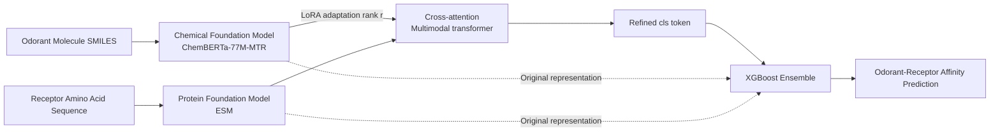

# Low rank adaptation of chemical foundation models generate effective odorant representations

**Conference**: ICLR 2026  
**OpenReview**: [https://openreview.net/forum?id=BUUfUcIcfE](https://openreview.net/forum?id=BUUfUcIcfE)  
**Code**: TBD  
**Area**: Computational Biology / Olfactory Representation Learning  
**Keywords**: Olfaction, Chemical Foundation Models, LoRA Fine-tuning, Odorant-Receptor Affinity, Cross-attention, Representation Alignment  

## TL;DR
This paper first uses a large-scale benchmark to prove that representations generated by off-the-shelf chemical foundation models are not stronger than manual physicochemical descriptors (due to high information redundancy). It then proposes LORAX—using LoRA to fine-tune chemical foundation models for olfactory tasks with cross-attention and XGBoost ensembles—to create odorant representations that are better aligned with neural representations and generalize more effectively.

## Background & Motivation
**Background**: Representing odorant molecules is a core challenge in olfaction research—structurally similar odorants can trigger vastly different neural responses at the receptor and perceptual levels (the structure-odor relationship is highly non-linear). Early studies relied on manually selected physicochemical descriptors (molecular weight, ring count, etc.), while recent trends have shifted toward data-driven approaches: either using supervised models like GNNs to learn representations or utilizing self-supervised chemical foundation models (pre-trained on massive unlabeled molecules) to generate fixed features. The latter is particularly attractive in the small-data scenarios typical of olfaction, given the billions of potential odorant molecules.

**Limitations of Prior Work**: Chemical foundation models have been successful in molecular property prediction, but **they have never been systematically used for odorant-receptor affinity prediction**, nor has anyone horizontally benchmarked how much stronger they are compared to manual descriptors. It is widely assumed that "foundation model representations are richer," but this hypothesis has never been verified in olfactory tasks.

**Key Challenge**: This study performs a systematic benchmark of 15 representations x 3 feature methods and reveals a counterintuitive conclusion—**off-the-shelf chemical foundation model representations do not outperform manual physicochemical descriptors**. Analysis using orthogonal Procrustes and CCA distances reveals that these representations are highly overlapping and redundant; self-supervised pre-training itself did not learn new features useful for "odorant-receptor binding." The problem is not that foundation models are useless, but that **pure feature-based methods (without fine-tuning) cannot activate their potential**.

**Goal**: To create an odorant-specific molecular representation that is aligned with neural responses and possesses strong generalization capabilities, rather than directly using pre-trained embeddings as fixed features.

**Core Idea**: **[Fine-tuning > Feature-based]** Use LoRA for parameter-efficient fine-tuning of chemical foundation models to "steer" general chemical representations toward olfactory tasks, finding the sweet spot between overfitting (purely supervised) and underfitting (purely feature-based).

## Method

### Overall Architecture
LORAX (LoRA-based Odorant-Receptor Affinity prediction with CROSS-attention) is a multimodal transformer: a protein foundation model (ESM) encodes receptors, while a chemical foundation model (ChemBERTa-77M-MTR) encodes odorants. The two are fused via cross-attention, and the chemical side's representation is continuously updated during training using LoRA. Finally, an XGBoost ensemble is used for the ultimate prediction. Training consists of two stages—first training the transformer (including LoRA parameters) to refine the `<cls>` token, and then freezing the transformer to feed the `<cls>` token along with the original foundation model embeddings into the XGBoost ensemble for testing.

### Key Designs

**1. Diagnostic benchmark proving "feature-based methods cannot save foundation models":** Before building the new model, the authors systematically compared 15 representations using three pure feature-based methods (Molecule-only Ridge Regression, Molecule+Protein Ridge Regression, ProSmith Multimodal Transformer+XGBoost)—including 5 transformer models, 3 GNN models, 8 physicochemical descriptors, and 1 random baseline. The conclusion is robust: with only molecular information, $R^2$ is extremely low and variance is high (receptor information must be included). In the strongest setting (ProSmith), Tukey tests with one-way ANOVA and Bonferroni correction showed that **except for the three worst representations, all others are statistically equivalent**—chemical foundation models are no better than manual descriptors. This step irrefutably argues "why fine-tuning is needed," serving as the foundation of the paper.

**2. Revealing the root cause of "Redundancy" via Procrustes/CCA distance:** To explain why foundation models fail, the authors embedded odorants from the Carey dataset into various representation spaces and calculated pairwise orthogonal Procrustes distances and CCA distances. The results show that most representations cluster into a "small distance block" in the upper-left of the distance matrix—indicating high alignment. For example, the Procrustes distance between RDKitDescriptors2D and MordredDescriptors is only 0.61, and they perform almost identically in ProSmith. ChemBERTa-77M-MTR (trained on 77 million SMILES to predict RDKit descriptors) is highly similar to RDKitDescriptors2D. **Massive overlap in information content → homogeneous redundancy**, which is the essence of their performance convergence and the direct motivation for "breaking redundancy through fine-tuning."

**3. LoRA Fine-tuning + Cross-attention to "steer" representations toward olfaction:** The core of LORAX is using a low-rank adaptation matrix (rank $r$) to update the chemical foundation model during training instead of freezing it. Compared to supervised training from scratch (prone to overfitting) and pure feature-based methods (limited by initial representations and underfitting), the low-rank assumption of LoRA provides a "sweet spot": it preserves chemical priors from pre-training while selectively injecting new features for olfactory tasks. The cross-attention block allows for full interaction between odorant and receptor representations, compressing refined information into the `<cls>` token. Notably, the authors found that **fine-tuning only the chemical side (LORAX (C)) was slightly superior to fine-tuning both protein and chemical sides (LORAX (P+C))**, despite the latter having approximately 2 million more parameters—suggesting that ESM receptor representations are already sufficient, and gains are primarily driven by improved chemical representations.

**4. Three-way XGBoost ensemble balancing performance and interpretability:** Each XGBoost in the ensemble uses a different set of input features: (1) the transformer's `<cls>` token, (2) concatenated original chemical and protein representations, and (3) a combination of both. The weighted sum of the XGBoosts provides the final prediction, and **the weights themselves serve as diagnostic tools**: the authors found that ProSmith assigns high weights to the XGBoost using "only original representations" (meaning its transformer's `<cls>` token is largely ignored), whereas LORAX assigns lower weights to paths "without the `<cls>` token" and its individual transformer achieves a higher validation $R^2$. This comparison quantitatively proves that **LORAX actually extracts more task-relevant information from the foundation model**, rather than just changing the architecture.

## Key Experimental Results

### Main Results: Comparison on the M2OR Large Dataset (5-fold cross-validation)

| Model | AUROC | AveP | Precision | Recall | F-score | MCC |
|---|---|---|---|---|---|---|
| MolOR (Weighted) | 76.12±1.53 | 0.626 | 0.507 | 0.727 | 0.595 | 0.467 |
| Hladiš et al. | n/a | 0.780 | 0.689 | 0.698 | 0.693 | 0.605 |
| ProSmith | **90.47±0.98** | 0.584 | **0.764** | 0.671 | 0.712 | 0.641 |
| LORAX (P+C) | 82.43 | 0.776 | 0.729 | 0.727 | 0.727 | 0.650 |
| **LORAX (C)** | 83.24 | **0.778** | 0.710 | **0.754** | **0.730** | **0.651** |

On the highly imbalanced M2OR dataset, MCC/F-score are more reliable than AUROC: LORAX (C) leads in both, significantly outperforming MolOR ($p < 0.003$) and surpassing ProSmith ($p = 0.067$). ProSmith's high AUROC has limited significance under class imbalance.

### Generalization Results: Two splits of the Carey Dataset ($R^2$, higher is better)

| Scenario | Method | avg | std |
|---|---|---|---|
| Unseen Odorants | ProSmith | -0.402 | 1.064 |
| Unseen Odorants | **LORAX** | **0.045** | **0.614** |
| Unseen Odorants | Naïve | -1.016 | 1.954 |
| Unseen Receptors | ProSmith | 0.088 | 0.169 |
| Unseen Receptors | LORAX | 0.060 | 0.067 |

LORAX significantly outperforms ProSmith on "unseen odorants" ($p = 0.069$) and is the only model to consistently beat the Naïve baseline; ProSmith even fails to beat the Naïve baseline in this scenario. Both methods perform comparably in the unseen receptor scenario.

### Key Findings
- In the standard Carey setting, LORAX and ProSmith achieve nearly identical scores (0.712 vs 0.703, $p = 0.264$); **performance advantages manifest primarily in generalization and large datasets**, rather than simple in-distribution prediction.
- CCA distance analysis shows that fine-tuned LORAX representations are **further from physicochemical descriptors, closer to all graph methods (GNN/ECFP), and more aligned with neural response representations**—proving that LoRA creates a truly new, olfactory-specific chemical space.

## Highlights & Insights
- **"Falsification first" research paradigm**: Rather than just showcasing a new model, the paper uses a rigorous statistical benchmark to falsify the implicit assumption that "off-the-shelf foundation models are sufficient," naturally leading to the fine-tuning solution with a solid logical foundation.
- **Ensemble weights as diagnostics**: By using XGBoost weights and individual transformer validation scores, the authors quantitatively decouple "architectural contribution" from "representation contribution," providing much more information than final scores alone.
- **Neural representation alignment as mechanistic evidence**: Beyond reporting score improvements, the authors use CCA distance to prove that fine-tuning shifts the molecular space toward the actual neural response space, providing a mechanistic explanation for "why it is better."
- **Value in negative results**: The fact that P+C dual fine-tuning was slightly worse clearly indicates that "receptor-side representations are saturated, and the bottleneck lies on the chemical side," offering valuable guidance for future work.

## Limitations & Future Work
- Most improvements show **weak statistical significance** (generalization $p = 0.069$, vs ProSmith $p = 0.067$); conclusions regarding robustness require verification on larger scales or more splits.
- The main analysis only utilized one chemical foundation model, ChemBERTa-77M-MTR (Uni-Mol2 was added in the appendix); larger and newer chemical foundation models + LoRA might yield further improvements, which the authors identify as a future direction.
- The task focuses on odorant-receptor binding and has not been extended to downstream **odor percept prediction**—the more central problem in olfaction research. The authors hypothesize that LoRA fine-tuning would provide similar gains there but have not yet verified this.
- While the modular design of LORAX (interchangeable foundation models) is a strength, it also means conclusions may depend on specific model combinations; cross-model universality still requires systematic benchmarking.

## Related Work & Insights
- **Olfactory Representation Lineage**: From manual descriptors (Haddad, Boyle, Gabler) → supervised GNNs (Achebouche, Hladiš) → chemical/protein foundation model feature methods (Shin, Taleb). This paper is the first to systematically apply chemical foundation models to odorant-receptor binding and the first to introduce LoRA to olfaction.
- **Methodological Heritage**: The architecture and training paradigm draw from ProSmith (Kroll 2024); LoRA is sourced from Hu et al. 2021; representation distance analysis utilizes the Procrustes/CCA framework from Williams et al. 2022.
- **Inspiration**: This paper serves as a clean case of "cross-domain LoRA transfer." In a scientific sub-domain characterized by data scarcity and information redundancy, rather than chasing larger models, it is better to use parameter-efficient fine-tuning to "calibrate" general foundation models. This "benchmark falsification + lightweight fine-tuning" template is transferable to other small-data scientific tasks (proteins, materials, single-cell analysis, etc.).

## Rating
- **Novelty**: ⭐⭐⭐⭐ First systematic benchmark of chemical foundation models in olfaction; first introduction of LoRA to odorant-receptor prediction. The method combines existing components (LoRA + cross-attention + XGBoost), but the application and findings are novel.
- **Experimental Thoroughness**: ⭐⭐⭐⭐ Solid benchmark across 15 representations, multiple datasets, and various scenarios with proper statistical testing. Points deducted for weak significance in key improvements and reliance on a single main chemical foundation model.
- **Writing Quality**: ⭐⭐⭐⭐⭐ Clear "falsification before proposition" structure. Mechanisms are well-explained through representation distances and ensemble weights; negative results are handled cleanly.
- **Value**: ⭐⭐⭐⭐ Directly valuable to the olfaction/computational neuroscience community—correcting misconceptions about foundation model sufficiency and providing a reusable fine-tuning framework. Offers methodological inspiration for broader small-data scientific modeling.

<!-- RELATED:START -->

## Related Papers

- [\[ICML 2026\] iLoRA: Bayesian Low-Rank Adaptation with Latent Interaction Graphs for Microbiome Diagnosis](../../ICML2026/computational_biology/ilora_bayesian_low-rank_adaptation_with_latent_interaction_graphs_for_microbiome.md)
- [\[ICLR 2026\] A Foundation Model with Multi-Variate Parallel Attention to Generate Neuronal Activity](a_foundation_model_with_multi-variate_parallel_attention_to_generate_neuronal_ac.md)
- [\[ICLR 2026\] Towards Understanding the Shape of Representations in Protein Language Models](towards_understanding_the_shape_of_representations_in_protein_language_models.md)
- [\[ICLR 2026\] Flow Autoencoders are Effective Protein Tokenizers](flow_autoencoders_are_effective_protein_tokenizers.md)
- [\[ICLR 2026\] Riemannian High-Order Pooling for Brain Foundation Models](riemannian_high-order_pooling_for_brain_foundation_models.md)

<!-- RELATED:END -->
