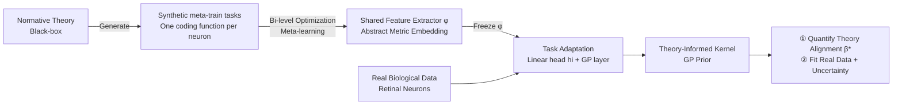

# Meta-Learning Theory-Informed Inductive Biases using Deep Kernel Gaussian Processes

**Conference**: ICLR 2026  
**OpenReview**: [https://openreview.net/forum?id=7dvYWzOiEu](https://openreview.net/forum?id=7dvYWzOiEu)  
**Code**: To be confirmed  
**Area**: Computational Neuroscience / Bayesian Machine Learning / Meta-Learning  
**Keywords**: Normative Theory, Gaussian Processes, Deep Kernels, Meta-Learning, Efficient Coding, Bayesian Model Comparison, Uncertainty Quantification  

## TL;DR
This work utilizes Bayesian meta-learning to automatically distill "black-box" normative theories (e.g., efficient coding in the retina) into a Deep Kernel Gaussian Process prior (Theory-Informed Kernel). This serves as an inductive bias to improve fitting on real neural data and allows for the rigorous quantification of "theory-data alignment" using exact marginal likelihood.

## Background & Motivation
- **Background**: Normative theories in neuroscience (normative/task-driven, such as efficient coding) are powerful top-down tools for explaining biological structures. They assume biological systems optimize a utility functional $\theta^* = \arg\max_\theta U(P(r|x,\theta), P_x(x))$ under evolutionary pressure, successfully predicting neural activity in the retina, V1, and high-level sensory areas.
- **Limitations of Prior Work**: This paradigm faces two long-standing bottlenecks. ① **Inability to quantitatively arbitrate competing theories**: While Bayesian Model Selection (BMS) can theoretically do this, it requires manually formulating the theory as a probabilistic model, and the resulting marginal likelihood is often intractable for high-dimensional neural data. ② **Difficulty in systematically injecting theoretical knowledge into data fitting**: Existing methods for combining "good theories" with "noisy real data" either rely on expert-crafted receptive field constraints (heuristic and system-specific) or are limited to idealized simple models.
- **Key Challenge**: Top-down theories offer high interpretability but are difficult to implement as computable probabilistic priors; bottom-up data fitting is flexible but lacks theoretical structure. An extensible, automated bridge between the two is missing.
- **Goal**: Propose a general framework that converts any theory capable of generating input/output predictions into a tractable probabilistic model, serving both "data fitting" and "theory validation."
- **Key Insight**: **[Theory-Informed Kernel]** Meta-learn a deep kernel for a Gaussian Process on synthetic data generated by normative theories. The meta-learned feature extractor forms an abstract metric embedding where geometric distances represent functional similarity consistent with the theory. Once frozen, a task-adaptation module adapts this prior to real biological data, thereby encoding the theoretical structure into the GP prior (i.e., inductive bias).

## Method

### Overall Architecture
The framework consists of three steps (Fig. 1): ① Generate synthetic datasets using normative theories (where each "task" is a coding function predicted by the theory); ② Meta-learn a **Theory-Informed Kernel (TIK)** on this synthetic data; ③ Adapt/apply the resulting GP prior to real data for prediction and theory validation. The kernel is composed of two decoupled modules: a shared meta-learned feature extractor $\phi$ and task-adaptive modules (linear head $h_i$ + GP layer) refitted for each task.

### Key Designs

**1. Theory-Informed Kernel: A decoupled "shared embedding + task-adaptive head" structure designed to embed theories into tractable kernels.** The kernel is split into three layers: a high-capacity, shared feature extractor $\phi$ that maps raw inputs (images) to a metric embedding $z$; a task-specific linear head $h_i$ that adjusts the embedding; and a task-specific RBF GP layer $K_{\mathrm{RBF}}(z,z';\theta_{gp})=\sigma_f\exp(-\|z-z'\|^2/2\ell^2)$. The final kernel for task $i$ is $K_{\mathrm{TIK},i}(x,x')=\sigma_{f,i}\exp\!\left(-\|h_i(\phi(x))-h_i(\phi(x'))\|^2/2\ell_i^2\right)$. $\phi$ carries the geometric structure learned from the theory (defining which inputs should be close/far), while $h_i$ provides flexibility to mitigate negative transfer and bridge the sim-to-real gap between synthetic and biological measurements.

**2. Bi-level Meta-Learning: Inner loop fits task heads, outer loop updates shared embeddings, using marginal likelihood as a unified objective.** Training employs bi-level optimization. The inner loop fixes $\phi$ and maximizes the GP marginal likelihood $P(y|x,\theta)=\int P(y|f)\,p(f|x,\theta)\,df$ using support data to fit $h_i$ and $\theta_{gp,i}$: $\theta^*_{h_i,gp_i}\leftarrow\arg\max P_{\theta_{meta},h_i,gp_i}(\mathcal{D}_{train,i})$. The outer loop updates $\phi$ based on the log-likelihood of the adapted model on query data: $\theta^*_{meta}\leftarrow\arg\max\,\mathbb{E}_{i\le N_\mathcal{T}}[P_{\theta^*_{h_i,gp_i},\theta_{meta}}(\mathcal{D}_{val,i}|\mathcal{D}_{train,i})]$. Using marginal likelihood throughout ensures an automatic "Occam's razor": with little data, the prior provides structure; with more data, the GP's non-parametric capacity expands, and the marginal likelihood stops rewarding extra structure in $h_i$, relaxing theoretical constraints.

**3. Generating Synthetic Meta-train Sets: "Sampling" normative theories into regression tasks.** Taking retinal efficient coding as an example, the authors adapt a convolutional autoencoder (trained on natural images to maximize reconstruction accuracy while minimizing bottleneck activity). Receptive fields $f_i$ are extracted from the bottleneck layer, and a synthetic task involves predicting the linearized response $y_{i,k}=f_i^T x_k$. This linearization isolates the center-surround receptive fields emergent from population efficient coding. Standard data augmentation yields approximately 490 synthetic tasks derived from the theory.

**4. Precise Bayesian Model Comparison via Interpolation Kernels.** Biological systems often only partially adhere to a theory. To move beyond binary comparisons (TIK vs. RBF), an interpolation kernel is constructed: $K_\beta(x,x')=\beta K_{\mathrm{TIK}}(x,x')+(1-\beta)K_{\mathrm{RBF}}(x,x')$, where $\beta\in[0,1]$ controls the theoretical contribution. After freezing all parameters, $\beta^*=\arg\max_\beta P(Y|X,\beta)$ is found via grid search. Since the GP marginal likelihood is exactly computable, $\beta^*$ quantifies the degree to which data supports the theoretical structure over a generic null kernel—effectively inferring the "degree of optimality" of the neurons.

## Key Experimental Results

Data: Ex vivo calcium imaging responses of 86 mouse retinal ganglion cells (RGCs) to natural images (1452 images of 36×32 pixels → scalar responses).

### Main Results (Predictive Accuracy, Fig. 3a)

| Model | Low Data N≤8 | Medium N (≤64) | Large N (Full Set) |
|------|-----------|--------------|--------------|
| LN (Linear-Nonlinear) | Best (temp.) | Average | Weak |
| RBF GP | — | Comparable to CNN | Weak |
| Systems-ID CNN (Baseline) | — | Competitive | Average |
| **Theory-Informed Kernel (Ours)** | Slightly < LN | Leading | **Highest (Pearson r)** |

- Performance is measured by the Pearson correlation between predicted and measured responses. Except in the extremely low-data regime (N≤8), TIK outperforms all baselines, combining the data efficiency of small N with the high accuracy of large N.

### Ablation Study

| Ablation Setting | Result |
|----------|------|
| Randomized $\phi$ | Significant performance drop |
| Removing Meta-learning of $\phi$ | Significant performance drop |
| Removing Theory meta-train set / Generic tasks | Significant reduction in gain |

- Conclusion: TIK significantly outperforms "random/removed $\phi$" and "generic task meta-learning," proving that $\phi$ indeed encodes knowledge from efficient coding theory rather than just benefiting from task-adaptive parameters.

### Key Findings
- **Uncertainty Quantification (Fig. 3b,c)**: At N=1400, RBF GP suffers from feature collapse (pathological uncertainty collapse near data), while TIK maintains reasonable heteroscedastic confidence intervals. NLPD (lower is better) is consistently superior to RBF, avoiding the overconfidence common in deep kernel GPs.
- **Interpretable Representations (Fig. 4)**: "Prototype images" $P_i$ derived from $h_i$ accurately reconstruct true receptive fields in synthetic data. On real data, $P_i$ for neurons with the best NLPD resemble biological receptive fields, whereas those for the worst lack structure—allowing for failure analysis. A "Bayesian Occam effect" is observed: as N increases, the correlation between $P_i$ and the ground truth does not always increase monotonically.
- **Theory Fidelity (Fig. 5)**: Inferred optimality $\beta^*$ correlates at **0.88** with ground truth on synthetic data. For 86 real RGCs, most score highly, consistent with the consensus that efficient coding is widely applicable in the retina.

## Highlights & Insights
- **Theory as Data Generator**: Does not require a manually written probabilistic model; as long as the theory can generate input/output predictions, it can be used, bypassing the hardest hurdle in applying normative theories.
- **Marginal Likelihood for Two Purposes**: The same GP marginal likelihood serves as both the meta-learning objective and the model comparison criterion for theory validation, automatically managing the "Occam's razor" adjustment.
- **Interpretable and "Aware of Ignorance"**: Prototype images visualize the "black-box" embeddings of the deep kernel GP, and well-calibrated UQ provides value for downstream scientific decision-making.
- **Cross-Domain Transferability**: Although demonstrated with retinal efficient coding, the framework applies to any system with a top-down theory capable of generating predictions.

## Limitations & Future Work
- **Dependency on Theoretical Samplability**: Requires the theory to generate input/output pairs (here achieved by linearizing the autoencoder), leaving the applicability to non-samplable or hard-to-linearize theories to be verified.
- **Single System/Theory Demonstration**: Experimental validation was limited to one mouse retina and one theory. Scaling to multiple species, brain regions, or competing theories remains for future work.
- **Feature Collapse Risks**: Although the architecture mitigates feature collapse in deep kernel GPs, the paper acknowledges this as an inherent risk of the approach.
- **Sim-to-Real Gap**: While $h_i$ bridges the gap, the construction of the synthetic meta-train set involves many engineering choices (augmentation, clustering) whose sensitivity is primarily discussed in the appendix.

## Related Work & Insights
- **Methodological Lineage**: Adaptive deep kernel meta-learning (Patacchiola 2020; Chen 2023), Deep Kernel GP (Wilson 2016), and the relationship between inductive bias and generalization in Bayesian Deep Learning (Wilson & Izmailov 2020).
- **Neuroscience Context**: Efficient coding theory (Barlow 1961; Atick 1992; Olshausen & Field 1996), task-driven modeling (Yamins 2014; Kell 2018), and early attempts at probabilistic normative theories (Młynarski 2021).
- **Insight**: The paradigm of "using theory as a teacher, distilling it into a prior via meta-learning, and using marginal likelihood for simultaneous fitting and testing" can be extended beyond neuroscience to any scientific field (e.g., physics, chemistry) as a generic path for domain knowledge injection in Scientific ML.

## Rating
- **Novelty**: ⭐⭐⭐⭐⭐ Automating the "normative theory → tractable prior" transition and using marginal likelihood for fit/validation is a paradigm-level bridge.
- **Experimental Thoroughness**: ⭐⭐⭐⭐ Systematic comparison against baselines on real RGC data across accuracy, UQ, interpretability, and fidelity; slightly limited by its single-system demonstration.
- **Writing Quality**: ⭐⭐⭐⭐ Clear motivation and well-coordinated formulas/figures; some engineering details require the appendix for full replication.
- **Value**: ⭐⭐⭐⭐⭐ Provides a scalable validation tool for neuroscience and serves as a strong case study for theory-informed kernel design in Bayesian ML.

<!-- RELATED:START -->

## Related Papers

- [\[ICML 2026\] Transformed Latent Variable Multi-Output Gaussian Processes](../../ICML2026/computational_biology/transformed_latent_variable_multi-output_gaussian_processes.md)
- [\[ICLR 2026\] PSDNorm: Temporal Normalization for Deep Learning in Sleep Staging](psdnorm_temporal_normalization_for_deep_learning_in_sleep_staging.md)
- [\[ICLR 2026\] SAIR: Enabling Deep Learning for Protein-Ligand Interactions with a Synthetic Structural Dataset](sair_enabling_deep_learning_for_protein-ligand_interactions_with_a_synthetic_str.md)
- [\[ICLR 2026\] PatchDNA: A Flexible and Biologically-Informed Alternative to Tokenization for DNA](patchdna_a_flexible_and_biologically-informed_alternative_to_tokenization_for_dn.md)
- [\[ICLR 2026\] GAGA: Gaussianity-Aware Gaussian Approximation for Efficient 3D Molecular Generation](gaga_gaussianity-aware_gaussian_approximation_for_efficient_3d_molecular_generat.md)

<!-- RELATED:END -->
