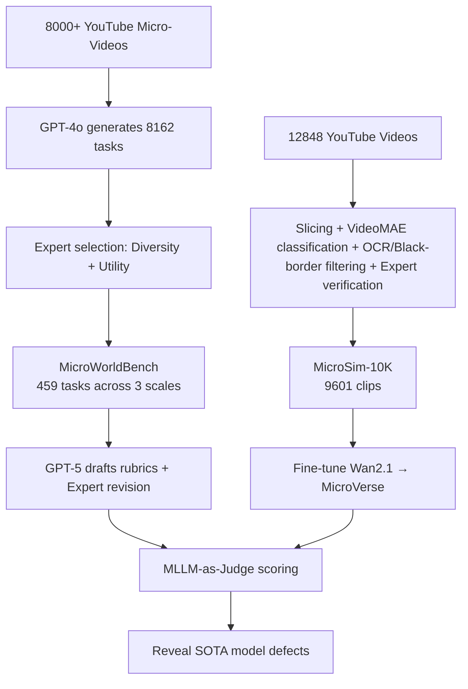

# MicroVerse: A Preliminary Exploration Toward a Micro-World Simulation

**Conference**: ICLR 2026  
**OpenReview**: [https://openreview.net/forum?id=7pQv7qitFV](https://openreview.net/forum?id=7pQv7qitFV)  
**Code**: [https://github.com/FreedomIntelligence/MicroVerse](https://github.com/FreedomIntelligence/MicroVerse)  
**Area**: Video Generation / Micro-World Simulation / Biomedicine  
**Keywords**: Micro-world simulation, Video generation, Rubric benchmark, Biomedicine, World models  

## TL;DR
This paper introduces the concept of "Micro-World Simulation" for the first time. It constructs a fine-grained rubric benchmark (MicroWorldBench), an expert-verified dataset (MicroSim-10K), and fine-tunes a micro-scale video generation model (MicroVerse) based on Wan2.1. It reveals and bridges the gap where current SOTA video models appear "visually plausible but physically/biologically incorrect" in simulating micro-biological mechanisms.

## Background & Motivation
**Background**: World models and video generation have achieved significant success at the macro scale (natural scenes, human activities, robotic manipulation). They can learn physical common sense from raw videos and are seen as precursors to "real-world simulators."

**Limitations of Prior Work**: These advancements have rarely been transferred to the **micro scale**. Generations from Sora or Veo3 for DNA transcription, alveolar blood flow, or cell division often "look right" but frequently violate physical and biological laws—incorrect blood cell shapes, distorted molecular scales, and chaotic mechanistic sequences. The root cause is that training data consists entirely of human-scale videos, **lacking grounding in micro-physical and biomedical knowledge**.

**Key Challenge**: Micro-simulation is highly valuable for drug discovery, organ-on-a-chip, disease mechanism research, and educational visualization. However, existing models lack both micro-scale data and evaluation methods capable of identifying "scientific fidelity." General scoring rules focus on visual coherence and fail to capture mechanism-level errors.

**Goal**: Systematize "biopsychical mechanism simulation at the micro scale" as a new video generation task. Provide a complete proof of concept: clear objectives + specialized benchmark + training data + customized model.

**Key Insight**:
- **Rubric-based Evaluation**: Replace generic scoring with fine-grained, expert-written points involving polarity and weights, focusing evaluation on "scientific fidelity" rather than surface aesthetics.
- **Domain Data-Driven**: Construct the first micro-simulation dataset from massive YouTube micro-videos through multi-stage filtering and expert verification, then fine-tune video models to inject domain knowledge.

## Method

### Overall Architecture
The work consists of two main tracks: (1) **MicroWorldBench**—459 expert-selected micro tasks, each paired with a set of rubric points, using MLLMs as judges to expose defects in existing models; (2) **MicroVerse**—fine-tuning Wan2.1 on the expert-verified MicroSim-10K (9,601 videos) to produce a micro-oriented generative model.

### Key Designs

**1. Three-level Biological Scale: Structured Sampling of the Micro-World**  
Biological systems are naturally hierarchical (Society → Body → Organ → Tissue → Cell → Organelle → Protein → Gene). Considering data availability and utility, this paper selects three representative levels: **Organ-level** (cardiac contraction, vessel deformation; connecting micro-behavior to macro-physiology), **Cell-level** (migration, proliferation, immune response; the core of biomedicine), and **Subcellular-level** (fusion, apoptosis, signaling cascades; highest complexity and fidelity requirements). The benchmark contains 238 organ, 189 cell, and 32 subcellular tasks.

**2. Polarized and Weighted Rubric Mechanism: Targeting Scientific Fidelity**  
This is the core evaluation design. Each task is assigned a set of fine-grained points $P = \{(a_i, d_i, s_i, w_i)\}_{i=1}^N$ drafted by GPT-5, where $a_i$ is the dimension, $d_i$ the description, $s_i \in \{+1, -1\}$ indicates the polarity (bonus or penalty), and $w_i \in (0,1]$ is the weight ($1.0$ for core scientific requirements, $0.5$ for key secondary details, $0.2$ for auxiliary presentation). The raw score $S = \sum_{i=1}^N s_i \cdot w_i$ is normalized as:
$$S_{\text{norm}} = \frac{S}{\sum_{i=1}^N w_i^{+}} \times 100$$
The denominator is the maximum possible score from positive points, ensuring a 100-point scale and preventing minor positive details from offsetting severe scientific errors. Experts revise the drafts via deletion, weighting, or addition, with multi-expert results aggregated.

**3. Multi-stage Filtering + Expert Verification Pipeline: Purifying Noise into Training Data**  
MicroSim-10K was refined from 12,848 YouTube videos: slicing at OpenCLIP similarity < 0.85 yielded 67,853 segments; a VideoMAE classifier (92%+ accuracy) removed non-micro segments (33,535 remaining); OpenCV black-border and EasyOCR subtitle detection filtered interference, leaving 12,194 segments; finally, expert verification removed meaningless or physically inconsistent clips to reach 9,601. Each clip was captioned with GPT-4o (8 frames + title) to generate ~150-word descriptions, verified by experts for semantic alignment.

**4. Domain Data Fine-tuning for Biological Grounding**  
MicroVerse was fine-tuned directly from Wan2.1-T2V-1.3B on MicroSim-10K. The results show that the 1.3B MicroVerse (43.0 scientific fidelity) surpasses the 14B version of its base model (42.7) and provides a +2.7 gain over its 1.3B base (40.3). This validates the core argument: **domain data > scaling parameters** for specialized knowledge.

## Key Experimental Results

### Main Results (Total Scores across Scales in MicroWorldBench)

| Model | Average ↑ | Organ-level ↑ | Cell-level ↑ | Subcellular-level ↑ |
|-------|-----------|---------------|--------------|---------------------|
| HunyuanVideo | 23.2 | 23.1 | 23.8 | 19.4 |
| CogVideoX-5B | 43.5 | 39.9 | 47.0 | 38.6 |
| Wan2.1-T2V-1.3B | 49.4 | 45.9 | 51.7 | 52.4 |
| Wan2.2-TI2V-5B | 51.6 | 46.6 | 53.9 | 49.5 |
| Wan2.1-T2V-14B | 54.8 | 55.7 | 54.4 | 52.8 |
| Wan2.2-T2V-A14B | 53.8 | 56.3 | 52.0 | 53.3 |
| **MicroVerse-1.3B (Ours)** | 50.2 | 47.6 | 51.7 | **53.3** |
| Sora | 50.7 | 55.9 | 46.1 | 55.0 |
| Veo3 | **77.2** | **77.5** | **76.9** | **78.2** |

### Dimension Breakdown (Scientific Fidelity vs. Visual Quality vs. Instruction Following)

| Model | Average ↑ | Scientific Fidelity ↑ | Visual Quality ↑ | Instruction Following ↑ |
|-------|-----------|-----------------------|------------------|-------------------------|
| HunyuanVideo | 23.2 | 15.6 | 48.2 | 23.4 |
| Wan2.1-T2V-1.3B | 49.4 | 40.3 | 71.8 | 50.1 |
| Wan2.2-T2V-A14B | 53.8 | 37.8 | 92.8 | 55.4 |
| **MicroVerse-1.3B (Ours)** | 50.2 | **43.0** | 68.5 | 49.3 |
| Sora | 50.7 | 35.3 | 96.4 | 37.9 |
| Veo3 | 77.2 | 65.7 | 97.0 | 77.0 |

### Key Findings
- **Visual Quality $\neq$ Scientific Fidelity**: Almost all models achieve high visual quality (80–97) but lag significantly in scientific fidelity (most open-source models range from 15–43), confirming the "looks right, acts wrong" hypothesis.
- **The Smaller the Scale, the Higher the Difficulty**: Even top models like Sora and Veo3 perform worse on cell/subcellular levels than organ levels due to stricter consistency requirements.
- **Scaling Does Not Save Fidelity**: Scaling Wan from 1.3B to 14B primarily improves visual quality, while scientific fidelity remains stagnant, proving the core issue is knowledge grounding, not capacity.
- **Small Models Surpass via Data**: MicroVerse-1.3B exceeds the 14B base in scientific fidelity. MicroSim-10K has an FVD of only 123.9 compared to real microscopic videos.

## Highlights & Insights
- **Clear Task Definition**: This is the first work to propose "Micro-World Simulation" as an independent research problem with a complete "Target-Benchmark-Data-Model" ecosystem.
- **Rubric Eval Targets the Core**: The design using polarized/weighted points with normalized denominators prevents minor aesthetic bonuses from masking severe scientific failures.
- **Reusable Data Pipeline**: The five-stage funnel provides a paradigm for building domain-specific datasets from public video platforms.
- **Honest Conclusions**: The authors acknowledge that while MicroVerse lags behind Veo3 overall, its 1.3B architecture approaches or exceeds much larger models in scientific fidelity.

## Limitations & Future Work
- **Absolute Performance is Still Low**: MicroVerse-1.3B's scientific fidelity (43.0) is far from the level required for drug discovery or clinical use.
- **Subcellular Scarcity**: Only 32 subcellular tasks and 18.5% of data coverage, despite being the most complex and valuable tier.
- **MLLM Bias**: Relying on GPT-5 as both the rubric drafter and the judge introduces potential self-appraisal bias.
- **Educational/Visualization Focus**: To achieve true biophysical simulation, explicit physical constraints or scientific priors must be introduced.

## Related Work & Insights
- **World Models / Video as Simulators**: Follows the vision of LeCun's world models and Sora-style "video models as simulators" but moves the focus to the micro scale.
- **Video Generation Evaluation**: Compared to general benchmarks like VBench, this rubric paradigm sets a new standard for domain-specific video generation requiring correctness.
- **Domain Fine-tuning**: Reconfirms "data > parameters" in professional domains; a 1.3B model can outperform a 14B base using 9,601 expert clips.

## Rating
- **Novelty**: ⭐⭐⭐⭐⭐ First to define the micro-world simulation task with a integrated suite.
- **Experimental Thoroughness**: ⭐⭐⭐⭐ Covers 8+ models and 3 scales, though more ablation on data scaling would be beneficial.
- **Writing Quality**: ⭐⭐⭐⭐ Clear logic; honest and restrained conclusions.
- **Value**: ⭐⭐⭐⭐⭐ Opens a new "Video Gen $\times$ Micro-Biomedicine" track, providing long-term value for education and research communities.

<!-- RELATED:START -->

## Related Papers

- [\[ICLR 2026\] VCWorld: A Biological World Model for Virtual Cell Simulation](vcworld_a_biological_world_model_for_virtual_cell_simulation.md)
- [\[ICLR 2026\] Multifidelity Simulation-based Inference for Computationally Expensive Simulators](multifidelity_simulation-based_inference_for_computationally_expensive_simulator.md)
- [\[ICLR 2026\] WFR-FM: Simulation-Free Dynamic Unbalanced Optimal Transport](wfr-fm_simulation-free_dynamic_unbalanced_optimal_transport.md)
- [\[ICLR 2026\] Musculoskeletal simulation of limb movement biomechanics in Drosophila melanogaster](musculoskeletal_simulation_of_limb_movement_biomechanics_in_drosophila_melanogas.md)
- [\[ICLR 2026\] BioMD: All-atom Generative Model for Biomolecular Dynamics Simulation](biomd_all-atom_generative_model_for_biomolecular_dynamics_simulation.md)

<!-- RELATED:END -->
