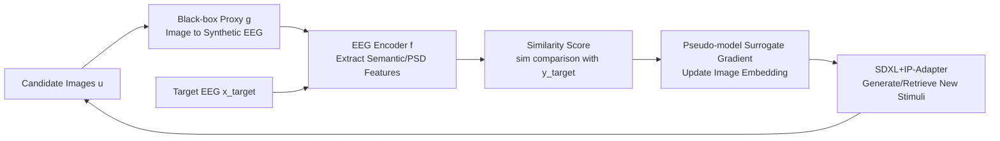

# MindPilot: Closed-loop Visual Stimulation Optimization for Brain Modulation with EEG-guided Diffusion

**Conference**: ICLR 2026  
**OpenReview**: [https://openreview.net/forum?id=7jdmXx869Q](https://openreview.net/forum?id=7jdmXx869Q)  
**Code**: [https://github.com/ncclab-sustech/MindPilot](https://github.com/ncclab-sustech/MindPilot)  
**Area**: Computational Neuroscience / Brain-Computer Interface / EEG-guided Generation  
**Keywords**: EEG, Closed-loop Brain Modulation, Black-box Optimization, Diffusion Models, Visual Stimulation Design  

## TL;DR
MindPilot treats the human brain as a non-differentiable black-box function. By using non-invasive EEG signals as optimization feedback paired with a "pseudo-model" to provide surrogate gradients, it iteratively generates or retrieves natural images to drive neural states toward specified targets. This work validates the feasibility of "reverse-modulating the brain with images" across both semantic and spectral neural objectives for the first time.

## Background & Motivation
**Background**: Most Brain-Computer Interface (BCI) research focuses on "decoding"—translating neural signals into behaviors or intentions. Conversely, "encoding modulation"—actively steering brain activity using meticulously designed stimuli—remains largely unexplored in the visual domain. Existing closed-loop visual neural modulation is either invasive (using small-scale cortical electrodes targeting low-level neuron firing) or restricted to low-level stimuli like flickering gratings, failing to generate semantically rich natural images that engage high-level brain representations.

**Limitations of Prior Work**: Designing images as reliable tools for driving neural responses faces three difficulties: (1) subjective states lack clear quantitative metrics; (2) real-world EEG feedback is noisy and unstable; and (3) the brain itself is **non-differentiable**, making it impossible to backpropagate gradients directly as one would when optimizing a neural network. While text-conditioned diffusion models offer unprecedented flexibility, they are optimized for linguistic prompts, which is orthogonal to the goal of "neural feedback targeting."

**Key Challenge**: Controllable generation requires differentiable optimization signals with clear rewards, whereas the brain provides neither gradients nor clean scalar rewards.

**Goal**: To establish a universal, continuous, and high-fidelity closed-loop framework that directly uses non-invasive EEG to drive natural image synthesis, stably pushing latent brain states toward specified targets.

**Core Idea**: **[Black-box + Pseudo-model]** The brain (or its EEG readout) is treated as a black-box forward process $x=g(u)$. A "pseudo-model" provides surrogate gradients in the CLIP latent space, enabling **gradient-free iterative optimization** for multiple neural targets, such as semantic similarity and EEG spectra, without requiring explicit rewards or true gradients.

## Method

### Overall Architecture
MindPilot formalizes "modulating the brain with images" as a black-box optimization problem: given an image $u$, the brain generates an EEG response $x=g(u)\in\mathbb{R}^{C\times T}$, from which neural features are extracted by an EEG encoder $f$. The goal is to find an image $u^\*=\arg\max_u \mathrm{sim}(f(g(u)), y_{\text{target}})$ that maximizes the cosine similarity between response and target features. The system iterates through four steps: black-box modeling (image to synthetic EEG), feature extraction (EEG to semantic/spectral features), guided generation (updating image embeddings in latent space), and stimulus updating (selecting high-scoring images for the generator), forming a closed-loop convergence.

### Key Designs
**1. Black-box Proxy Model: Scaling experiments by using a neural network surrogate.** Since real-time EEG collection is expensive and impractical for large-scale iterations, MindPilot trains an image-to-EEG proxy $g$ as a brain surrogate. Using nine pre-trained visual backbones (from AlexNet/ResNet50/CORnet-S to ViT/CLIP/DINO), the classification layer is replaced with a $C\times T$ regression head, fitted to real EEG (17 channels × 250 time points) from THINGS-EEG2 using MSE. A key observation is that even simple CNNs achieve competitive prediction accuracy (AlexNet actually achieved the highest Pearson $R$), indicating the framework is a "plug-and-play" recipe compatible with any image-to-EEG predictor.

**2. Closed-loop Score Update (Direct Reward + Diffusion Propagation): Spreading sparse top-k feedback across the gallery.** Starting from a uniform prior, each image maintains a score $S_t(u)$. First, **Direct Reward** is applied: scores of the top-k images with the highest similarity are updated using an exponential moving average: $S'_t(u_i)=(1-\alpha)S_t(u_i)+\alpha\,\mathrm{sim}(f(g(u_i)),y_{\text{target}})$. Second, **Propagation Update** is performed: the top-k rewards are "diffused" to similar images in the database based on CLIP embedding similarity: $S_{t+1}(u_j)=(1-\beta)S'_t(u_j)+\frac{\beta}{|I_{best}|}\sum_{i\in I_{best}}S'_t(u_i)\frac{\exp(s(u_i,u_j))}{\sum_l \exp(s(u_i,u_l))}$. Finally, scores are converted into sampling probabilities $P_{t+1}$ via softmax. This mechanism significantly improves sample efficiency by boosting scores of images similar to multiple high-performing candidates.

**3. Black-box Guided Diffusion (Pseudo-model Surrogate Gradient): Bypassing the non-differentiable brain with GP surrogates.** Since gradients cannot be directly computed through the black-box encoding model, MindPilot employs a Gaussian Process (GP) surrogate to predict reward gradients in the CLIP latent space, constructing a **pseudo-target embedding** $\hat z^\*=z_K-\eta\nabla\hat f(z_K;Z_n)$. Here, $\hat f(z_K;Z_n)=k(z_K,Z_n)^T(K(Z_n,Z_n)+\lambda I)^{-1}y$ is the GP's closed-form prediction of historical samples and their rewards $y_i=\mathrm{sim}(f(g(u_i)),y_{\text{target}})\times\gamma$. SDXL-Lightning + IP-Adapter then use this pseudo-target as guidance to generate new images, integrating gradient-free black-box optimization into the diffusion denoising pipeline.

**4. Interactive Search + Heuristic Evolution: A two-stage strategy from cold start to continuous generation.** To handle unknown target images, the system first uses "roulette wheel" similarity-weighted sampling (Algorithm 1) inspired by interactive retrieval, gradually tightening the sampling distribution from random candidates to target-approaching stimuli. When a fixed gallery is insufficient, it switches to heuristic evolutionary generation (Algorithm 2)—performing crossover and "mutation" on image embeddings to sample new images while preserving the relative order of original CLIP features to ensure semantic coherence.

## Key Experimental Results

### Main Results (EEG Semantic-driven Generation vs. Specialized Decoders, Subject-01)

| Method | Type | SSIM↑ | AlexNet(2)↑ | Inception↑ | CLIP↑ | SwAV↓ |
|------|------|-------|-------------|-----------|-------|-------|
| ATM-S (Upper bound, direct GT EEG decoding) | EEG-to-image | 0.32 | 0.80 | 0.72 | 0.76 | 0.58 |
| CongCapturer | EEG-to-image | 0.33 | 0.73 | 0.65 | 0.68 | 0.59 |
| Chance-level | Modulation Baseline | 0.28 | 0.49 | 0.50 | 0.48 | 0.69 |
| **MindPilot (Ours)** | Modulation | **0.35** | 0.70 | 0.58 | 0.67 | 0.60 |

Note: While ATM-S/CongCapturer represents the theoretical upper bound by "reconstructing images directly from GT EEG," MindPilot must iteratively search without seeing the GT. Even so, it outperforms the upper bound in SSIM and approaches ATM-S (0.67 vs 0.76) in CLIP 2AFC.

### Ablation Study (Semantic Closed-loop Iteration Similarity, Mean of 10 Subjects)

| Stage | Semantic Similarity (SS) | Intensity Similarity (IS) |
|------|-------------|-------------|
| Random (Initial) | 0.6012 | 0.9354 |
| Step-1 | 0.7370 | 0.9680 |
| Step-Best | 0.8451 | 0.9946 |
| **Gain** | **+10.91%** | **+2.65%** |

### Key Findings
- **Convergence & Alignment**: Similarity scores rise stably across iterations, significantly exceeding random sampling. EEG embeddings correlate significantly with CLIP representations across subjects ($R=0.23, P<0.01$), proving CLIP similarity is a valid proxy for neural alignment.
- **Spectral Target Modulation**: Beyond semantic features, optimizing for EEG Power Spectral Density (PSD) targets also significantly increases similarity across 10 subjects. Neural alignment is most prominent in the early window (0–500 ms post-stimulus), showing the framework can actively design stimuli matching spectral targets beyond simple "retrieval."
- **Real-human Validation**: In real-time experiments with 10 subjects, model-derived similarities strongly correlate with subjective human ratings. In **emotion modulation** tasks, pseudo-model rewards correlate with human ratings at $R=0.714$, and group emotion was significantly positively modulated (0.45→0.60). Performance in fine-grained "mental matching" was moderate, which the authors characterize as a realistic baseline for non-invasive EEG given the sim-to-real semantic gap.

## Highlights & Insights
- **Creative Problem Inversion**: Flipping the mature "EEG decoding" paradigm into "EEG encoding modulation" and formalizing it as black-box optimization is an imaginative new problem setting.
- **Engineering Around "Impossibles"**: The authors bypass three major hurdles—lack of quantitative metrics (similarity scores), EEG noise (proxy models + EMA smoothing), and brain non-differentiability (GP pseudo-model surrogate gradients). Each tactic targets a specific pain point.
- **Plug-and-play Versatility**: The black-box proxy is backbone-agnostic, and targets are swappable (semantics/spectra/subjective emotion), allowing the same framework to cover retrieval, generation, and emotion modulation.
- **Honest Failure Analysis**: The authors do not shy away from the moderate performance in mental matching; instead, they attribute it to the physical limits of non-invasive EEG and contrast it with the strong effects in emotion modulation to demonstrate robust closed-loop performance when neural targets are well-defined.

## Limitations & Future Work
- **Limited Proxy Predictivity**: The best Pearson $R$ in Table 1 is only ~16% (though time-resolved analysis reaches 0.6 at ~100ms). The weak overall correlation suggests a significant gap between the proxy and the real brain, capping the closed-loop effectiveness.
- **Sim-to-real Gap**: Fine-grained semantic matching in humans only reaches moderate levels; the SNR of non-invasive EEG limits high-fidelity semantic modulation.
- **Hyperparameter Search**: Coefficients like $\alpha=\beta=0.1$ were set empirically. The authors acknowledge that a thorough search might yield further gains.
- **Sample Size**: The real-human experiments involved only 10 participants. Generalizability and individual differences require validation with larger cohorts.
- **Future Work**: Potential applications include bidirectional BCIs, neural-guided generative modeling, cognitive enhancement, and neurorehabilitation.

## Related Work & Insights
- **Closed-loop Visual Neuro-modulation**: Following work by Ponce et al. (2019), Walker et al. (2019), and Bashivan et al. (2019) on invasive stimulus synthesis for activity maximization, and Luo et al. (2024b) on VEP Booster for flickering stimuli—MindPilot pushes this trajectory from invasive/low-level to non-invasive/semantic-level natural images.
- **Brain-conditioned Controllable Generation**: While fMRI-conditioned image generation (e.g., Scotti et al., 2024) is relatively mature, EEG-conditioned generation previously focused almost exclusively on decoding reconstruction (ATM-S, CongCapturer). MindPilot fills the gap by integrating this into a closed-loop optimization.
- **Black-box Guided Diffusion**: Borrowing black-box guidance ideas from Fan et al. (2023) and Black et al. (2024) used in drug discovery and high-quality generation, the authors successfully port GP surrogate gradients to the EEG-guided domain.
- **Insight**: When the optimization target is a noisy, non-differentiable real-world system (not just the brain, but also human preferences or physical experiments), the "proxy model + pseudo-gradient + reward spreading" gradient-free closed-loop paradigm is a highly reusable pattern.

## Rating
- **Novelty**: ⭐⭐⭐⭐⭐ First closed-loop framework for non-invasive EEG-guided natural image modulation; the problem setting and black-box + pseudo-model solution are highly original.
- **Experimental Thoroughness**: ⭐⭐⭐⭐ Includes simulation, 9 proxy types, and three levels of human validation (semantic/spectral/emotion); however, proxy predictivity is weak and the human sample size is small.
- **Writing Quality**: ⭐⭐⭐⭐ Clear motivation, well-executed diagrams/formulas, and honest about limitations; some notation (GP/pseudo-model section) requires the appendix for full clarity.
- **Value**: ⭐⭐⭐⭐⭐ Opens a feasible new path for bidirectional BCIs and neural-guided generation with broad application potential.

<!-- RELATED:START -->

## Related Papers

- [\[ICLR 2026\] Learning Brain Representation with Hierarchical Visual Embeddings](learning_brain_representation_with_hierarchical_visual_embeddings.md)
- [\[ICLR 2026\] NC-Bench and NCfold: A Benchmark and Closed-Loop Framework for RNA Non-Canonical Base-Pair Prediction](nc-bench_and_ncfold_a_benchmark_and_closed-loop_framework_for_rna_non-canonical_.md)
- [\[ICLR 2026\] Uncovering Semantic Selectivity of Latent Groups in Higher Visual Cortex with Mutual Information-Guided Diffusion](uncovering_semantic_selectivity_of_latent_groups_in_higher_visual_cortex_with_mu.md)
- [\[ICLR 2026\] Model-Guided Microstimulation Steers Primate Visual Behavior](model-guided_microstimulation_steers_primate_visual_behavior.md)
- [\[ICLR 2026\] The Human Brain as a Dynamic Mixture of Expert Models in Video Understanding](the_human_brain_as_a_dynamic_mixture_of_expert_models_in_video_understanding.md)

<!-- RELATED:END -->
