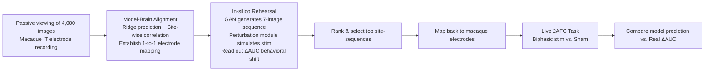

# Model-Guided Microstimulation Steers Primate Visual Behavior

**Conference**: ICLR 2026  
**OpenReview**: [https://openreview.net/forum?id=S4B7Iq7S3C](https://openreview.net/forum?id=S4B7Iq7S3C)  
**Code**: To be confirmed  
**Area**: Computational Neuroscience / Visual Prostheses / Brain-like Models  
**Keywords**: Topographic Deep Neural Networks, Microstimulation, Visual Prosthesis, High-level Visual Cortex, Causal Intervention, Primate Behavior  

## TL;DR
A topographic deep visual model is used to rehearse microstimulation experiments "in silico," identifying stimulation sites and images most likely to alter behavior. These predictions were then validated in the inferior temporal (IT) cortex of live macaques. The results show a significant correlation between model-predicted behavioral shifts and the monkeys' actual choices, achieving the first model-in-the-loop guided stimulation of the high-level visual cortex.

## Background & Motivation
**Background**: The concept of visual prostheses involves bypassing damaged visual pathways (retina, optic nerve, lateral geniculate nucleus) to "plant" visual perceptions by directly stimulating the visual cortex. Existing work in the early visual cortex (V1/V2) using microstimulation can reliably induce phosphenes, simple geometric shapes, or even letters. This approach relies on **retinotopy**—where adjacent points in the visual field are mapped onto adjacent cortical locations—meaning that knowing the target location in the visual field dictates which electrode to stimulate.

**Limitations of Prior Work**: Approaches targeting early visual cortex are limited by two factors: first, the restricted number of implantable electrodes; second, the fact that V1/V2 only encode low-level local features like orientation and position. Stimulating them produces only "scattered" simple visual elements, **which cannot form complex object-level perceptions** (e.g., faces, tools, scenes). To restore truly useful vision, one must stimulate the high-level visual cortex (such as the inferior temporal cortex, IT) that encodes complex objects.

**Key Challenge**: However, **retinotopy mostly breaks down** in the high-level visual cortex, where organizational principles shift to abstract semantic features like "animacy vs. inanimacy" or "category selectivity." Without the "map" provided by retinotopy, researchers lack a guiding principle for "what perception will be induced by stimulating where," making purposeful stimulation in the high-level cortex an unsolved problem.

**Goal**: To establish a **computational framework** that replaces the missing "map" with a model, predicting which sites and image combinations can reliably steer an animal's perceptual choice in a specific direction, and to validate this in live macaques.

**Core Idea**: **[Model-in-the-loop Causal Rehearsal]** Develop a Topographic Deep Artificial Neural Network (TDANN) where neurons are positioned on a 2D cortical sheet. This model is used to simulate the full causal chain "electrode stimulation → spatial perturbation of neural activity → downstream behavioral change" in silico. The optimal stimulation sites from the model are mapped back to real electrode arrays for live monkey experiments—moving from "post-hoc explanation of stimulation" to "pre-hoc prediction of stimulation."

## Method

### Overall Architecture
The system consists of a three-stage "model ↔ brain" closed-loop process. First, the topographic model's "cortical sheet" is **aligned one-to-one** with the monkey's actual electrode array using passive viewing data. Second, **exhaustive rehearsal** is performed in the aligned model: for each candidate site, a sequence of images varying along the neural tuning direction is generated, microstimulation is simulated, and the model's 2AFC (two-alternative forced choice) behavioral shifts are read out and ranked. Finally, the highest-scoring "site + image sequence" combinations are **mapped back** to the monkey's IT electrodes. Biphasic electrical stimulation is then applied (randomly interleaved with sham stimulation) during a live 2AFC task to see if behavior is pushed in the predicted direction.

### Key Designs

**1. Topographic Deep Artificial Neural Network (TDANN): Providing an "Actuatable Cortical Map"**  
The foundation of the framework involves pinning every unit of a ResNet18 onto a **2D plane (model cortical sheet)** before training. A spatial loss is used to force "units close on the sheet to have more similar responses." Specifically, pairs of units $(i,j)$ are sampled from local neighborhoods to calculate their response similarity $r_{ij}$ (Pearson correlation) across stimuli and inverse distance weights $D_{ij}=1/(d_{ij}+1)$. The spatial loss is defined as $SL_k = 1 - \mathrm{Corr}(r, D)$, with the total loss $\text{Loss} = L_{task} + \sum_k \alpha_k SL_k$ (Self-supervised SimCLR loss + spatial loss, $\alpha_k=0.25$). This forces the model to spontaneously develop "pinwheel" patterns for orientation in early layers and category-selective "patches" in deeper layers—highly similar to the functional organization of the real visual cortex. Because representations are embedded spatially, the model can simulate "how local current perturbations spread across the cortical sheet."

**2. Perturbation Module: Translating Electrode Current into Activity Fluctuations**  
This serves as the physical interface connecting "stimulation parameters" to the model. For a unit at distance $d$ from the electrode, its activity increment follows an empirical current-distance relationship:
$$\Delta r(d) = \min\!\big(r_{base} + \gamma \cdot f_{pulse},\, r_{max}\big)\cdot \exp\!\Big(-\frac{d}{\lambda(I)}\Big)$$
where $r_{base}=30$Hz (IT baseline firing rate), $f_{pulse}$ is the pulse frequency, $\gamma$ linearly converts pulse frequency to firing rate increment, and activity is capped at $r_{max}=200$Hz to prevent distortion. The spatial decay constant $\lambda(I)$ increases with the stimulation current $I$ (µA)—stronger currents lead to wider activity spread. In short: activity at the stimulation site increases with pulse rate and decays exponentially with cortical distance, with all parameters calibrated by previous primate IT stimulation studies to mimic real electrophysiology.

**3. GAN Image Sequences + Selectivity Scoring: Leveraging Perception via Tuning Directions**  
Stimulation alone is insufficient; it requires images that make the stimulation effects manifest. The authors used StyleGAN-XL to build a linear mapping between IT multi-unit activity (MUA) and a 512-dimensional GAN latent space. They then **added or subtracted up to 5 standard deviations along the response direction of a target site** (while keeping other sites fixed) to generate a sequence of 7 natural images that vary smoothly along the site's neural tuning dimension. Each sequence is ranked using a "slope-to-noise" selectivity score, preferring sequences that are monotonic and site-specific. This step aligns "stimulating a site" and "viewing an image" in the same latent space, allowing the prediction of which semantic dimension the perception will be pushed towards.

**4. Model-Brain Alignment and Mapping: Translating Silico Predictions to Real Electrodes**  
The framework's credibility depends on perfectly aligning model sites with monkey electrodes. Using response data from 4,000 images collected 2–4 days prior to stimulation, the authors calculated linear predictability $R^2$ for every "model instance × electrode array" combination using 10-fold cross-validated ridge regression. They kept the model-array pairs with the highest $R^2$ (which varied significantly, e.g., [-0.06, 0.27] for Monkey 1). They then **slid and rotated** a simulated Utah array on the model cortical sheet, maximizing the average site-wise correlation (64 channels) to establish a one-to-one mapping. The optimal sites selected in rehearsal were "translated" back to real electrode IDs using this mapping.

**5. Generative Visualization: Visualizing "What is Seen After Stimulation"**  
To qualitatively answer what perceptual content is changed, the authors built two generative pipelines: first, modifying Brain2GAN to use topographic model deep activations instead of real neural recordings for image reconstruction with StyleGAN-XL; second, using Stable Diffusion v1.5 + IP-Adapter to ridge-regress deep features to CLIP visual embeddings for denoised generation. By fixing text prompts, noise, and hyperparameters, and **only changing the simulated stimulation in the model**, the image differences directly reflect internal representational changes caused by stimulation. They also used a scrambled perturbation control (preserving perturbation magnitude but destroying topographic structure) to verify that the emergence of face-like content depends on **spatially structured stimulation** of face-selective regions rather than global non-specific modulation.

## Key Experimental Results

**Setup**: 2 macaques, Utah arrays in IT, 2AFC visual recognition task; stimulation and sham trials randomly interleaved (50%/50%); effects characterized by $\Delta\text{AUC}$ (Perturbed − Unperturbed). Two experiments differed only in the spatial constraints of candidate electrodes (Exp 1: Manhattan distance 1.6mm; Exp 2: tightened to 1.2mm to include more candidate sites).

### Main Results: Model Prediction vs. Real Behavioral Shift (Exp 1)

| Subject | Model-Behavior Pearson r | p-value | r² | Permutation p |
|------|------------------------|------|----|-----------|
| Monkey 1 | 0.58 | 0.024 | 0.34 | 0.019 |
| Monkey 2 | 0.53 | 0.019 | 0.28 | 0.017 |
| Pooled | 0.53 | 0.0012 | — | — |

"Site + Image sequence" combinations predicted to be stronger by the model yielded stronger behavioral effects in the monkeys. However, in Exp 1, the behavioral shift itself was **not significantly greater than zero** (Wilcoxon, p > 0.05).

### Behavioral Directional Bias (Exp 2, Monkey 1 Only)

| Metric | Result |
|------|------|
| Behavioral Shift > 0 (Wilcoxon signed-rank) | p = 0.043 (Significant) |
| Effect size Cohen's d | 0.671 |
| Per-site predictive power | p > 0.05 (No longer significant) |

Exp 2 proved that parameters selected by the model could indeed induce **reliable behavioral shifts in the target direction** in vivo; however, per-site predictive power vanished due to signal quality degradation and increased candidate sites.

### Key Findings
- **Cross-modal Confirmation**: Applying 1000µA simulated stimulation to face-selective sites in the model generated "hallucinated faces"—adding a second face to a cat, magnifying a bear's face, or turning insects/fruits into faces. Low-selectivity control sites and scrambled perturbation controls did not produce this structured facial content. This qualitatively matches reported "facephenes" in human patients during stimulation of face-selective areas.
- **Topography Not Essential for Linear Alignment**: Non-topographic ResNet18 models without spatial loss showed comparable IT linear predictability ($R^2 \approx 0.27$), suggesting the benefit of topography lies in **simulating the spatial spread of stimulation** rather than improving linear fits.
- The model generally **overestimated** the absolute magnitude of behavioral effects (correlation existed, but the slope was too steep).

## Highlights & Insights
- **From Post-hoc to Pre-hoc**: While previous topographic models were used to replicate stimulation effects offline, this work is the first to put them into the experimental loop to **direct live stimulation experiments**, marking a methodological paradigm shift.
- **A Substitute for Missing Retinotopy**: High-level visual cortex lacks retinotopy; the authors used the trained topographic model + perturbation module to reconstruct a computable mapping of "stimulation site → perceptual consequence," filling the primary gap in high-level visual prostheses.
- **Generative Visualization of Subjective Content**: By fixing all variables and only toggling model stimulation, translating internal representations into images using GAN/Diffusion and matching them with human patient reports provided rare "silico-to-human" semantic-level evidence.

## Limitations & Future Work
- **Small Sample Size**: Only 2 monkeys and roughly a dozen sites were tested. Due to signal degradation and electrode removal, additional experiments were not possible, leading to limited statistical power and wide confidence intervals.
- **Failure to Simultaneously Achieve Core Effects**: Exp 1 showed per-site predictive power without significant behavioral shifts, while Exp 2 showed significant behavioral shifts without per-site predictive power. Both were not achieved in a single experiment, which the authors attributed to signal degradation.
- **Systemic Overestimation**: The model systematically overestimates effect magnitudes; the stim-to-behavior quantitative mapping still requires calibration.
- **Global State Interference**: While the randomized interleaved design mitigates non-specific effects like attention/arousal, they cannot be completely ruled out.
- **Visualization Lacks Neural Ground Truth**: Since neural recordings during stimulation in monkeys were unavailable, the facephene visualizations are qualitative interpretations of IT representations, and their correspondence to actual perception remains an inference.
- **Future Work**: Stable chronic implants, larger-scale sites, and incorporating generative predictions into a closed-loop optimization could lead to next-generation prostheses capable of inducing complex object perceptions.

## Related Work & Insights
- **Early Visual Cortex Prostheses** (Chen 2020, Beauchamp 2020, Fernandez 2021): These rely on retinotopy to induce simple shapes; this paper breaks through their low-level representation ceiling.
- **Topographic ANNs** (Margalit 2024, Lee 2020, Keller 2021, etc.): Provided the paradigm of "placing units on a sheet + spatial regularization." This paper's TDANN and perturbation module are built directly on these (Schrimpf 2024's offline perturbation evaluation is the most direct predecessor).
- **Neural Activity Visualization** (Bashivan 2019, Ponce 2019, Dado/Papale 2024, Shahbazi 2024 "perceptograms"): Linking deep generative models to neural codes. This work adopts Papale 2024's GAN mapping for stimulation image generation.
- **Insight**: When a brain region lacks a natural "functional map," a well-aligned, spatially embedded computational model can serve as an **intervenable proxy map**. This "in-silico rehearsal → mapping → in-vivo validation" loop can be extended to other causal interventions like optogenetics or TMS.

## Rating
- **Novelty**: ⭐⭐⭐⭐⭐ First implementation of model-in-the-loop, pre-hoc predicted high-level visual cortex microstimulation with cross-validation across silico/live/human facephene reports.
- **Experimental Thoroughness**: ⭐⭐⭐ Robust conceptual proof (including permutation tests and various controls), but limited by sample size and signal degradation.
- **Writing Quality**: ⭐⭐⭐⭐ Clear description of the three-stage framework with appropriate math and diagrams; honest discussion of overestimation and signal issues.
- **Value**: ⭐⭐⭐⭐⭐ Lays the methodological foundation for next-generation visual prostheses capable of inducing complex object perception; highly significant for computational neuroscience and BCI.

<!-- RELATED:START -->

## Related Papers

- [\[ICLR 2026\] MindPilot: Closed-loop Visual Stimulation Optimization for Brain Modulation with EEG-guided Diffusion](mindpilot_closed-loop_visual_stimulation_optimization_for_brain_modulation_with_.md)
- [\[ICLR 2026\] Uncovering Semantic Selectivity of Latent Groups in Higher Visual Cortex with Mutual Information-Guided Diffusion](uncovering_semantic_selectivity_of_latent_groups_in_higher_visual_cortex_with_mu.md)
- [\[ICLR 2026\] Learning Brain Representation with Hierarchical Visual Embeddings](learning_brain_representation_with_hierarchical_visual_embeddings.md)
- [\[ICLR 2026\] A tale of two tails: Preferred and anti-preferred natural stimuli in visual cortex](a_tale_of_two_tails_preferred_and_anti-preferred_natural_stimuli_in_visual_corte.md)
- [\[CVPR 2025\] Synthetic Visual Genome](../../CVPR2025/computational_biology/synthetic_visual_genome.md)

<!-- RELATED:END -->
