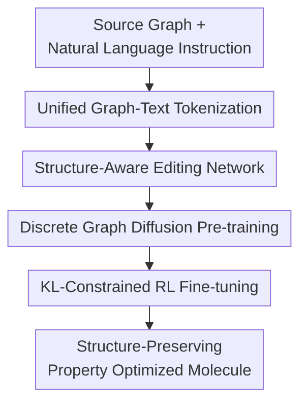

# MolEditRL: Structure-Preserving Molecular Editing via Discrete Diffusion and Reinforcement Learning

**Conference**: ICLR 2026  
**OpenReview**: [https://openreview.net/forum?id=40QphlZ9fY](https://openreview.net/forum?id=40QphlZ9fY)  
**Code**: TBD  
**Area**: Computational Biology / Molecular Editing  
**Keywords**: Molecular Editing, Discrete Graph Diffusion, Reinforcement Learning, Drug Design, Structure Preservation

## TL;DR
MolEditRL performs molecular editing directly on discrete molecular graphs: it employs graph-text conditional diffusion to learn target molecule reconstruction from source molecules and natural language instructions, followed by property optimization via reinforcement learning with structural constraints. This approach simultaneously improves editing success rates, structural similarity, and chemical distribution quality using fewer parameters.

## Background & Motivation
**Background**: Molecular optimization in drug discovery often involves modifying an existing lead compound rather than generating a new molecule from scratch. The goal is to locally adjust the structure to improve specific properties, such as increasing QED, reducing synthetic accessibility (SA) score, altering LogP, or modulating target activity. This task is defined as molecular editing: given a source molecule $G_{src}$ and a natural language instruction $S$, the model outputs a target molecule $G_{tgt}$ that satisfies the instruction while remaining similar to the source.

**Limitations of Prior Work**: Existing methods transition between rule-based editing, continuous latent space optimization, SMILES/SELFIES sequence generation, and language model instruction tuning. Rule-based methods are interpretable but limited by manual templates. Latent space methods allow for searching but often lose local topological details during compression. Sequence models and LLM-based methods are scalable and understand natural language but treat molecules as strings; structurally similar molecules can be distant in SMILES space, and minor token changes can lead to uncontrollable bond breakage, scaffold hopping, or invalid molecules.

**Key Challenge**: Molecular editing requires satisfying two objectives: driving target properties in the directed direction while preserving the core scaffold of the source molecule. Pure text generation often optimizes properties at the cost of structure, while pure graph models capture topology but struggle to integrate natural language instructions with non-differentiable discrete editing processes. Standard reinforcement learning (RL) using property oracles tends to over-explore the chemical space, sacrificing distributional realism and structural similarity.

**Goal**: The authors aim to build a unified framework for molecular editing that understands natural language property modification instructions while explicitly modeling atoms and bonds at the graph level. The framework should learn structure-preserving editing priors from large-scale paired data and continue optimization on new or complex property combinations using oracle rewards. Evaluation focuses not just on Validity, but also on property success rates, structural constraints (Tanimoto/MCS/GED), and distribution quality (FCD).

**Key Insight**: MolEditRL observes that molecular editing is naturally analogous to "stepwise denoising of a masked target graph." The source molecule and instructions provide conditions, allowing the target molecular graph to be recovered progressively in discrete atom/bond space. Discrete diffusion is suitable for learning such graph structural priors, while RL is ideal for pushing property alignment using oracles (e.g., RDKit/TDC) once the diffusion model can already generate reasonable molecules.

**Core Idea**: Use structure-aware discrete graph diffusion as a molecular editing prior, followed by KL-constrained reinforcement learning to optimize property rewards along the graph denoising trajectory. This binds "precise property modification" and "structural preservation" into a single training pipeline.

## Method

### Overall Architecture
The input to MolEditRL consists of three parts: a natural language editing instruction $S$, a source molecular graph $G_{src}$, and a target molecular graph $G_{tgt}$ during training. The model concatenates text tokens, source molecule atoms, and target molecule atoms into a unified sequence and injects bond connectivity biases from both the source and target graphs into the Transformer attention mechanism. Training proceeds in two stages: first, discrete diffusion is used to recover the ground-truth target graph from a masked version; second, the reverse denoising trajectory is treated as a Markov Decision Process (MDP) for edit-aware fine-tuning using property rewards and KL regularization.

Specifically, instead of translating molecules as SMILES sequences, the model predicts distributions over atom and bond types. Diffusion pre-training teaches the model "what local graph modifications look like realistic edits," while RL fine-tuning feeds the property success of the generated molecule back into the denoising process. Thus, property optimization is embedded within each step of the graph recovery policy rather than being an isolated post-processing step.

### Key Designs
**1. Unified Graph-Text Tokenization: Aligning Intent and Topology**

MolEditRL represents molecules as attributed graphs $G=(V,E)$ where nodes are atoms and edges are bonds. Instructions are token sequences $S=[s_1,\dots,s_n]$. Given $G_{src}$ and $G_{tgt}$, the model constructs a unified input:

$$
h_0=[h_1,\dots,h_n,h^{src}_{n+1},\dots,h^{src}_{n+k},h^{tgt}_{n+k+1},\dots,h^{tgt}_{n+k+m}]\in \mathbb{R}^{(n+k+m)\times d_h}.
$$

This design addresses the difficulty of aligning "textual intent" with "molecular topology." While LLM-based methods see molecules only at the string level, MolEditRL allows text tokens, source atoms, and target atoms to share a Transformer encoding space, enabling the model to attend to both semantic requirements and graph structural context in the same layer.

**2. Structure-Aware Attention: Injecting Connectivity as Bias**

To prevent the model from treating nodes as an unstructured sequence, MolEditRL adds a structural bias $b^l_{i,j}$ to the attention scores:

$$
\hat A^l_{i,j}=\frac{1}{\sqrt{d_k}}(h_i^lW_Q)(h_j^lW_K)^\top+b^l_{i,j}.
$$

The bias term injects source graph adjacency/bond types between source tokens and target graph adjacency information at the first layer of target tokens, propagating this information in subsequent layers. Intuitively, this informs the Transformer which atoms are connected by which bonds and which target nodes should maintain topological correlations. The model outputs probabilities for atom types $\hat p(V_{tgt})$ and bond types $\hat p(E_{tgt})$, with edge predictions symmetrized as $(e_{i,j}+e_{j,i})/2$ to ensure undirected consistency.

**3. Discrete Graph Diffusion Pre-training: Editing as Masked Graph Recovery**

Starting from the ground-truth target molecule $G^0_{tgt}$, the forward process gradually masks atoms and bonds with probability $\beta(t)=(T-t+1)^{-1}$ until $G^T_{tgt}$ is nearly fully masked. The reverse process trains the model to recover the target graph conditioned on $G_{src}$ and $S$:

$$
p_\theta(G^{0:T-1}_{tgt}\mid G^T_{tgt},G_{src},S)=\prod_{t=1}^{T}p_\theta(G^{t-1}_{tgt}\mid G^t_{tgt},G_{src},S).
$$

The training loss is primarily the cross-entropy of target atoms, target edges, and instruction tokens. Including instruction tokens in the loss ensures semantic alignment; the model learns not just how a source molecule usually changes, but how it changes in response to specific property directions. During inference, $x_0$-parameterization is used: at each step, the model predicts the clean target graph $\hat G^0_{tgt}$ and samples the next state $G^{t-1}_{tgt}$ from the posterior.

**4. Edit-Aware RL: Optimizing Properties within the Diffusion Prior**

MolEditRL reformulates the discrete denoising trajectory as an MDP: state $s_t=(S,G_{src},G^{T-t}_{tgt})$, action $a_t=G^{T-t-1}_{tgt}$, and policy $\pi_\theta(a_t\mid s_t)$. Rewards are provided at the terminal state: 1 for a successful edit, 0.2 for a chemically valid but unsuccessful edit, and 0 for invalid molecules. To prevent RL from destroying the scaffold to chase rewards, a KL divergence regularization between the current policy and the pre-trained diffusion model $p_{pre}$ is added:

$$
\mathcal{L}(\theta)=-\mathbb{E}[r(G^0_{tgt},S,G_{src})]+\beta\sum_{t=1}^{T}\mathbb{E}\left[D_{KL}\left(p_\theta(G^0_{tgt}\mid G^t_{tgt},S,G_{src})\Vert p_{pre}(G^0_{tgt}\mid G^t_{tgt},S,G_{src})\right)\right].
$$

The KL term restricts updates to the neighborhood of "valid structure-preserving edits" as defined by the pre-trained model. This allows the property oracle to drive the direction while the diffusion prior maintains chemical realism and scaffold similarity.

### Mechanism
Consider a lead molecule where the instruction is "Make this molecule easier to synthesize" (lower SA score). MolEditRL concatenates this instruction with the source atoms and a masked target graph. Structural-aware attention allows the model to continuously observe the connectivity of the source molecule.

In the early stages of the reverse diffusion process, the model restores the main scaffold aligned with the source. In intermediate stages, it attempts to replace or remove fragments that increase synthetic difficulty. In the final stages, it completes the specific atom and bond types. If the final molecule is valid, shows decreased SA, and maintains structural similarity (Tanimoto/MCS/GED), a full reward is given. The KL term anchors this update to the pre-trained prior, preventing the model from drastically rewriting the backbone to minimize SA.

### Loss & Training
Pre-training objectives include cross-entropy for target atoms, target edges, and instruction tokens. RL fine-tuning uses RDKit and TDC for property rewards ($1.0, 0.2, 0$ for success, partial success, and invalidity). The model is initialized with RoBERTa-base (12 layers, 12 heads, hidden size 768). The tokenizer is expanded to 51,933 tokens. Diffusion uses 2000 steps, with top-k sampling ($k=15$) during evaluation. Pre-training on MolEdit-Instruct takes approximately 100 hours using AdamW ($LR=5\times 10^{-5}$). RL fine-tuning achieves most gains within 6,400 oracle queries.

## Key Experimental Results

### Main Results
The authors constructed the MolEdit-Instruct dataset (3M editing pairs, 967K unique molecules) covering 10 chemical properties across 20 single-property tasks and multi-property combinations.

| Task | Metric | MolEditRL | Prev. SOTA | Observation |
|------|------|-----------|--------------|------|
| GSK3β↑ | Accall(TS≥0.65) | 0.342 | DrugAssist 0.236 | Better target activity while preserving structure |
| GSK3β↑ | FCD↓ | 7.99 | DrugAssist 9.42 | Distribution closer to real molecules |
| SA↓ | Accall(TS≥0.65) | 0.628 | DrugAssist 0.537 | Preserves scaffold during synthesis optimization |
| QED↑ + SA↓ | Accall(TS≥0.65) | 0.632 | DrugAssist 0.532 | Significant lead in multi-objective tasks |
| Haccept↓ + LogP↑ | Accall(TS≥0.65) | 0.316 | DrugAssist 0.372 | DrugAssist has higher TS, but Ours is steadier in MCS/GED/FCD |

Ours demonstrates that while sequence models (BioT5, MolGen) reach nearly 1.0 Validity, they often fail on structural constraint accuracy (Accall near 0). MolEditRL excels in the trade-off between property success, scaffold preservation, and distributional quality.

### Ablation Study
| Configuration | Key Metrics | Note |
|------|---------|------|
| Pretrain w/o Structure Bias | Validity 0.744 / Accall 0.176 | Weak structural editing ability |
| Pretrain w/ Structure Bias | Validity 0.758 / Accall 0.316 | Structural bias significantly improves Accall |
| Finetune w/o Structure Bias | Validity 0.890 / Accall 0.212 | RL improves validity but lacks structural focus |
| Finetune w/ Structure Bias | Validity 0.976 / Accall 0.462 | Optimal performance for structural preservation |
| KL $\beta=0.0$ | Validity 0.986 / Accall 0.278 | Over-optimizing reward sacrifices structure |

### Key Findings
- Gains result from the synergy of the diffusion prior, RL rewards, and structural bias.
- Generalizes to unseen properties (BBBP, hERG) via property-specific fine-tuning.
- At 125M parameters, it outperforms 7B+ models like GeLLM4O-C by exploiting graph structural inductive biases.
- High success rates (0.744-0.872) in functional group edits (e.g., "add amide," "remove aromatic ring"), showing that natural language can drive specific local chemical operations.

## Highlights & Insights
- Shifting molecular editing from sequence translation back to discrete graph space is crucial. Structural constraints are integrated into attention biases rather than being post-hoc.
- KL-regularized RL fine-tuning on diffusion models provides a stable paradigm: diffusion ensures realism, RL drives property direction, and KL maintains scaffold similarity.
- The MolEdit-Instruct dataset enables the model to learn diverse mappings from natural language to structural edits, moving beyond simple de novo optimization.

## Limitations & Future Work
- Primarily focused on drug-like molecules; scalability to proteins or large natural products remains to be tested.
- Reliability depends on the quality of property oracles; rare properties or expensive wet-lab feedback limit upper bounds.
- No explicit diagnostic for conflicting instructions; the model may produce compromises rather than explaining infeasibility.
- Single-task fine-tuning still requires ~12 hours; reducing costs for interactive multi-turn editing is a future direction.

## Related Work & Insights
- **vs DrugAssist**: MolEditRL avoids the limitations of SMILES strings by predicting atoms and bonds directly, achieving better scaffold preservation.
- **vs BioT5/MolGen**: High validity in sequence models does not guarantee controllable editing; structure-aware modeling is necessary to understand which parts of the source molecule to keep.
- **vs REINVENT4/GCPN**: Traditional RL methods suffer from high-variance exploration. MolEditRL's search space is localized around the source molecule via conditional denoising, improving oracle efficiency.

## Rating
- Novelty: ⭐⭐⭐⭐☆
- Experimental Thoroughness: ⭐⭐⭐⭐⭐
- Writing Quality: ⭐⭐⭐⭐☆
- Value: ⭐⭐⭐⭐⭐

<!-- RELATED:START -->

- **DrugAssist**: [https://arxiv.org/abs/2401.10334](https://arxiv.org/abs/2401.10334)
- **MolGen**: [https://arxiv.org/abs/2303.16804](https://arxiv.org/abs/2303.16804)
- **DDPO**: [https://arxiv.org/abs/2305.13301](https://arxiv.org/abs/2305.13301)

<!-- RELATED:END -->

## Related Papers

- [\[ICLR 2026\] Discrete Compositional Generation via General Soft Operators and Robust Reinforcement Learning](discrete_compositional_generation_via_general_soft_operators_and_robust_reinforc.md)
- [\[ICLR 2026\] Learning Flexible Forward Trajectories for Masked Molecular Diffusion](learning_flexible_forward_trajectories_for_masked_molecular_diffusion.md)
- [\[ICLR 2026\] Controllable Sequence Editing for Biological and Clinical Trajectories](controllable_sequence_editing_for_biological_and_clinical_trajectories.md)
- [\[ICLR 2026\] Ultra-Fast Language Generation via Discrete Diffusion Divergence Instruct](ultra-fast_language_generation_via_discrete_diffusion_divergence_instruct.md)
- [\[ICLR 2026\] ProteinAE: Protein Diffusion Autoencoders for Structure Encoding](proteinae_protein_diffusion_autoencoders_for_structure_encoding.md)

<!-- RELATED:END -->
