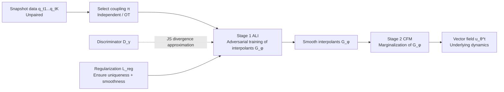

# Multi-Marginal Flow Matching with Adversarially Learnt Interpolants

**Conference**: ICLR 2026  
**OpenReview**: [https://openreview.net/forum?id=AJls43yje7](https://openreview.net/forum?id=AJls43yje7)  
**Code**: [github.com/mmacosha/adversarially-learned-interpolants](https://github.com/mmacosha/adversarially-learned-interpolants)  
**Area**: Computational Biology / Trajectory Inference / Flow Matching Generative Models  
**Keywords**: Multi-marginal flow matching, Adversarially learned interpolants, GAN, Single-cell trajectory inference, Spatial transcriptomics, Cell tracking  

## TL;DR
This paper uses a GAN-style adversarial loss to learn "neural interpolant curves," forcing the marginal distributions of the curves at intermediate time points to approximate the observed snapshot distributions (rather than passing through samples point-wise). These smooth interpolants are then marginalized into a vector field via Flow Matching to infer continuous dynamics from discrete time snapshots lacking ground-truth trajectories in scientific data.

## Background & Motivation

**Background**: Many scientific problems (scRNA-seq, spatial transcriptomics, disease evolution) only collect data snapshots at discrete time points, and samples at different times are **unpaired**—it is impossible to know which cell at $t_i$ corresponds to which cell at $t_{i+1}$. To recover the underlying continuous dynamics (i.e., the vector field $v_t$ of the ODE $dx_t = v_t(x_t)\,dt$) from these snapshots, Flow Matching needs to be extended to a **multi-marginal** setting: the learned dynamics must not only map $q_0$ to $q_1$ but also satisfy $p_{t_i} = q_{t_i}$ at all intermediate time points.

**Limitations of Prior Work**: The core of multi-marginal flow matching is the selection of the "interpolant curve" $G(x_0,x_1,t)$. Existing methods have several flaws: (1) **Pairwise linear/piecewise interpolation** (OT-CFM, Tong et al. 2024) is linear within each segment $[t_i,t_{i+1}]$ and non-smooth at junctions, leading to high gradient variance in the CFM objective and divergent vector field integration; (2) **Cubic spline interpolation** (MMFM, Rohbeck et al. 2025) is smooth but requires curves to **pass through** intermediate samples point-wise, scaling poorly in high dimensions; (3) **Metric Flow Matching (MFM)** (Kapuśniak et al. 2024) learns a metric to find geodesics, but time-independent metrics cannot capture dynamics where geometry changes over time, while time-dependent metrics degenerate into piecewise interpolation.

**Key Challenge**: All existing methods treat intermediate marginals as **point-wise constraints**—forcing interpolant curves through specific sample points. This represents a wrong inductive bias when data is noisy or when samples are merely stochastic realizations of a distribution: it treats noisy samples as mandatory paths, resulting in non-smoothness and overfitting.

**Goal**: Construct a family of **smooth, unique** interpolant curves that approximate the **distributions** of observed marginals $q_{t_i}$ at intermediate times, without forcing them through specific samples, thereby being robust to noise and scalable to large $K$ (thousands of marginals) and high dimensions.

**Key Insight (Adversarial distribution matching interpolation)**: The constraint that "the pushforward distribution of the interpolant at $t_i$ must equal $q_{t_i}$", i.e., $(G_\phi(\cdot,\cdot,t_i))_\#\pi = q_{t_i}$, is enforced using a GAN discriminator. The discriminator distinguishes between "real snapshot samples $x_{t_i}\sim q_{t_i}$" and "interpolated points $G_\phi(x_0,x_1,t_i)$," while the generator (interpolant network) attempts to fool the discriminator. This is equivalent to minimizing the JS divergence between the two, representing **distribution matching** rather than point-wise matching.

## Method

### Overall Architecture
ALI-CFM is a two-stage pipeline: **Stage 1 (ALI)** uses adversarial loss + regularization to train a family of neural interpolant curves $G_\phi$, matching their intermediate marginals to observed snapshots; **Stage 2 (CFM)** fixes $G_\phi$ and uses standard Conditional Flow Matching to marginalize these smooth interpolants, regressing the vector field $u_\theta^t$. The prefixes I-/OT- indicate whether independent or (minibatch) optimal transport coupling $\pi$ is used between end marginals.

### Key Designs

**1. Adversarially Learnt Interpolants (ALI): Turning marginal constraints into GAN min-max.** The interpolant curve is parameterized as a linear basis + a neural correction term $G_\phi(x_0,x_1,t) = (1-t)x_0 + tx_1 + t(1-t)f_\phi(x_0,x_1,t)$. The $t(1-t)$ factor ensures the endpoints at $t=0,1$ automatically satisfy marginal constraints, requiring learning only for the intermediate range. To match intermediate marginals $q_{t_i}$, a discriminator $D_\gamma(x_t,t)$ is introduced to distinguish real snapshots from interpolants, optimizing $\min_{G_\phi}\max_{D_\gamma} \mathbb{E}_{(x_0,x_1)\sim\pi}[\log(1-D_\gamma(G_\phi(x_0,x_1,t_i),t_i))] + \mathbb{E}_{q_{t_i}}[\log D_\gamma(x_{t_i},t_i)]$. Under the optimal discriminator assumption, this is equivalent to minimizing the JS divergence between $q_{t_i}$ and $(G_\phi(\cdot,\cdot,t_i))_\#\pi$. The novelty lies in the endpoint pairs $(x_0,x_1)\sim\pi$ acting as the "noise input" for the GAN, with time $t_i$ as a condition—the interpolant itself is a conditional generator. This differs fundamentally from prior work: it performs **distribution matching instead of point-wise passing**, inherently providing noise robustness.

**2. Three regularization terms to ensure uniqueness and smoothness.** A pure min-max solution is non-unique and could yield arbitrarily curved interpolants. The paper proposes three regularizers, the first two of which provide provable uniqueness: (a) **Linear reference regularization** $L_{\text{reg}} = \mathbb{E}_\pi\|G_\phi(x_0,x_1,t_i) - \ell(x_0,x_1,t)\|^2$, penalizing deviations from the line $\ell$ connecting endpoints. Theorem 2.1 proves uniqueness under marginal constraints assuming $q_t$-a.c. conditions; (b) **Piecewise linear reference regularization** (Eq 11), used when intermediate marginal support differs significantly from endpoints, regressing to a piecewise linear reference via Markov chain OT coupling (Eq 12) with continuous averaging over $t\in[0,1]$. Theorem 2.2 provides uniqueness, suitable for small $K$; (c) **Second-order derivative norm regularization** $L_{\text{reg}} = \mathbb{E}_\pi\int_0^1\|\partial^2 G_\phi/\partial t^2\|_2^2\,dt$, directly penalizing curvature (analogous to the cubic spline concept). The second derivative is approximated using finite differences $[G(t+h)+G(t-h)-2G(t)]/h^2$, with the integral estimated via 3 Monte Carlo $t$ samples. The total objective is $L_{\text{ALI}} = \mathbb{E}_i[L_{\text{GAN}}(G_\phi,D_\gamma;t_i) + \lambda L_{\text{reg}}(G_\phi;t_i)]$.

**3. Marginalization into a Vector Field (ALI-CFM).** After training ALI, $\phi$ is fixed and the vector field is regressed via Conditional Flow Matching. Target velocities are derived from the time-derivative of the interpolant: $\frac{d}{dt}G_\phi = x_1 - x_0 + t(1-t)\frac{d}{dt}f_\phi + (1-2t)f_\phi$ (computed via low-cost autograd). The CFM loss is $\|u_\theta^t(G_\phi(x_0,x_1,t)) - \frac{d}{dt}G_\phi(x_0,x_1,t)\|^2$. Because ALI interpolants are smooth, the target gradient variance for regression is significantly lower than that of piecewise linear interpolation, ensuring vector field integration is stable—this is the root cause of why OT-ALI-CFM succeeds on long sequences while OT-CFM fails.

## Key Experimental Results

### Main Results

5D PCA scRNA-seq trajectory inference (EMD, lower is better, leave-one-out intermediate marginal, average of 5):

| Method | Cite | EB | Multi |
|------|------|------|------|
| I-CFM | 1.236 | 1.156 | 1.150 |
| OT-CFM | 1.142 | 0.809 | 0.975 |
| OT-MFM | **0.793** | **0.711** | 0.890 |
| OT-MMFM (Spline) | 1.099 | 3.530 | 1.807 |
| **OT-ALI-CFM (Ours)** | 0.910 | 0.742 | **0.925** |

Spatial transcriptomics (ST) tumor coordinate inference (Mean EMD, leave-one-slice out):

| Method | EMD (↓) |
|------|---------|
| OT-CFM | 109.76±9.98 |
| OT-MMFM | 109.17±9.82 |
| OT-MFM | 183.88±53.92 |
| **OT-ALI-CFM** | **98.91±2.03** |

### Ablation Study

Comparison of methods across different application scenarios (Qualitative/Quantitative):

| Task | Key Challenge | Key Findings |
|------|------|----------|
| Synthetic knot (§4.1, K=1200 marginals) | Time-varying geometry | Only method able to accurately capture time-varying geometry; piecewise/spline/LAND are not smooth |
| Cell tracking (§4.2, U373 cells 115 frames) | High noise, loopy paths, cell deformation | ALI provides smooth mapping; OT-CFM vector field diverges and fails to train; time-independent OT-MFM fails to learn time-varying dynamics |
| High-dim scRNA-seq (§4.3, 50D/100D) | High dimensionality | Parity with SOTA, slightly behind OT-MFM (distribution matching is disadvantaged on point-wise metrics) |

### Key Findings
- **Superiority in tasks with significant noise and large $K$ (hundreds to thousands)**: In synthetic knot and cell tracking tasks, no other FM method achieves comparable performance; OT-CFM even fails to train due to integration divergence caused by non-smoothness.
- **Parity with SOTA in high-dimensional single-cell tasks without exceeding it**: The authors acknowledge that adversarial training performs **distribution matching**, which may trail OT-MFM's "overfitting to given samples" on point-wise EMD metrics—this is an inherent tradeoff of the distribution matching paradigm.
- **Unexpected stability of GAN on multi-modal data**: ST data is highly multi-modal (inconsistent patterns between slices); while GANs are typically difficult to train here, Eq(11) regularization + Markov chain OT coupling stabilizes training and yields the lowest EMD.

## Highlights & Insights
- **Paradigm Shift**: Moving from "interpolation must pass through samples" (point-wise) to "interpolant distribution must match snapshot distribution" (distribution matching) provides a more accurate inductive bias for noisy scientific data—snapshots are distribution samples and should not be treated as mandatory paths.
- **Elegant Hybrid of GAN and Flow Matching**: Using endpoint pairs $(x_0,x_1)\sim\pi$ as GAN "noise" and time $t_i$ as a condition transforms abstract "marginal matching constraints" into optimizable adversarial objectives with a theoretical JS divergence interpretation.
- **Theoretical + Engineering Guarantees**: Two regularization terms are accompanied by uniqueness theorems (Theorems 2.1/2.2), addressing the fundamental non-uniqueness of GAN solutions while stabilizing training in practice.
- **Smoothness as a Key Lever**: Smooth interpolation directly reduces the gradient variance of the downstream CFM regression target, which is the mechanism that prevents integration divergence on long sequences compared to piecewise methods.

## Limitations & Future Work
- **Disadvantage on point-wise metrics**: Distribution matching naturally avoids overfitting specific samples, causing it to trail OT-MFM slightly on high-dimensional scRNA-seq tasks evaluated by point-wise EMD.
- **Inherent fragility of GAN training**: Although mitigated by regularization, adversarial training remains sensitive to multi-modal distributions; hyperparameters ($\lambda$, discriminator architecture) require careful tuning. The paper suggests exploring alternative objectives like WGAN for further stability.
- **Coupling dependency**: The method depends on the quality of OT coupling between end marginals; minibatch OT approximation errors in extremely high dimensions may propagate to the interpolant.
- **Future Work**: The vast literature on GAN optimization (alternative divergences, spectral normalization, etc.) has not yet been fully integrated; the precision of finite difference approximations for second-order derivative regularization could also be improved.

## Related Work & Insights
- **Flow Matching Foundations**: Based on CFM (Lipman et al. 2023; Tong et al. 2024), Stochastic Interpolants (Albergo et al. 2025), and Rectified Flow (Liu et al. 2023). This paper adopts the "interpolation → marginal vector field" framework, innovating in the interpolation learning methodology.
- **Multi-Marginal Methods**: MFM (Kapuśniak et al. 2024), neural interpolation by Neklyudov et al. (2024), and MMFM cubic splines (Rohbeck et al. 2025; Lee et al. 2025)—all of which are point-wise, whereas this work distinguishes itself through distribution matching.
- **GANs**: The min-max and JS divergence equivalence (Goodfellow et al. 2014) is a theoretical pillar; multi-modal stability issues mirror findings in WGAN (Arjovsky et al. 2017).
- **Inspiration**: Injecting "distribution matching" from generative modeling into trajectory inference provides a blueprint for any scientific time-series problem characterized bysnapshots, unpaired samples, and noise (e.g., disease evolution, developmental biology). Using adversarial objectives as "soft constraints" to replace hard point-wise constraints is a generalizable strategy for handling noisy observations.

## Rating
- **Novelty**: ⭐⭐⭐⭐ First use of adversarial distribution matching to learn multi-marginal interpolants, breaking the "point-wise passing" paradigm, supported by two uniqueness theorems.
- **Experimental Thoroughness**: ⭐⭐⭐⭐ Covers synthetic, cell tracking, scRNA-seq, and spatial transcriptomics tasks with various dimensionalities and regularization ablations; identifies ST tumor coordinate inference as a new task. Slightly docked for not exceeding SOTA in high-dimensional single-cell tasks.
- **Writing Quality**: ⭐⭐⭐⭐ Clear progression from motivation to method and theory; Figures 1/2 effectively illustrate the difference between distribution matching and point-wise methods. Theoretical proofs and algorithm pseudocode are complete.
- **Value**: ⭐⭐⭐⭐ Provides a robust and practical tool for inferring scientific time-series dynamics in cases with high noise and many marginals, with high potential impact in computational biology (scRNA-seq, spatial transcriptomics).

<!-- RELATED:START -->

## Related Papers

- [\[ICLR 2026\] Riemannian Variational Flow Matching for Material and Protein Design](riemannian_variational_flow_matching_for_material_and_protein_design.md)
- [\[ICLR 2026\] Interpolation-Based Conditioning of Flow Matching Models for Bioisosteric Ligand Design](interpolation-based_conditioning_of_flow_matching_models_for_bioisosteric_ligand.md)
- [\[ICLR 2026\] La-Proteina: Atomistic Protein Generation via Partially Latent Flow Matching](la-proteina_atomistic_protein_generation_via_partially_latent_flow_matching.md)
- [\[ICLR 2026\] scDFM: Distributional Flow Matching for Robust Single-Cell Perturbation Prediction](scdfm_distributional_flow_matching_model_for_robust_single-cell_perturbation_pre.md)
- [\[ICLR 2026\] FragFM: Hierarchical Framework for Efficient Molecule Generation via Fragment-Level Discrete Flow Matching](fragfm_hierarchical_framework_for_efficient_molecule_generation_via_fragment-lev.md)

<!-- RELATED:END -->
