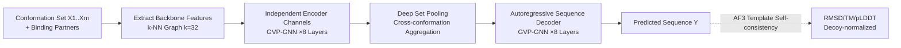

# Multi-state Protein Sequence Design with DynamicMPNN

**Conference**: ICLR 2026  
**OpenReview**: [https://openreview.net/forum?id=4ptHfbHG3D](https://openreview.net/forum?id=4ptHfbHG3D)  
**Code**: To be confirmed  
**Area**: Computational Biology / Protein Design (Inverse Folding)  
**Keywords**: Multi-conformational design, Inverse folding, ProteinMPNN, Geometric deep learning, GVP-GNN, AlphaFold3, Metamorphic proteins  

## TL;DR
DynamicMPNN is the first "explicit" multi-state inverse folding model that directly learns the joint conditional distribution $p(Y|X_1,\dots,X_m)$ for a single sequence across multiple conformations. It improves the sequence recovery of ProteinMPNN by 12% and decoy-normalized RMSD self-consistency by 31% on multi-state protein benchmarks.

## Background & Motivation

**Background**: Structural biology has long been dominated by the "one sequence, one structure, one function" paradigm. The PDB is filled with static crystal structures, which catalyzed high-precision models like AlphaFold (structure prediction) and ProteinMPNN (inverse folding). ProteinMPNN has become the de facto standard for protein design due to its low inference cost and robust experimental success rate.

**Limitations of Prior Work**: Many critical biological processes—enzyme catalysis, membrane transport, allostery, and signaling switches—rely on proteins that can switch between multiple conformations (e.g., transporter open/closed, hinge domain movement, metamorphic folding). Current multi-state design methods rely on **post-hoc aggregation**: running inverse folding independently for each single conformation and then averaging logits (ProteinMPNN-MSD), using geometric mean probabilities (Multi-state ESM-IF), or averaging across diffusion steps (ProteinGenerator). These methods show poor experimental results—ProteinGenerator's in silico success rate for multi-state tasks is only 0.05%, compared to 2–10% for single-state tasks.

**Key Challenge**: Logit averaging biases toward sequences that are highly favorable for a single conformation and remain high after averaging, rather than sequences that moderately satisfy both conformations—the latter being the true multi-state solutions. In other words, the **single-state then aggregate** pipeline is fundamentally misaligned with multi-state objectives. This is compounded by scarce multi-conformational data, weak benchmarks, and the poor ability of folding models to predict alternative states.

**Goal**: Replace "aggregation" with "joint learning"—train a model that takes an entire ensemble of conformations as input and outputs a sequence satisfying all structural constraints simultaneously. Additionally, create an ML-ready multi-conformational dataset and an AlphaFold3-based multi-state self-consistency benchmark.

**Core Idea**: **[Explicit Joint Modeling]** Use a multi-state GNN encoder to encode $m$ conformations into a shared latent space, pool them into a single representation, and then autoregressively decode the sequence. This ensures the sequence distribution is naturally constrained by all structures simultaneously rather than being patched together post-hoc.

## Method

### Overall Architecture
The inverse folding pipeline of DynamicMPNN consists of three stages: first, each functional state of the protein (along with its binding partners) is independently encoded into a shared SE(3)-equivariant latent space. Second, the embeddings of the target chain across orientations are pooled into a single representation. Finally, an amino acid sequence compatible with all conformations is decoded autoregressively. Evaluation is performed using template-based AlphaFold3: the target structures are provided as templates to AF3 to verify if the designed sequence can reproduce those conformations.

### Key Designs

**1. Joint Conditional Distribution Modeling: From "Aggregation" to "Joint Solving"** This is the foundation of the work. Single-state inverse folding models $p(Y|X)$, while DynamicMPNN directly learns the joint conditional distribution using autoregressive decomposition:

$$p(Y|X_1,\dots,X_m)=\prod_{i=1}^{n} p(y_i \mid y_{i-1},\dots,y_1; X_1,\dots,X_m)$$

At each step, predicting residue $y_i$ considers the shared representation of the full set $\{X_1,\dots,X_m\}$, avoiding the bias of post-hoc logit averaging. The architecture adopts the gRNAde framework from RNA design, with 8 layers of SE(3)-equivariant GVP (Geometric Vector Perceptron) for both encoder and decoder. Scalar and vector features undergo O(3)-equivariant message passing: $m_i,\vec m_i=\sum_{j\in N_i}\mathrm{MSG}((s_i,\vec v_i),(s_j,\vec v_j),e_{ij})$, followed by $s_i',\vec v_i'=\mathrm{UPD}((s_i,\vec v_i),(m_i,\vec m_i))$. By using reflection-sensitive input features like dihedral angles, the system achieves SO(3)-equivariance.

**2. Cross-conformation Pooling and DSS Variants: Controlled Expressivity-Efficiency Trade-off** How conformations are fused after encoding determines expressivity. The base **DynamicMPNN** uses Deep Set pooling—invariant to conformation order, adding no parameters, and only updating node features. The advanced **DynamicMPNN + DSS** employs a Deep Symmetric Set module after each layer for scatter/gather: averaging node embeddings across all design chains, passing them through a GVP, and adding them back via residual connections. This allows richer inter-conformation interaction and updates edge features, at the cost of higher computation. Since DSS gains are often marginal, Deep Set is the default.

**3. Heterogeneous Sequence Processing: Leveraging PDB Conformational Diversity** True multi-conformational NMR data covers only 21% of CATH superfamilies. Instead, the authors exploit sequence redundancy in the PDB—clustering chains with $\geq 80\%$ (PDB80) or $\geq 95\%$ (CoDNaS) similarity as different conformations of the same protein. This yields ~46k clusters covering 75% of superfamilies. However, sequences within a cluster are not identical; alignment introduces gaps, and X-ray structures often have missing residues. The protocol involves sequence alignment followed by featurization, independent encoding of complex pairs, and **masking gap positions to exclude them from message passing**. During pooling, gap-node embeddings are zeroed. During training, sequence info for chains with $>70\%$ similarity to the ground truth is masked to prevent leakage.

**4. Template-based AF3 Multi-state Self-consistency and Decoy Normalization** Evaluation is challenging as folding models typically predict only one dominant state. Following Roney & Ovchinnikov, AF3 is provided with the target conformation as a template, turning "prediction" into "compatibility assessment." For each designed sequence, AF3 is run twice (once per state as a template) to measure $\mathrm{AF3_{template}}(Y,X_k)=\mathrm{RMSD}(\mathrm{AF3}(Y,X_k),X_k)$. To remove template bias, **decoy normalization** is introduced: using a structurally dissimilar decoy (TM-score < 0.4) as a template. A smaller $\mathrm{RMSD_{decoy}}=\mathrm{AF3_{template}}(Y,X_k)/\mathrm{AF3_{template}}(Y,D)$ indicates the sequence specifically folds into the target state rather than being compatible with any backbone.

## Key Experimental Results

Dataset: CoDNaS (46,033 clusters) + PDB80 (46,924 clusters), filtered against test/val sets (TM-score > 0.4 or seq id > 30%), resulting in 44,243 training conformation pairs. Benchmark: 96 biologically relevant metamorphic/hinge/transporter proteins.

### Main Results: Sequence Recovery (Table 3)

| Model Variant | Seq Recovery (%) ↑ |
|---|---|
| Combined Pretraining + Multi Finetuning | **42.7 (8.8)** |
| Single Pretraining + Multi Finetuning | 42.1 (8.3) |
| Combined Training | 41.0 (8.5) |
| **ProteinMPNN MSD (Baseline)** | 38.0 (11.0) |
| Single chain 2-state | 37.4 (9.0) |
| Single Training (Single-state only) | 27.1 (9.4) |

The best variant outperforms ProteinMPNN-MSD by approximately 12% (42.7 vs 38.0).

### Ablation Study: Self-consistency (Table 1, n=96)

| Model Variant | RMSD (Å) ↓ | TM-score ↑ | Decoy-Norm RMSD ↓ |
|---|---|---|---|
| Combined Training | **2.35** | 0.870 | 0.124 |
| Combined Training + DSS | 2.56 | 0.862 | 0.131 |
| Sampled Pair Training | 2.29 | 0.872 | 0.125 |
| Single Training (Single-state only) | 8.16 | 0.652 | 0.348 |

Decoy-normalized RMSD dropped from 0.348 to 0.124 (~31% relative reduction) for Combined vs Single training. BioEmu evaluation (Table 5) confirms this: Combined TM-score 0.623 vs Single 0.394.

### Key Findings
- **Multi-state data is critical**: Single Training (only single-state pairs) fails (RMSD 8.16, Recovery 27.1%), proving that explicit multi-state signals, not just model size, drive performance.
- **Simple pooling is sufficient**: DSS does not consistently outperform Deep Set, suggesting marginal gains from expensive inter-conformation interactions.
- **Joint training > Post-processing aggregation**: In a comparable subset (n=61, Table 4), Combined achieved a decoy-norm RMSD of 0.129 vs 0.187 for ProteinMPNN-MSD.

## Highlights & Insights
- **Paradigm Shift**: The work identifies why post-hoc aggregation inherently biases toward single conformations and addresses this via joint conditional distribution modeling.
- **Data Engineering**: Utilizing PDB sequence redundancy (80%/95% clusters) expands scarce multi-conformation data to the 46k scale. The heterogeneous gap-masking allows the use of "approximate homologs."
- **Benchmark Contribution**: The template-based AF3 + decoy normalization sidesteps the limitation that folding models only predict dominant states, providing a quantifiable metric for multi-state design.
- **Architecture Transfer**: Adapting the multi-state GNN from gRNAde (RNA design) and reusing GVP-GNN minimizes engineering risk.

## Limitations & Future Work
- **Focus on Two States**: While the architecture supports arbitrary $k$, training and evaluation primarily focused on $k=2$. Multi-chain $k>2$ remains future work.
- **Lack of Wet Lab Validation**: Results rely on in silico self-consistency (AF3/BioEmu). Experimental validation of actual protein folding is yet to be performed.
- **Dependence on Folding Models**: The AF3 template method is limited by AF3's own ability to predict alternative states; decoy normalization mitigates but does not eliminate this bias.
- **No Continuous Conformations**: Intrinsically Disordered Proteins (IDPs) are excluded; the method applies to globular proteins with discrete states.

## Related Work & Insights
- **Inverse Folding Baselines**: ProteinMPNN, ESM-IF.
- **Multi-state Aggregation**: ProteinMPNN-MSD (logit averaging), Multi-state ESM-IF (geometric mean), ProteinGenerator (diffusion aggregation).
- **Architecture Sources**: gRNAde (RNA multi-state GNN), GVP-GNN (equivariant message passing).
- **Evaluation Tools**: AlphaFold3 (template mechanism), BioEmu (ensemble generation), Decoy self-consistency (Roney & Ovchinnikov).
- **Insight**: When the goal is "joint satisfaction of multiple constraints," modeling them directly in the conditional distribution is superior to aggregating single-constraint models—a principle applicable to multi-objective molecular design and multi-view generation.

## Rating
- **Novelty**: ⭐⭐⭐⭐ First explicit multi-state inverse folding model; clear paradigm shift with solid data/benchmark increments.
- **Experimental Thoroughness**: ⭐⭐⭐ Extensive ablations and cross-validation, but entirely in silico; lacks wet lab data and full $k>2$ coverage.
- **Writing Quality**: ⭐⭐⭐⭐ Clear motivation, rigorous analysis of root causes, and well-organized methodology.
- **Value**: ⭐⭐⭐⭐ Addresses a core bottleneck in bio-switches and enzyme engineering; data and benchmarks provide immediate community value.

<!-- RELATED:START -->

## Related Papers

- [\[ICLR 2026\] Property-Driven Protein Inverse Folding with Multi-Objective Preference Alignment](property-driven_protein_inverse_folding_with_multi-objective_preference_alignmen.md)
- [\[ICLR 2026\] FlexRibbon: Joint Sequence and Structure Pretraining for Protein Modeling](flexribbon_joint_sequence_and_structure_pretraining_for_protein_modeling.md)
- [\[ICLR 2026\] PRISM: Enhancing Protein Inverse Folding through Fine-Grained Retrieval on Structure-Sequence Multimodal Representations](prism_enhancing_protein_inverse_folding_through_fine-_grained_retrieval_on_struc.md)
- [\[ICLR 2026\] Riemannian Variational Flow Matching for Material and Protein Design](riemannian_variational_flow_matching_for_material_and_protein_design.md)
- [\[ICLR 2026\] MarS-FM: Generative Modeling of Molecular Dynamics via Markov State Models](mars-fm_generative_modeling_of_molecular_dynamics_via_markov_state_models.md)

<!-- RELATED:END -->
