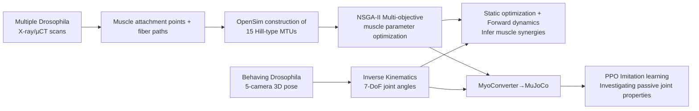

# Musculoskeletal simulation of limb movement biomechanics in Drosophila melanogaster

**Conference**: ICLR 2026  
**OpenReview**: [https://openreview.net/forum?id=6lEjX1getx](https://openreview.net/forum?id=6lEjX1getx)  
**Code**: TBD  
**Area**: Computational Biology / Neuroscience / Motor Control  
**Keywords**: Drosophila, Musculoskeletal model, Hill-type muscle, OpenSim, MuJoCo, Imitation learning, Muscle synergy  

## TL;DR
Constructs the first anatomically and physiologically accurate 3D musculoskeletal model for the Drosophila leg (OpenSim + MuJoCo dual engines). It bridges motor neuron activity with joint movement using Hill-type muscles, infers muscle synergies from real behavioral data, and demonstrates that passive joint properties (stiffness/damping) accelerate the learning of muscle-driven control.

## Background & Motivation
**Background**: The central nervous system, muscle tissue, and exoskeleton of *Drosophila melanogaster* have reached near-complete reconstruction (connectome, micro-CT, etc.). Drosophila serves as an ideal model organism for studying how "neuro-biomechanics-behavior" coordinate to produce movement due to its compact nervous system, genetic tractability, and high degrees of freedom (DoF) in its legs.

**Limitations of Prior Work**: Despite available anatomical data, **biomechanically and physically grounded models for Drosophila leg muscles are lacking**. Existing whole-body simulations (e.g., NeuroMechFly, Vaxenburg) rely on abstract "position/torque controllers" to drive joints, abstracting away muscle tissues and passive biomechanics. These cannot characterize muscle redundancy and inherent compliance, nor can they explain how neural networks coordinate muscles for robust behavior.

**Key Challenge**: There is a missing "bridge" between motor neuron activity and joint movement. Given that Drosophila leg muscles (approx. 19 muscles, 69 motor neurons, including multi-joint muscles) are anatomically and functionally complex, it is impossible to predict muscle activity patterns for a specific behavior solely from connectomes or neural recordings.

**Goal**: Establish the first musculoskeletal model of the Drosophila leg with sufficient biological detail. Unify anatomical, physiological, and behavioral data into a framework capable of inferring muscle synergies from real kinematics and serving as a physical constraint interface for embodied agents.

**Key Insight**: **Replace abstract joint controllers with Hill-type muscle models.** Extract muscle attachment points and fiber orientations from high-resolution X-ray scans to construct musculotendon units (MTU). Calibrate unknown parameters via multi-objective optimization, achieve "muscle-driven behavioral playback" combined with 3D pose estimation, and finally train imitation learning policies in MuJoCo to explore the impact of passive properties on control.

## Method

### Overall Architecture
The pipeline consists of three segments: The left side determines muscle attachment points and fiber paths from anatomical data (X-ray/µCT scans) of multiple flies, constructing Hill-type muscle models for 15 MTUs in OpenSim and optimizing parameters. The right side obtains real joint kinematics from 3D pose estimation of freely behaving flies. The middle integrates both: first using static optimization and forward dynamics in OpenSim to infer muscle activity, then using MyoConverter to transfer the model to MuJoCo for imitation learning policy training.

### Key Designs

**1. Constructing Hill-type muscle models from anatomical images: Growing "real muscles" in simulation.** The authors used two public datasets and one self-acquired synchrotron µCT dataset to label muscle fibers for the thorax–coxa, coxa–trochanter, and femur–tibia joints, cross-validating attachments. Each foreleg models 15 MTUs (7 thorax, 6 coxa, 2 femur), covering 12 of 19 muscle groups. Each group is represented by 1–2 Hill-type MTUs, containing a contractile element (CE), parallel elastic element (PE), and series elastic element (SE, assuming rigid tendons). Total tendon length $l_{mt}=l_m\cos(\alpha)+l_t$, where $l_m$ is fiber length, $\alpha$ is pennation angle, and $l_t$ is tendon length. Maximum isometric force is estimated from physiological cross-sectional area (PCSA), scaled by a specific tension of $28\,\text{mN/mm}^2$.

**2. Multi-objective optimization for parameter calibration: Preventing overfitting with dual behaviors.** Since experimental data is limited and initial anatomical parameters might not reflect biological reality, the authors performed closed-loop optimization in OpenSim. For each candidate parameter set proposed by the optimizer, static optimization (SO) infers muscle activation from reference joint angles, followed by forward dynamics (FD) to simulate joint trajectories. **NSGA-II** is used to find parameter sets that minimize the difference between simulated and experimental kinematics. A key technique involves **simultaneously fitting grooming and walking behaviors**, retaining only solutions that perform well on both to avoid overfitting. Each joint (1 or 3 DoF) is optimized independently.

**3. Imitation learning + Physically constrained action space: Training policies to learn control, not physics.** The optimized OpenSim model is converted to MuJoCo format via MyoConverter. Tracking tasks are built using dm_control, and an MLP policy (2 layers of 512 units + 256, ReLU) is trained using PPO for $15\times10^6$ steps at a control frequency of 500 Hz. The 86-dimensional observation includes 3D coordinates of 4 leg landmarks (12-D), 7 DoF joint angles and velocities (14-D), and activations/forces/lengths/velocities of 15 muscles (60-D). The output is 15-dimensional $[0,1]$ muscle excitation (i.e., motor neuron activity). The reward encourages precise tracking in Cartesian, joint angle, and joint velocity spaces:
$$r_t=\frac{1}{3}\left[\exp(-w_p d^{xpos}_t)+\exp(-w_p d^{qpos}_t)+\exp(-w_v d^{qvel}_t)\right]$$
where $w_p=5,\ w_v=3$. A key insight is that the musculoskeletal model restricts the action space to "physically plausible movements," eliminating catastrophic actions. **The policy does not need to learn a world model of physics before learning control**; it only needs to learn control itself, reducing the sim-to-real gap.

**4. Inferring synergy primitives from simulated muscle activity using NMF.** Non-negative Matrix Factorization (NMF) applied to muscle activity estimated by SO revealed that **only 3 muscle primitives explained over 90% of the variance**, with the first primitive alone accounting for over 80%. These primitives show distinct non-overlapping temporal dynamics, allowing for the prediction of behaviorally relevant muscle synergy groupings for experimental validation.

## Key Experimental Results

### Main Results: Muscle Synergy and Parameter Optimization

| Item | Result |
|------|------|
| Modeled MTUs | 15/foreleg (7 thorax + 6 coxa + 2 femur), covering 12/19 muscle groups |
| Optimization Algorithm | NSGA-II, 200 individuals × 40 generations, ~8h for 3-DoF joints, ~20h for full leg |
| Optimization Goal | Joint walking + grooming behaviors, RMSE (normalized by RoM) + Pearson $R^2$ |
| Muscle Synergy | NMF with 3 primitives explained >90% variance, 1st primitive >80% |
| Synergy Structure | Task-invariant for Sar/Sa; coxal flexors → Synergy 2, extensors → Synergy 3 (specialized during grooming) |

### Ablation Study: Impact of Passive Joint Properties on Imitation Learning
Four MuJoCo configurations (comparing early vs. late mean rewards):

| Configuration | Learning Speed / Final Performance |
|------|------|
| Armature only (Inertia) | Slowest, Lowest |
| Armature + damping | Medium |
| Armature + stiffness | Medium |
| **Armature + damping + stiffness** | **Fastest, Highest** (Early advantage persists to the end) |

Statistical tests used Two-sided Mann-Whitney U + Holm-Bonferroni correction.

### Key Findings
- **Muscle coordination is highly behavior-dependent**: Drosophila may reuse the same set of muscles by activating different task-specific synergies. For example, trochanter flexors/extensors show rhythmic overlapping activation during grooming but antiphase activation during walking.
- **The combination of stiffness and damping enables fastest learning**: Passive dynamics stabilize movement and reduce the need for constant error correction, allowing the policy to focus on coordinated muscle patterns rather than correcting instability.

## Highlights & Insights
- **First anatomically and physiologically accurate musculoskeletal model of the Drosophila leg**, leveraging dual engines (OpenSim for biomechanical analysis, MuJoCo for learning) to bridge motor neurons and joint metrics.
- **End-to-end automated pipeline from anatomical imaging to functional simulation**: Extracting features → estimating physiological parameters → multi-objective optimization for unknown parameters, transferable to other species.
- **The "Physically Constrained Action Space" training philosophy**: Musculoskeletal models naturally filter out non-physical actions, meaning the policy doesn't have to implicitly learn physics, addressing a major sim-to-real pain point.
- **3 primitives explaining >90% variance** echoes the classic "muscle synergy dimensionality reduction" hypothesis in motor control.

## Limitations & Future Work
- **Tibia muscles not fully modeled** (X-ray only partially captured tibia) and trochanter muscles (function unclear); covers 12/19 muscle groups.
- **High training cost**: ~96 hours for 7-DoF full leg imitation learning, ~20 hours for parameter optimization.
- **Simulation is suspended/contact-free**: Body-environment contact was omitted for speed, meaning true landing dynamics were not addressed.
- **Limited to front legs and two behaviors**: Generalization of synergy findings to other legs or behaviors remains to be verified.
- **Not truly closed-loop neural control**: Yet to be integrated with connectome neural circuits; currently infers muscles from kinematics rather than driving muscles from neurons.

## Related Work & Insights
- **NeuroMechFly / Vaxenburg Drosophila models**: Ours extends NeuroMechFly by replacing abstract joint controllers with anatomical muscles, a critical upgrade in biological fidelity.
- **OpenSim / MyoSuite / MuJoCo ecosystem**: Reusing simulation platforms from human/primate research proves these tools can scale down to the insect level.
- **Muscle Synergy Theory (Bizzi & Cheung, Ting & McKay)**: Validating the "low-dimensional synergy" hypothesis in Drosophila using NMF.
- **Motion Imitation Learning (DeepMimic/Peng et al.)**: Extending the imitation learning paradigm from graphics to muscle-driven insects.

## Rating
- **Novelty**: ⭐⭐⭐⭐⭐ First biologically accurate musculoskeletal fly leg model; end-to-end pipeline.
- **Experimental Thoroughness**: ⭐⭐⭐⭐ Includes optimization, force-arm validation, NMF synergy analysis, and passive property ablations.
- **Writing Quality**: ⭐⭐⭐⭐ Clear diagrams, progressive motivation, and thorough biological context.
- **Value**: ⭐⭐⭐⭐⭐ A physically grounded motor control foundation for neuroscience and robotics.

<!-- RELATED:START -->

## Related Papers

- [\[ICLR 2026\] MicroVerse: A Preliminary Exploration Toward a Micro-World Simulation](microverse_a_preliminary_exploration_toward_a_micro-world_simulation.md)
- [\[ICLR 2026\] Multifidelity Simulation-based Inference for Computationally Expensive Simulators](multifidelity_simulation-based_inference_for_computationally_expensive_simulator.md)
- [\[ICLR 2026\] WFR-FM: Simulation-Free Dynamic Unbalanced Optimal Transport](wfr-fm_simulation-free_dynamic_unbalanced_optimal_transport.md)
- [\[ICLR 2026\] VCWorld: A Biological World Model for Virtual Cell Simulation](vcworld_a_biological_world_model_for_virtual_cell_simulation.md)
- [\[ICLR 2026\] BioMD: All-atom Generative Model for Biomolecular Dynamics Simulation](biomd_all-atom_generative_model_for_biomolecular_dynamics_simulation.md)

<!-- RELATED:END -->
