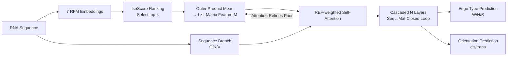

# NC-Bench and NCfold: A Benchmark and Closed-Loop Framework for RNA Non-Canonical Base-Pair Prediction

**Conference**: ICLR 2026  
**OpenReview**: [https://openreview.net/forum?id=G9UhQEZHjY](https://openreview.net/forum?id=G9UhQEZHjY)  
**Code**: [https://github.com/heqin-zhu/NCBench](https://github.com/heqin-zhu/NCBench)  
**Area**: Computational Biology / RNA Structure Prediction  
**Keywords**: Non-canonical base pairs, RNA secondary structure, benchmark dataset, RNA foundation models, attention prior  

## TL;DR
This paper constructs the first standardized benchmark for RNA non-canonical (NC) base-pair prediction, NC-Bench (925 sequences, 6708 NC annotations), and proposes NCfold—a dual-branch closed-loop framework. By utilizing IsoScore to select RNA foundation model (RFM) embeddings and injecting structural priors via Representative Embedding Fusion (REF) into attention, NCfold significantly outperforms traditional machine learning and RFM baselines in NC edge type and orientation prediction.

## Background & Motivation
**Background**: RNA secondary structure is the foundation of its folding and function, governed by base-pairing patterns. Beyond classical Watson-Crick (A-U, G-C) and Wobble (G-U) pairs, non-canonical (NC) base pairs—such as those involving Hoogsteen edges and various cis/trans orientations—are widespread in natural RNA. These pairs play critical roles in the tertiary interactions and structural stability of ribozymes, riboswitches, and long non-coding RNAs, and are by no means negligible "exceptions."

**Limitations of Prior Work**: Thermodynamic models (RNAstructure), alignment-based methods (TurboFold II, PFold), and deep learning approaches (MXfold, UFold, BPfold) are almost exclusively designed for classical base pairs, with zero or minimal coverage of geometric details like pairing orientation and edge types. A more fundamental issue is the **absence of a standardized NC benchmark**: NC annotations rely on high-resolution 3D structures which are extremely scarce; NC pairs are highly imbalanced across types; and biological metrics for measuring their geometric and functional complexity are missing.

**Key Challenge**: NC base pairs are biologically essential but samples are extremely sparse and highly imbalanced. Relying solely on sequence self-attention makes it difficult to learn reliable pairing patterns—the **contradiction between data scarcity and modeling requirements** is the core obstacle.

**Goal**: To establish the first unified evaluation benchmark for NC base-pair prediction and design a framework capable of effectively predicting NC edge types and orientations under data-scarce conditions.

**Core Idea**: **[Benchmark]** Systematically curate 925 RNA sequences with NC pairs from the PDB, define fine-grained edge/orientation classification tasks, and introduce IsoScore to evaluate RFM embedding quality. **[Framework]** Use RFM embeddings as structural priors to compensate for annotation scarcity, employing Representative Embedding Fusion and REF-weighted self-attention to mutually refine sequence features and structural priors in a closed loop.

## Method

### Overall Architecture
NCfold is a **closed-loop dual-branch sequence-matrix framework**. It first uses IsoScore to select the top-$k$ most informative embeddings from 7 RNA foundation models (RFMs). Each embedding is converted into an $L \times L$ base-pair interaction matrix via "outer product followed by mean" to serve as a structural prior. These priors are then injected into a Transformer via REF-weighted self-attention, coupling with the sequence branch's attention calculation. The priors are refined by attention scores across cascaded layers, forming a closed loop where "priors guide attention, and attention refines priors." Finally, it outputs the edge type and base-pair orientation for each nucleotide in a multi-task fashion.

### Key Designs

**1. IsoScore-driven Representative Embedding Fusion (REF): Selecting only the most informative priors.** The geometric properties of embedding spaces learned by different RFMs vary significantly—some are highly anisotropic, while others over-compress semantic information. Blindly concatenating all embeddings introduces noise and semantic inconsistency. The authors use IsoScore to quantify the isotropy and information density of embeddings, ranking 7 models (e.g., RNA-FM, RNAErnie, structRFM) and selecting only the top-$k$ representatives. Each selected embedding $E^{(r)} \in \mathbb{R}^{L\times D}$ is transformed into a pairwise interaction matrix $M^{(r)} = \mathrm{mean}(E^{(r)} \otimes E^{(r)\top}; -1, -2)$, which is then stacked into a unified representation $M = \mathrm{stack}(\{M^{(r)}\}_{r=1}^{k}) \in \mathbb{R}^{k\times L\times L}$. This step transforms "model selection" from empirical guessing into a geometry-driven process, similar to expert selection in MoE, while keeping RFM backbones frozen for efficiency.

**2. REF-weighted Self-Attention: Directly integrating structural priors into the attention map.** Given the sparsity of NC pairs, purely data-driven attention struggles to capture pairing diversity. Thus, the REF matrix is added directly to the attention scores as a bias. The REF matrix $M$ is first enhanced for local structural signals via $\mathrm{CONV}$, then superimposed onto the original attention scoring:
$$
\text{REF-weighted Self-Attention}(X) = \mathrm{softmax}\!\left(\frac{QK^\top + \mathrm{CONV}(M)}{\sqrt{d}}\right) V.
$$
The essence is that attention relies on both sequence context and biophysically plausible structural priors, pushing the model's attention toward more credible pairing positions while allowing space for sequence features to adaptively fine-tune.

**3. Dual-branch Closed Loop: Layer-wise mutual reinforcement of sequence and matrix.** The framework allows sequence and matrix representations to flow bidirectionally between cascaded Transformer blocks. In the $i$-th block, the sequence branch generates $Q_i, K_i, V_i$. The matrix branch processes the attention weight $M_i$ from the previous block (the stacked REF for the first block) via residual convolution and integrates it into the current attention: $M_{i+1} = \mathrm{softmax}\big((Q_iK_i^\top + \mathrm{CONV}(M_i))/\sqrt{d}\big)$, $X_{\mathrm{MSA},i} = M_{i+1}V_i$. Sequence features are then updated via residuals, LN, and FFN. After $N$ layers, **sequence-level context and inter-base interactions serve as mutual inputs and refine each other at every layer**, mitigating data sparsity and strengthening local and global structural dependencies through a closed loop.

**4. Multi-task Prediction Head and Class-weighted Loss: Combating extreme imbalance.** The sequence path uses a fully connected layer to project edge logits $\hat{Y}_{\text{edge}} \in \mathbb{R}^{B\times L\times 4}$, while the matrix path uses a $1\times 1$ convolution to map interaction matrices to orientation logits $\hat{Y}_{\text{orient}} \in \mathbb{R}^{B\times L\times L\times 3}$. Cross-entropy is optimized jointly: $\mathcal{L} = \lambda_{\text{edge}}\,\mathrm{CE}(\hat{Y}_{\text{edge}}, Y_{\text{edge}}) + \lambda_{\text{orient}}\,\mathrm{CE}(\hat{Y}_{\text{orient}}, Y_{\text{orient}})$. To address the extreme imbalance of NC types, class weights of $[1,5,20,20]$ (Ne/W/H/S) for the edge task and $[1,20,20]$ (Np/trans/cis) for the orientation task are applied, combined with label smoothing ($\varepsilon=0.05$), to effectively boost the learning signal for rare classes.

## Key Experimental Results

### Main Results
NC-Bench 4-fold cross-validation, comparing 7 traditional ML methods and 7 RFMs. F1 and MCC are more informative in imbalanced scenarios (selected):

| Model | Edge-MCC | Edge-F1 | Orient-MCC | Orient-F1 |
|------|--------|-------|----------|---------|
| Random Forest | -0.020 | 0.168 | 0.002 | 0.372 |
| Gradient Boosting | 0.042 | 0.258 | 0.002 | 0.365 |
| MLP | 0.000 | 0.218 | 0.163 | 0.402 |
| RNA-FM (Frozen+Linear) | 0.000 | 0.218 | 0.000 | 0.355 |
| structRFM | 0.000 | 0.218 | 0.005 | 0.357 |
| **NCfold (top-1)** | 0.211 | 0.341 | 0.285 | 0.482 |
| **NCfold (top-2)** | **0.245** | **0.365** | **0.312** | **0.486** |
| NCfold (top-3) | 0.219 | 0.336 | 0.265 | 0.466 |

All frozen RFMs achieve MCC=0 and F1=0.218 on the edge sub-task because the simple linear head predicts all samples as "No edge" (negative class), failing to recognize positive samples entirely. NCfold (top-2) leads significantly in both tasks.

### Ablation Study
Verifying the value of RFM structural priors (NCfold-base: No RFM embeddings; NCfold-BPE: Replaced with base-pair energy priors from BPfold):

| Model | Edge-MCC | Edge-F1 | Orient-MCC | Orient-F1 |
|------|--------|-------|----------|---------|
| NCfold-base | 0.084 | 0.251 | 0.217 | 0.419 |
| NCfold-BPE | 0.211 | 0.335 | 0.326 | 0.464 |
| **NCfold** | **0.245** | **0.365** | 0.312 | **0.486** |

Performance drops across the board without RFM priors. Replacing them with BPfold energy priors helps but remains inferior to RFM embeddings, proving that RFM structural priors introduced via REF are the main source of performance gain.

### Key Findings
- **Zero-shot Comparison**: Classical secondary structure methods like MXfold2, SPOT-RNA, UFold, and BPfold can only predict "paired/unpaired" states, with near-zero recall for NC pairs (high precision, zero recall). NCfold achieves the highest F1=0.440 (P=0.489, R=0.431), highlighting the necessity of NC-specific benchmarks and methods.
- **Hyperparameter Sensitivity**: Optimal performance is achieved with 4 or 6 Transformer layers and a batch size of 4; smaller batches help capture fine-grained patterns.
- **Data Distribution**: Among 6708 NC annotations, WH is the most frequent (26.94%) and HH the rarest (3.40%). For orientation, trans accounts for 58.96% and cis for 41.04%, confirming the strong imbalance of NC interactions.

## Highlights & Insights
- **First NC Benchmark Fills the Vacuum**: Standardizing previously scattered and non-comparable NC prediction tasks into a unified evaluation with fine-grained edge/orientation labels, 4-fold cross-validation, and 5 metrics is highly significant for the field.
- **Engineering Ingenuity in IsoScore Selection**: Quantifying "which RFM embedding is worth using" via isotropy metrics avoids noise from blind concatenation and serves as a good example of embedding representation quality assessment in model design.
- **Closed-loop Dual Branch Animates Priors**: Structural priors are not statically injected but are refined layer-by-layer alongside attention. Sequence and structure serve as mutual inputs, effectively mitigating sparse supervision.
- **Failure of Frozen RFMs Reveals the Core Problem**: The collapse of all RFMs with direct linear heads indicates that the difficulty of NC prediction lies not in the representation itself, but in how to transform representations into structural priors while resisting extreme imbalance.

## Limitations & Future Work
- **Limited Data Scale**: Although 925 sequences comprise the largest dataset of its kind, it is still small compared to classical base-pair resources; continuous expansion with new experimental structures is needed.
- **Restricted Supervision Paradigm**: Currently fully supervised, the authors plan to introduce semi-supervised or generative methods to leverage massive unlabeled RNA data.
- **Pseudoknot False Positives**: Visualizations show that NCfold tends to predict many false-positive pseudoknots, requiring post-processing and threshold adjustments for orientation maps.
- **Scalability to be Verified**: Whether the closed-loop dual-branch design can be transferred to tasks like tertiary structure modeling, RNA-protein interaction, or RNA design remains to be explored.

## Related Work & Insights
- **Classical Secondary Structure Prediction**: Thermodynamic (RNAstructure), alignment (TurboFold II, PFold), and deep learning (MXfold, UFold, SPOT-RNA, BPfold) models focus on classical pairing, serving as the source of zero-shot comparison and motivation for this work.
- **RNA Foundation Models (RFMs)**: RNA-FM, RNAErnie, SpliceBERT, UTR-LM, AIDO.RNA, RiNALMo, and structRFM provide rich contextual representations. This work innovatively uses them as structural priors rather than direct classifiers.
- **Geometric Classification Standards**: The Leontis-Westhof scheme (3 edges W/H/S $\times$ cis/trans) is the theoretical cornerstone of NC-Bench task definitions.
- **Methodological References**: MoE expert selection ideas inspired REF top-$k$ filtering, and IsoScore originates from representation isotropy research.
- **Insight**: For scientific tasks with scarce annotations, "using large model embeddings as structural priors + metric-driven prior selection + closed-loop refinement" is a paradigm worth promoting.

## Rating
- **Novelty**: ⭐⭐⭐⭐ First NC base-pair benchmark + IsoScore embedding selection + REF-weighted closed-loop attention; novel combination addressing real pain points.
- **Experimental Thoroughness**: ⭐⭐⭐⭐ Covers 14 baselines, 4-fold cross-validation, ablation, zero-shot, hyperparameter analysis, and visualization; fairly complete, though data scale is small and lacks an independent external test set.
- **Writing Quality**: ⭐⭐⭐⭐ Clear motivation, standardized formulas and diagrams, coherent presentation of the benchmark and methodology.
- **Value**: ⭐⭐⭐⭐ Fills the gap in NC prediction evaluation, with open-sourced data and code, providing a clear push for the RNA structure modeling community.

<!-- RELATED:START -->

## Related Papers

- [\[ICLR 2026\] MindPilot: Closed-loop Visual Stimulation Optimization for Brain Modulation with EEG-guided Diffusion](mindpilot_closed-loop_visual_stimulation_optimization_for_brain_modulation_with_.md)
- [\[ICLR 2026\] Protein Structure Tokenization via Geometric Byte Pair Encoding](protein_structure_tokenization_via_geometric_byte_pair_encoding.md)
- [\[ICML 2026\] TadA-Bench: A Million-Variant Benchmark for Future-Round Discovery Toward Agentic Protein Engineering](../../ICML2026/computational_biology/tada-bench_a_million-variant_benchmark_for_future-round_discovery_toward_agentic.md)
- [\[CVPR 2026\] TRIDENT: A Trimodal Cascade Generative Framework for Drug and RNA-Conditioned Cellular Morphology Synthesis](../../CVPR2026/computational_biology/trident_a_trimodal_cascade_generative_framework_for_drug_and_rna-conditioned_cel.md)
- [\[ICLR 2026\] HeurekaBench: A Benchmarking Framework for AI Co-scientist](heurekabench_a_benchmarking_framework_for_ai_co-scientist.md)

<!-- RELATED:END -->
